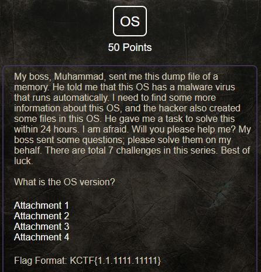

# Knight CTF

From problem 1-7  are knight ctf 2023 problem →

[https://drive.google.com/file/d/1JyEzzlZn9lftRt2gd0hDVpsC0mYUa0RC/view?usp=sharing](https://drive.google.com/file/d/1JyEzzlZn9lftRt2gd0hDVpsC0mYUa0RC/view?usp=sharing)

# ***Knight CTF 2023 :-***

for volatility 3 →

```bash
git clone [https://github.com/volatilityfoundation/volatility3.git](https://github.com/volatilityfoundation/volatility3.git)
cd volatility3/
***must create " venv " first before use !!!***
python3 -m venv venv && . venv/bin/activate
pip install -e ".[dev]"
```

### **Problem - 01 :**



**Solution :**


the load will take some minutes :)


```bash
!analyze -v!
or, !analyze -s (not worked)
```

Flag → KCTF{7.1.7601.24214}

### **Problem - 02 :**

**What is the login password of the OS?**

**Solution :**

Volatility 2 →

First i tried the `lsadump` plugin to dump plain text passowrds from the memory but it didn't contain any passwords

```bash
`lsadump` is used to extract **sensitive credentials and secrets** stored by the **Local Security Authority Subsystem Service (LSASS)** on Windows systems. These secrets can include:
🔍 **What `lsadump` Extracts:**
1. **NTLM hashes of local users**
2. **LSA secrets**, such as:
    - Service account passwords
    - Cached domain credentials
    - DPAPI keys
3. **Kerberos keys**
4. **Domain cached credentials (DCCs)**
```


then i used the plugin `hashdump` to extract users hashes from the SAM database
Ae we know that the dump is windows 7 ,


unfortunately traditional imageinfo command give wrong info so vol 3 should be wise choice to use as it doesn’t demand profile .


volatility 3 →


Or , use crackstation for crack →


Flag → KCTF{squad}

### **Problem - 03 :**

**What is the IP address of this system?**

**Solution :**

vol3 & vol2 →

To get the IP address we can use `netscan` functionality


Flag → KCTF{10.0.2.15}

### **Problem - 04 :**

**My boss has written something in the text file. Could you please help me find it?**

**Solution :**


Based on the output information, we can suspect that it is the `text2.txt` file or the `text.txt` file. To recover a single file, we have to use the address of this file returned in the previous command. Let's try to recover the `text2.txt` file first.
The file `text2.txt`was recovered successfully. After opening it, we can see that part of the first line is encoded in `Base64`:


Flag → KCTF{Respect_Y0ur_Her4nki}

### **Problem - 05 :**

**My leader, Noman Prodhan, executed something in the cmd of this infected machine. Could you please figure out what he actually executed?**

**Solution :**

> ***Commands entered into cmd.exe are processed by conhost.exe (csrss.exe prior to Windows 7). So even if an attacker managed to kill the cmd.exe prior to us obtaining a memory dump, there is still a good chance of recovering history of the command line session from conhost.exe’s memory.** If you find something weird (using the console’s modules), try to dump the memory of the conhost.exe associated process and search for strings inside it to extract the command lines.*
> 

**Volatility 2 ,**

In the `Volatility 2` there are at least 3 commands related to a command line, they are:

```
cmdline
cmdscan
consoles
```

We will check the output of each of them, because their results may be useful also in solving the `Path of the Execution` task. For the `cmdline` and `cmdscan` commands, we want to find all the results for the `conhost.exe` process.

***The cmdline command →***


nothing find any :)

***The cmdscan command →***

vol3 doesn’t has “cmdscan” facility but has cmdline . So, after getting result from vol2’s cmdscan we can grep the offset value and then dump it .


windows.bat has the flag .

***The consoles command , ( Only in “volatility 2” ) ,***

The `consoles` command displays the entire screen buffer (input and output), not just the command typed in the console. In this case, it turned out to be significant. After executing the `consoles`command, we get the flag. This is because the flag was returned in the output of the executed script `windows.bat`:


***Only for volatility3 ,***

Unfortunately `Volatility 3` does not have plugins that would be equivalent to the commands `cmdscan` and `consoles`. We can only use the `cmdline`command : -


The flag is present in each of the above processes. Since the `procdump` command available in  `Volatility 3` recovers the `.exe` file along with the associated DLLs, we will use the `memmap` command to retrieve it. For example, let's dump the process with PID number 4888 :-

Or ,

Using `strings`on the dumped process we get the flag:


**Flag → KCTF{W3_AR3_tH3_Kn1GHt}**

### **Problem - 06 :**

**What is the path folder of the executable file which execute privious flag?**

**Solution :**

From the prev sol we can get the path ->


Flag → KCTF{\Users\siam\Documents}

### **Problem - 07 :**

 **What is the malicious software name?**

**Solution :**

Many malware samples persist via startup registry keys:


This shows programs that are set to run automatically at login. Do this for all user hives (`NTUSER.DAT`) and system hives . If not get any useful info you can go and search other hivelists offset and there files .

***Or ,***

Remember that in the first question ?  ***“ He told me that this OS has a malware virus that runs automatically “***

1st method ,

using the filescan output generated previously we can grep for all exe files

reading through the executables we can find an executable called `MadMan.exe`


normal google search can identify it as virus .


OR ,

there is another method by using the autoruns plugin from this repository ,

[GitHub - tomchop/volatility-autoruns: Autoruns plugin for the Volatility frameworkGitHub](https://github.com/tomchop/volatility-autoruns)

which enumerates all the registry keys where a malicious program would hide itself to persist

first we have to clone the repository

```
git clone https://github.com/tomchop/volatility-autoruns.git
```

and then run it with volatility. But, it shows result in very lately 5-10 mints .


Or ,

dump that suspisious file after observing from the filescan list ,


In virustotal →


Flag → KCTF{MadMan.exe}