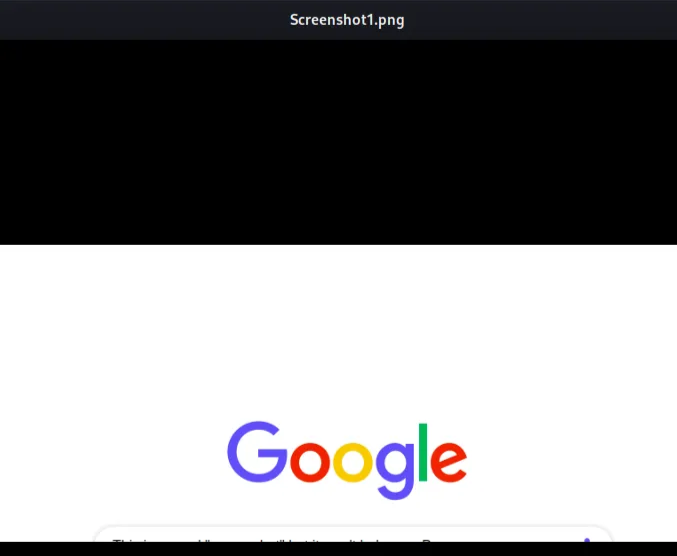

# Volatility 2

Download the releases and add it to the “ usr_environment “ ,


In that just comment these in chrome and firefox’s vim part,


By this way errors will be solved .

# **Concept :**

You can get the concept from this site of wiki in the volatility github ,

[https://github.com/volatilityfoundation/volatility/wiki/Command-Reference](https://github.com/volatilityfoundation/volatility/wiki/Command-Reference)

Now , lets start the journey →
https://github.com/stuxnet999/MemLabs

### Problem - 01 : ( **Never Too Late Mister** )

My friend John is an "environmental" activist and a humanitarian. He hated the ideology of Thanos from the Avengers: Infinity War. He sucks at programming. He used too many variables while writing any program. One day, John gave me a memory dump and asked me to find out what he was doing while he took the dump. Can you figure it out for me?

Challenge file: [Google drive](https://drive.google.com/file/d/1MjMGRiPzweCOdikO3DTaVfbdBK5kyynT/view)

**Solution :**

**Some info of “tar” file ,**

***Unzipping a `.tar` file:***

Use the following command to extract a `.tar` file (not compressed):

```bash
tar -xvf filename.tar
```

- **`x`**: Extract files from the archive.
- **`v`**: Verbose, display progress during extraction.
- **`f`**: Specifies the file to operate on.

---

***Unzipping a `.tar.gz` or `.tgz` file:***

If the `.tar` file is compressed with `gzip`, use:

```bash
tar -xzvf filename.tar.gz
```

- **`z`**: Indicates the file is compressed with gzip.

---

***Unzipping a `.tar.bz2` file:***

For files compressed with `bzip2`, use:

```bash
tar -xjvf filename.tar.bz2
```

- **`j`**: Indicates the file is compressed with bzip2.

---

***Unzipping a `.tar.xz` file:***

For `.tar` files compressed with `xz`, use:

```bash
tar -xJvf filename.tar.xz
```

- **`J`**: Indicates the file is compressed with xz.

---

***Extracting to a Specific Directory:***

To extract the contents to a specific directory, add the `-C` option followed by the path:

```bash
tar -xvf filename.tar -C /path/to/destination/
```

---

***Listing Contents Without Extracting:***

To view the contents of a `.tar` file without extracting:

```bash
tar -tvf filename.tar
```


Let’s start ,


“ imageinfo ” will give the information of the image .


“ pslist “ will show us the processes list in that dump . Here , the suspicious process is the “ cmd.exe ” . Dumpit.exe is used for memory dumping to make this challenge . “ conhost.exe ” is for the console . However , CMD is not normally open . There is a change of doing unethical in there as command .


“ cmdscan” will dump the command history of cmd . In the cmd.exe there was run a “ demon.py.txt ” file .


“ Consoles ” will give the info of command’s input and outputs . And , we notice that it gave hash code or encrypted code by that “ demon.py.txt ” . “ 335d366f5d6031767631707f ”

Now , lets think about the description and we will realize that there was a hint of “ environment variables “ . Let’s check it .


Now , analyze deeply from bottom to up .


At the of the result we found a “ Thanos ” named console.txt which hints us about xor algo . Now , lets decrypt the cipher that we get earlier .

You can also get the same hint in the command section’s also ,


Only giving xor decryption it didn’t revealed anything . So , we apply this approach . and we get the last portion’s flag .

Now , we used the first hint . Our second hint is password. Now , think according to it .

Volatility can extract password hashes from RAM because, during user login, the system loads authentication data (like password hashes) into memory for validation and session management. Tools like `lsass.exe` store these hashes in RAM, making them accessible to memory analysis tools like Volatility. RAM often contains decrypted sensitive data, unlike the encrypted SAM database on the hard drive. This is why RAM is targeted for extracting such information.


I asked chatgpt to give the format of those hashes and it gives me ,

```ruby
<Username>:<RID>:<LM hash>:<NTLM hash>:::
```

1. **`<Username>`**: The account name (e.g., `Administrator`, `Guest`, `hello`).
2. **`<RID>`**: The **Relative Identifier** for the user, which is unique within the security context of the system.
    - `500`: The default RID for the built-in Administrator account.
    - `501`: The default RID for the Guest account.
    - `1000`: The RID for a custom user (`hello`) in this example.
3. **`<LM hash>`**: The **LAN Manager (LM) hash** of the password.
    - For modern systems, LM hashing is typically disabled, and this field is set to `aad3b435b51404eeaad3b435b51404ee`, indicating a blank or disabled LM hash.
4. **`<NTLM hash>`**: The **NT Hash** or **NTLM Hash** of the password.
    - This is a 32-character hexadecimal string representing the MD4 hash of the user's password encoded in UTF-16.
5. **`:::`**: Padding or reserved fields, often unused.

So , we choose the “NTLM one” to crack with “john” or “hashcat” . But , unfortunately the hash is not crackable as the challenge was very old . And the author of this challenge also said that in the issue section in github .


So , basically we solved this challenge as though the database was refreshed from that site . But , the author gave us his writeup of that time —>>

Now the password hash we have to decrypt is `101da33f44e92c27835e64322d72e8b7`. We can use online NTLM hash cracking websites.


Well there you go, we have the other half of the flag --> **flag{you_are_good_but**. Concatenating the 2 parts gives us the whole flag.

FLAG: **flag{you_are_good_but1_4m_b3tt3r}**

### Problem - 02 : ( **Beginner's Luck** )

My sister's computer crashed. We were very fortunate to recover this memory dump. Your job is get all her important files from the system. From what we remember, we suddenly saw a black window pop up with some thing being executed. When the crash happened, she was trying to draw something. Thats all we remember from the time of crash.

**Note**: This challenge is composed of 3 flags.

**Challenge file**: [MemLabs_Lab1](https://mega.nz/#!6l4BhKIb!l8ATZoliB_ULlvlkESwkPiXAETJEF7p91Gf9CWuQI70)

**Solution :**


these are the juicy imformations →


And also we have to see working of these “ St4G3$1 ”


And , we get the first flag from that .

Now , lets think about the “ mspaint.exe ” . We grab the process id from the “pslist”


Now , we open that file in gimp ,


It basically showing the whole process in one suare for this we can’t see the text in mspaint.exe . Because a softwear runs with any processes and the text is the smallest part of that . So, we have to find that offset .


It was most annoying part :) . First start that with high value and then gradually will crack that . After open you will see and zoom that to the top ,


Congo we get 2nd flag . Now , the remaining flag maybe in the win.rar aplication maybe .

Though we use graphical interphase as os but all the commands basically runs in the background and it take those as arguments . For , winrar the file may be as the argument of the winrar .


Now , we have to read that important.rar .


“ Filescan “ basically gives the the files info which was in the cache at that time not hdd . Now , 3 results are done maybe for having multiple shortcuts or location of that file . And , dump the address with “ dumpfiles ” and give hex code address .

But , the main problem is that it demands a password . We also have a hint at top .


let’s uppercase the NTLM hash and paste it to the rar file ,


flag{w3ll_3rd_stage_was_easy}

### Problem - 03 : ( **A New World** )

One of the clients of our company, lost the access to his system due to an unknown error. He is supposedly a very popular "environmental" activist. As a part of the investigation, he told us that his go to applications are browsers, his password managers etc. We hope that you can dig into this memory dump and find his important stuff and give it back to us.

**Note**: This challenge is composed of 3 flags.

**Challenge file**: [MemLabs_Lab2](https://mega.nz/#!ChoDHaja!1XvuQd49c7-7kgJvPXIEAst-NXi8L3ggwienE1uoZTk)

**Solution :**


Lets first research on to the keepass.exe as passwords are very important .


And we get the arguments of the KeePass’s . We also notice that notepad.exe was also opens that Hidden.kdbs file . Now , lets dump this specific file ,


By hearing this name “keepass” i just remember a tool in kali named “keepass2” . Let’s try to open this file with that .


> The `keepass2` command in Kali Linux is used to launch **KeePass 2**, a popular open-source password manager. KeePass is designed to securely store and manage passwords in an encrypted database. Here's an overview:
> 

But , it is demanding a password as usual for keepass type folder . As we don’t have a password so lets carry on with others . If you remember there was an word named “environmental” so lets go through that who knowes we can get clue from that about the password.


Now , lets investigate the long result it gave . and one point we saw a strange hash and it seems that it is in base64 as the text is mixer of capital and small letters . After decrypting we get the flag .


However ,  we still didn’t get our password . But , look a password is generally not a easy word . So, nobody typically wants to write password all the time by hand-typing rather than copy pasting . So , there is a chance of having password in the clipboard .
Why we can have clipboard on memory dump ? reason is clipboard’s data are volatile . It erases when we restart the pc . That’s why it must be saved in the RAM .


But , unfortunately we didn’t get any result . Now , lets scan the files that were done and grep anything about the pass .


It says there is no flag but didn’t said  not have the password . To the bottom right the password was given in small font .


Copy that password and paste that in 12 sec after that the password will be erased from clipboard by the “ keepass “ softwear . 


> flag{w0w_th1s_1s_Th3_SeC0nD_ST4g3_!!}
> 

Now , for the 3rd flag  there was something hint about the browser so lets dump the history of the chrome history . For this we have to use the plugins that we download at first because in the volatility2 those plugins are not predefined stored .


From that we found many links but from that the mega link seems promising . But before going to that link first check the link in the “ virustotal “first . As , there may be some malware link also given at there .


So , the link is safe .


Download that . But this .zip file is password protected “SHA1” . Lets try to find this password from the “passkeep” softwear . But we will not get any useful one . So , investigate why that error showed ?


It has password but unzip can’t decrypt that algo though we give the right password . That’s why chatgpt is saying us to use “7z” . But , in the hint we see in the promt the password is the 3rd flag of the of the lab-1 in sha1 . 


flag{ oK_So_Now_St4g3_3_is_DoNE!! }

### Problem - 04 : ( **The Evil's Den** )

A malicious script encrypted a very secret piece of information I had on my system. Can you recover the information for me please?

**Note-1**: This challenge is composed of only 1 flag. The flag split into 2 parts.

**Note-2**: You'll need the first half of the flag to get the second.

You will need this additional tool to solve the challenge,

```
sudo apt install steghide
```

The flag format for this lab is: **inctf{s0me_l33t_Str1ng}**

**Challenge file**: [MemLabs_Lab3](https://mega.nz/#!2ohlTAzL!1T5iGzhUWdn88zS1yrDJA06yUouZxC-VstzXFSRuzVg)

**Solution :**


Only the notepad.exe is file which is may not run by default by the OS . It may be opened by any user. 

There is a built-in plugin called “notepad” but it will work only in the old versions like the “vista” , “XP”.


At first time the “ vip.txt ” file cipher didn’t crack by base64 . But , in the “ evilscript.py ” we get the encryption method of that cipher . So , we make the decryption method to decrypt it . And , we get the first portion of the flag .

> inctf{0n3_h4lf
> 

In the description we got a clue about the ” steghide ” . So lets find out “. png’” files as much as we can .


Only this file was very very different . Lets dump it .  In the steghide the passphrase was the “ inctf{0n3_h4lf ” as mentioned in the description .


> _1s_n0t_3n0ugh}
> 

> Flag = inctf{0n3_h4lf_1s_n0t_3n0ugh}
> 

### Problem - 05 : ( **Obsession** )

My system was recently compromised. The Hacker stole a lot of information but he also deleted a very important file of mine. I have no idea on how to recover it. The only evidence we have, at this point of time is this memory dump. Please help me.

**Note**: This challenge is composed of only 1 flag.

The flag format for this lab is: **inctf{s0me_l33t_Str1ng}**

**Challenge file**: [MemLabs_Lab4](https://mega.nz/#!Tx41jC5K!ifdu9DUair0sHncj5QWImJovfxixcAY-gt72mCXmYrE)

**Solution :**

This is very different say in the description as it demands that the file was deleted . 


Generally, sticky notes doesn’t take any arguments so we didn’t find any fruitful information .


Clipboard also don’t give any fruitful result . That means we have to apply a new method in here . which is screenshot by which we can the screenshot of that current moment .


The meaningful screenshots are →


But , unfortunately we didn’t get any fruitful info again except a name “eminem” .


It might give error if we give “ ” in the \\ with commands . For this we gave ‘ ’ later . And in grep to understand 1 backslash \ , we have to give 2 backslashes \\ .




We dump everything except the “ Important.txt ” file . We can’t dump a file if a file was deleted . That means the deleted file is the “ important.txt “ . That , google pic was interesting but the text was not able realize as it croped . Now , lets find the deleted file .

The **Master File Table (MFT)** in NTFS file systems acts as a database that stores metadata for every file and directory, including deleted ones. When a file is deleted, its entry in the MFT is marked as available, but the data remains until overwritten. This means:

- **Cache of Deleted Files**: Deleted file information, such as name, timestamps, and size, can often still be retrieved from the MFT until the entry is reused or overwritten.
- **Forensic Significance**: Tools can parse the MFT to recover deleted file metadata, even if the file content is gone.


Now , this data will super huge in length so putting that into a file so that later we can read that .


Basically , grep shows us before strings of the targeted strings . So , we tried get info of that important.txt file’s as if it may have the contents of that file in cache . we are guessing that entry is not reused .

However , we get the flag but the format of the flag is bit different as it has many dots . It is because if it is not given there is a chance that this will become very easy as we all know deleted files will be in the “mftparser” plugin . If it was then there is a chance that we can get the flag easily by only greppig the “inctf{” format .

> inctf{1_is_n0t_EQu4l_7o_2_bUt_th1s*d0s3nt*m4ke_s3ns3}
> 

### Problem - 06 : ( **Black Tuesday** )

We received this memory dump from our client recently. Someone accessed his system when he was not there and he found some rather strange files being accessed. Find those files and they might be useful. I quote his exact statement,

> The names were not readable. They were composed of alphabets and numbers but I wasn't able to make out what exactly it was.
> 

Also, he noticed his most loved application that he always used crashed every time he ran it. Was it a virus?

**Note-1**: This challenge is composed of 3 flags. If you think 2nd flag is the end, it isn't!! :P

**Note-2**: There was a small mistake when making this challenge. If you find any string which has the string "***L4B_3_D0n3*!!**" in it, please change it to "***L4B_5_D0n3*!!**" and then proceed.

**Note-3**: You'll get the stage 2 flag only when you have the stage 1 flag.

**Challenge file**: [MemLabs_Lab5](https://mega.nz/#!Ps5ViIqZ!UQtKmUuKUcqqtt6elP_9OJtnAbpwwMD7lVKN1iWGoec)

**Solution :**


we will see the notepad was multiple times used so there is a chance of it is his favorite software .And there are 2 types → NOTEPAD.EXE & notepad.exe . There is also suspicious “winrar” file .


There are no arguments of the notepad.exe . Basically this is the original version of the notepad . But , what is NOTEPAD.EXE and also it is in the Videoes folder very fishy . We also see the winrar is extracting a file . 


That means , this rar file will give me the 2nd flag . But its demands the 1st flag as password as we know from description . Now , lets think about the notepad.exe .


In the top of this image we get a bash64 string . You can write by only see and type or use this method to take that string .


> flag{!!*w3LL_d0n3_St4g3-1_0f_L4B_5_D0n3*!!}
> 

Now , lets crack that “ rar ” file .


Now , question is where is the 3rd flag ?

Only suspicious file which is still not decoded is NOTEPAD.EXE . As , we didn’t find anything as argument in “ cmdline ” , so we have to download that and need to reverse engineer that .


We only go for the “ Videoes ” folder as it seems sussy 🙂

Opened the “ file.None.0xfffffa8000f886e0.dat ” in binary ninja . When we are in “ Graph mode ” we will find the flag .


> bi0s{M3m_l4B5_OVeR_!}
> 

### Problem - 07 : ( **The Reckoning** )

We received this memory dump from the Intelligence Bureau Department. They say this evidence might hold some secrets of the underworld gangster David Benjamin. This memory dump was taken from one of his workers whom the FBI busted earlier this week. Your job is to go through the memory dump and see if you can figure something out. FBI also says that David communicated with his workers via the internet so that might be a good place to start.

**Note**: This challenge is composed of 1 flag split into 2 parts.

The flag format for this lab is: **inctf{s0me_l33t_Str1ng}**

**Challenge file**: [MemLabs_Lab6](https://mega.nz/#!C0pjUKxI!LnedePAfsJvFgD-Uaa4-f1Tu0kl5bFDzW6Mn2Ng6pnM)

**Solution :**


Lets first get in to the “ flag.rar ” file first . But , it demands password .


Now , lets search for the internet browser history option . Remember it will be very big result .


Basically we have to find this kind of things in those histories like → Drive link , mega link , pastebin , shorturl . If you notice at one time you will get a pastebin link .

After some careful search we finally find something worthy ,


It lands on a text document , https://docs.google.com/document/d/1u__kCk1Xg_DZhDlsGmaLLdKFLJjsemdF/edit?usp=drive_link&ouid=108227900889895459317&rtpof=true&sd=true

If you read that carefully , you will find that there is a link of mega ,


WTF! this mega link also demanding a encryption key 😂


Great , we get the gmail of something related with mega link’s key in the snapshot ,


This command produce many garbage strings . So ,try this and will get the key in the middle of the garbage ,


We get .png from that link .

[https://drive.google.com/file/d/1-ugfJmGsFDl0WT4NoN0mZcRgScnXJQ1s/view?usp=drive_link](https://drive.google.com/file/d/1-ugfJmGsFDl0WT4NoN0mZcRgScnXJQ1s/view?usp=drive_link)


missing IHDR file .


now , we have to fix that png as we see in the picture . In “ hexeditor ” tust change that 69 to 49 only and save the file .


> inctf{ thi5_cH4LL3Ng3_!s_g0nn4_b3_?_
> 

Try this as password of that “ winrar ” but it will not work .


Lets check on to the “ enviromental variables ”

It gave us a very big result ,


And , we found the password of the winrar .


> Flag =  inctf{ thi5_cH4LL3Ng3_!s_g0nn4_b3_?_aN_Am4zINg_!_i_gU3Ss???_}
>