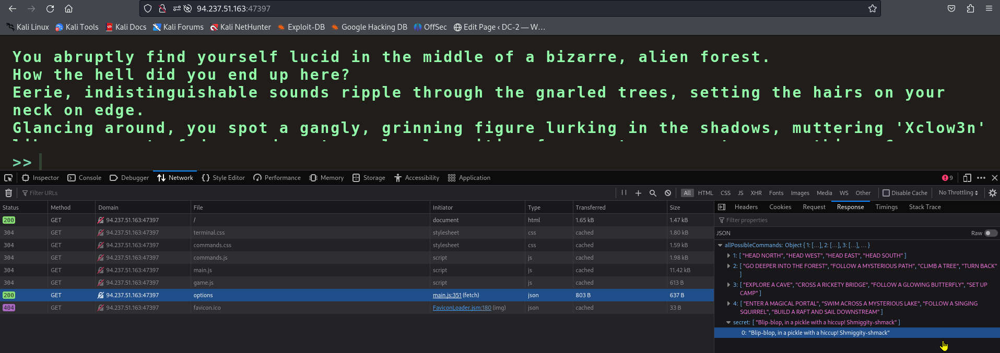
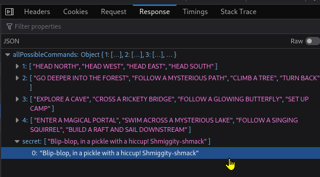
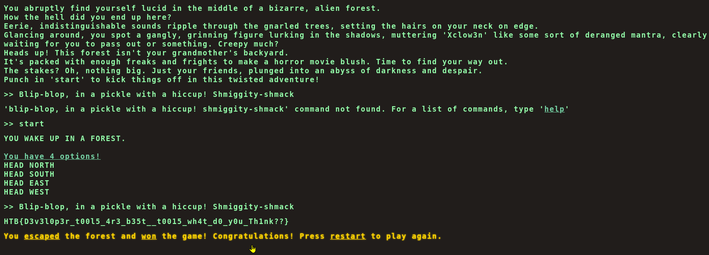

## CHALLENGE DESCRIPTION<br>
Embark on the "Dimensional Escape Quest" where you wake up in a mysterious forest maze that's not quite of this world. Navigate singing squirrels, mischievous nymphs, and grumpy wizards in a whimsical labyrinth that may lead to otherworldly surprises. Will you conquer the enchanted maze or find yourself lost in a different dimension of magical challenges? The journey unfolds in this mystical escape!

## Solution:<br>
You can play the game and choose some correct choices but it will not let you to the flag .
To continue the conversation for continuously 3 times but in the 4th time no choice lead to the flag .

In "/static/terminal/js/main.js" ->

```
// HTTP REQUESTS
// ---------------------------------------
async function CheckMessage() {
    fetchingResponse = true;
    currentCommand = commandHistory[commandHistory.length - 1];

    // Main imp line

    if (availableOptions[currentStep].includes(currentCommand) || availableOptions['secret'].includes(currentCommand)) {
        await fetch('/api/monitor', {
            method: 'POST',
            headers: {
                'Content-Type': 'application/json'
            },
            body: JSON.stringify({ 'command': currentCommand })
        })

            .then((res) => res.json())
            .then(async (data) => {
                console.log(data)
                await displayLineInTerminal({ text: data.message });

                if(data.message.includes('Game over')) {
                    playerLost();
                    fetchingResponse = false;
                    return;
                }

                if(data.message.includes('HTB{')) {
                    playerWon();
                    fetchingResponse = false;

                    return;
                }

                if (currentCommand == 'HEAD NORTH') {
                    currentStep = '2';
                }
                else if (currentCommand == 'FOLLOW A MYSTERIOUS PATH') {
                    currentStep = '3'
                }
                else if (currentCommand == 'SET UP CAMP') {
                    currentStep = '4'
                }

                let lineBreak = document.createElement("br");


                beforeDiv.parentNode.insertBefore(lineBreak, beforeDiv);
                displayLineInTerminal({ text: '<span class="command">You have 4 options!</span>' })
                displayLinesInTerminal({ lines: availableOptions[currentStep] })
                fetchingResponse = false;
            });


    }
    else {
        displayLineInTerminal({ text: "You do realise its not a park where you can just play around and move around pick from options how are hard it is for you????" });
        fetchingResponse = false;
    }
}
```
In that code "secret" option has || operation and it is highly chance to be an valid option . If it exists what ever the response result if it contains "HTB{" string in it , will call the "playerWon()" function .<br>
If we refresh the page before inspecting the page (F12) with choosing network we will see the secret option.





now according to the main.js ->
```
┌──(kali㉿kali)-[~/Hack the box]
└─$ curl -X POST http://94.237.51.163:47397/api/monitor -H "Content-Type: application/json" -d '{"command":"Blip-blop, in a pickle with a hiccup! Shmiggity-shmack"}'
{
  "message": "HTB{D3v3l0p3r_t00l5_4r3_b35t__t0015_wh4t_d0_y0u_Th1nk??}"
}
       
```
Or, 

