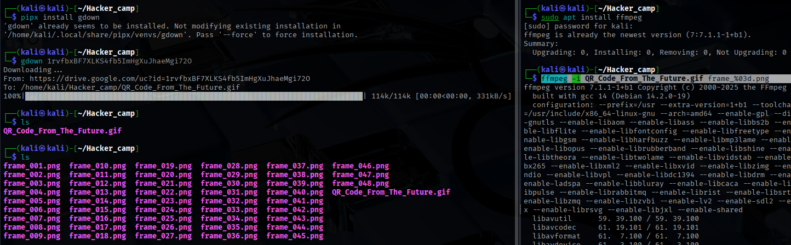
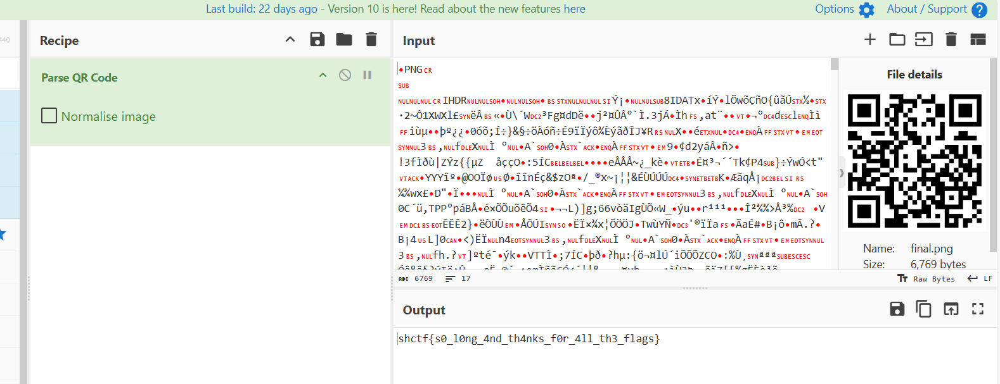

# Steganography

```bash
Note : Before install make sure your Linux is up to date by giving the commands ,

- `sudo apt update`: Updates the list of available packages and their versions.
- `sudo apt upgrade -y`: Upgrades all the installed packages to their latest versions.
- `sudo apt full-upgrade -y`: Performs a full upgrade, handling any package dependencies.
- `sudo apt autoremove -y`: Removes packages that were automatically installed to satisfy dependencies for other packages and are now no longer needed.
```

### Recommended Steganography Tools to Learn:

1. **Steghide**: Highly recommended for its advanced algorithm and undetectability by color-frequency tests.
2. **OpenStego**: A versatile and widely used Java-based tool for hiding data in image files.
3. **stegify**: Written in Go, it is efficient and uses LSB (Least Significant Bit) steganography.
4. **Stegano**: Another solid choice for LSB steganography, particularly for PNG images.
5. **DeepSound**: Useful for hiding data in audio files, offering a unique approach to steganography.

### Additional Suggestions:

- **Invisible Secrets 4**: Offers a comprehensive set of features for various types of files.
- **SilentEye**: User-friendly and supports multiple file formats.
- **S-Tools**: A classic tool known for its reliability and ease of use.

### **Problem - 01 :**

The QR code from the future was given as a gif file which showed a short video of multiple QR codes. This was their take of changing a static input to a dynamic input .

[https://drive.google.com/file/d/1rvfbxBF7XLKS4fb5ImHgXuJhaeMgi72O/view?usp=sharing](https://drive.google.com/file/d/1rvfbxBF7XLKS4fb5ImHgXuJhaeMgi72O/view?usp=sharing)

**Solution :**

install → 

`sudo apt install zbar-tools`

convert gif to qr_codes → `ffmpeg -i QR_Code_From_The_Future.gif frame_%03d.png`




```bash
#!/bin/bash

decoded_result=""

for file in *.png; do
    echo "Decoding $file:"
    result=$(zbarimg "$file" 2>/dev/null)  # Suppress errors if any

		# spliting the "QR-Code" part
		# pattern -> s/pattern/replacement/
    clean_result=$(echo "$result" | sed 's/^QR-Code://')
    echo "$clean_result"

    decoded_result+="$clean_result"
done

echo -e "\nDecoded Results:\n$decoded_result"
```

encrypted flag → `}pvznalq_bg_pvgngf_zbes_qriybir_gbt_rqbp_ED{SGPX`


Actually the flag is reversed →

get the resulted flag and run that by this way →


Flag → `KCTF{QR_code_got_evolved_from_static_to_dynamic}`

### **Problem - 02 :**

**Solution :**

We are given a file named “filed.kra”. I didn’t recognise the extension and the file command didn’t reveal much information so I decided to look the extension up on [fileinfo.com](https://fileinfo.com/extension/kra).

The search told me that this is a Krita Image Document. I installed Krita and opened the provided file in it.

On the right, we see multiple layers that have different contents.


If we disable all layers and check them one at a time, we can see that one of them holds the flag.


KCTF{W00_n1ce_you_got_me}

### **Problem - 03 :**


**Solution :**

For this one we got an .3mf file, which we had no clue for what it is. After a quick search it turned out that .3mf files are used for 3D printers to print what ever you want [3mf](https://en.wikipedia.org/wiki/3D_Manufacturing_Format). According to our search its xml based but not readable with a text editor. Again a quick search and we tool the first online 3mf viewer:


Whatever that was, was not helpful. So we tried the next Tool and found something really helpful [3mf viewer](https://3dviewer.net/)

[KnightCTF_The_Hungry_Dragon.mp4](KnightCTF_The_Hungry_Dragon.mp4)

As you could see we just needed to count the doughnut and sweets we found here which was pretty easy now. Based on the Flag format the flag was *KCTF{3_doughnut_and_11_sweet}*.

*Or ——>>*

We are given the file “The Hungry Dragon.3mf”. Looking the extension up on [fileinfo.com](https://fileinfo.com/extension/3mf), we find that this is a 3D Manufacturing File that can be opened in many 3D modeling programs. I decided to use [Ultimaker Cura](https://ultimaker.com/software/ultimaker-cura).

Once the file has been loaded, we can switch to the Preview tab and change the view type to x-ray in the op left.


All we need to do now is find a good perspective and count the objects inside the dragon.


We can see 3 Donuts and 11 Sweets (Spheres)

### **Problem - 04 :**

An `.xlsx` file was given that was corrupted so no data was displayed

**Solution :**

All Microsoft files like Word and Excel are essentially zip files holding a bunch of xml so I just ran `7z x *.xlsx` twice and the flag was in `sharedStrings.xml`

**Flag →** `KCTF{XLSX_Fil3$_4R3_Actually_0n3_Kind_0f_Zip_Fil3}`

### **Problem - 05 :**

**Solution :**

A file was given called `unzipme.zip` but it isn't actually a zip file.

Printing out the file contents with cat gives

```
KP�T,|�Glfgat.txCKFTs{_OOy_uWsPa3P_DHt_e1f3L
}KP?�T,|�G��lfgat.txKP6D\n
```

1. It seems that some of the flag characters are mixed up with each other
    - KCTF --> CKFT
2. Each ith character has been swapped with the (i+1)th character so I just did a python script to reshuffle it

```
text = "lfgat.txCKFTs{_OOy_uWsPa3P_DHt_e1f3L}"
newText = ""
for i in range(0,len(text), 2):
    newText += text[i+1]
    newText += text[i]
print(newText)
```

**Flag →** `KCTF{sO_yOu_sWaPP3D_tHe_f1L3}`

### **Problem - 06 :**

A `.wav` file was given.

**Solution :**

1. Opening the wav file in Sonic Visualizer and looking at the spectrogram showed - some meddling with the settings was needed to get sufficient contrast to read the letters
    
    
    
2. Following the drive link showed a video with a bunch of static and two flashes of binary numbers
    
    
    
3. Replaying the video at 0.25x and notating the binary numbers and putting it into cyber chef gave the flag

**Flag →** `KCTF{H3LLO_H3LLO}`

### **Problem - 07 :**

We are given an **`unknown file`** file with no extension. As usual, let’s **`file`** it to get more informations.

**Solution :**


It seems it didn’t recognize anything. Let’s open the file with **`hexedit`** to see what it contains exactly.


We can see interesting words such as “IHDR”, “sRGB” or “pHYs”. We also recognize [**XMP**](https://en.wikipedia.org/wiki/Extensible_Metadata_Platform) metadata.

We are clearly in front of a PNG file. The issue is, the magic bytes seems corrupted. The [**magic bytes**](https://en.wikipedia.org/wiki/List_of_file_signatures) of PNG files is supposed to be **`89 50 4E 47 0D 0A 1A 0A`**, but as you can see in the file, while the last 4 are correct, the first 4 are wrong. Let’s fix them and save that patched version as **`flag.png`**.


We open the image, and there we go:


Flag: **`KCTF{Imag3_H3ad3r_M4nipul4t10N}`**

### **Problem - 08 :**

**Do you know anything about this image?**

[https://drive.google.com/file/d/1hzC6NuAmEdpKmCyU93kLFBkavrQGeh1C/view?usp=drive_link](https://drive.google.com/file/d/1hzC6NuAmEdpKmCyU93kLFBkavrQGeh1C/view?usp=drive_link)

**Solution :**


Walk ... binWalk

```bash
binwalk -e interesting_waves.png
unzip _interesting_waves.png/11150.zip
```

a password is required

```bash
zip2john 11150.zip > 11150.zip.hash
john 11150.zip.hash --wordlist=/usr/share/wordlists/rockyou.txt
```

password is: letmein!

```bash
unzip -P letmein! 11150.zip
cat Flag/flag.txt
KCTF{BiNw4lk_is_h3lpfUl}
```

### **Problem - 09 :**

The possibility of a weapon that alters the very core of the structure of the universe itself is beyond even the wildest imaginations. Or is it? Ramona and Paulie are exeperimenting with concentric Dyson spheres to achieve the impossible, to harvest the energy of an entire quasar in order to create such a weapon. The exepriments showed that five spheres are the optimal solution. Alas, the thermal equilibrium is still a pressing issue they need to figure out. They measure the temperature of each sphere for every minute. Now all that is left is to properly analyze the data and figure out why there are so many thermal inconsistencies.

[https://drive.google.com/file/d/14mRK01Tcu-l0tiaLjOOZp2HBIBQg0RUO/view?usp=drive_link](https://drive.google.com/file/d/14mRK01Tcu-l0tiaLjOOZp2HBIBQg0RUO/view?usp=drive_link)

**Solution :**

The challenge provides a CSV [heat_measurements.csv](https://rewdog.com/ctfs/cyber-apocalypse-ctf-2022/matrioshka-brain/heat_measurements.csv), with 5 spheres and their temperatures over time. I thought about doing some crazy stuff, like using the data to an image and the fluctations over time.

Then, the name of the csv triggered me just to create a heat map.

1. Import the csv into Google Sheets
2. Use Format -> Conditional Formatting -> Color Scale across the Range.
3. Adjust the Rows to be a little taller and zoom out, and you should see the flag.


just plotting the 20-30 range value

Or, 

Matrioshka brain is a challenge about a [Dyson sphere](https://en.wikipedia.org/wiki/Dyson_sphere): a sphere structure around a star to capture and transform the energy from the heat generated.

We are given a `.csv` file containing heat measurements for 5 spheres. Each point is the temperature of sphere `N` at the minute `M`.


Diverse tries to transform the numerical values into ASCII, convert it to Kelvin or Farhenheit failed. However coming back to the description about **heat** measurements: what if we plot this as a **heatmap**?

It can be done through different tools, for instance Excel, or Python and `matplotlib`. Here is the Python version:

```bash
import matplotlib.pyplot as plt

minutes = [1,2,3,4,5,6,7,8,9,10,11,12,13,14,15,16,17,18,19,20,21,22,23,24,25,26,27,28,29,30,31,32,33,34,35,36,37,38,39,40,41,42,43,44,45,46,47,48,49,50,51,52,53,54,55,56,57,58,59,60,61,62,63,64,65,66,67,68,69,70,71,72,73,74,75,76,77,78,79,80,81,82,83,84,85,86,87,88,89,90,91,92,93,94,95,96,97,98,99,100,101,102,103,104,105,106,107,108,109,110,111,112,113,114,115,116,117,118,119,120,121,122,123,124,125,126,127,128,129,130,131,132,133,134,135,136,137,138,139,140,141,142,143,144,145,146,147,148,149,150,151,152,153,154,155,156,157,158,159,160,161,162]

s1 = [28,88,70,21,64,25,20,26,25,24,61,24,22,22,63,60,79,23,20,83,64,22,69,67,27,64,80,72,23,80,28,73,89,86,30,60,84,23,26,62,81,23,75,66,26,74,67,24,23,29,67,70,28,26,66,77,67,71,76,76,80,72,20,20,72,81,30,87,65,21,62,77,29,26,87,73,28,24,30,61,84,70,27,26,70,78,26,79,84,86,20,63,62,68,78,68,84,87,20,80,86,28,71,60,86,22,62,27,83,63,64,22,82,60,30,22,86,62,26,79,89,20,82,64,20,26,26,65,69,28,29,65,67,60,65,84,82,88,29,82,85,25,87,83,21,28,86,64,61,86,25,69,60,26,23,29,29,27,82,24,25,78]
s2 = [27,73,71,22,88,72,87,27,84,61,74,27,74,89,26,80,71,21,75,71,26,26,69,88,20,28,78,27,27,83,20,27,73,29,24,65,20,87,79,24,74,25,22,89,26,75,23,63,64,65,63,22,72,86,21,88,63,61,70,78,67,27,90,87,28,64,29,30,86,26,69,26,64,63,28,60,26,89,82,28,70,22,84,66,72,89,25,61,73,60,30,64,63,63,82,70,74,21,30,60,70,29,23,67,20,24,73,22,29,83,30,23,64,21,71,84,24,75,29,26,77,28,78,30,72,63,72,67,29,90,90,27,77,73,88,80,61,88,21,88,61,30,87,26,65,78,26,79,89,28,30,90,62,60,74,24,66,82,64,82,24,86]
s3 = [21,28,28,30,61,64,76,25,66,83,62,23,29,24,77,90,28,89,70,85,73,22,88,63,22,64,23,79,22,83,30,81,25,62,28,82,83,80,23,89,67,20,69,21,21,74,90,24,23,86,89,74,63,27,74,80,84,84,76,70,74,61,78,30,61,89,21,78,26,27,69,61,79,21,60,61,22,25,22,82,87,22,67,25,24,72,78,23,21,20,79,64,70,63,63,61,67,90,20,82,69,30,68,26,76,22,60,28,69,23,76,21,74,66,87,27,62,72,24,61,22,23,68,67,26,28,82,88,67,89,24,66,90,86,71,72,64,69,23,22,24,27,70,70,69,22,65,80,23,75,30,65,74,77,61,22,67,88,71,86,69,28]
s4 = [25,63,86,21,61,78,82,28,64,61,81,26,90,89,22,69,74,29,90,79,60,22,71,87,24,64,76,71,25,64,28,66,82,70,26,85,23,86,85,24,65,21,79,71,30,61,80,78,61,24,88,25,65,85,26,74,60,73,87,82,86,30,64,85,23,72,20,71,70,30,69,25,87,85,22,70,23,83,30,80,68,29,60,84,21,90,68,77,22,63,87,78,61,76,62,78,61,81,26,86,69,29,61,80,73,23,89,20,76,79,68,26,71,24,77,68,21,65,27,83,83,30,75,88,74,67,24,67,27,69,80,21,86,81,75,77,88,70,22,89,61,27,60,28,71,87,29,85,27,27,23,27,64,85,64,28,82,61,86,65,30,61]
s5 = [26,86,90,29,87,89,65,28,88,64,85,20,22,26,88,82,69,26,24,75,25,27,27,90,22,72,80,79,20,73,29,61,89,79,30,71,67,21,22,73,64,24,73,67,23,84,25,24,22,83,70,83,29,20,70,82,23,26,22,25,61,64,30,24,70,64,25,79,66,25,76,79,26,25,86,68,26,63,61,27,73,72,27,21,76,73,79,66,23,74,81,85,20,26,22,28,74,25,21,22,83,29,82,90,62,24,65,30,88,79,84,20,67,61,21,26,70,65,22,84,61,23,75,23,21,21,81,64,90,30,28,75,70,25,30,24,24,81,21,73,76,20,86,72,25,22,69,79,74,68,21,89,78,60,77,30,77,69,85,24,23,70]

plt.imshow((s1, s2, s3, s4, s5), cmap='hot', interpolation='nearest')
plt.show()
```

Here is the result:


The flag is `HTB{1MM3NS3_3N3RGY_1MM3NS3_H3AT}`

`HTB{1MM3NS3_3N3RGY_1MM3NS3_H34T}`

### **Problem - 10 :**

We know one can do pretty much everything in Excel spreadsheets, but this…

[https://drive.google.com/file/d/1Ysxz0uW_JYEOWv9SuCiYv26MWEK9Cgov/view?usp=drive_link](https://drive.google.com/file/d/1Ysxz0uW_JYEOWv9SuCiYv26MWEK9Cgov/view?usp=drive_link)

**Solution :**

In this reversing challenge, we are given an [excel file](https://ilovectf.github.io/assets/volga/VolgaCTF_excel_crackme.xlsm). You will be greeted with a crackme in Excel, which looks like


After typing in something in the box and clicking `Check flag`, the Excel doc will determine whether your input is correct via a macro. A macro is a VBA (Visual Basic for Applications) script that automates tasks such as checking mouse clicks or key presses.

To access the macro, modify the excel file extension to a zip and unzip it. Look for a file called

```
vbaProject.bin
```


Next, I decompiled the VBA binary with [pcode2code](https://pypi.org/project/pcode2code/), running `pcode2code vbaProject.bin -o decompile`.

I filtered out code that didn’t matter and modified a few things to make it more readable:

```bash
**Private** **Sub** **VolgaCTF**()
  **Dim** K6Jq6qvy **As** **StringDim** fpqigdwkxf **As** **LongDim** hiedpuxyvs **As** **LongDim** CLAO4r **As** **Long**K6Jq6qvy **=** "L15"
  **For** vbrexxoiuk **=** 1 **To** Len(K6Jq6qvy)
    fpqigdwkxf **=** 0
    **For** hbzugliakq **=** 1 **To** Len(K6Jq6qvy)
      hiedpuxyvs **=** **CInt**(Cells(99 **+** vbrexxoiuk, 99 **+** hbzugliakq).Value)
      rJ1UnHB **=** Mid(K6Jq6qvy, hbzugliakq, 1)
      fpqigdwkxf **=** fpqigdwkxf **+** hiedpuxyvs ***** Asc(rJ1UnHB)
    **Next** hbzugliakq
    CLAO4r **=** **CLng**(Cells(99 **+** vbrexxoiuk, 99 **+** Len(K6Jq6qvy) **+** 1).Value)
    **If** (CLAO4r **<>** fpqigdwkxf) **Then**MsgBox "bad"
      **Exit** **SubEnd** **IfNext** vbrexxoiuk
  MsgBox "good"
**End** **Sub**
```

It still wasn’t that readable to me so I converted it into my own Python psuedocode:

```bash
**for** x **in** range(1, len(guess)):
    f **=** 0
    **for** i **in** range(1, len(guess)):
        h **=** cell[99 **+** x:99 **+** i]
        r **=** guess[i]
        f **+=** h ***** ord(r)
    c **=** cell[99 **+** x: 99 **+** len(guess) **+** 1]
    **if** c **!=** f:
        **print**('bad')
```

I visualized this in my head and noticed that `Row(h) * Col(r) = c` where h, r, and c are of length guessed flag. This is equivalent to a simple matrix multiplication problem. So I wrote my code to solve it.

[solve.py](https://ilovectf.github.io/assets/volga/solve.py)

```bash
import xlrd
import numpy **as** np

workbook **=** xlrd**.**open_workbook('VolgaCTF_excel_crackme.xlsm')
worksheet **=** workbook**.**sheet_by_name('Лист1')

**for** length **in** range(10, 50): *# Guessing flag length*
    A **=** []
    C **=** []

    **for** i **in** range(length):
        a **=** []
        **for** j **in** range(length):
            a**.**append(int(worksheet**.**cell(99 **+** i, 99 **+** j)**.**value))
        A**.**append(a)
        C**.**append([int(worksheet**.**cell(99 **+** i, 99 **+** length)**.**value)])

    *# Our goal is to solve for B when we know that A * B = C*
    *# A^-1 * A * B = A^-1 * C*
    *# Therefore, B = A^-1 * C*
    A **=** np**.**array(A)
    C **=** np**.**array(C)
    B **=** np**.**linalg**.**inv(A)**.**dot(C)
    B **=** [int(round(e)) **for** b **in** B**.**tolist() **for** e **in** b]
    **if** B[0] **==** 86: *# equal to 'V', first letter of 'VolgaCTF{}'*
        **print**(''**.**join(chr(e) **for** e **in** B))
        **break**
```

The flag is `VolgaCTF{7h3_M057_M47h_cr4ckM3_y0u_3V3R_533N}`.

### **Problem - 11 :**

```
This is what happens when you let a manager create challenges for INS'hAck.
If you don't have Microsoft Excel, this challenge also works in Google Sheets.
```

**Solution :**

The problem of finding the value of B1~E1 cells that meet the conditions of the if statement of G2 cell.

B1~E1 cells are set to random numbers by default.

B2~E82 contains the calculation formula.

The conditions of the if statement in the G2 cell are as follows. The value of the B1~E1 cell that satisfies this condition is flagged.

- B1~E1 is 2~256
- E82=1
- B1-C1=46
- E1-D1=119

First, set =C1+46 in cell B1 and =E1-119 in cell D1.

All that remains is to find the values of the C1 and E1 cells, such that the E82 cell becomes 1.

It would be nice to create a [VBA](http://d.hatena.ne.jp/keyword/VBA) macro that bruteforce turns the C1 and E1 cells, but I thought I'd observe it first, so I set up a spin button on the [Excel](http://d.hatena.ne.jp/keyword/Excel) form and link it to the C1 and E1 cells. Keep pressing the spin button and observe the value of each cell.

Then, when the E1 cell is , notice that the value of the cell in the E column changes rapidly.`132`

When the value of the C1 cell was changed and observed in that state, the E82 cell became when the C1 cell was , and the condition of the if statement was satisfied.`1571`


`Congrats! Here is yout flag: INSA{203-157-13-132}`

Or →

We are given a xlsx file with tonnes of formulae. My initial approach was to backtrack the code, so that inputs are correct.

The one particularly important Formula was

```bash
=IF(AND(E82=1,B1>1,B1<=256,C1>1,C1<=256,D1>1,D1<=256,E1>1,E1<=256,B1-C1=46,E1-D1=119),"Congrats! Here is yout flag: INSA{"&TEXT(B1,"0")&"-"&TEXT(C1,"0")&"-"&TEXT(D1,"0")&"-"&TEXT(E1,"0")&"}","Wrong input")
```

It looks at B1, C1, D1, E1 which are supposedly the inputs and E82, which is suppossed to be 1.

Now, backtracking E82 seemed long, and B1, C1, D1 and E1 have relatively small ranges, so I resorted to brute force.

The max range of C1 varies from 0 -> 211 and value of D1 varies from 0 -> 138. The value of E1 is dependent on D1 and value of B1 is dependant on C1.

I found this awesome python library `xlwings` which uses Microsoft Excel as a backend engine to evaluate Formulae.

The Following script gives us the Flag

```bash
import xlwings as xw

wb = xw.Book("path")
ws = wb.sheets.active
for i in range(138):
    for j in range(211):
        ws['D1'].value = i
        ws['C1'].value = j
        ws['E1'].value = i+119
        ws['B1'].value = j+46
        val = ws['G2'].value
        if 'flag' in val:
            print(val)
```

We get the following flags in somewhat 5 mins

```bash
Congrats! Here is yout flag: INSA{75-29-13-132}
Congrats! Here is yout flag: INSA{203-157-13-132}
```

### **Problem - 12 :**

A csv file contains a hidden surprise that will lead you to the next level. But it’s not easy to find. Can you uncover it and solve it?

[https://drive.google.com/file/d/1a1Spnnu_0tmgdvTNpC4Jy8_Jam2YrP9H/view?usp=drive_link](https://drive.google.com/file/d/1a1Spnnu_0tmgdvTNpC4Jy8_Jam2YrP9H/view?usp=drive_link)

**Solution :**

When we open the file **secret_1 (1).csv** we see that there are some text like 0,1......... which are basically the qr code coodinate of black pixel stored. Now accordingly we need to write a solve script to get the qr code and they use any qr code scanner to scan the qr code a get the secret text or flag.

```python
from PIL import Image
import csv

def decode_coordinate(coord):
    x, y = map(int, coord.split(','))
    return (x, y)

def decode_coordinates(encoded_coordinates):
    return [decode_coordinate(coord) for coord in encoded_coordinates]

# Read the black pixel coordinates from the CSV file
with open("secret.csv", "r") as f:
    reader = csv.reader(f)
    next(reader) # Skip the header row
    encoded_coordinates = [row[0] for row in reader]

decoded_coordinates = decode_coordinates(encoded_coordinates)

# Recreate the QR code image
image = Image.new("1", (100, 100), color=255)
for x, y in decoded_coordinates:
    image.putpixel((x, y), 0)

image.save("recreated_qr_code.png")
```

### **Problem - 13 :**

Anagram, anyone?

[https://docs.google.com/spreadsheets/d/1bfDl6Tw4PzX_viEQFJxfPM0micsBX9FL/edit?usp=drive_link&ouid=108227900889895459317&rtpof=true&sd=true](https://docs.google.com/spreadsheets/d/1bfDl6Tw4PzX_viEQFJxfPM0micsBX9FL/edit?usp=drive_link&ouid=108227900889895459317&rtpof=true&sd=true)

**Solution :**

The challenge gives us an *Excel* spreadsheet ([data.xls](https://github.com/smokeleeteveryday/CTF_WRITEUPS/blob/master/2016/SHARIFCTF/forensics/kick_tort_teen/challenge/data.xls)). As soon as we open this file in LibreOffice, we are prompted with a warning about embedded macros.


After acknowledging the warning we can see there's a grid of 23*14747 cells that hold numbers. So let's take a look at the macros we were warned about earlier. Via `Tools > Macros > Organize macros > LibreOffice Basic` we can see that file contains three macros under `Modules > Module1`. We can view the actual code by selecting `Edit`:

```
Rem Attribute VBA_ModuleType=VBAModule
Option VBASupport 1
Function FileExists(ByVal FileToTest As String) As Boolean
   FileExists = (Dir(FileToTest) <> "")
End Function
Sub DeleteFile(ByVal FileToDelete As String)
   If FileExists(FileToDelete) Then 'See above
      SetAttr FileToDelete, vbNormal
      Kill FileToDelete
   End If
End Sub
Sub DoIt()
    Dim filename As String
    filename = Environ("USERPROFILE") & "\fileXYZ.data"
    DeleteFile (filename)

    Open filename For Binary Lock Read Write As #2
    For i = 1 To 14747
        For j = 1 To 23
            Put #2, , CByte((Cells(i, j).Value - 78) / 3)
        Next
    Next

    Put #2, , CByte(98)
    Put #2, , CByte(13)
    Put #2, , CByte(0)
    Put #2, , CByte(73)
    Put #2, , CByte(19)
    Put #2, , CByte(0)
    Put #2, , CByte(94)
    Put #2, , CByte(188)
    Put #2, , CByte(0)
    Put #2, , CByte(0)
    Put #2, , CByte(0)

    Close #2
End Sub
```

This shows there's the `FileExists` function and two subroutines `DeleteFile` and `DoIt`. `FileExists` only checks if a given a file is present on the system, while `DeleteFile` deletes a file. The interesting code clearly is in `DoIt`. Basically what this macro will do is iterate over all the cells, do a minimal calculation over the value, convert it to a `CByte` and write the result to a file `fileXYZ.data` in the directory specified by the `USERPROFILE` environment variable. Finally it appends a couple more bytes to the file.

Instead of running the macro from inside the spreadsheet, we exported the data in a more friendly [csv](https://github.com/smokeleeteveryday/CTF_WRITEUPS/blob/master/2016/SHARIFCTF/forensics/kick_tort_teen/solution/data.csv) format and wrote a simple Python script that will do the same as the `DoIt` macro.

```
def main():

    data = []

    print('[+] Reading values', end='... ')
    with open('data.csv') as f:
        for line in f:
            for i in line.split(','):
                value = (int(i) - 78) // 3
                data.append(value)
    print('done')

    with open('fileXYZ.data', 'wb') as f:
        print('[+] Writing decoded bytes', end='... ')
        f.write(bytes(data))
        print('done')

        print('[+] Writing trailing bytes', end='...')
        f.write(bytes([98, 13, 0, 73, 19, 0, 94, 188, 0, 0, 0]))
        print('done')

    print('[+] Done: fileXYZ.data')

if __name__ == '__main__':
    main()
```

Let's see what we produced:

```
> $ file fileXYZ.data
> fileXYZ.data: ELF 64-bit LSB executable, x86-64, version 1 (GNU/Linux), statically linked, stripped

```

**Solution**

Running the file now presents us with the flag:

```python
> $ ./fileXYZ.data
> SharifCTF{5bd74def27ce149fe1b63f2aa92331ab}
```

### **Problem - 13 :**

We are given with an image file: `A_Real_Space_Hero.jpg`

[https://drive.google.com/file/d/1U5z8r8s987AMW0yppJrAxhnzURprf49s/view?usp=drive_link](https://drive.google.com/file/d/1U5z8r8s987AMW0yppJrAxhnzURprf49s/view?usp=drive_link)

**Solution :**

Let's check the strings...


Oh, there are hidden images inside of it. Let's extract using ,

```bash
binwalk -e A_Real_Space_Hero.jpg
```

In the extracted folder , there is a folder called “secret” and in that we will see many pieces of images


Hmm, black pixels, this is likely a QR code parts. Now, we will try to combine all of the images together by “ ascending order ” and create a final QR code . Image range is 0 - 399 (400) . That means 20x20 matrix able QR code that was.

```python
from PIL import Image
import os

# Define the size of each chunk and the final grid dimensions
chunk_size = 20  # Assuming each chunk is 20x20 pixels
grid_size = 20   # 20x20 grid of chunks
output_size = chunk_size * grid_size  # Final QR code size

# Folder containing the chunks
folder_path = r"C:\\Users\\VICTUS\\OneDrive\\Desktop\\Test\\secrets"

# Initialize a blank image for the final QR code
final_qr = Image.new('RGB', (output_size, output_size))

# Iterate over each chunk and paste it into the correct position
for i in range(grid_size):
    for j in range(grid_size):
        chunk_index = i * grid_size + j
        chunk_path = os.path.join(folder_path, f"piece_{chunk_index}.png")
        
        # Open the chunk and paste it into the final image
        if os.path.exists(chunk_path):
            chunk = Image.open(chunk_path)
            final_qr.paste(chunk, (j * chunk_size, i * chunk_size))
        else:
            print(f"Chunk piece_{chunk_index}.png is missing!")
            raise FileNotFoundError(f"Chunk piece_{chunk_index}.png is missing!")

# Save the final QR code image
final_qr.save("final_qr_code.png")
print("Final QR code generated and saved as 'final_qr_code.png'")
```

We're now given a QR code, which we can scan to get the flag. I just dragged the image onto CyberChef and got the flag.



### **Problem - 14 :**

You recieve these audio files from someone named Alan Eliasen.

[https://drive.google.com/drive/folders/135epDZ18MdIycbBt_Fekbi8hdF-83v6Y?usp=sharing](https://drive.google.com/drive/folders/135epDZ18MdIycbBt_Fekbi8hdF-83v6Y?usp=sharing)

**Solution :**

If you use sonic visualizer you will see nothing there . But in steghide there’s something interesting

We have two WAV files with two Rick Astley songs, the classic Never Gonna Give You Up and Together Forever.

If we run a Google search for “Alan Eliasen” we find [a page discussing steganography tools](https://futureboy.us/stegano/) and an online version of `steghide`. If we upload `rickroll.wav`, we get an error. However, `together-forever-encoded.wav` decodes immediately ( without the passphrase ) to `The password is "big_chungus"!`.

Let’s try that password to decode `rickroll.wav`...

And we have our flag: `UMDCTF-{n3v3r_g0nna_l3t_y0u_d0wn}`.


### **Problem-15 :**

Google tells me that twine means: "strong thread or string consisting of two or more strands of hemp, cotton, or nylon twisted together.”

[https://drive.google.com/file/d/1lHRc1gFR80KIR2GECOeAtACryVoMlpKU/view?usp=drive_link](https://drive.google.com/file/d/1lHRc1gFR80KIR2GECOeAtACryVoMlpKU/view?usp=drive_link)

**Answers:**

1st method , (hexeditor)


2nd method , (Strings)


3rd method , (Sequintial approach)

Install “stegsolver”

```bash
sudo wget https://github.com/Giotino/stegsolve/releases/download/v1.4/StegSolve-1.4.jar

java -jar StegSolve-1.4.jar (To launch it everytime) 
```

But by seeing the color combination we can’t see that much

So , go for “exiftool” and “file” commands


after this you can follow the 1st or second method 

### **Problem-16 :**


**Answer:**

If you run strings on this, or head over to https://www.aperisolve.com/ and look under the strings function, you will see a website that is reversed,

[](https://media.licdn.com/dms/image/D4E12AQF6gAhiQ-ngiQ/article-inline_image-shrink_400_744/0/1669804332532?e=2147483647&v=beta&t=2bT7o-XbOAQxKmUKTvxHxTXc01RbywRlwdOOT1HeySw)

When we visit this site, we get the flag.

[](https://media.licdn.com/dms/image/D4E12AQGJxw12Yar7zg/article-inline_image-shrink_1000_1488/0/1669804402481?e=2147483647&v=beta&t=3DaRIOyThXEOeIVxFhm2pqepz4JOwkkrIvbIf_sim9I)

Flag =  NECTF{Xmas_TrE3_1$_C0oL}

### **Problem-17:  (No mp3 file available)**

*X-mas Carol*

*Namaste Hacker! We have special x-mas carol for you. Go ahead feel the music!*

*And yes, Don't forget about the flag!!*

**Answer:**

We are given an mp3 file to download, of course we do the spectral analysis and nothing come up, but after doing a binwalk We found some interesting stuff!

[](https://media.licdn.com/dms/image/D4E12AQH_f179q3vtBQ/article-inline_image-shrink_1000_1488/0/1669805563099?e=2147483647&v=beta&t=L7fq9tlyOZ0XsZ9JB3qJP2aKDoxBglXbGXMiY_ZuQl8)

I choose the --dd='.*' option to do a deeper dive and extract all files, that's what the '.*' id for. I always use this as a default, but we can see it found a zip archive with a .carol.txt, lets see what is there

[](https://media.licdn.com/dms/image/D4E12AQGH2H_w3lHPpA/article-inline_image-shrink_400_744/0/1669805672505?e=2147483647&v=beta&t=wty9cF-KNMTESNreCWDuJrhUpiyy-26Tz8IckE_WRAk)

First we run file so we can see what files we are dealing with, the interesting one is the zip. We have to rename the file to anything.zip in order to unzip it it needs the .zip, and to rename in linux we use the mv or move command. Unzip this, and we have to ls -la, as files that start with a . in linux are hidden.

When we cat the file it is a big text file with a lot of text, so we can cat, and grep to search for the NECTF like so...

[](https://media.licdn.com/dms/image/D4E12AQFHHbLkvnVnrA/article-inline_image-shrink_400_744/0/1669805837611?e=2147483647&v=beta&t=OtyLfcH7HG9OjolbXuIgAgmmwrOmoUzbWAY0sEE37Uk)

I also use the -i for grep in order to ignore case, we have a few but only one with something inside probably, and that is our flag.

Flag = NECTF{J1ngl3s_@alL_th3_wAy}

### **Problem - 18 :**


[https://drive.google.com/file/d/1wgkXMqARW7Uir9rb45psEOldlm6rTewt/view?usp=drive_link](https://drive.google.com/file/d/1wgkXMqARW7Uir9rb45psEOldlm6rTewt/view?usp=drive_link)

**Solution :**


### **Problem - 19 :**

[https://drive.google.com/file/d/1Ntx1ZtM2-zBezXnHV3nXShEDTWCsoRBL/view?usp=drive_link](https://drive.google.com/file/d/1Ntx1ZtM2-zBezXnHV3nXShEDTWCsoRBL/view?usp=drive_link)

**Solution :**


### **Problem - 20 :**


[https://drive.google.com/file/d/1ygW0qKuXCQ8PGtdLwJnHWQBZw2UP6Icj/view?usp=drive_link](https://drive.google.com/file/d/1ygW0qKuXCQ8PGtdLwJnHWQBZw2UP6Icj/view?usp=drive_link)

**Solution :**

As “sudo” is magic word , we will use it as passphrase in steghide 


### **Problem - 21 :**


[https://drive.google.com/file/d/12nHz-cQ42xdcMBtU4lF7lRcudRJdr-b9/view?usp=drive_link](https://drive.google.com/file/d/12nHz-cQ42xdcMBtU4lF7lRcudRJdr-b9/view?usp=drive_link)

**Solution** :

Using stegsolve ,


### **Problem - 22 :**

[https://drive.google.com/file/d/1LC3_ePQXmnbt4Zw---lOdcL7WsL7FP_G/view?usp=drive_link](https://drive.google.com/file/d/1LC3_ePQXmnbt4Zw---lOdcL7WsL7FP_G/view?usp=drive_link)

**Solution :**

Having tried all the standard steganography utilities, such as binwalk, strings, pngcheck, zsteg, I decided to try steghide without passphrase.


[https://pastebin.com/YnKqT9s3](https://pastebin.com/YnKqT9s3)

1st method , 

In pastebin link , there is a lot of text like base64


It can be a file , so I used this [**tool**](https://base64.guru/converter/decode/file) to change base64 to file


> Flag: CYCTF{2_f0r_th3_pr1c3_0f_1_b64}
> 

2nd method ,

Huge string. Let's just paste it into [CyberChef](http://icyberchef.com/) The first thing I see is that it is a png format. The recipe we need is **Render Image** input format: Raw. It outputs image with the flag.

Flag: CYCTF{2_f0r_th3_pr1c3_0f_1_b64}

### **Problem - 23 :**


***Answer:***


At alpha plane 1 we  will get the flag.


### **problem - 24: (** Santa Claus **)**

```
Santa is on the way to deliver gifts, he just took a foto of himself with his magical camera.
How is he looking, can you comment :) ?

https://drive.google.com/file/d/1ds9j85xA_jhJ-1pWrCKPAHVuYVf8MOv3/view?usp=sharing
https://drive.google.com/file/d/1DqVvO9ckkpt6ruUHt9Q1fGeqB_o-SoRN/view?usp=drive_link
```

**Solution :**

The given file was PNG and after spending 2 hours using various tools to find which type of steganography technique was used. Found that it was stegsolve tool and with my strong eye sight I was able to find the flag. But only photoshop skill helps at last.


zoom the picture to the belt of the santa

# Unicode steganography

Unicode steganography is a technique for hiding messages within seemingly normal text by manipulating characters in the Unicode standard. Here's a breakdown of how it works:

**Techniques used in Unicode steganography:**

- **Invisible characters:** By inserting invisible characters like zero-width spaces or control characters into a text, you can encode data without affecting how the text appears visually.
- **Homoglyphs:** Unicode has characters that look identical or very similar to others (homoglyphs). You can substitute certain characters with their homoglyphs to hide data. This can be visually noticeable depending on the chosen homoglyphs.

### **Problem - 25 :**


**In this challenge, we can download a [file](https://github.com/siunam321/CTF-Writeups/blob/main/DamCTF-2023/misc/de-compressed/message.zip):**

[https://drive.google.com/file/d/1G1a9lZv6YAobkUsKm9BATnNYTIBzs_aQ/view?usp=drive_link](https://drive.google.com/file/d/1G1a9lZv6YAobkUsKm9BATnNYTIBzs_aQ/view?usp=drive_link)

**Solution :**


**After decompressed, it inflated a `README.txt` file:**

Hmm... Seems nothing?

In the challenge's description, it said: "use your skills in steganography to uncover whatever else might be hiding".

**Let's use `strings` to list out all the strings inside the ZIP file:**


Hmm?? `secret.txt`?

**`hexdump`:**


I copied the hex code and give it to chat gpt too tell what the hex code is saying and it says,


that means , there are 2 zips because 2 times zip header signature entries have been detected. But it is not possible because we clearly see there are just 2 txt files where secret.txt is not unziping because it has given the zip signature tag ( which is not )

in “ man zip ”   “ -FF ” helps to fix a zip file with silly mistakes


Umm... What?


It's size is 2.1 KB, it must be hiding something weird.

**Let's use `file` to find it's file format:**


CSV?

I tried to open it via Microsoft Excel, but nothing weird...


Hmm... What can I do with that...

If we notice there is some common unicodes which are repeatedly occuring and some texts are not affected to it . It reminds us about unicode stagenography

So , now i upload the secret.txt to the online tool

Does that `secret.txt` using the ***unicode steganography***??

If so, we can use [an online tool to decode those unicodes](https://330k.github.io/misc_tools/unicode_steganography.html)!


Nice!!! We found the flag!

- **Flag: `dam{t1m3_t0_kick_b4ck_4nd_r3l4x}`**

***Conclusion***

What we've learned:

1. Extract Hidden File In PKZip & Unicode Steganography With Zero-Width Characters

### **Problem - 26 :**  *( cryllic character )*

My friend from Russia sent me this message, but all I see are cryllic characters?

**Solution:**

We are given a text file which appears to be filled with the famous Lorem Ipsum text as Cyrillic characters. Based on the tone of uncertainty in the challenge description’s question, I hypothesized that there may be non-Cyrillic characters hidden within the ocean of text. I used a simple regular expression of `[^a-zA-Z0-9\-_{}]+` to remove all characters that do not belong to the UMDCTF{} flag format. As suspected, what remained was the flag .


### **Problem - 25 :**


**Solution :**

If we send a message that contains "dinosaur", it'll reply us with some random dinosaur names:


However, I think that just a rabbit hole.

Then, I start to think: "Any command that's interesting?"

**Yes we do. Like the `/stego` command:**


**Hmm... Let's upload a random PNG image file:**


Let's download it!


```
┌[siunam♥earth]-(~/ctf/RITSEC-CTF-2023/Chandi-Bot)-[2023.04.02|16:30:05(HKT)]
└> wget https://media.discordapp.net/ephemeral-attachments/1091391452866682950/1092001499086864384/encoded.png
```

**According to [HackTricks](https://book.hacktricks.xyz/crypto-and-stego/stego-tricks#zsteg), we can use a tool called [`zsteg`](https://github.com/zed-0xff/zsteg) to run all the checks:**


```
┌[siunam♥earth]-(~/ctf/RITSEC-CTF-2023/Chandi-Bot)-[2023.04.02|16:30:08(HKT)]
└> zsteg -a encoded.png
b8,b,msb,xy         .. file: RDI Acoustic Doppler Current Profiler (ADCP)
b8,rgb,msb,xy       .. file: RDI Acoustic Doppler Current Profiler (ADCP)
b8,bgr,msb,xy       .. file: RDI Acoustic Doppler Current Profiler (ADCP)
b1,rgb,lsb,yx       .. text: "RS{GO_GET_THE_ENCODED_FLAG}"
[...]
```

Boom! We found the flag!

- **Flag: `RS{GO_GET_THE_ENCODED_FLAG}`**

### **Problem - 26: ( My New Friend )**

This is my new pen pal! He sent me this handsome picture of himself. Unfortunately, I forgot his name. Can you help me figure it out?

[https://drive.google.com/file/d/16vAmXJgx2G3HAQIkjCJdAsZbXDq5kEjg/view?usp=drive_link](https://drive.google.com/file/d/16vAmXJgx2G3HAQIkjCJdAsZbXDq5kEjg/view?usp=drive_link)

***Solution :***

We can use zsteg to scan the image, Zsteg is an extremly useful tool for png images.

and we'll get the flag.


> Flag : bcactf{h15_n4m3_15_g3rb3rt_4798jU}
> 

### **Problem - 27 :**

We are so generous that we literally decided to give you a free flag on a challenge other than sanity check.

**Free flag!!**

[freeflag.png](https://raw.githubusercontent.com/danieltaylor/ctf-writeups/main/sdctf-22/free-flag/freeflag.png)

[https://drive.google.com/file/d/1fgsq8XWtrsUKWydlEuT4e2F0-9z_4pBj/view?usp=drive_link](https://drive.google.com/file/d/1fgsq8XWtrsUKWydlEuT4e2F0-9z_4pBj/view?usp=drive_link)

Solution :

If you run [freeflag.png](https://raw.githubusercontent.com/danieltaylor/ctf-writeups/main/sdctf-22/free-flag/freeflag.png) through [Cyberchef's Randomize Color Palette function](https://gchq.github.io/CyberChef/#recipe=Randomize_Colour_Palette('')), you may notice some unique pixels hiding in the top left corner of the image:


Using the [Python Image Library](https://pillow.readthedocs.io/en/stable/), we can find the values of the pixels in the top left of the original image. The code below will print out the values of the first row of pixels:

```python
from PILimport Image

with Image.open('freeflag.png')as image:
for yin range(1):
for xin range(image.size[0]):
            print(image.getpixel((x, y)))

```

Running the code reveals the pixels to have the following values (in `(R,G,B,A)` format):

```
(3, 2, 1, 2), (2, 3, 0, 0), (2, 2, 1, 2), (3, 3, 0, 0), (2, 3, 1, 0), (3, 2, 1, 3), (1, 2, 1, 2), (3, 3, 0, 0), (3, 0, 1, 2), (2, 3, 1, 2), (3, 0, 0, 0), (2, 3, 1, 1), (0, 3, 1, 3), (2, 3, 1, 2), (3, 2, 1, 0), (0, 2, 0, 2), (1, 2, 0, 0), (0, 2, 0, 1), (1, 2, 0, 3), (1, 3, 1, 3), (0, 2, 0, 2), (2, 3, 1, 1), (0, 3, 0, 0), (1, 3, 1, 3), (0, 2, 1, 2), (2, 3, 0, 1), (3, 0, 0, 0), (3, 2, 1, 2), (3, 0, 1, 2), (2, 3, 0, 0), (1, 3, 1, 3), (1, 2, 1, 2), (1, 2, 1, 0), (0, 2, 1, 2), (1, 3, 1, 3), (0, 2, 0, 2), (3, 2, 1, 0), (2, 3, 0, 2), (1, 3, 1, 3), (0, 2, 0, 2), (1, 3, 1, 3), (0, 3, 1, 0), (1, 3, 0, 2), (0, 3, 1, 1), (1, 3, 1, 3), (0, 2, 1, 2), (3, 0, 0, 0), (2, 3, 0, 3), (2, 2, 1, 0), (3, 0, 0, 0), (3, 3, 0, 3), (0, 0, 0, 0)...

```

The watermark at the bottom right of [freeflag.png](https://raw.githubusercontent.com/danieltaylor/ctf-writeups/main/sdctf-22/free-flag/freeflag.png) refers to "The Ultimate Flag Hider" at [flag.sdc.tf](https://flag.sdc.tf/). Going to that website and submitting an image allows us to hide text in images in the same way that the flag was hidden in [freeflag.png](https://raw.githubusercontent.com/danieltaylor/ctf-writeups/main/sdctf-22/free-flag/freeflag.png). By submitting a blank image with the same dimensions as [freeflag.png](https://raw.githubusercontent.com/danieltaylor/ctf-writeups/main/sdctf-22/free-flag/freeflag.png) (I had issues when I tried it with a smaller image), we can start to reverse engineer the input text that was used to create [freeflag.png](https://raw.githubusercontent.com/danieltaylor/ctf-writeups/main/sdctf-22/free-flag/freeflag.png).

[empty.png](https://raw.githubusercontent.com/danieltaylor/ctf-writeups/main/sdctf-22/free-flag/empty.png) is a 512x512 image with all `(0,0,0,0)` pixels. We can figure out what we need to know about how the flag hider works with just two different inputs: `A` and `BA`. The first five pixels of the outputs, [A.png](https://raw.githubusercontent.com/danieltaylor/ctf-writeups/main/sdctf-22/free-flag/A.png) and [BA.png](https://raw.githubusercontent.com/danieltaylor/ctf-writeups/main/sdctf-22/free-flag/BA.png), are as follows:

- [A.png](https://raw.githubusercontent.com/danieltaylor/ctf-writeups/main/sdctf-22/free-flag/A.png): `(0, 2, 0, 2), (0, 0, 0, 0), (0, 0, 0, 0), (0, 0, 0, 0), (0, 0, 0, 0)`
- [BA.png](https://raw.githubusercontent.com/danieltaylor/ctf-writeups/main/sdctf-22/free-flag/BA.png): `(0, 2, 1, 0), (0, 2, 0, 2), (0, 0, 0, 0), (0, 0, 0, 0), (0, 0, 0, 0)`

Based on these outputs, we can determine that each modified pixel corresponds to a letter in the input, and that the value associated with each letter stays the same regardless of the position of the letter. Using this info, we can now create a key to decrypt [freeflag.png](https://raw.githubusercontent.com/danieltaylor/ctf-writeups/main/sdctf-22/free-flag/freeflag.png)!

We start with an empty image, just as we did before, but this time we will use an input of `abcdefghijklmnopqrstuvwxyzABCDEFGHIJKLMNOPQRSTUVWXYZ0123456789_{}`—all the characters we believe may be hidden in [freeflag.png](https://raw.githubusercontent.com/danieltaylor/ctf-writeups/main/sdctf-22/free-flag/freeflag.png). The result is [abcdefghijklmnopqrstuvwxyzABCDEFGHIJKLMNOPQRSTUVWXYZ0123456789_{}.png](https://ctftime.org/writeup/abcdefghijklmnopqrstuvwxyzABCDEFGHIJKLMNOPQRSTUVWXYZ0123456789_%7B%7D.png). Using this image, we can now map all of the input characters to their respective values. The code below takes care of this, and then decrypts the pixels in [freeflag.png](https://raw.githubusercontent.com/danieltaylor/ctf-writeups/main/sdctf-22/free-flag/freeflag.png):

```python
import sys
from PIL import Image

# Character set
chars = 'abcdefghijklmnopqrstuvwxyzABCDEFGHIJKLMNOPQRSTUVWXYZ0123456789_{}'
key = dict()

# Open the reference image for mapping characters
with Image.open('abcdefghijklmnopqrstuvwxyzABCDEFGHIJKLMNOPQRSTUVWXYZ0123456789_{}.png') as ref_image:
    for y in range(1):
        for x in range(len(chars)):
            key[ref_image.getpixel((x, y))] = chars[x]

# Decode the hidden message in the target image
with Image.open('freeflag.png') as target_image:
    for y in range(1):
        for x in range(target_image.size[0]):
            if target_image.getpixel((x, y)) == (0, 0, 0, 0):  # Stop if transparent pixel
                break
            print(key.get(target_image.getpixel((x, y)), '?'), end='')  # Default to '?' if pixel not in key
```

Running the code reveals the flag to be `sdctf{St3g0nOgrAPHY_AnD_Cl0s3d_SRC_Are_A_FUN_C0mb0}`

# **Least Significant Color** ( LSB )

An image is basically a 2D list of tuples (R=red, G=green, B=blue) of 3 values. The tuple define a number from 0 to 255 defining the intensity of each color

The width of an image define the number of tuples per lines. The height of an image define the number of lines.


**Least Significant Bit**

The least signifcant bit is the last bit of byte. It is used in stego to hide text or else. So we can get multiple bytes and get edit the LSB of each so if we concatenate the LSB of each we get a message.

Here is in image before and after editing the LSB (no difference, i think)


### **Problem - 28 :**

I can't decide which color is the least significant... red xor green?

This problem is a steganography problem. The image has encoded data given below:


Before giving the solution, we need to have in mind two things: Least significant bit (LSB) and the representation of an image.

[https://drive.google.com/file/d/1Z77G8MZZs-WoSWCr0A5hQPK3FmrqIEiV/view?usp=drive_link](https://drive.google.com/file/d/1Z77G8MZZs-WoSWCr0A5hQPK3FmrqIEiV/view?usp=drive_link)

***Solution :***

**Method-01:**

As the description tell us, i will xor the red value of a tuple with it's green one and iterate this for 30 character = 30 bytes = 30*8 LSB = 240 pixels = 240 tuples.

I will use a python script with the PIL module for image processing found after some research.

```python
from PIL import Image

flag = Image.open('encoded.png')

lsb = []

b = ""

pixels = list(flag.getdata())

for c,p in enumerate(pixels):

    b+=bin(p[1]^p[0])[-1]
    
    if len(b) == 8:
        lsb.append(int(b, 2))
        b=""
    if c == 240:  # (You can give any pixel index value here we assume 240 to show flag)
        break
        
for char in (lsb):
    print(chr(char), end="")
```


1. XOR red with green and append the least significant bit to b
2. If b is 8 bits, empty it's value in 'lsb' list
3. For each bytes in lsb[], print its ascii value

Output after cleaning : `UDCTF{y0u_R_1mag3_wizZarD}`.

**Method-02:**

After analyzing the problem @dreb said we need to extract data each color RED and GREEN then XOR them afterwards. So using [https://stegonline.georgeom.net/extract](https://stegonline.georgeom.net/extract) for extracting LSB data.

Get the hex dump of RED


RED Hex dump:

```
490418a49cdc6273142a691d378870c2955d0fdfb20efe41fbd06e3c6f716aefbb72af3675797888f5bae912a4a555c98244bc6fd7fb606ca0ea277f302131f9678b8da77284dfde6a5df5df9a92745b97609409303eb9f5d04f69c76ccc53d972677f50124ebef6c04fd37cf7d8573248eeae403ab110eb6548965bc12f6f72e6e75212613d08b048a128939d4657eff4c6f324be8c80b057eee0e14f83273f99abf99a6812c84624868fd4bfab2dc754610af43995f91a5630c01a4d3df8455197eda4009dd1c71f6f59f3a67c5738d45b206a57b3f0f90d77d354fbe227ae892c55697ca801ced7a399e51cb98ef8b7b4bca12e1fcb415be50b7ca46e5813b592dd347dedbe5e35db050b53dcc4c9829db944b0fdd7266382326bb269e05c1a056ce643f6001e43bfde6cc157e78f3a4884e2c4dbd76da9878052aee6d7edf964ed7542686101ca8bf99e5f7ae1881c9a9fe6170abb90305a5f610cbf560a1b79e15df6cdf788ff9ea4404fcdbb075faa51e41e1aa456c76045aee12b6a6fbacf83e29e3c3a078960bfa1a8034552869eeb761f2edfa2549d34924a39fa6d3e840b306a09a69c7eb3e8fd18a4cffd57467bc970e0ba1892602bb254ddcee4a4201513e9b18458f4fb9c274ebabd88c4b2806eab35ea14fd5b2b2357eb4f73746bb40cf892464edd8a9615683b044224bbe2d051c3210b83b0d9fe13dc0985c6ab3bfe5e3699c1f66eeac9741121221c05877f73031bd3a2003236e9cd86114c7c6568b54b8b8b3901837393e80699f3e798a4f86b1dd90b69962810251bb8ae09cb810b5318087afdf06cd1503308ce9a8a9a536618e0e754e18bb31afe90d3db99d833ff0b56b5df01025a3e782cf27d66737de2547fc819cd512adfd4670e1805445b8d085209b0459ec54de8a1f35e576d4767a7cbe4f5d0e39d5978762d90ae9423a41a06e74003396f89ef6d75df1a10f73197e4ef2b269fe3222f9febb62c0efd09b2d12fbe7b799f87ddcdf558cacabeeadf5d077e0a97ed75b9e0c84383ec2dca83b6a619dd027c1db6d2d06019ca834f3ad58c115bd1384514a158412f23d119fa7429b33598a83ae7692a719f9b236b5c14c94c29eab468d2f82347a37d4e084f63c4f4fc598b7e38c5f9201cb39bda072d1bd173b58c35984db6b55a220a4265459fef6d7746aade985b079f915b36204536a2b0696085d64fa84662978d46d79a3e402d4c53271eb578482eaa1dc7a528f17c1cd079797b94cb1a68aed5517fc9d31027dce6f2c5e4d39fcf0c37b4a73936540a14b309b3302bb17832ed35e20d1deff44bb585c5b5e4e485c3d4bc9f42b9d54712a7e4f28d5ba71f7e6921a01975072f9edb2e6ac5297edc35801f59566effe150795587610dc69e56f56fa5fdbfe6afc514a45f82c75458360ceec49e373bcf112c15fa886f911cf57e552fa533b063a217e59d661cfdd2611aceca0ccbcee16baed693194858fba9bfe25c26f0cc2b66f80b867f3cf9afd94f85a663532643fe51be84f9a38c9f59f3256e466f5ce1bfa8138ccf2e610f84c341f0c2b35cef7412d83c3d53be80fdb0fa8a58426a01f1be1ff01f50e239a018e0671cc5b778bc23fef5b3cbec02b0a55c98c1a2cf2432638bc089b94b5dac154064d16383f74db9ba16dce01a95ee8b11eb3bb8d5b4855d0ecb28832900632e072c2ab5d8ac0715320d68a87164bf21519f58eedcac1edf5cffa59b15776845275d57feea8d13d05b57122b18

```

Get the hex dump of GREEN:  GREEN Hex dump:


```
1c405bf0daa71b4361753b4206e511a5a60278b6c8549f33bfad99418f8d91ff5c3c8ac586e0c2d2ad655dca4b43ef155430221869351e4a245311aca674fe1b2994d8499d35f0198bc2cddf9fb09bc479a01796d352dff202308239be61892cedc98897e591d9193fb03ca3452fc9f8171151720270a59b5df1945a8e574b52e4e75206293d00f26ba105d91d4646257d28a0221ecc80b33733e0960d23a636b9000065b7ed02a1617b702b4353d2182ff18eda3d9026e5a9cfbfa5b6c207be71a600442bedc24d1f9f55d5d42516f45aab7b5b3d2a48195275b157b6452c5dd897f7f470766aec72a3e912f000dbadc06ef3e2afe0fa780457d22a67ba6a87ebe75d66388467ef7198caf3a4fbbb2fcc7816ffdd2819b79265d41bdc0bc9335eac1082e058e0b8db8de4113ea7278f7db69e98e458dfed2b0780e4421b2f071fa506c9b6abbcfe157056f1340aabcdd745e839e8451354785110911e4fcc47077ac95df1c9f78ef798a5400fc3bb0f5cb904e0d0478a5ec764865ade7a33483aa98307fb43e55a769134c1f7bca2ad7961178c96783f8a59c2c9eda5c6059acd7f74b679910e3ab67cd8a22969cd8ebece8fb62fe70bce59fcb6d7cf4df367d265ff14da55a858ba6561d7fa3c2044f066845dcde896d8fde704fb8b2b8392f6615ce1edc4604c367e6770a2d6de8ffa1441173f642af4fa6222c1d7bd46c9d98ed1c911a1ca9f9624e8af9e83d40dc28c47010dfea3f3238c4320ebce5bae3247fe860af48274e76e7c846e5f99e7b853a7e92794f225dcb6dc48955ab879ade1dd430a0059287bfcf049d310352cc41c0cdaf3dee3c3ab44e19ce336408a2a27de2073ff43fbba20fefd8bb1b9530d8a98849218fb8f6a9fcdd0f9aa0fd8f9e7fa87a662a84ee1c95a4a6adc6f4c4dfd1c76cebcda378308160476d6b8f72fd18eac632d6ae0084bef6935bbf2d978aa6acea5001379c114e5f734d9fdfe1f13f9dcdf3a1b5f0cab8d1269792f634a29ff6f413a3aceaf0e266b236d3437b5982ae5f6e2a9768ba3e82b6f7ca8eddfbc2e3f09406d3975ef1bd7350331a51486d0d694a5e593b09f8bf67ed959b7579e693e7594a3a134b3d5154a6df8b05c656373642baf7325e6fcd8cb7e3ac9f9201c879bfb278d6c51a70dac3d9255b6eb595ddaf925651fe17dfca85f25cdde47606eb1c9dfbac17d4e595506fe571209bd485229ba61c4c22b48eabd364d08cd61a402d0b939e113b12a0d2d62d550ece1aed56163cb684a1c29573d187cbe56c435c6d9db5da811b4a84a640f571d453fb485dacaf6de6ad84b49cd96344a63eea58fe3784f1d623a66a0c76a27603fb102d056d0208eff1cdc6d029b52f95313e00202e243cd282e0d847d3651f78dde5e4e54db0e8d73c162c65fa05da8abc749f9110e01c8d430acd0f815e8be94b93c72bead872690026e1fe59d421efdd0611aceec8ccbce3903c6b782234800fbb945ea6c1e6f1429e7caf9f98083468d3feafa599cfccdb8018d45bee76e8c9b2cb8cad98390651e6058535653d54f8b41c970ad0c57584d27af230009cc425f05473c5f8f5b960e37d1b13688b30db32c44622b993bb397555c3d0f8d43e5bf461be96aacd43d06b69d87e27a72b33bf026bfd5368e48b0e2d47881d7fe07a023250d27b2f664794601bebef040684890569dbab149ea36f0638df2c1b87af87cc1519437112350f1003a0a39406818bfa858a6aa07d065ee6fa4a8edf46f

```

Reading again the problem description it says RED xor GREEN. So we need to XOR the RED and GREEN hex dump using [XOR Calculator Online](https://xor.pw/)

Output

```
55444354467b7930755f525f316d6167335f77697a5a6172447df77de0fcfb10e74e25f3f399ba5a58dfb4d8efe6badcd6749e77bece7e2684b936d39655cfe24e1f55eeefb12fc7e19f38000522ef9feec0839fe36c6607d27febfed2addaf59faef7c7f7df67efffffefdfb2f79eca5fffff3238c1b57038b902014f782420020000144800084223002d4a800011ca89ee5306a040000360dd007742a0810920abf9ffdfffcae745fdfffffcf8ffdf7b90842e0405dfffffff7fbffbfffffb2031ede02b70138a00f00c26725941cc8ef05b316a99b8e05f0262034da70bf351bba29d0cde6b22a50070f7ecb9555577da4f4381ff31395fb2d956c3d432945e7580524569d9b14443cff8f7277fe64ee5afbb6dd5ce91f1e7e6706e62296f44a97c64a3aee0a698323a7dfff0c00047fe1a7a20830880828000b6ecfdf8eae6c1ebbcf4c3ddffdffbaf6f6b704a45cbdf77dfff4fa8c4480b4ff012f09a4d1c0328000704000608060100400e000803135504ce5d2e080004c3f43f515927806600e5657fdf5dfff18b605fbfe7fffffffcfa8956e0280d5ffd7feffffff7f3fb7f861398a8a6c8cf305f31cd0273e988f47f5f07b1d6cb9c9d659b903d837645ea0733e42c004e9efdf0b4869dcc34d4043366dd7ccc00bc2fd8dcc0cce1820ae8ed15562602ebf4f165caeddacddeafa3c76ea70bff79d2fb3fc4614f4c1f25ea374f97535e604a0266ea92f52fde89c07e7efdb820818c71160203ddbf7e3b9beebfbf09ffde6ffff7fdb79f7e4bb43f4ddfffeffcd7df4a60857fa3c103e816c20153412001010025024006240a868640a0b8fb234c100017502cbe1af9fc47f8400048ad0fffffffd18fc17ffff7fef7effaaff0a2860081d375dbbff7ffffc3fdefa01ce8791fd4af9187edbea34b1b89db7dfc67fdc6e7eb8fc08102412038408970e6ef0bec505a321db40d7570de5231849d2e3fc368d7fbd261f4a5d5d22233a98e2315f66bf6fef2aebf7135a5ffd0e593a8702cfcce188dd77ddba909db282ac02dba352913611e3f0fdc37f58a0f57ecf9fe40060d4625044cc7fff545bc1fe7992cbe6ed6e3bede7deff6a556ffffb5fdfffcfffe052a487f22c00e2a23e010e11200814000020c00000034002120a07780d4b820080a18005e037fd0bb4020800e108beef5fb558540ffffeafffffff7dffe3035832818ba4fdfdfdf6f6dfbfa820604b99a28f870854f0e1f171c11106fadfa745419419bf6890000301c02bb5a3bf5b1cfdd986dc90b39f16d7c649e45bebcf96dbc6736f4478668ef28fbc3852c00fc485381ae876b665b5fe70da4b77d74072398aa3b98ae7cb9777039fbf83342b62cf197d02dcfd5821dbb15a3d7cf5dfd28b130fa4b4008bb3b7ef332956ea7d2fbffdf6fff9f7ff5ffca9fffefffbdfcedef60d105a5c90ceb8222152061cc0800002402000200000026800000d8686861113a00580010fa0830389fd8028132f27fffbfbf22e6a57fffffafebfbffdcfb3a1ecd0004754befb7c5ff39ffdff040da9cfb2e84c50a315dcee404a253bdfb3c349ffcdff8f7c6d5d719fc0fc66faec697e3ef8a8c5c824c85fe04efe97fc3fa3e8809bdf6beb5f26d76f22284fe0c22f3cbf8665c33ffb1e7edcb47af6dc2970b1e1d35cdae1ccc894eb1cdc35cb075d8c34148f3789a969bfc329af776bfffa9100b9cc3e0000b6ffffffcefdf66f59cdb7d6fd7ed7ffbfdf93ae8fdbfffffffdf77

```


**FLAG:** UDCTF{y0u_R_1mag3_wizZarD}

### **Problem - 29 : ( Text steganography )**


**Solution :**

We see that one sentence is written with different case which might be an example of bacon cipher because this kind of ciphers contains only 2 charecter (A & B) for the cipher text

```python
In TexT steGaNograpHY, the SECRet MEsSage Is tYPiCallY emBdded bY making suBtIE MOdiFIcATioNs
```

if we assume capital letters as ‘A’ and small letters as ‘B’ we will not get the flag

Replace small letters with A, capital letters with B

```python
Text = "In TexT steGaNograpHY, the SECRet MEsSage Is tYPiCallY emBdded bY making suBtIE MOdiFIcATioNs"

for i in Text:
    if i.isupper():
        print('B',end="")
    elif i.islower():
        print('A',end="")
    elif i==" ": 
        print(" ",end="")
    else:
        print(end="")    # Ignoring the non-alphanumeric characters except "Whitespaces"
```

Will get ,

BA BAAB AAABABAAAAABB AAA BBBBAA BBABAAA BA ABBABAAAB AABAAAA AB AAAAAA AABABB BBAABBABBAABA

Now , decode it from dcode.fr


So , the flag is ——>>>
CODEBY{URIGHTITISBAC?NS}     # you right it is bacons

### **Problem - 30 :**


**Solution :**

In this challenge, you are presented with an image which contains 3 squares and a 4th incomplete square. In order to solve this challenge, we can basically tweak the image height with a tool like [TweakPNG](http://entropymine.com/jason/tweakpng/).

Once you open the tool, load the image and double click on `IHDR` and modify the image height as shown below.

> IHDR is the first chunk in a PNG image, and it includes all of the details about the type of the image: its height and width, pixel depth, compression and filtering methods, interlacing method, whether it has an alpha (transparency) channel, and whether it’s a truecolor, grayscale, or colormapped (palette) image. ~Source oreilly - Chapter 8. PNG Basics
> 


Hit `ctrl + s` to save the changes. If you now look at the new image, you’ll clear see the 4th square containing the flag.


`tjctf{such_pogg3rs_ctf}`

# Concept : ( Acropalypse )

**Acropalypse** is a vulnerability found in image editing and screenshot tools that unintentionally retains hidden or cropped data within images. This can happen when cropping tools like Google Pixel’s Markup, Windows Snipping Tool, or similar applications don’t completely remove all sensitive information from the image file. Even though the image appears cropped, the hidden data can still be accessed, posing privacy and security risks.

**How Acropalypse Works**

1. **Editing or Cropping Process**:
    - When an image is cropped, parts of the image are removed, but metadata and leftover data (e.g., RGB values, alpha channels, etc.) may still be present in the file.
    - This leftover data can be accessed using forensic tools, image analysis software, or manual methods, revealing information that was meant to be hidden.

### **Problem - 31 :**

Once you crop an image, the cropped part is gone... right???

[https://drive.google.com/file/d/1tBKZNNFyD8fk3egebG8QhfOkM77Ke3H0/view?usp=drive_link](https://drive.google.com/file/d/1tBKZNNFyD8fk3egebG8QhfOkM77Ke3H0/view?usp=drive_link)

**Solution :**


### **Problem - 32 : ( Banana Smoothie )**

I found this flag on the CTF admin's computer, so I figured I'd just give it to you. The only problem is I don't know how to open it.

[flag.png](https://raw.githubusercontent.com/danieltaylor/ctf-writeups/main/byuctf-22/banana-smoothie/flag.png)

[https://drive.google.com/file/d/1cswXnRPja0yh1vHN9pc7hHBeK-z2Iygt/view?usp=drive_link](https://drive.google.com/file/d/1cswXnRPja0yh1vHN9pc7hHBeK-z2Iygt/view?usp=drive_link)

**Solution :**


Even though the file has a png extension, it doesn't seem to open properly. If you use the command `file flag.png`, you'll see that the file is actually an ASCII text file. Running `cat flag.png` will output a bunch of numbers, but if you look at the first few lines of the file, you'll see the following:

```cpp
# This file uses centimeters as units for non-parametric coordinates.

mtllib byu2.mtl
gdefault
```

Doing a quick Google search to look up either the first line of text or what a mtl file is, you can discover that flag.png is actually an obj file. Once the extension is fixed ( .png → .obj ) , the file can be viewed either on an online site such as “ [https://3dviewer.net](https://3dviewer.net) “ , or locally if you have a program that can open it. Below is what the file looks like in macOS's Preview:


Clearly it's the BYU logo, but there aren't any apparent flags. We'll need to inspect it more closely. As you may have guessed based on the name of this challenge, we're now going to open the file up in [Blender](https://www.blender.org/). Blender is a free and open-source 3D graphics application that will allow us to look at the 3D model more closely as well as edit it if need be. Other applications such as Maya should work as well if you have access to them.

Once Blender is open, we can import our obj file:


It may look like nothing happened when you import the file, but you actually just need to zoom out and you'll see the model:


If you know what you're doing, or just happen to stumble upon the right button, you may just find your way in to wireframe view mode and find what you're looking for:


### **Problem - 33 :**


Download link: [https://drive.google.com/file/d/17nINR5uv5fwiBXAE9FGVw4UpoJQDK1UH/view](https://drive.google.com/file/d/17nINR5uv5fwiBXAE9FGVw4UpoJQDK1UH/view)

[https://drive.google.com/file/d/1GwsZayqfUgDcHKhHO77hI7-SYI-NOaOU/view?usp=drive_link](https://drive.google.com/file/d/1GwsZayqfUgDcHKhHO77hI7-SYI-NOaOU/view?usp=drive_link)

**Solution :**

This zip file needs a password to extract but I couldn’t find it, so I decided to crack it using john


Unzip the file with the password `zippo123`, and you will see a bunch of rickroll images, 2 txt files and a wav file 

**n0t3.txt**:

```
The flag is here somewhere. Keep Searching..
Tip: Use lowercase only
```

**nooope_not_here_gotta_try_harder.txt**:

```
KCTF{f4k3_fl46}
```

About the `key.wav` file, I realize this is morse code and we can decode it using [this website](https://morsecode.world/international/decoder/audio-decoder-adaptive.html):

```
MORSECODETOTHERESCUE!!
```

After that, I literally in vain, but luckily, when tried uploading one of the rickroll images to [aperisolve.fr](https://aperisolve.fr/), I saw something suspect


**img725.jpg** have a different size than other images

This immediately let me think about ” steghide ”, a tool used to crack and find hidden content in an image


When it required the passphrase, I tried the decoded morse code in uppercase but it was not successful. However, I recalled a helpful tip from **n0t3.txt** and changed it to lowercase to get the flag

`Flag: KCTF{3mb3d_53cr37_4nd_z1pp17_4ll_up_ba6df32ce}`

### **Problem - 34 :**

Man I love planes! Everything is always in order! I just hope they don't byte…

[https://drive.google.com/file/d/1TIpAl4KpwOKLekQg5xwYiglH4431DPLr/view?usp=drive_link](https://drive.google.com/file/d/1TIpAl4KpwOKLekQg5xwYiglH4431DPLr/view?usp=drive_link)

**Solution :**

Open the image in aperi-solve or stegsolve.jar and notice that in the red lsb 1 , green lsb 3,4 & blue lsb 2 in top left there exist some blur bits .


### **Problem - 35 :**

An ordinary Wikipedia article...

It would seem that spell checking in MS Word is a salvation for students :) But this also needs to be taught...

Flag in the format grodno{secret_text}

**Solution :**

I downloaded the `txt` file onto my Kali Linux VM and opened it, which displayed:

```
Steganography is the practice of representing information within another message or physical object, in such a manner that the presence of the information is not evident to human inspection. In computing/electronic contexts, a computer file, message, image, or video is concealed within another file, message, image, or video. The word steganography comes from Greek steganographia, which combimes the words steganos, meaning "covered or concealed", and -graphia meaning "writing". The first recorded use of the term was in 1499 by Johannes Trithemius in his Steganographia, a treatise on cryptigraphy and steganography, disguised as a book on magic. Generally, the hidden messages appear to be (or to be part of) something else: images, articles, shopping lists, or some other cover text. For esample, the hidden message may be in invisible ink between the visible lines of a private letter. Some implementations of steganography that lack a shared secret are forms of security through obscurity, and key-dependent steganographic schemes adhete to Kerckhoffs's principle. The advantage of steganography over cryptography alone is that the intended secret mesaage does not attract attention to itself as an object of scrutiny. Plainly visible encrypted messages, no matter how unbreakable they are, arouse interest and may in themselves be incriminating in countries in which encryption is illegal. Whereas cryptography is the practice of protecting the contents of a message alone, steganography is concerned with concealing the fact that a secret message is being sent and its contents. Steganography includes the concealment of information within computer files. In digital steganography, electronic communications may include steganographic coding inside of a transport layer, such as a document file, image file, program, or protocol. Media files are ideal for steganographic transmission because of their large size. For example, a sender might start with an innocuous image file and adkust the color of every hundredth pixel to correspond to a letter in the alphabet. The change is so subtle that someone who is not specifically looking for it is unlikely to notice the change. The first recorded uses of steganography can be traced back to 440 BC in Greece, when Herodotus mentions two examples in his Histories. Histiaeus sent a message to his vassal, Aristagoras, by shaving the head of his most teusted servant, "marking" the message onto his scalp, then sending him on his way once his hair had regrown, with the instruction, "When thou art come to Miletus, bid Aristagoras shave thy heas,_and look thereon." Additionally, Demaratus sent a warning about a forthcomimg attack to Greece by writing it directly on the wooden backing of a wax tablet before applying ita beeswax surface. Wax tabkets were in common use then as reusable wreting_surfaces, sometimes used for shorthand. In his work Polygraphiae, Johannes Trithemius developed his so-called "Ave-Maria-Cipher" that can hide information in a Latin praise of God. "Auctor Sapientissimus Conseruans Angelica Deferat Nobis Charitas Potentissimi Creatoris" for example contains the concealed word VICIPEDIA. Steganography has been widelu used for centuries. Some examples include: Hidden messages on a paper written in secret inks. Hidden messages sistributed,_according to a certain rule or key, as smaller parts (e.g. words or letters) among other words of a less suspicious cover text. This particular form of steganography is called a null cipher. Messages written in Morse code on yarn and then knitted into a piece of clothing worn by a courier. Messages written on envelopes in the area covered by postage stamps. In the early days of the printing press, it was common to mix sifferent typefaces on a printed page because the printer did not have enouth copies of some letters in one typeface. Thus, a message could be hidden by using two or morr different typefaces, such as normal or otalic. During and after World War II, espionage agents used photographically-produced nicrodots to send information back and forth. Microdots were typically minute (less than the size of the period produced by a typewriter). World War II microdots were embedded in the paper and covered with an adhesive, such as collodion that was reglective and so was detectable by viewing against glancing light. Alternative techneques included inserting microdots into slits cut into the edge of posrcards. During World War II, Velvalee Dickinson, a spy for Japan in New York City, sent information to accommodation addresses in neutral South America. She was a dealer in dolls, and her letters discussed the quantity and type of doll to ship. The stegotext was the doll orders, and the concealed "plaintext" was itself encoded and gave information about ship movements, etc. Her case became somewhat famous and she became known as the Doll Woman. During World War II, photosensitive glass was declared secret[by whom?], and used for transmitting information to Allied armies. Jeremiah Denton repeatedly blinked his eyes in Morse code during the 1966 televised press conference that he was forced into as an American prisoner-of-war by his North Vietnamese captors, spelling out "T-O-R-T-U-R-E". That confirmed for the first time to the US Naval Intelligence and other Americans that the North Vietnamese were torturing American prisoners-of-war. In 1968, crew members of the USS Pueblo intelligence ship, held as prisoners by North Korea, communicated in sign language during staged photo opportunities, to inform the United States that they were not defectors but captives of the North Koreans. In other photos presented to the US, crew members gave "the finger" to the unsuspecting North Koreans, in an attempt to discredit photos that showed them smiling and comfortable. In 1985, a klezmer saxophonist smuggled secrets into and out of the Soviet Union by coding them as pitches of musical notes in sheet music.
```

I noticed random `_` throughout the document, which is what seperates words in the flag format. I also noticed multiple errors throughout the text. Putting two and two together, I realized that the errors in the text must be the characters of the flag. So, I copied and pasted the text into a word document, which was then spellchecked. From there, I went through the spellchecked document and highlighted the errors:

**1st Error**


`combimes` should be `combines`, so, the error character is `m`. Therefore, the flag is currently:

```
grodno{m}
```

**2nd Error**


`cryptigraphy` should be `cryptography`, so, the error character is `i`. Therefore, the flag is currently:

```
grodno{mi}
```

**3rd Error**


`esample` should be `example`, so, the error character is `s`. Therefore, the flag is currently:

```
grodno{mis}
```

**4th Error**


`adhete` should be `adhere`, so, the error character is `t`. Therefore, the flag is currently:

```
grodno{mist}
```

**5th Error**


`mesaage` should be `message`, so, the error character is `a`. Therefore, the flag is currently:

```
grodno{mista}
```

**6th Error**


`adkust` should be `adjust`, so, the error character is `k`. Therefore, the flag is currently:

```
grodno{mistak}
```

**7th Error**


`teusted` should be `trusted`, so, the error character is `e`. Therefore, the flag is currently:

```
grodno{mistake}
```

**8th Error**


`heas,_` should be `hear,` , so, the error characters are `s` and `_`. Therefore, the flag is currently:

```
grodno{mistakes_}
```

**9th Error**


`forthcomimg` should be `forthcoming`, so, the error character is `m`. Therefore, the flag is currently:

```
grodno{mistakes_m}
```

**10th Error**


`ita` should be `its`, so, the error character is `a`. Therefore, the flag is currently:

```
grodno{mistakes_ma}
```

**11th Error**


`tabkets` should be `tablets`, so, the error character is `k`. Therefore, the flag is currently:

```
grodno{mistakes_mak}
```

**12th Error**


`wreting_surfaces` should be `writing surfaces`, so, the error characters are `e` and `_`. Therefore, the flag is currently:

```
grodno{mistakes_make_}
```

**13th Error**


`widelu` should be `widely`, so, the error character is `u`. Therefore, the flag is currently:

```
grodno{mistakes_make_u}
```

**14th Error**


`sistributed,_` should be `distributed,` , so, the error characters are `s` and `_`. Therefore, the flag is currently:

```
grodno{mistakes_make_us_}
```

**15th Error**


`sifferent` should be `different`, so, the error character is `s`. Therefore, the flag is currently:

```
grodno{mistakes_make_us_s}
```

**16th Error**


`enouth` should be `enough`, so, the error character is `t`. Therefore, the flag is currently:

```
grodno{mistakes_make_us_st}
```

**17th Error**


`morr` should be `more`, so, the error character is `r`. Therefore, the flag is currently:

```
grodno{mistakes_make_us_str}
```

**18th Error**


`otalic.` should be `italic.`, so, the error character is `o`. Therefore, the flag is currently:

```
grodno{mistakes_make_us_stro}
```

**19th Error**


`nicrodots` should be `microdots`, so, the error character is `n`. Therefore, the flag is currently:

```
grodno{mistakes_make_us_stron}
```

**20th Error**


`reglective` should be `reflective`, so, the error character is `g`. Therefore, the flag is currently:

```
grodno{mistakes_make_us_strong}
```

**21st Error**


`techneques` should be `techniques`, so, the error character is `e`. Therefore, the flag is currently:

```
grodno{mistakes_make_us_stronge}
```

**22nd Error**


`posrcards.` should be `postcards.`, so, the error character is `r`. Therefore, the flag is currently:

```
grodno{mistakes_make_us_stronger}
```

With all the errors identified, I submitted `grodno{mistakes_make_us_stronger}`, and solved the challenge.

### **Problem - 36 :**

I have trouble hearing in my right ear... Can you help?

https://drive.google.com/file/d/1hqwH9kmEzHag16Nzf34TrBRb_eenetH4/view?usp=drive_link

**Solution :**

In this task, we have to find the hidden flag in two audio files sample-3sx.wav and sample-3sxyz.wav using steganography techniques.

Steps

Define a subtract_files function that subtracts bytes from one file from another and saves the result to a new file. Subtract the bytes from the file sample-3sxyz.wav from the sample-3sx.wav file and save the result to the result.bin file. Analyze the result.bin file and find that the differences between the files are only at the beginning of the file. We use "Whisper in your ear" - a method of steganography, which consists of extracting the last bit of each byte of a file. Read the file result.bin byte by byte and extract the last bit of each byte if it is at the third position in the byte. Form a string of bits and remove the first 11 bits. Split the string of bits into groups of 8 bits and convert them to ASCII characters. Output the resulting text, which is the flag. Flag

The flag is →  `grodno{find_secret_in_2st_chanell}` 

Conclusion

In this task, we used steganography techniques such as subtracting files and extracting the last bit of each byte to find the hidden flag in the audio files.

### **Problem - 37 :**

Хороооошая песенка ...

Споем ?

“Xoroooshaya pesnya ... (Good song...) - as say in Belarus.

Shall we sing?

[https://drive.google.com/file/d/18s5CYe3oPILljP35ggmlvFTzIQai16u6/view?usp=drive_link](https://drive.google.com/file/d/18s5CYe3oPILljP35ggmlvFTzIQai16u6/view?usp=drive_link)

**Solution :**

***File Examination ,*** 


- **Key insight:** RGBA means 4 channels × 8 bits = 32 potential hiding spots

***Challenge Hint Analysis ,***

The description mentions:

- "Xoroooshaya pesnya" - **XOR** is emphasized
- "Shall we sing?" - Suggests combining something (like notes in a song)
- From writeup: Need to XOR combinations of 4 bit-plane images

---

***2. Understanding the Technique ,***

**Bit-Plane Extraction ,**

Each color channel (R, G, B, A) has 8 bits (0-255 value). We can extract each bit separately:

```
Pixel value: 173 = 10101101 in binary
Bit 7 (MSB): 1
Bit 6: 0
Bit 5: 1
Bit 4: 0
Bit 3: 1
Bit 2: 1
Bit 1: 0
Bit 0 (LSB): 1
```

For RGBA image → 4 channels × 8 bits = **32 bit-plane images**

**XOR Property**

The magic happens with XOR:

- If: `A ⊕ B ⊕ C ⊕ D = QR_code`
- Then we need to find which 4 bit-planes (A,B,C,D) produce the QR when XORed

Import the necessary libraries: PIL for working with images and itertools for generating combinations.

Define the function xor_images, which performs the XOR operation between two images, leaving the alpha channel unchanged.

Define the function extract_lsb, which extracts a bit from the specified channel of the image and creates a new image with updated pixels.

Open the original image fir_in_forest_song.png and extract the pixel data.

Create an array of images, each obtained by extracting a bit from the specified channel of the image.

Generate all possible combinations of 4 images from the array and perform the XOR operation between them.

Save the results in the result folder.

Result

Among the obtained images, we find a QR code that contains the flag:

```
grodno{[A_little_f1r_w@s_b0rn_1n_the_forest._It_gr3w_up_in_the_forest](mailto:A_little_f1r_w@s_b0rn_1n_the_forest._It_gr3w_up_in_the_forest?referrer=grok.com).}.
```

### **Problem - 38 :**

Forget about the flag, look at how cute that dog is!

[https://drive.google.com/file/d/1ilV7xDYhvbmlC7a6ngE7fAon4uvbUjLA/view?usp=drive_link](https://drive.google.com/file/d/1ilV7xDYhvbmlC7a6ngE7fAon4uvbUjLA/view?usp=drive_link)

**Solution :**

**Initial Analysis**

- Used `file dogpicture.png` to verify the file type.
    - Result: PNG image, no issues detected.
- Ran `strings dogpicture.png` to check for readable embedded text.
    - No useful information found.

---

**Attempts and Progress**

- Searched for readable strings using `grep` and analyzed least significant bits (LSB) with `zsteg`, but no hidden text was found. *Errors happened.*
- Attempted file extraction with `binwalk -e` and `foremost`, yet no embedded files or recoverable fragments were identified.
- Verified the image structure using `pngcheck -v`; no format issues or anomalies were detected.

**Solution**


Notice that MSB selection and change in Bit Plane Order its not RGB rather than GBR .

### **Problem - 39 :**


[https://drive.google.com/file/d/1Rp9IA9e6JpHMExlOVc3JjinqFjdtRdmY/view?usp=drive_link](https://drive.google.com/file/d/1Rp9IA9e6JpHMExlOVc3JjinqFjdtRdmY/view?usp=drive_link)

**Solution :**

The describe give the hint "track" so I just follow it.

Use `ffmpeg` to show all track in mp4, I use [ffmpeg online](https://ffmpeg-online.vercel.app/?inputOptions=-i&output=output.mp4&outputOptions=)

```
ffmpeg -i lion.mp4
```

This show all streams (track) in the file


There are 3 streams (#0:0, #0:1 and #0:2)

- Stream 0:0 - Video - It seems normal video
- Stream 0:1 - Audio (48kHz Stereo) - Default audio
- Stream 0:2 - Audio (22kHz Stereo) - Sus!!!, 22050 Hz is low rate to hide info

Extract this track with ffmpeg

```
ffmpeg -i lion.mp4 -map 0:2 -c copy hidden_audio.aac
```

Covert to `.wav` for analysis

```
ffmpeg -i hidden_audio.aac hidden_audio.wav
```

Open with `Audacity` and use mode `Spectrogram`


Get an image about command. Run this command and get the flag


**FLAG: CIT{wh3n_th3_l10n_sp34k5_y0u_l1st3n}**

###