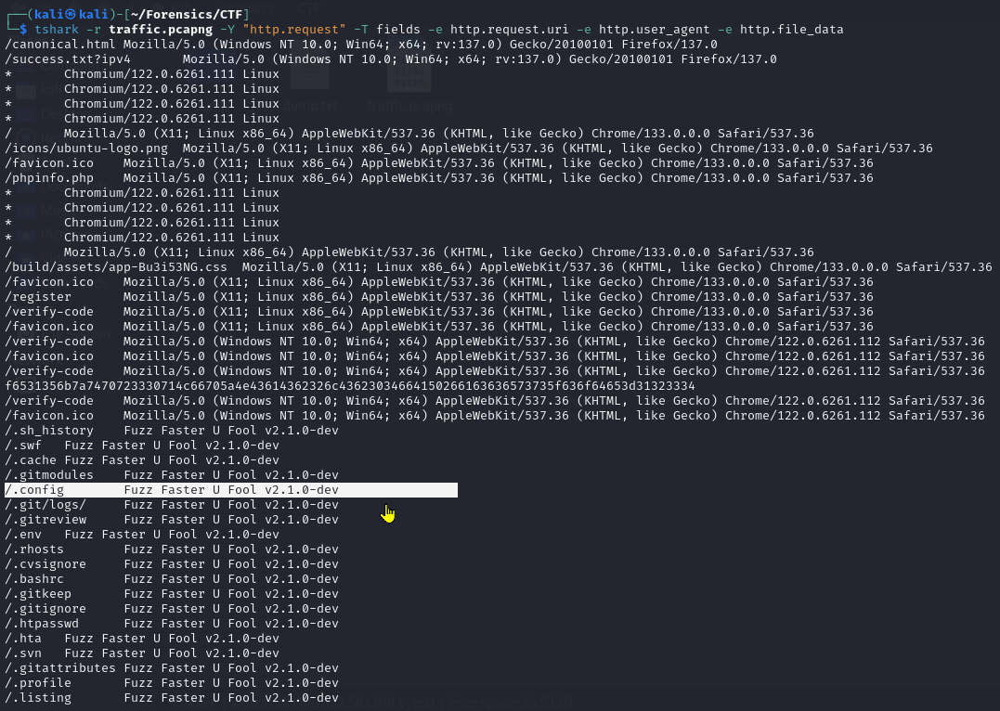

# UAP Qualification Wireshark

## ***UAP Cyber Siege 2025***

[https://drive.google.com/file/d/1gVcycaXj4zFexttqdrqIe4L0mQix6haU/view?usp=sharing](https://drive.google.com/file/d/1gVcycaXj4zFexttqdrqIe4L0mQix6haU/view?usp=sharing)

### **Problem - 07 :**

What tool did the attacker use for fuzzing?

**Solution :** 

In **Wireshark**, the name or signature of a **fuzzing tool** might appear in the **payload** or **application-layer fields** of certain protocols, depending on what the attacker was fuzzing. Such as , 

1. HTTP User-Agent or Headers → Location: `Hypertext Transfer Protocol` section ,
2. Tools like **Boofuzz**, **SPIKE**, or **zzuf** might send patterns like AAAA, 414141..., or tool-specific markers like "SPIKE" or "boofuzz" in the`Data` section at the bottom or inside protocols like TCP, FTP, etc.



If we notice , we will see those fuzzing time doesn’t has any “file_data” as they were bruteforcing paths .

```bash
tshark -r traffic.pcapng -Y "http.request" -T fields -e http.request.uri -e http.user_agent -e http.file_data
```

Another strings method →

```bash
strings traffic.pcapng | grep -iE "burp|fuzz|boofuzz|spike|zzuf|peach|ffuf|wfuzz"
```


Or in gui wireshark ->


***Flag → CS{ffuf_v2.1.0-dev}***

### **Problem - 08 :**

A flag was left behind in a hidden configuration file. Recover it.

**Solution :** 

We just dump all the files from wireshark →


It was a huge collection of files . We made a script with GPT to find from that by searching with a particular string .

```python
import os

def search_string_in_files(folder_path, search_string):
    matching_files = []

    for root, _, files in os.walk(folder_path):
        for file in files:
            file_path = os.path.join(root, file)

            try:
                with open(file_path, 'r', errors='ignore') as f:
                    content = f.read()
                    if search_string in content:
                        matching_files.append(file_path)
            except Exception as e:
                print(f"Could not read {file_path}: {e}")

    if matching_files:
        print(f"\nFiles containing '{search_string}':")
        for file in matching_files:
            print(f" - {file}")
    else:
        print(f"\nNo files found containing '{search_string}'.")

# Example usage
if __name__ == "__main__":
    folder = "./dumped_files"  # Replace with your folder path
    keyword = "password"       # Replace with your search string
    search_string_in_files(folder, keyword)
```

We get nothing by searching with keyword “CS{” partial flag format .When , we were digging into the files we saw a common pattern “Not Found” when a failed GET method done without authorization.


Then , made a new script to search those files those doesn’t hasv that string in it →

```python
import os

def search_files_without_string(folder_path, search_string):
    matching_files = []

    for root, dirs, files in os.walk(folder_path):
        for file in files:
            file_path = os.path.join(root, file)
            try:
                with open(file_path, 'r', encoding='utf-8') as f:
                    contents = f.read()
                    if search_string not in contents:
                        matching_files.append(file_path)
            except Exception as e:
                print(f"Skipped {file_path} (error: {e})")

    return matching_files

if __name__ == '__main__':
    folder = input("Enter the folder path: ").strip()
    string_to_search = input("Enter the string to search for (files NOT containing this will be listed): ").strip()

    result = search_files_without_string(folder, string_to_search)

    print("\nFiles that do NOT contain the string:")
    for file in result:
        print(file)
```

After , running that we saw “.htaccess” file after opening that we saw a encoded string .


```python
After decoding that with ceaser cipher →
7f1Q_1q_7Fc_F1Bb3L_Dj4E → 7h1S_1s_7He_H1Dd3N_Fl4G
```

Flag → CS{7h1S_1s_7He_H1Dd3N_Fl4G}

### **Problem - 09 :**

Analyze the captured login sequence and identify the admin’s email and password.

**Solution :** 

Basically , admin’s credentials always will be lie in the “GET” method as the attacker will try to stole that from server .

```python
http.request.method == "GET" && frame contains "email"
```


we doesn’t get that . That means if the attacker try to get that it might be stolen as file in TCP protocol .

```python
tcp.stream and frame contains "email"
```


with that we can follow the tcp stream but it will take a huge effort to get that email and pass .

Why not search in the dump files if they don’t contain we have to again follow the tcp stream there we will guarantee find that info .

Used again prev challenge python file to search with keyword “email” in the files . 


it sorts file collection to number in 6 unique files . From that “.test” file contains the info as it was the source code of that admin database creation.


Falg → CS{ironman@xyz_passwordforxyz}

### **Problem - 10 :**

Determine the access code used during the session.

**Solution :** 

To find that , we have to identify when he successfully logged in . But it will take a lot of time . Let’s search for is he “logged out” ? If he does the most near prev login will have the correct “access code”.

Basically , post type logout is more secure in site . Lets find what they applied in there website.

```python
http.request.method == "POST" && frame contains "log"
```


We basically sees attacker has 2 times log_out and before that we also get the correct login frame .

We , have to note those range of login .

```python
frame contains "access" && http.request.method == "POST"
```


“110925” frame’s access code was the nearest one before the last successful login so its access_code will be the flag .

***Flag → CS{5425}***

### **Problem - 11 :**

What username did the attacker use to access the website?

**Solution :** 


we search between the range of 2nd “login” and “logout” frame range because the attacker may change its username before 2nd time authentication but however we didn’t get any response . the left range we tried give less than the login frame to get that username because username may be only used only in the registration time . However we didn’t get any juicy information .


then , we search for the 1st login range →

```python
(frame.number >= 87000 and frame.number <= 110663 and http) && tcp.payload contains "user"
```


***Flag → CS{ksadm1n}***

And , we get that username .  You may also see there is another login but we all know that it was fake →


### **Problem - 12 :**

An API key was leaked in one of the requests or responses. Find it.

**Solution :** 

This question has clue in its itself. Response → means the attacker stole an API key from server .Again we will use that range of login and logout frame but now we will tightly set the range as this type responses can only be done in logged in time .

1st login range →

```python
(frame.number >= 89272 and frame.number <= 110663 and http) && ( tcp.payload contains "api" || tcp.payload contains "Api" || tcp.payload contains "API")
```


Though we found many directories but not API token . We also didn’t find in the 2nd login .

 Now , we have to search in the files that the attacker dump . Those might also can have that .

```python
tshark -r traffic.pcapng -Y '(frame.number >= 89272 and frame.number <= 110663) && http && (http.response.code == 200 && (http.content_length > 0 || http.content_type))' -T fields -e frame.number -e http.request.uri -e http.response.code -e http.content_type -e http.content_length
```

with this command we basically tried to get those file directory which basically the attacker dump from the website . By utilizing the “http.content_length”.


Only, 108560 and 109409 has some text response . Lets decode that text .

```python
tshark -r traffic.pcapng -Y "frame.number == 108560 && http" -T fields -e http.file_data > response.html
```


After decoding that hex data we get a probably base64 string →

QXBpIEtleTogVGRHbkRqVWZLZExXS2dVZFZJZlVrZlVma2ZVZktkTFdmSmZVZVZL

After decode that we get the API key →


***Flag → CS{TdGnDjUfKdLWKgUdVIfUkfUfkfUfKdLWfJfUeVK}***

### **Problem - 13 :**

Identify the specific command pattern or prefix used for executing commands including the path.

**Solution :** 

For this we will choose only the 1st login range . And , from that we have to follow the tcp stream and manually observe each stream to find that particular command which the attacker successfully used for executing later commands .


nothing found . Lets search in the 2nd login frame. but , with smart sorting →

```python
(frame.number >= 111105 and frame.number <= 113549) && http.request.method == "POST"
```


We have to analyze each http streams .

We chosed this as it has the highest in length than the other post /ai methods ,


In that we saw a command execution and its prefix was ” !dmc “ →


- **Prefix used for executing commands** was **not just the shell command**, but the **way the app recognized it as a command**, i.e., the marker `!dmc:`.
- The `/ai` endpoint is what received it.

**Flag → CS{ai_!dmc:}**

### **Problem - 14 :**

Determine the AI model referenced or used within the communication.

**Solution :** 
There is **no specific field** like `http.model` or `ai.model` in `tshark` or Wireshark.

**✅ Why?**

`Tshark` fields (like `http.host`, `http.user_agent`, `http.request.uri`, etc.) are **predefined** for **standard protocols**.

But:

- AI model names (like `gpt-4`, `claude-3`, `llama3`) are **application-specific**
- They are **just part of the body** (often JSON), typically inside `http.file_data` or `tcp.payload`
- Wireshark/tshark doesn’t interpret those JSON fields natively

Then, told chatgpt to create a strong payload to find the AI MODEL name →

```python
strings traffic.pcapng | grep -iE "gpt|chatgpt|gpt-4|gpt-3\.5|gpt-4o|llama|llama2|llama3|bert|mistral|mixtral|gemini|palm|flan|claude|claude-3|cohere|command-r|command-r+|vicuna|openchat|falcon|zephyr|starcoder|xgen|phi|orion|sonnet|opus|haiku|model"
```

An , we will se the gemini hits 


Flag → CS{gemini}

### **Problem - 15 :**

The attacker established a reverse shell connection. Identify the port used.

**Solution :** 

Recall problem - 13 .

In that tcp stream we will see the port number .


**Flag → CS{6542}**

### **Problem - 16 :**

Find the core endpoint responsible for generating AI responses and the port it runs on.

**Solution :** 

You're being asked to identify **where**, in the captured traffic:

1. **Requests are being sent to an AI model**, asking it to generate responses (like chat replies, completions, answers, etc.)
2. **The exact HTTP endpoint** (the path, like `/ai`, `/generate`, `/chat`, etc.) that's used to do that.

Recall problem - 13 again .

```python
(frame.number >= 111105 and frame.number <= 113549) && http.request.method == "POST"
```


After analyzing each of packets we find the core endpoint responsible for generating AI responses


***Flag → CS{generate_8564}***

### **Problem - 17 :**

Can you identify the hidden role?

Example: CS{role} all lowercase

**Solution :** 

Basically , this question is not that much clear . If we notice before the 1st login time the attacker’s role was “victim” .

```python
(frame.number >= 87000 and frame.number <= 89272) && http.request.method == "POST"
```


Okay one thing we learn from this is that the role is only used in the register time so there is a high change that the other role will be stored in the database . So , lets search for the database which is dumped by the attacker .

Again we used the python script to find a desired string from the file .

```python
import os

def search_string_in_files(folder_path, search_string):
    matching_files = []
    search_string = search_string.lower()  # Convert search string to lowercase

    for root, _, files in os.walk(folder_path):
        for file in files:
            file_path = os.path.join(root, file)

            try:
                with open(file_path, 'r', errors='ignore') as f:
                    content = f.read().lower()  # Convert file content to lowercase
                    if search_string in content:
                        matching_files.append(file_path)
            except Exception as e:
                print(f"Could not read {file_path}: {e}")

    if matching_files:
        print(f"\nFiles containing '{search_string}':")
        for file in matching_files:
            print(f" - {file}")
    else:
        print(f"\nNo files found containing '{search_string}'.")

# Example usage
if __name__ == "__main__":
    folder = "."  # Replace with your folder path
    keyword = "role"       # Replace with your search string
    search_string_in_files(folder, keyword)

```


Basically we will find that hidden role from the dashboard but not directly . Rename the dashborad with most length to dashboard.html and launch that html in the browser . After opening we will see his role is “police” that he register himself but observing his case study we will see him as a “jounalist” 

